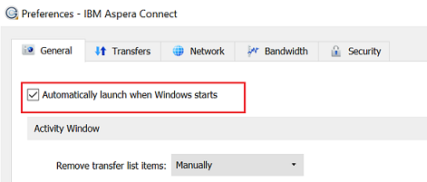

# 브랜드 포털 다운로드 시간 단축 {#guide-to-accelerate-downloads-from-brand-portal}

브랜드 포털을 사용하면 On-Demand 애플리케이션인 IBM Aspera Connect와 통합하여 대용량 에셋 파일의 다운로드 성능을 향상시킬 수 있습니다. 애플리케이션은 독점적인 기술을 사용하여 TCP 오버헤드를 제거하고 에셋 파일의 전송 속도를 향상시킵니다. 이러한 통합을 통해 다운로드 경험을 향상시킬 수 있습니다.

>[!NOTE]
>
>다운로드 속도는 사용자의 네트워크 대역폭, 서버 대기 시간 및 지리적 위치와 같은 요인에 따라 다릅니다.

브랜드 포털 사용자가 활성화된 경우 브랜드 포털 사용자는 Aspera Connect 클라이언트를 설치하여 브랜드 포털 또는 공유 링크를 통해 원하는 에셋 파일을 다운로드하는 데 소요되는 시간을 크게 줄일 수 있습니다.

## 파일 다운로드 시간을 단축하기 위한 전제 조건 {#prerequisites-to-accelerate-file-download}

파일을 더 빨리 다운로드하려면 다음을 확인하십시오.

* **[!UICONTROL 관리 도구 패널의]** [!UICONTROL 일반 설정에서] 다운로드 가속 (기본적으로 비활성화되어 있음) 를 활성화합니다.
* 포트 33001 (TCP 및 UDP 모두) 이 방화벽에서 열려 있습니다. 사전 요구 사항에 대한 자세한 내용은 [Aspera Connect 클라이언트 설명서를 참조하십시오](https://downloads.asperasoft.com/en/documentation/8).
* 관리자 권한을 사용하여 Aspera Connect를 설치합니다.
* Aspera Transfer Client의 플랫폼 지원은 [Aspera Connect Platform Support Matrix](https://www.asperasoft.com/company/support/transfer-clients/)를 참조하십시오.

## 도메인 다운로드 {#download-domains}

다음은 여러 지역에 대한 다운로드 도메인입니다.

| 지역 코드 | 도메인 |
|---|---|
| NA 또는 1 | downloads-na1.brand-portal.adobe.com |
| na va 5 | downloads-na2.brand-portal.adobe.com |
| EMEA LON 5 | downloads-emea1.brand-portal.adobe.com |
| APAC SIN 2 | downloads-apac1.brand-portal.adobe.com |

## 파일 가속기를 사용한 샘플 다운로드 성능 {#expected-download-performance-using-file-accelerator}

다음 표는 Aspera Connect 파일 다운로드 가속기를 사용하는 2 GB 파일의 다운로드 성능을 보여줍니다.

**브랜드 포털 서버는 오리건 (미국) 에 있는 브랜드 포털 서버를 고려하면 네트워크 대역폭, 서버 지연 및 클라이언트 위치와 같은 요인에 따라 달라질 수 있습니다.*

| 클라이언트 위치 | 클라이언트와 서버 사이의 지연 시간 (밀리초) | Aspera Connect 파일 전송 가속기 (MBps) 사용 속도 | Aspera 파일 전송 가속기 (초) 를 사용하여 2 GB 파일을 다운로드하는 데 걸린 시간 |
|---------------------------|-----------------------------------|---------------------------------------------|-------------------------------------------------------------------------|
| U.S. 서부 (캘리포니아) | 18 | 36 | 57 |
| U.S. 서부 (오레곤) | 42 | 36 | 57 |
| U.S. 동부 (버지니아) | 85 | 35 | 58 |
| APAC (도쿄) | 124 | 36 | 57 |
| Noida (India) | 275 | 13.36 | 153 |
| 시드니 | 175 | 29 | 70 |
| 런던 | 179 | 35 | 58 |
| 싱가포르 | 196 | 34 | 60 |

## 파일 가속기를 사용하여 워크플로우 다운로드 {#download-workflow-using-file-accelerator}

브랜드 포털에서 에셋을 빠르게 다운로드하려면 다음을 수행하십시오.

1. 지원되는 브라우저를 사용하여 브랜드 포털에 로그인합니다.
2. 다운로드할 자산 파일, 폴더 또는 컬렉션을 찾아보고 선택합니다. 다운로드 옵션을 탭/클릭합니다.
다운로드 가속 [활성화] 옵션이 선택된 상태로 다운로드 대화 상자가 나타납니다.
   

   >[!NOTE]
   >
   >에셋을 다운로드하는 링크와 함께 이메일 알림을 보내는 기능은 현재 빠른 다운로드가 활성화되어 있는 동안에는 지원되지 않습니다.

   

3. **[!UICONTROL 다운로드]** 옵션을 탭/클릭합니다.
브랜드 포털 임차인 계정에서 다운로드 경험을 가속화하려면 시스템에 Aspera Connect 클라이언트 애플리케이션을 설치해야 합니다.

4. **Aspera Connect 클라이언트**
다운로드 시스템이나 기존 설치된 Aspera Connect 클라이언트가 시스템에 설치되어 있지 않거나 기존 설치된 Connect 클라이언트가 최신 버전인 경우 [최신 **[!UICONTROL 버전 다운로드]**] 를 선택하여 시스템 전용 Aspera Connect 클라이언트를 다운로드할 수 있는 메시지가 브라우저 페이지에 표시됩니다.

   

   https://downloads.asperasoft.com/connect2/에서 [최신 버전의 Aspera Connect를 다운로드하려면](https://downloads.asperasoft.com/connect2/)**[!UICONTROL 지금 다운로드를]** 선택하고 지침을 따르십시오.

5. **Aspera Connect 클라이언트를**
설치하고 IBM Aspera Connect 클라이언트 설정을 설치하려면 IBM Aspera Connect 클라이언트 응용 프로그램의. msi 파일에서 설정을 실행하고 설치 마법사를 따릅니다.

6. 클라이언트가 성공적으로 설치되면 브라우저 페이지를 새로 고치고 다운로드를 다시 시작하거나 **[!UICONTROL 에셋]** **[!UICONTROL 다운로드]** 대화 상자에서 다시 시작을 선택합니다 (# 2 단계).
Aspera Connect를 처음 사용하는 경우 브라우저가 IBM Aspera Connect를 사용하여 **[!UICONTROL 링크를 열라는 메시지를 표시합니다]**. 나중에 이 대화 상자를 건너뛰려면 FASP 링크에 대한 내 선택 **[!UICONTROL 사항을 기억하십시오]**.

   >[!NOTE]
   >
   >이 메시지는 다른 브라우저마다 다릅니다.

7. 전송 진행 여부를 확인하는 대화 상자가 나타납니다. [ **[!UICONTROL 허용하려면 허용]** ] 를 선택합니다.
나중에 이 대화 상자를 건너뛰려면 이 주최자와 모든 연결에 대해 내 선택 **[!UICONTROL 사용을 활성화합니다]**.
다운로드가 시작됩니다. 다운로드 진행 상황을 대화 상자에 표시합니다. 대화 상자를 사용하여 다운로드를 **[!UICONTROL 일시 중지]**, **[!UICONTROL 재개]**&#x200B;또는 **[!UICONTROL 취소합니다]** .
Aspera Connect 애플리케이션은 사용자가 모든 전송 세션을 보고 관리할 수 있는 시스템에 활동 창을 제공합니다. 자세한 내용은 [Aspera Connect 클라이언트 설명서를 참조하십시오](https://downloads.asperasoft.com/en/documentation/8).

다운로드가 성공적으로 완료되면, 대화 상자에 사용자의 시스템에 자산이 다운로드된 위치가 표시됩니다. 오류가 있는 경우 오류가 표시됩니다.

>[!NOTE]
>
>환경 설정 내의 탭 전송 아래에서 다운로드한 파일을 저장할 위치를 항상 묻는 경우 **[!UICONTROL 다운로드 위치를 선택하라는 메시지가 표시되지 않는 Aspera Connect 클라이언트]** 응용 프로그램에서 [!UICONTROL 알려진] [!UICONTROL 제한 사항이 있습니다]. 다운로드가 시작되기 전에 다운로드한 파일을 텍스트 상자에 **[!UICONTROL 저장합니다]**.

## Microsoft Edge 브라우저에서 파일 가속기 사용 {#using-file-accelerator-on-microsoft-edge-browser}

Microsoft Edge는 동일한 비공개 네트워크 또는 신뢰할 수 있는 사이트와 함께 Aspera Connect 서버와 통신을 차단하는 EPM (Enhanced Protection Mode) 에서 실행됩니다. 따라서 서버와의 연결이 설정될 때마다 팝업이 표시됩니다.

Microsoft Edge에서 가속화된 다운로드 기능을 사용하려면 신뢰할 수 있는 사이트 목록에서 브랜드 포털 사이트를 제거합니다.

1. 제어판 (창 키 + X를 누른 **[!UICONTROL 다음 제어판 선택]****[!UICONTROL ) 를 엽니다]**.
2. **[!UICONTROL 네트워크 및 인터넷 &gt; 인터넷 옵션으로 이동합니다]**. **[!UICONTROL 보안]** 탭을 클릭합니다.
3. **[!UICONTROL 신뢰할 수 있는 사이트 영역을]**&#x200B;클릭한 다음 **[!UICONTROL 사이트를 클릭합니다]**.
4. 목록에서 브랜드 포털 사이트를 제거합니다.

## Aspera Connect 클라이언트 환경 설정 {#aspera-connect-client-preferences}

아이콘을 마우스 오른쪽 단추로 클릭하고 기본 설정을 선택하여 **[!UICONTROL IBM Aspera Connect 클라이언트 환경 설정에서 설정할 수 있는 몇 가지 유용한 기본 설정이]**&#x200B;있습니다.

기본 다운로드 위치를 설정할 수 있습니다.

또한 Aspera Connect 클라이언트를 시스템 시작 시 자동으로 시작하도록 표시할 수 있으므로 Connect 클라이언트가 실행 중이며 다운로드를 더 빠르게 시작할 수 있습니다.

## 다운로드 가속 문제 해결 {#troubleshoot-issues-with-download-acceleration}

다운로드 가속이 작동하지 않는 경우 다음 단계에 따라 문제를 해결하십시오.

1. 시스템의 [https://test-connect.asperasoft.com](https://test-connect.asperasoft.com/) 를 방문하여 포트가 차단되지 않았는지 확인합니다.

   포트가 양호하지 않으면 네트워크 팀에 연락하여 포트 33001 (TCP 및 UDP 모두) 이 방화벽에서 차단되지 않도록 합니다.

2. 포트가 괜찮다면 https://www.speedtest.net/를 사용하여 [사용 가능한 대역폭을 측정하여 네트워크가 느리지 않은지 확인합니다](https://www.speedtest.net/).

   대역폭이 일부 (1-10 Mbps) 또는 Kbps 인 경우 Aspera 환경 설정을 사용하고 사용 가능한 대역폭과 같은 대역폭을 제한해 보십시오.

3. Aspera 데모 서버의 다운로드가 작동하는지 확인하려면 [https://demo.asperasoft.com/aspera/user](https://demo.asperasoft.com/aspera/user)를 사용합니다.\
   (로그인: Asperaweb, password: Demoaspera)

4. 위의 문제 해결 단계가 작동하지 않으면 다운로드 가속화 활성화 옵션을 선택 취소하고 일반 다운로드를 사용합니다.
