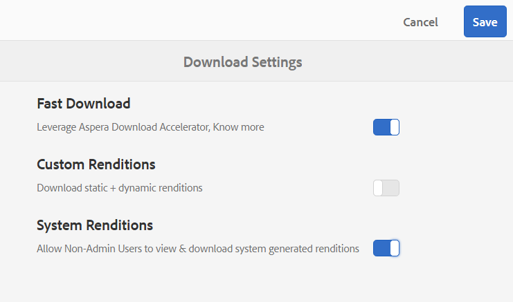
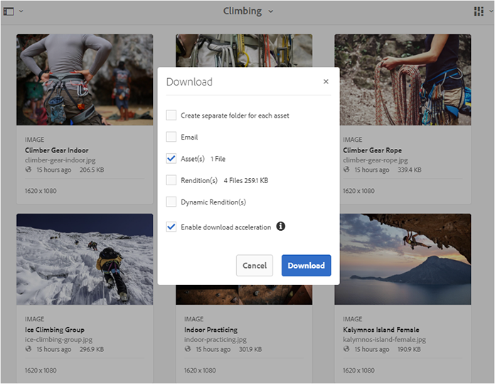

# 브랜드 포털 다운로드 시간 단축 {#guide-to-accelerate-downloads-from-brand-portal}

브랜드 포털을 통해 Install-On-Demand 애플리케이션인 IBM Aspera Connect와 통합하여 대용량 에셋 파일의 다운로드 성능을 향상시킬 수 있습니다. 이 응용 프로그램은 독점 기술을 사용하여 TCP 오버헤드를 제거하고 에셋 파일의 전송 속도를 개선하는 데 도움이 됩니다. 이러한 통합을 통해 다운로드 환경이 개선되었습니다.

>[!NOTE]
>
>다운로드 속도는 네트워크 대역폭, 서버 지연 및 클라이언트의 지리적 위치 등과 같은 요인에 따라 다르므로 사용자에 따라 다릅니다.

**[!UICONTROL 빠른 다운로드]** 구성은 기본적으로 활성화되어 있으므로 브랜드 포털에서 원하는 에셋 파일을 다운로드하는 데 걸리는 시간이 크게 줄어듭니다.

## 파일 다운로드 속도를 높이기 위한 사전 요구 사항 {#prerequisites-to-accelerate-file-download}

파일을 더 빨리 다운로드하려면 다음을 확인하십시오.

* **[!UICONTROL 도구]** > **[!UICONTROL 다운로드]**&#x200B;로 이동하고 **[!UICONTROL 빠른 다운로드]** 구성이 **[!UICONTROL 다운로드 설정]**&#x200B;에서 활성화되어 있는지 확인합니다.
* 포트 33001(TCP 및 UDP 모두)이 방화벽에서 열려 있는지 확인합니다. 사전 요구 사항에 대한 자세한 내용은 [IBM Aspera Connect Client 설명서](https://downloads.asperasoft.com/en/documentation/8)를 참조하십시오.
* [관리자 권한을 사용하여 브라우저](https://www.ibm.com/support/knowledgecenter/SSXMX3_3.9.9/kc/connect_welcome.html) 의 확장 프로그램에 IBM Aspera Connect 3.9.9를 설치합니다.
* Aspera 전송 클라이언트에 대한 플랫폼 지원은 [IBM Aspera Connect 플랫폼 지원 매트릭스](https://www.asperasoft.com/company/support/transfer-clients/)를 참조하십시오.

## 도메인 다운로드 {#download-domains}

다른 지역에 대한 다운로드 도메인은 다음과 같습니다.

| 지역 코드 | 도메인 |
|---|---|
| NA 또는1 | downloads-na1.brand-portal.adobe.com |
| NA VA5 | downloads-na2.brand-portal.adobe.com |
| EMEA LON5 | downloads-emea1.brand-portal.adobe.com |
| APAC SIN2 | downloads-apac1.brand-portal.adobe.com |

## 파일 액셀러레이터 {#expected-download-performance-using-file-accelerator}를 사용한 다운로드 성능 샘플

다음 표는 Aspera Connect 파일 다운로드 가속기를 사용한 2GB 파일의 다운로드 성능을 보여줍니다.

*Brand Portal 서버가 오레곤(미국)에 있는 것을 고려하여 관찰된 결과는 네트워크 대역폭, 서버 지연 및 클라이언트 위치와 같은 요인에 따라 달라집니다.*

| 클라이언트 위치 | 클라이언트와 서버 간 지연 시간(밀리초) | Aspera Connect 파일 전송 액셀러레이터를 사용한 속도(MBps) | Aspera 파일 전송 가속기를 사용하여 2GB 파일을 다운로드하는 데 걸린 시간(초) |
|---------------------------|-----------------------------------|---------------------------------------------|-------------------------------------------------------------------------|
| 미국 서부(캘리포니아 주) | 18 | 36 | 57 |
| 미국 서부(오레곤) | 42 | 36 | 57 |
| 미국 동부(버지니아 주) | 85 | 35 | 58 |
| APAC(도쿄) | 124년 | 36 | 57 |
| 노이다(인도) | 275년 | 13.36 | 153년 |
| 시드니 | 175년 | 29 | 70 |
| 런던 | 179년 | 35 | 58 |
| 싱가포르 | 196년 | 34 | 60 |

## 파일 액셀러레이터 {#download-workflow-using-file-accelerator}를 사용하여 워크플로우 다운로드

브랜드 포털에서 에셋을 보다 빠르게 다운로드하려면

1. 지원되는 브라우저를 사용하여 브랜드 포털에 로그인합니다.
1. 다운로드할 폴더 또는 자산을 찾아보고 선택합니다. 맨 위의 도구 모음에서 **[!UICONTROL 다운로드]** 아이콘을 클릭합니다. **[!UICONTROL 다운로드]** 대화 상자가 기본적으로 선택된 **[!UICONTROL 자산]** 및 **[!UICONTROL 다운로드 가속 사용]** 확인란과 함께 나타납니다.

   

   >[!NOTE]
   >
   >자산 다운로드 링크가 포함된 이메일 알림을 전송하는 기능은 현재 지원되지 않으며 빠른 다운로드가 활성화됩니다.

   

1. **[!UICONTROL 다운로드]**&#x200B;를 클릭합니다.

   브랜드 포털 임차인 계정에서 다운로드 경험을 빠르게 하려면 브라우저 확장명에 Aspera Connect 클라이언트 응용 프로그램을 설치해야 합니다.

1. **Aspera Connect 클라이언트 다운로드**

   시스템에 Aspera Connect 클라이언트가 설치되어 있지 않거나 기존 Aspera Connect 클라이언트가 최신 상태가 아니면 **[!UICONTROL 최신 버전 다운로드]**&#x200B;를 선택하여 시스템 특정 Aspera Connect 클라이언트를 다운로드할 수 있는 브라우저 페이지에 프롬프트가 표시됩니다.

   

   [https://downloads.asperasoft.com/connect2/](https://downloads.asperasoft.com/connect2/)에서 최신 버전의 Aspera Connect를 다운로드하려면 **[!UICONTROL 지금 다운로드]**&#x200B;를 선택하고 지침을 따릅니다.

1. **Aspera Connect 클라이언트 설치**

   IBM Aspera Connect 클라이언트 설정을 설치하려면 IBM Aspera Connect 클라이언트 응용 프로그램의 .msi 파일에서 설정을 실행하고 설치 마법사를 따릅니다.

1. 클라이언트가 성공적으로 설치되면 브라우저 페이지를 새로 고치고 다운로드 단계를 다시 시작합니다.

   처음으로 Aspera Connect를 사용하는 경우 브라우저가 **[!UICONTROL IBM Aspera Connect]**&#x200B;를 사용하여 링크를 열라는 메시지를 표시합니다. 나중에 이 대화 상자를 건너뛰려면 **[!UICONTROL FASP 링크]**&#x200B;에 대해 내 선택 사항을 기억합니다.

   >[!NOTE]
   >
   >이 메시지는 다른 브라우저에서 다릅니다.

1. 전송을 진행할지 여부를 확인하는 대화 상자가 나타납니다. **[!UICONTROL 시작 허용]**을 선택합니다.
나중에 이 대화 상자를 건너뛰려면 **[!UICONTROL 이 호스트에 대한 모든 연결에 내 선택 사항을 사용하십시오]**.
다운로드가 시작됩니다. 다운로드 진행 상황을 대화 상자에 표시합니다. 대화 상자를 사용하여 **[!UICONTROL 일시 중지]**, **[!UICONTROL 다시 시작]** 또는 **[!UICONTROL 취소]**합니다.
Aspera Connect 응용 프로그램은 사용자가 모든 전송 세션을 보고 관리할 수 있는 시스템에서 활동 창을 제공합니다. 자세한 내용은 [Aspera Connect 클라이언트 설명서](https://downloads.asperasoft.com/en/documentation/8)를 참조하십시오.

다운로드가 성공적으로 완료되면 사용자 시스템에 에셋이 다운로드되는 위치가 대화 상자에 표시됩니다. 오류가 있으면 오류가 표시됩니다.

>[!NOTE]
>
>Aspera Connect 클라이언트 응용 프로그램에서 **[!UICONTROL 다운로드한 파일을 저장할 위치]**&#x200B;를 **[!UICONTROL Preferences]** 내의 **[!UICONTROL Transfer]** 탭 아래에서 확인할 수 있는 경우 다운로드 위치를 선택하라는 메시지가 표시되지 않는 알려진 제한이 있습니다. 다운로드가 시작되기 전에 텍스트 상자 **[!UICONTROL 다운로드한 파일을]**&#x200B;에 저장합니다.

## Microsoft Edge 브라우저에서 파일 가속기 사용 {#using-file-accelerator-on-microsoft-edge-browser}

Microsoft Edge는 동일한 개인 네트워크 또는 신뢰할 수 있는 사이트와의 통신을 차단하는 EPM(Enhanced Protected Mode)에서 실행됩니다. 따라서 서버와의 연결이 설정될 때마다 팝업이 표시됩니다.

Microsoft Edge에서 가속화된 다운로드 기능을 사용하려면 신뢰할 수 있는 사이트 목록에서 브랜드 포털 사이트를 제거하십시오.

1. Campaign 컨트롤 패널(**[!UICONTROL Window 키 + X]**)을 연 다음 **[!UICONTROL Campaign 컨트롤 패널]**)을 선택합니다.
1. **[!UICONTROL 네트워크 및 인터넷]** > **[!UICONTROL 인터넷 옵션]**&#x200B;으로 이동합니다. **[!UICONTROL 보안]** 탭을 클릭합니다.
1. **[!UICONTROL 신뢰할 수 있는 사이트 영역]**&#x200B;을 클릭한 다음 **[!UICONTROL 사이트]**&#x200B;를 클릭합니다.
1. 목록에서 브랜드 포털 사이트를 제거합니다.

## Aspera Connect 클라이언트 환경 설정 {#aspera-connect-client-preferences}

IBM Aspera Connect Client 환경 설정에서 아이콘을 마우스 오른쪽 단추로 클릭하고 **[!UICONTROL 환경 설정]**&#x200B;을 선택하여 설정할 수 있는 유용한 기본 설정이 몇 가지 있습니다.

기본 다운로드 위치를 설정할 수 있습니다.

또한 Aspera Connect 클라이언트는 시스템 시작 시 자동으로 시작되도록 표시되어 Connect 클라이언트가 실행 중이며 다운로드를 빠르게 시작할 수 있도록 할 수 있습니다.

## 다운로드 가속 문제 해결 {#troubleshoot-issues-with-download-acceleration}

다운로드 가속이 작동하지 않는 경우 다음 단계에 따라 문제를 해결하십시오.

1. 시스템에서 [https://test-connect.asperasoft.com](https://test-connect.asperasoft.com/)을(를) 방문하여 포트가 차단되지 않았는지 확인하십시오.

   포트가 OK되지 않으면 네트워크 팀에 연락하여 포트 33001(TCP 및 UDP 모두)이 방화벽에서 차단되지 않도록 하십시오.

1. 포트가 정상 상태인 경우, [https://www.speedtest.net/](https://www.speedtest.net/)을 사용하여 사용 가능한 대역폭을 측정하여 네트워크가 느려지지 않은지 확인합니다.

   대역폭이 몇 가지(1-10Mbps) 또는 Kbps인 경우 Aspera 환경 설정을 사용하고 사용 가능한 대역폭과 동일한 대역폭을 제한하십시오.

1. Aspera 데모 서버의 다운로드가 작동하는지 확인하려면 [https://demo.asperasoft.com/aspera/user](https://demo.asperasoft.com/aspera/user)을 사용하십시오.\
   (로그인: 아스퍼웹, 암호: 데모아스퍼 )

1. 위의 문제 해결 단계 중 아무 것도 작동하지 않으면 [다운로드 가속 사용] 옵션을 선택 취소하고 일반 다운로드를 사용하십시오.
