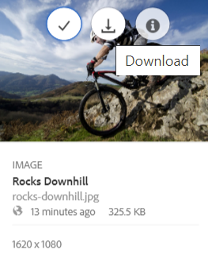
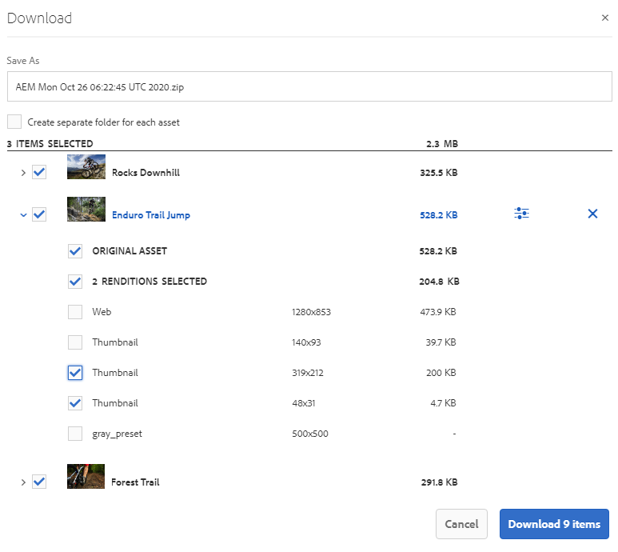

# Brand Portal 다운로드 속도 향상 {#guide-to-accelerate-downloads-from-brand-portal}

Adobe Experience Manager Assets Brand Portal을 사용하면 설치 온디맨드 애플리케이션인 IBM Aspera Connect와 통합하여 대용량 자산 파일의 다운로드 성능을 향상시킬 수 있습니다. 이 애플리케이션은 독점 기술을 사용하여 TCP 오버헤드를 제거하고 자산 파일의 전송 속도를 개선하는 데 도움이 됩니다. 이 통합을 통해 다운로드 경험을 향상시킬 수 있습니다.

>[!NOTE]
>
>다운로드 속도는 네트워크 대역폭, 서버 지연 시간 및 클라이언트의 지리적 위치 등의 요인에 따라 달라지기 때문에 사용자에게 다릅니다.

**[!UICONTROL 빠른 다운로드]** 구성은 기본적으로 활성화되어 있으므로 Brand Portal에서 원하는 자산 파일을 다운로드하는 데 걸리는 시간이 크게 줄어듭니다.

## 파일 다운로드를 가속화하기 위한 사전 요구 사항 {#prerequisites-to-accelerate-file-download}

파일을 더 빨리 다운로드하려면 다음을 확인하십시오.

* **[!UICONTROL 도구]** > **[!UICONTROL 다운로드]**&#x200B;로 이동하여 **[!UICONTROL 빠른 다운로드]** 구성이 **[!UICONTROL 다운로드 설정]**&#x200B;에서 활성화되어 있는지 확인합니다.
* 방화벽에서 포트 33001(TCP 및 UDP 모두)가 열려 있는지 확인합니다. 사전 요구 사항에 대한 자세한 내용은 [IBM Aspera Connect Client 설명서](https://downloads.asperasoft.com/en/documentation/8)를 참조하십시오.
* [관리자 권한을 사용하여 브라우저의 확장 프로그램에 IBM Aspera Connect 3.9.9를 설치합니다](https://www.ibm.com/docs/en/aspera-connect/3.9.9) .
* Aspera 전송 클라이언트에 대한 플랫폼 지원은 [IBM Aspera Connect 플랫폼 지원 매트릭스](https://www.asperasoft.com/company/support/transfer-clients/)를 참조하십시오.

## 도메인 다운로드 {#download-domains}

다음은 다른 지역의 다운로드 도메인입니다.

| 지역 코드 | 도메인 |
|---|---|
| NA 또는1 | downloads-na1.brand-portal.adobe.com |
| NA VA5 | downloads-na2.brand-portal.adobe.com |
| EMEA LON5 | downloads-emea1.brand-portal.adobe.com |
| APAC SIN2 | downloads-apac1.brand-portal.adobe.com |

## 파일 가속기를 사용한 다운로드 성능 샘플 {#expected-download-performance-using-file-accelerator}

다음 표는 Aspera Connect 파일 다운로드 가속기를 사용하는 2GB 파일의 다운로드 성능을 보여줍니다.

*관찰된 결과는 Brand Portal 서버가 오레곤(미국)에 있는 것을 고려하여 네트워크 대역폭, 서버 지연, 클라이언트 위치 등의 요인에 따라 달라집니다.*

| 클라이언트 위치 | 클라이언트와 서버 사이의 지연 시간(밀리초) | Aspera Connect 파일 전송 가속기(MBps) 속도 | Aspera File Transfer Accelerator 를 사용하여 2GB 파일을 다운로드하는 데 걸린 시간(초) |
|---------------------------|-----------------------------------|---------------------------------------------|-------------------------------------------------------------------------|
| 미국 서부(캘리포니아 북부) | 18 | 36 | 57 |
| 미국 서부(오레곤) | 42 | 36 | 57 |
| 미국 동부(버지니아 북부) | 85 | 35 | 58 |
| APAC(도쿄) | 124년 | 36 | 57 |
| 노이다(인도) | 275년 | 13.36 | 153년 |
| 시드니 | 175년 | 29 | 70 |
| 런던 | 179년 | 35 | 58 |
| 싱가포르 | 196 | 34 | 60 |

## 파일 가속기를 사용하여 워크플로우 다운로드 {#download-workflow-using-file-accelerator}

Brand Portal에서 자산을 더 빨리 다운로드하려면 다음을 수행하십시오.

1. Brand Portal 테넌트에 로그인합니다. 기본적으로 게시된 모든 자산 및 폴더가 포함된 **[!UICONTROL 파일]** 보기가 열립니다.

   다음 중 하나를 수행하십시오.

   * 다운로드할 자산 또는 폴더를 선택합니다. 맨 위의 도구 모음에서 **[!UICONTROL 다운로드]** 아이콘을 클릭합니다.

      

   * 자산의 특정 자산 표현물을 다운로드하려면 포인터를 자산 위로 가져간 다음 빠른 작업 축소판에서 사용할 수 있는 **[!UICONTROL 다운로드]** 아이콘을 클릭합니다.

      

1. 선택한 모든 자산을 나열하는 **[!UICONTROL 다운로드]** 대화 상자가 열립니다.

   자산을 다운로드하는 동안 Brand Portal 폴더 계층 구조를 유지하려면 **[!UICONTROL 각 자산에 대해 별도의 폴더 만들기]** 확인란을 선택합니다.

   다운로드 단추는 선택한 항목의 수를 반영합니다. 규칙 적용을 마쳤으면 **[!UICONTROL 항목 다운로드]**&#x200B;를 클릭합니다. 규칙 적용 방법에 대한 자세한 내용은 [자산 다운로드](../using/brand-portal-download-assets.md#download-assets)를 참조하십시오.

   

1. 기본적으로 **[!UICONTROL 빠른 다운로드]** 설정은 **[!UICONTROL 다운로드 설정]**&#x200B;에서 활성화됩니다. 따라서 IBM Aspera Connect를 사용하여 자산을 다운로드하는 확인 상자가 나타납니다.

   자산을 처음 다운로드하는 중에 브라우저에 IBM Aspera Connect가 설치되어 있지 않거나 기존 버전이 오래된 경우 [Aspera 다운로드 가속기](https://www.ibm.com/docs/en/aspera-connect/3.9.9)를 설치하라는 메시지가 표시됩니다.

   

1. **Aspera Connect 클라이언트 설치**

   IBM Aspera Connect 클라이언트 설정을 설치하려면 IBM Aspera Connect 클라이언트 응용 프로그램의 .msi 파일에서 설치 프로그램을 실행하고 설치 마법사를 따릅니다.

   

1. 클라이언트가 성공적으로 설치되면 브라우저 페이지를 새로 고침하고 다운로드 단계를 다시 시작합니다.

1. **[!UICONTROL 빠른 다운로드]**&#x200B;를 계속 사용하려면 **[!UICONTROL 허용]**&#x200B;을 클릭하십시오. 선택한 모든 표현물은 IBM Aspera Connect를 사용하여 zip 폴더에 다운로드됩니다.

   다운로드가 성공적으로 완료되면 사용자의 시스템에 자산이 다운로드되는 위치가 대화 상자에 표시됩니다.

   

   IBM Aspera Connect를 사용하지 않으려면 **[!UICONTROL Deny]**&#x200B;를 클릭합니다. **[!UICONTROL 빠른 다운로드]**&#x200B;가 거부되거나 실패하면 시스템이 오류 메시지를 채웁니다. **[!UICONTROL 일반 다운로드]** 단추를 클릭하여 자산 다운로드를 계속합니다.

>[!NOTE]
>
>관리자가 **[!UICONTROL 빠른 다운로드]** 설정을 해제하면 선택한 변환이 IBM Aspera Connect를 사용하지 않고 zip 폴더에서 직접 다운로드됩니다.

<!-- 
On successful completion of the download, a dialog box shows the location where assets are downloaded onto the user's system. If there is a failure, it shows error.

   >[!NOTE]
   >
   >There is a known limitation in Aspera Connect client application that no prompt to select download location appears if **[!UICONTROL Always ask me where to save downloaded files]** is enabled under the tab **[!UICONTROL Transfers]** within **[!UICONTROL Preferences]**. Before any download begins, provide the location in the text box **[!UICONTROL Save downloaded files to]**.

1. Log in to Brand Portal using a supported browser.
1. Browse and select the folders or assets you want to download. From the toolbar at the top, click the **[!UICONTROL Download]** icon. the **[!UICONTROL Download]** dialog appears with the **[!UICONTROL Asset(s)]** and **[!UICONTROL Enable download acceleration]** check boxes selected by default. 

   

   >[!NOTE]
   >
   >The functionality to send email notification with the link to download assets is presently not supported while faster downloads are enabled.

   

1. Click **[!UICONTROL Download]**.

   To speed up the download experience on your Brand Portal tenant account, you need to have Aspera Connect client application installed in your browser's extension.

1. **Download Aspera Connect Client**

   If Aspera Connect client is not installed on your system or the existing Aspera Connect client is out of date, a prompt is displayed on the browser page from where you can download the system-specific Aspera Connect client by selecting **[!UICONTROL Download Latest Version]**.

   

   To download the latest version of Aspera Connect from [https://downloads.asperasoft.com/connect2/](https://downloads.asperasoft.com/connect2/), select **[!UICONTROL Download Now]** and follow the instructions.

1. **Install Aspera Connect Client**

   To install IBM Aspera Connect client setup, run the setup from  .msi  file of IBM Aspera Connect client application and follow the installation wizard.

1. Once the client is successfully installed, refresh the browser page and initiate the download steps again.

   When using Aspera Connect for the first time, the browser prompts to open the link using **[!UICONTROL IBM Aspera Connect]**. To skip this dialog in future, enable **[!UICONTROL Remember my choice for FASP links]**.

   >[!NOTE]
   >
   >This message is different on the different browsers.

1. A dialog box confirms whether to proceed the transfer or not. Select **[!UICONTROL Allow]** to begin.
To skip this dialog in future, enable **[!UICONTROL Use my choice for all connections with this host]**.
Download begins. A dialog box shows the progress of the download. Use the dialog box to **[!UICONTROL pause]**, **[!UICONTROL resume]**, or **[!UICONTROL cancel]** the download.
Aspera Connect application provides an Activity Window on the system where user can view and manage all transfer sessions. For more information, refer [Aspera Connect Client documentation](https://downloads.asperasoft.com/en/documentation/8).

On successful completion of the download, a dialog box shows the location where assets are downloaded onto the user's system. If there is a failure, it shows error.

   >[!NOTE]
   >
   >There is a known limitation in Aspera Connect client application that no prompt to select download location appears if **[!UICONTROL Always ask me where to save downloaded files]** is enabled under the tab **[!UICONTROL Transfers]** within **[!UICONTROL Preferences]**. Before any download begins, provide the location in the text box **[!UICONTROL Save downloaded files to]**.
-->

## Microsoft Edge 브라우저에서 파일 가속기 사용 {#using-file-accelerator-on-microsoft-edge-browser}

Microsoft Edge는 EPM(Enhanced Protected Mode)에서 실행되므로 동일한 개인 네트워크나 신뢰할 수 있는 사이트와의 통신이 차단됩니다. 따라서 서버와의 연결이 설정될 때마다 팝업이 표시됩니다.

Microsoft Edge에서 가속화된 다운로드 기능을 사용하려면 신뢰할 수 있는 사이트 목록에서 Brand Portal 사이트를 제거하십시오.

1. Campaign 컨트롤 패널(**[!UICONTROL Window 키 + X]**)를 열고 **[!UICONTROL Campaign 컨트롤 패널]**)를 선택합니다.
1. **[!UICONTROL 네트워크 및 인터넷]** > **[!UICONTROL 인터넷 옵션]**&#x200B;으로 이동합니다. **[!UICONTROL 보안]** 탭을 클릭합니다.
1. **[!UICONTROL 신뢰할 수 있는 사이트 영역]**&#x200B;을 클릭한 다음 **[!UICONTROL 사이트]**&#x200B;를 클릭합니다.
1. 목록에서 Brand Portal 사이트를 제거합니다.

## Aspera Connect 클라이언트 환경 설정 {#aspera-connect-client-preferences}

아이콘을 마우스 오른쪽 버튼으로 클릭하고 **[!UICONTROL 환경 설정]**&#x200B;을 선택하여 IBM Aspera Connect Client 기본 설정에서 설정할 수 있는 몇 가지 유용한 환경 설정이 있습니다.

기본 다운로드 위치를 설정할 수 있습니다.

또한 Aspera Connect 클라이언트를 시스템 시작 시 자동으로 시작하도록 표시하여 연결 클라이언트가 실행 중이고 다운로드가 더 빨리 시작될 수 있도록 할 수 있습니다.

## 다운로드 가속 문제 해결 {#troubleshoot-issues-with-download-acceleration}

다운로드 가속도가 작동하지 않는 경우 다음 단계에 따라 문제를 해결하십시오.

1. 컴퓨터에서 [https://test-connect.asperasoft.com](https://test-connect.asperasoft.com/)을 방문하여 포트가 차단되지 않았는지 확인하십시오.

   포트가 OK가 아니면 네트워크 팀에 연락하여 포트 33001(TCP 및 UDP 모두)가 방화벽에서 차단되지 않았는지 확인합니다.

1. 포트가 정상 상태일 경우 [https://www.speedtest.net/](https://www.speedtest.net/)을 사용하여 사용 가능한 대역폭을 측정하여 네트워크 속도가 느려지지 않는지 확인합니다.

   대역폭이 몇 개(1-10Mbps) 또는 Kbps인 경우 Aspera 환경 설정을 사용하고 사용 가능한 대역폭과 동일한 대역폭을 제한하려고 합니다.

1. Aspera 데모 서버에서 다운로드가 작동하는지 확인하려면 [https://demo.asperasoft.com/aspera/user](https://demo.asperasoft.com/aspera/user)을 사용하십시오.\
   (로그인:  asperaweb , 암호:  데모아스퍼 )

1. 위의 문제 해결 단계 중 어느 것도 작동하지 않는 경우 Download Acceleration 활성화 옵션을 선택 취소하고 일반 다운로드를 사용하십시오.
