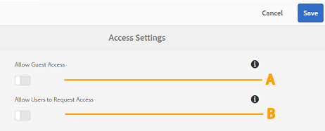
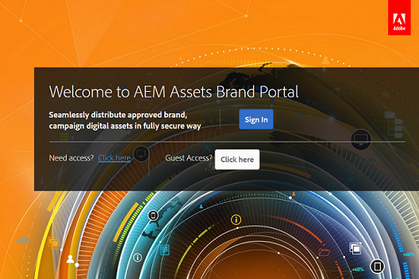

# Brand Portal에 대한 관리자 액세스 {#administer-user-access-on-brand-portal}

Adobe Experience Manager Assets Brand Portal 6.4.2 이상에서는 관리자가 게스트 액세스를 구성하고 사용자가 조직의 Brand Portal에 대한 액세스를 요청할 수 있도록 권한을 부여합니다. 이러한 구성은 관리 패널에서 **[!UICONTROL 액세스 설정]** 구성으로 제공됩니다. 두 설정은 기본적으로 비활성화되어 있습니다.

**A** - 게스트가 Brand Portal 시작 화면의 **[!UICONTROL `Guest Access?`]** 링크를 사용하여 Brand Portal에서 액세스할 수 있도록 하는 구성 (기본값은 비활성화됨)

**B** - 사용자가 Brand Portal 시작 화면의 **[!UICONTROL `Need access?`]** 링크를 사용하여 Brand Portal 액세스를 요청할 수 있도록 하는 구성입니다. (기본값은 비활성화됨)

## 게스트 액세스 허용 {#allow-guest-access}

게스트 액세스를 허용함으로써 사용자는 Brand Portal에 로그인할 필요 없이 공개 자산에 액세스할 수 있습니다.
게스트 액세스를 허용하려면 관리자가 다음 단계를 수행해야 합니다.

1. 상단의 도구 모음에서 AEM 로고를 선택하여 관리 도구에 액세스합니다.
1. 관리 도구 패널에서 **[!UICONTROL 액세스]**&#x200B;를 선택하여 **[!UICONTROL 액세스 설정]** 페이지를 엽니다.
1. **[!UICONTROL 게스트 액세스 허용]** 구성을 사용하도록 설정합니다.
1. 변경 내용을 **[!UICONTROL 저장]**&#x200B;합니다.
1. 로그아웃하여 변경 사항을 적용합니다.

## 사용자 액세스 요청 허용 {#allow-users-to-request-access}

관리자는 조직 사용자가 시작 화면에서 Brand Portal에 대한 액세스를 요청하도록 허용할 수 있습니다. 그러나 관리자는 **[!UICONTROL 사용자에게 액세스 권한 요청 허용]** 구성을 활성화하여 시작 화면에 액세스 요청 링크가 나타나도록 해야 합니다.

조직 사용자가 Brand Portal에 대한 액세스 권한을 요청하도록 하려면 관리자는 다음을 수행해야 합니다.

1. 상단의 도구 모음에서 AEM 로고를 선택하여 관리 도구에 액세스합니다.
1. 관리 도구 패널에서 **[!UICONTROL 액세스]**&#x200B;를 선택하여 **[!UICONTROL 액세스 설정]** 페이지를 엽니다.
1. **[!UICONTROL 사용자가 액세스를 요청할 수 있도록 허용]** 구성을 사용하도록 설정합니다.
1. 변경 내용을 **[!UICONTROL 저장]**&#x200B;합니다.
1. 로그아웃하여 변경 사항을 적용합니다.
