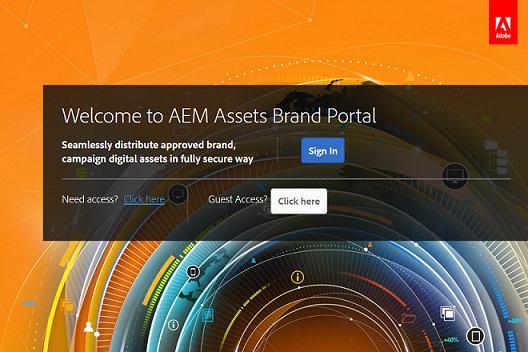

# 브랜드 포털에서 사용자 액세스 관리 {#administer-user-access-on-brand-portal}

AEM Assets 브랜드 포털 6.4.2 이상은 관리자에게 게스트 액세스 권한을 구성하고 사용자가 조직의 브랜드 포털에서 액세스를 요청할 수 있도록 허용합니다. 이러한 구성은 관리 패널에서 [!UICONTROL 액세스 설정] 구성으로 제공됩니다. 두 설정 모두 기본적으로 비활성화되어 있습니다.

**게스트** 액세스를 사용하여 [!UICONTROL 브랜드 포털에서 게스트 액세스를 허용하는 구성] Link on the Brand Portal welcome screen. (기본값은 비활성화됨)

**사용자가** 액세스 필요 기능을 사용하여 [!UICONTROL 브랜드 포털에 대한 액세스를 요청할 수 있는 B 구성] Link on the Brand Portal welcome screen. (기본값은 비활성화됨)

## 게스트 액세스 허용 {#allow-guest-access}

브랜드 포털에서 손님 액세스를 허용하기 위해 사용자가 로그인하여 공개 자산에 액세스할 필요가 없도록 하려면 관리자가 다음을 수행해야 합니다.

1. 맨 위의 도구 모음에서 관리 도구에 액세스하려면 AEM 로고를 선택합니다.
2. [관리 도구] 패널에서 [액세스 설정 열기] 페이지에 **[!UICONTROL 액세스하려면]** **[!UICONTROL [액세스] 를 선택합니다.]**
3. 손님 **[!UICONTROL 액세스]** 권한 구성을 활성화합니다.
4. **[!UICONTROL 변경 사항을 저장합니다.]**
5. 로그아웃하면 변경 사항이 적용됩니다.

## 사용자 액세스 요청 허용 {#allow-users-to-request-access}

관리자는 조직 사용자가 시작 화면에서 브랜드 포털에 대한 액세스를 요청할 수 있습니다. 그러나 관리자는 사용자가 액세스 구성을 요청할 **[!UICONTROL 수 있도록 허용하여]** 시작 화면에 액세스 요청 링크가 나타나도록 해야 합니다.

조직 사용자가 브랜드 포털에서 액세스 권한을 요청할 수 있도록 하려면 관리자가 다음을 수행해야 합니다.

1. 맨 위의 도구 모음에서 관리 도구에 액세스하려면 AEM 로고를 선택합니다.
2. [관리 도구] 패널에서 [액세스 설정 열기] 페이지에 **[!UICONTROL 액세스하려면]** **[!UICONTROL [액세스] 를 선택합니다.]**
3. 사용자가 **[!UICONTROL 액세스]** 구성을 요청할 수 있도록 허용합니다.
4. **[!UICONTROL 변경 사항을 저장합니다.]**
5. 로그아웃하면 변경 사항이 적용됩니다.
