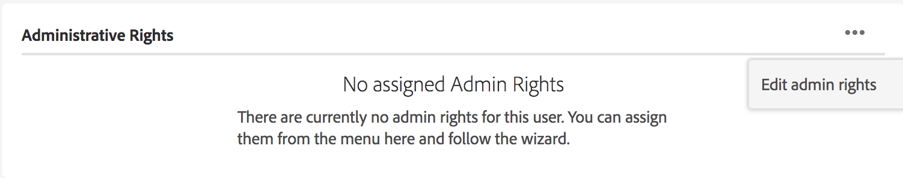
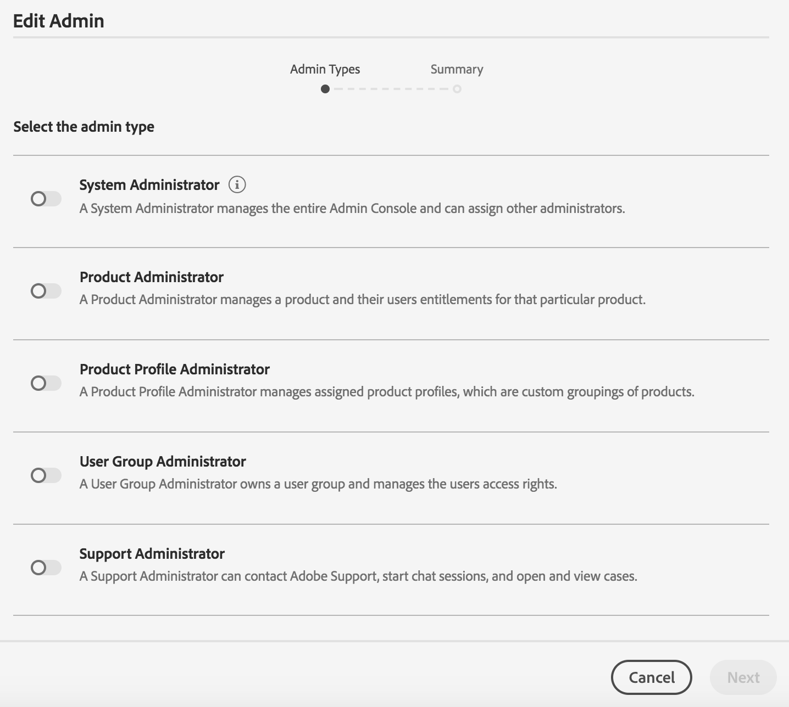

# 사용자, 그룹 및 사용자 역할 관리 {#manage-users-groups-and-user-roles}

관리자는 Adobe Admin Console을 사용하여 AEM Assets 브랜드 포털 사용자 및 제품 프로필을 만들고 브랜드 포털 사용자 인터페이스를 사용하여 역할을 관리할 수 있습니다. 이 권한은 뷰어 및 편집기에서는 사용할 수 없습니다.

[! [UICONTROL 관리 콘솔]에서](http://adminconsole.adobe.com/enterprise/overview)조직과 관련된 모든 제품을 볼 수 있습니다. 제품은 Adobe Analytics, Adobe Target 또는 AEM 브랜드 포털과 같은 Experience Cloud 솔루션일 수 있습니다. AEM 브랜드 포털 제품을 선택하고 제품 프로필을 만들어야 합니다.

<!--
Comment Type: draft

<note type="note">

Product Profiles (formerly known as product configurations*). 

* The nomenclature has changed from product configurations to product profiles in the new Adobe Admin Console.

</note>
-->

이러한 제품 프로필은 8시간마다 브랜드 포털 사용자 인터페이스와 동기화되고 브랜드 포털에서 그룹으로 표시됩니다. 사용자를 추가하고 제품 프로필을 만들고 해당 제품 프로필에 사용자를 추가한 후에는 브랜드 포털에서 사용자 및 그룹에 역할을 할당할 수 있습니다.

>[!NOTE]
>
>브랜드 포털에서 그룹을 만들려면 Adobe Admin [!UICONTROL Console에서]사용자 **[!UICONTROL 페이지 &gt; 사용자 그룹]**&#x200B;대신 **[!UICONTROL 제품 &gt; 제품 프로필을]**&#x200B;사용하십시오. Adobe Admin Console [!UICONTROL 의 제품] 프로필은 브랜드 포털에서 그룹을 만드는 데 사용됩니다.

## 사용자 추가 {#add-a-user}

제품 관리자인 경우 Adobe [[!UICONTROL Admin Console]을](http://adminconsole.adobe.com/enterprise/overview) 사용하여 사용자를 만들고 제품 프로필(*이전의 제품 구성*)에 할당하여 브랜드 포털에서 그룹으로 표시합니다. 그룹을 사용하여 역할 관리 및 자산 공유와 같은 일괄 작업을 수행할 수 있습니다.

>[!NOTE]
브랜드 포털에 대한 액세스 권한이 없는 신규 사용자는 브랜드 포털의 로그인 화면에서 액세스 권한을 요청할 수 있습니다. 자세한 내용은 브랜드 포털에 [대한 액세스 권한 요청을 참조하십시오](../using/brand-portal.md#request-access-to-brand-portal). 알림 영역에서 액세스 요청 알림을 받으면 관련 알림을 클릭한 다음 액세스 권한 **[!UICONTROL 부여를 클릭합니다]**. 또는 받은 액세스 요청 이메일의 링크를 따릅니다. 그런 다음 Adobe [!UICONTROL [관리 콘솔]을](http://adminconsole.adobe.com/enterprise/overview)통해 사용자를 추가하려면 아래 절차의 4-7단계를 따르십시오.

>[!NOTE]
Adobe [!UICONTROL [관리 콘솔]](http://adminconsole.adobe.com/enterprise/overview) 직접 또는 브랜드 포털에서 로그인할 수 있습니다. 직접 로그인하는 경우 아래 절차의 4-7단계를 수행하여 사용자를 추가합니다.

1. 맨 위의 AEM 도구 모음에서 Adobe 로고를 클릭하여 관리 도구에 액세스합니다.

   

1. 관리 도구 패널에서 사용자를 **[!UICONTROL 클릭합니다]**.

   

1. 사용자 [!UICONTROL 역할] 페이지에서 관리 **[!UICONTROL 탭을 클릭한 다음]** 관리 **[!UICONTROL 콘솔]**&#x200B;시작을클릭합니다.

   

1. 관리 콘솔에서 다음 중 하나를 수행하여 새 사용자를 만듭니다.

   * 맨 위의 도구 모음에서 개요를 **[!UICONTROL 클릭합니다]**. 개요 [!UICONTROL 페이지에서] 브랜드 포털 **[!UICONTROL 제품]** 카드에서 사용자 할당을 클릭합니다.
   

   * 맨 위의 도구 모음에서 사용자를 **[!UICONTROL 클릭합니다]**. 사용자 [!UICONTROL 페이지에서] 왼쪽 [!UICONTROL 레일의] 사용자는 기본적으로 선택됩니다. 사용자 **[!UICONTROL 추가를 클릭합니다]**.
   

1. 사용자 추가 대화 상자에서 추가할 사용자의 이메일 ID를 입력하거나 입력할 때 표시되는 제안 목록에서 사용자를 선택합니다.

   

1. 사용자가 브랜드 포털에 액세스할 수 있도록 사용자를 하나 이상의 제품 프로필(이전의 제품 구성)에 할당합니다. 이 제품의 **[!UICONTROL 프로필을 선택하십시오 필드에서 해당 제품 프로필을]** 선택하십시오.
1. **[!UICONTROL 저장을 클릭합니다]**. 추가한 사용자에게 환영 이메일이 전송됩니다. 초대받은 사용자는 환영 이메일의 링크를 클릭하고 Adobe ID를 사용하여 로그인하여 브랜드 포털에 액세스할 [!UICONTROL 수 있습니다]. 자세한 내용은 [최초 로그인 환경을](../using/brand-portal-onboarding.md)참조하십시오.

   >[!NOTE]
   사용자가 브랜드 포털에 로그온할 수 없는 경우, 조직 관리자는 Adobe Admin [!UICONTROL Console을] 방문하여 사용자가 있는지, 그리고 하나 이상의 제품 프로필에 추가되었는지 확인해야 합니다.

   사용자에게 관리 권한을 부여하는 방법에 대한 자세한 내용은 [사용자에게](../using/brand-portal-adding-users.md#provideadministratorprivilegestousers)관리자 권한 제공을 참조하십시오.

## 제품 프로필 추가 {#add-a-product-profile}

관리 콘솔의 제품 프로필(이전의 제품 구성) [!UICONTROL 은] 브랜드 포털에서 그룹을 만드는 데 사용되며, 브랜드 포털에서 역할 관리 및 자산 공유와 같은 일괄 작업을 수행할 수 있습니다. **브랜드 포털은** 사용 가능한 기본 제품 프로필입니다.더 많은 제품 프로필을 만들고 새 제품 프로필에 사용자를 추가할 수 있습니다.

>[!NOTE]
직접 또는 브랜드 포털에서 [[!UICONTROL Admin Console]에](http://adminconsole.adobe.com/enterprise/overview) 로그인할 수 있습니다. Admin Console에 [!UICONTROL 직접 로그인하는] 경우 아래 절차의 4-7단계를 수행하여 제품 프로필을 추가합니다.

1. 맨 위의 AEM 도구 모음에서 Adobe 로고를 클릭하여 관리 도구에 액세스합니다.

   

1. 관리 도구 패널에서 사용자를 **[!UICONTROL 클릭합니다]**.

   

1. 사용자 [!UICONTROL 역할] 페이지에서 관리 **[!UICONTROL 탭을 클릭한 다음]** 관리 **[!UICONTROL 콘솔]**&#x200B;시작을클릭합니다.

   

1. 맨 위의 도구 모음에서 제품을 **[!UICONTROL 클릭합니다]**.
1. 제품 [!UICONTROL 페이지에서] 제품 [!UICONTROL 프로필은] 기본적으로 선택되어 있습니다. 새 **[!UICONTROL 프로필을 클릭합니다]**.

   

1. 새 [!UICONTROL 프로필 만들기] 페이지에서 프로필 이름, 표시 이름, 프로필 설명을 제공하고, 프로필에 추가되거나 프로필에서 제거되었을 때 사용자에게 이메일로 알릴 것인지 선택합니다.

   

1. 완료를 **[!UICONTROL 클릭합니다]**. 제품 구성 그룹(예: **[!UICONTROL 판매 그룹]**)이 브랜드 포털에 추가됩니다.

   

## 제품 프로필에 사용자 추가 {#add-users-to-a-product-profile}

브랜드 포털 그룹에 사용자를 추가하려면 관리 콘솔의 해당 제품 프로필(이전의 제품 구성)에 [!UICONTROL 추가하십시오]. 개별적으로 또는 대량으로 사용자를 추가할 수 있습니다.

>[!NOTE]
직접 또는 브랜드 포털에서 [[!UICONTROL Admin Console]에](http://adminconsole.adobe.com/enterprise/overview) 로그인할 수 있습니다. Admin Console에 직접 로그인하는 경우 아래 절차의 4-7단계를 수행하여 사용자를 제품 프로필에 추가합니다.

1. 맨 위의 AEM 도구 모음에서 Adobe 로고를 클릭하여 관리 도구에 액세스합니다.

   

1. 관리 도구 패널에서 사용자를 **[!UICONTROL 클릭합니다]**.

   

1. 사용자 [!UICONTROL 역할] 페이지에서 관리 **[!UICONTROL 탭을 클릭한 다음]** 관리 **[!UICONTROL 콘솔]**&#x200B;시작을클릭합니다.

   ![시작 [!DNL Admin Console]](assets/launch_admin_console.png)

1. 맨 위의 도구 모음에서 제품을 **[!UICONTROL 클릭합니다]**.
1. 제품 [!UICONTROL 페이지에서] 제품 [!UICONTROL 프로필은] 기본적으로 선택되어 있습니다. 사용자를 추가할 제품 프로필(예: 판매 그룹)을 [!UICONTROL 엽니다].

   

1. 개별 사용자를 제품 프로필에 추가하려면 다음을 수행합니다.

   * 사용자 **[!UICONTROL 추가를 클릭합니다]**.
   

   * 영업 [!UICONTROL 그룹에] 사용자 추가 페이지에서 추가할 사용자의 이메일 ID를 입력하거나 입력하면서 표시되는 제안 목록에서 사용자를 선택합니다.
   

   * **[!UICONTROL 저장을 클릭합니다]**.

1. 제품 프로필에 벌크 사용자를 추가하려면 다음을 수행합니다.

   * 줄임표(**[!UICONTROL ...) &gt; CSV로 사용자 추가를 선택합니다]**.
   

   * CSV **[!UICONTROL 로 사용자 추가]** 페이지에서 CSV 템플릿을 다운로드하거나 CSV 파일을 드래그하여 놓습니다.
   

   * **[!UICONTROL 업로드를 클릭합니다]**.
   기본 제품 프로필, 즉 브랜드 포털에 사용자를 추가한 경우 추가한 사용자의 이메일 ID로 환영 이메일이 전송됩니다. 초대받은 사용자는 환영 이메일의 링크를 클릭하고 Adobe ID를 사용하여 로그인하여 브랜드 포털에 액세스할 [!UICONTROL 수 있습니다]. 자세한 내용은 [최초 로그인 환경을](../using/brand-portal-onboarding.md)참조하십시오.

   사용자 지정 또는 새 제품 프로필에 추가된 사용자는 이메일 알림을 받지 않습니다.

## 사용자에게 관리자 권한 제공 {#provide-administrator-privileges-to-users}

시스템 관리자 또는 제품 관리자 권한을 브랜드 포털 사용자에게 제공할 수 있습니다. 제품 프로필 관리자, 사용자 그룹 관리자, [!UICONTROL 지원 관리자]등 관리 콘솔에서 사용할 수 있는 다른 관리 권한을 제공하지 마십시오. 이러한 역할에 대한 자세한 내용은 관리 역할을 [참조하십시오](https://helpx.adobe.com/enterprise/using/admin-roles.html).

>[!NOTE]
직접 또는 브랜드 포털에서 [[!UICONTROL Admin Console]에](https://adminconsole.adobe.com/enterprise/overview) 로그인할 수 있습니다. Admin Console에 [!UICONTROL 직접 로그인하는] 경우 아래 절차의 4-8단계를 수행하여 사용자를 제품 프로필에 추가합니다.

1. 맨 위의 AEM 도구 모음에서 Adobe 로고를 클릭하여 관리 도구에 액세스합니다.

   

1. 관리 도구 패널에서 사용자를 **[!UICONTROL 클릭합니다]**.

   

1. 사용자 [!UICONTROL 역할] 페이지에서 관리 **[!UICONTROL 탭을 클릭한 다음]** 관리 **[!UICONTROL 콘솔]**&#x200B;시작을클릭합니다.

   

1. 맨 위의 도구 모음에서 사용자를 **[!UICONTROL 클릭합니다]**.
1. 사용자 [!UICONTROL 페이지에서] 왼쪽 [!UICONTROL 레일의] 사용자는 기본적으로 선택됩니다. 관리자 권한을 제공하려는 사용자의 사용자 이름을 클릭합니다.

   

1. 사용자 프로필 페이지에서 하단에 있는 **[!UICONTROL 관리]** 권한 섹션을 찾아 줄임표(**[!UICONTROL ...&gt; 관리자 권한]**편집
   

1. 관리 [!UICONTROL 편집] 페이지에서 시스템 관리자 또는 제품 관리자를 선택합니다.

   

   >[!NOTE]
   브랜드 포털은 시스템 관리자 및 제품 관리자 역할만 지원합니다.
   Adobe는 조직의 모든 제품에 대해 조직 전체에 관리자 권한을 부여하므로 시스템 관리자 역할을 사용하지 않는 것이 좋습니다. 예를 들어 세 개의 Marketing Cloud 제품을 포함하는 조직의 시스템 관리자는 세 가지 제품 모두에 대한 전체 권한 집합을 가집니다. AEM 자산에서 브랜드 포털에 자산을 게시할 수 있도록 시스템 관리자만 AEM 자산을 구성할 수 있습니다. 자세한 내용은 브랜드 포털과 [AEM 자산 통합 구성을 참조하십시오](https://helpx.adobe.com/experience-manager/6-5/assets/using/brand-portal-configuring-integration.html).
   반면 제품 관리자 역할은 특정 제품에 대한 관리자 권한을 부여합니다. 브랜드 포털 내에서 보다 세부적으로 액세스 제어를 적용하려면 제품 관리자 역할을 사용하고 해당 제품을 브랜드 포털로 선택하십시오.

   >[!NOTE]
   브랜드 포털은 제품 프로필 관리자(이전 구성 관리자)를 지원하지 않습니다. 사용자에게 제품 프로필 관리자 권한을 할당하지 마십시오.

1. 관리 유형 선택을 검토하고 저장을 **[!UICONTROL 클릭합니다]**.

   >[!NOTE]
   사용자에 대한 관리자 권한을 취소하려면 [관리 편집] 페이지에서 적절한 [!UICONTROL 변경] 작업을 수행한 다음 저장을 **[!UICONTROL 클릭합니다]**.

## 사용자 역할 관리 {#manage-user-roles}

관리자는 브랜드 포털에서 사용자의 역할을 수정할 수 있습니다.

관리자 역할 외에 브랜드 포털은 다음 역할을 지원합니다.

* [!UICONTROL 뷰어]:이 역할을 가진 사용자는 관리자가 공유하는 파일과 폴더를 볼 수 있습니다. 또한 사용자는 에셋을 검색하고 다운로드할 수 있습니다. 그러나 뷰어는 콘텐트(파일, 폴더, [!UICONTROL 컬렉션])를 다른 사용자와 공유할 수 없습니다.
* [!UICONTROL 편집기]:이 역할을 가진 사용자는 뷰어의 모든 권한을 갖습니다. 또한 편집자는 콘텐트(폴더, [!UICONTROL 컬렉션], 링크)를 다른 사용자와 공유할 수 있습니다.

1. 맨 위의 AEM 도구 모음에서 Adobe 로고를 클릭하여 관리 도구에 액세스합니다.

   

1. 관리 도구 패널에서 사용자를 **[!UICONTROL 클릭합니다]**.

   

1. [사용자 [!UICONTROL 역할] ] 페이지에서 [!UICONTROL [사용자] ] 탭이 기본적으로 선택됩니다. 역할을 변경할 사용자의 경우 역할 **[!UICONTROL 드롭다운에서]** **[!UICONTROL 편집기]** 또는 **[!UICONTROL 뷰어를]** 선택합니다.

   

   여러 사용자의 역할을 동시에 수정하려면 사용자를 선택하고 역할 **[!UICONTROL 드롭다운에서 적절한 역할을]** 선택합니다.

   >[!NOTE]
   관리자 [!UICONTROL 사용자에] 대한 역할 목록이 비활성화됩니다. 이러한 사용자를 선택하여 역할을 수정할 수 없습니다.

   >[!NOTE]
   사용자가 편집기 그룹의 구성원인 경우에도 사용자 역할이 비활성화됩니다. 사용자의 편집 권한을 취소하려면, 편집기 그룹에서 사용자를 제거하거나 전체 그룹의 역할을 뷰어로 변경합니다.

1. **[!UICONTROL 저장을 클릭합니다]**. 해당 사용자에 대해 역할이 수정되었습니다. 여러 사용자를 선택한 경우 모든 사용자에 대한 역할이 동시에 수정됩니다.

   >[!NOTE]
   사용자 권한 변경 사항은 사용자가 브랜드 포털에 다시 [!UICONTROL 로그인한] 후에만 사용자 역할 페이지에 반영됩니다.

## 그룹 역할 및 권한 관리 {#manage-group-roles-and-privileges}

관리자는 특정 권한을 브랜드 포털의 사용자 [그룹과](../using/brand-portal-adding-users.md#main-pars-title-278567577) 연결할 수 있습니다. [ [!UICONTROL 사용자] 역할] 페이지의 [그룹  ] 탭에서는 관리자가 다음을 수행할 수 있습니다.

* 사용자 그룹에 역할 할당
* 사용자 그룹이 Brand Portal에서 이미지 파일의 원본 변환(.jpeg, .tiff, .png, .bmp, .gif, .pjpeg, x-portable-anymap, x-portable-bitmap, x-portable-graymap, x-portable-xbitmap, x-xpixmap, x-icon, image/photoshop, image/x-photoshop, .psd, image/vnd.adobe.photoshop)을 다운로드하도록 제한합니다.

>[!NOTE]
링크로 공유된 자산의 경우, 이미지 파일의 원본 표현물에 액세스할 수 있는 권한은 자산을 공유하는 사용자의 권한에 따라 적용됩니다.

특정 그룹 구성원에 대한 원본 변환에 액세스할 수 있는 역할과 권한을 수정하려면 다음 단계를 수행하십시오.

1. 사용자 [!UICONTROL 역할] 페이지에서 그룹 **[!UICONTROL 탭으로 이동합니다]** .
1. 역할을 변경할 그룹을 선택합니다.
1. 역할 드롭다운 목록에서 적절한 [!UICONTROL 역할을] 선택합니다.

   그룹 구성원이 이미지 파일의 원본 변환에 액세스할 수 있도록 하려면(.jpeg, .tiff, .png, .bmp, .gif, .pjpeg, x-portable-anymap, x-portable-bitmap, x-portable-graymap, x-portable-pixmap, x-rgb, x-xpixmap, x-icon, image/photoshop, image/x-photoshop, .psd, image/vnd.adobe.photoshop) 포털 또는 공유 링크에서 다운로드하는 Access to Original [!UICONTROL 옵션은 해당] 그룹에 대해 선택된 상태로 유지됩니다. 기본적으로 [!UICONTROL [원본에] 액세스] 옵션은 모든 사용자에 대해 선택됩니다. 사용자 그룹이 원본 변환에 액세스하지 못하게 하려면 해당 그룹에 해당하는 옵션을 선택 취소합니다.

   

   >[!NOTE]
   사용자가 여러 그룹에 추가되고 이러한 그룹 중 하나에 제한이 있는 경우 해당 사용자에게 제한이 적용됩니다.
   또한, 이미지 파일의 원본 표현물에 대한 액세스 제한은 제한된 그룹의 구성원도 관리자에게 적용되지 않습니다.

1. **[!UICONTROL 저장을 클릭합니다]**. 해당 그룹에 대해 역할이 수정되었습니다.

   >[!NOTE]
   사용자 대 그룹 연결 또는 사용자의 그룹 멤버십은 8시간마다 브랜드 포털에 동기화됩니다. 사용자 또는 그룹 역할에 대한 변경 사항은 다음 동기화 작업이 실행된 후에 적용됩니다.
