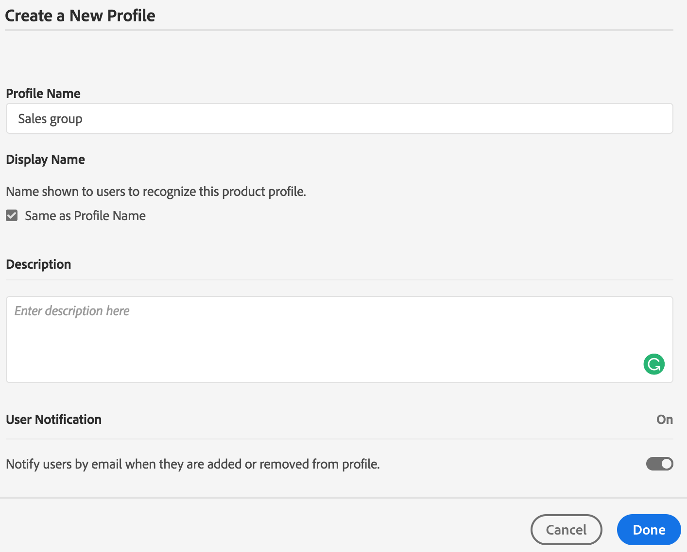

# 사용자, 그룹 및 사용자 역할 관리 {#manage-users-groups-and-user-roles}

관리자는 Adobe Admin Console을 사용하여 Experience Manager Assets Brand Portal 사용자 및 제품 프로필을 만들고 Brand Portal 사용자 인터페이스를 사용하여 자신의 역할을 관리할 수 있습니다. 뷰어 및 편집자는 이 권한을 사용할 수 없습니다.

[[!UICONTROL Admin Console]](https://adminconsole.adobe.com/enterprise/overview)에서 조직과 관련된 모든 제품을 볼 수 있습니다. 제품은 Adobe Analytics, Adobe Target 또는 Experience Manager Assets Brand Portal과 같은 모든 Experience Cloud 솔루션이 될 수 있습니다. AEM Brand Portal 제품을 선택하고 제품 프로필을 만듭니다.

<!--
Comment Type: draft

<note type="note">

Product profiles (formerly known as product configurations*). 

* The nomenclature has changed from product configurations to Product Profiles in the new Adobe Admin Console.

</note>
-->

이러한 제품 프로필은 8시간마다 Brand Portal 사용자 인터페이스와 동기화되며 Brand Portal에 그룹으로 표시됩니다. 사용자를 추가하고 제품 프로필을 만든 후 해당 제품 프로필에 사용자를 추가하면 Brand Portal에서 사용자 및 그룹에 역할을 할당할 수 있습니다.

>[!NOTE]
>
>Brand Portal에서 그룹을 만들려면 [!UICONTROL Admin Console] Adobe에서 **[!UICONTROL 사용자 페이지 > 사용자 그룹]** 대신 **[!UICONTROL 제품 > 제품 프로필]**&#x200B;을 사용하십시오. [!UICONTROL Admin Console] Adobe의 제품 프로필을 사용하여 Brand Portal에서 그룹을 만듭니다.

## 사용자 추가 {#add-a-user}

제품 관리자인 경우 Adobe [[!UICONTROL Admin Console]](https://adminconsole.adobe.com/enterprise/overview)을(를) 사용하여 사용자를 만들고 Brand Portal에 그룹으로 표시되는 제품 프로필(*이전 제품 구성*)에 할당합니다. 그룹을 사용하여 역할 관리 및 에셋 공유와 같은 대량 작업을 수행할 수 있습니다.

>[!NOTE]
>
>Brand Portal에 대한 액세스 권한이 없는 신규 사용자는 Brand Portal의 로그인 화면에서 액세스 권한을 요청할 수 있습니다. 자세한 내용은 [Brand Portal 액세스 요청](../using/brand-portal.md#request-access-to-brand-portal)을 참조하세요. 알림 영역에서 액세스 요청 알림을 받은 후 관련 알림을 클릭한 다음 **[!UICONTROL 액세스 권한 부여]**&#x200B;를 클릭합니다. 또는 수신한 액세스 요청 이메일의 링크를 따르십시오. [Adobe [!UICONTROL Admin Console]](https://adminconsole.adobe.com/enterprise/overview)을(를) 통해 사용자를 추가하려면 아래 절차의 4-7단계를 따르십시오.

>[!NOTE]
>
>직접 또는 Brand Portal에서 [Adobe [!UICONTROL Admin Console]](https://adminconsole.adobe.com/enterprise/overview)에 로그인할 수 있습니다. 직접 로그인하는 경우 아래 4-7단계에 따라 사용자를 추가합니다.

1. 맨 위에 있는 AEM 도구 모음에서 Adobe 로고를 클릭하여 관리 도구에 액세스합니다.

   

1. 관리 도구 패널에서 **[!UICONTROL 사용자]**&#x200B;를 클릭합니다.

   

1. [!UICONTROL 사용자 역할] 페이지에서 **[!UICONTROL 관리]** 탭을 클릭한 다음 **[!UICONTROL Admin Console 시작]**&#x200B;을 클릭합니다.

   

1. Admin Console에서 다음 중 하나를 수행하여 새 사용자를 만듭니다.

   * 맨 위에 있는 도구 모음에서 **[!UICONTROL 개요]**&#x200B;를 클릭합니다. [!UICONTROL 개요] 페이지의 Brand Portal 제품 카드에서 **[!UICONTROL 사용자 할당]**&#x200B;을 클릭합니다.

   

   * 상단의 도구 모음에서 **[!UICONTROL 사용자]**&#x200B;를 클릭합니다. [!UICONTROL 사용자] 페이지에서 기본적으로 왼쪽 레일의 [!UICONTROL 사용자]가 선택됩니다. **[!UICONTROL 사용자 추가]**&#x200B;를 클릭합니다.

   

1. 사용자 추가 대화 상자에서 추가하려는 사용자의 이메일 ID를 입력하거나, 입력할 때 나타나는 제안 목록에서 사용자를 선택합니다.

   

1. 사용자가 Brand Portal에 액세스할 수 있도록 사용자를 하나 이상의 제품 프로필(이전의 제품 구성)에 할당합니다. **[!UICONTROL 이 제품에 대한 프로필을 선택하십시오]** 필드.
1. **[!UICONTROL 저장]**&#x200B;을 클릭합니다. 새로 추가된 사용자에게 시작 이메일이 전송됩니다. 초대된 사용자는 시작 이메일의 링크를 클릭하여 Brand Portal에 액세스할 수 있습니다. 사용자는 Admin Console에 구성된 전자 메일 ID([!UICONTROL Adobe ID], [!UICONTROL Enterprise ID] 또는 [!UICONTROL Federated ID])를 사용하여 로그인할 수 있습니다. 자세한 내용은 [처음 로그인 경험](../using/brand-portal-onboarding.md)을 참조하세요.

   >[!NOTE]
   >
   >사용자가 Brand Portal에 로그온할 수 없는 경우 조직 관리자는 [!UICONTROL Admin Console] Adobe을 방문해야 합니다. 사용자가 존재하며 하나 이상의 제품 프로필에 추가되었는지 확인합니다.

   사용자에게 관리자 권한을 부여하는 방법에 대한 자세한 내용은 [사용자에게 관리자 권한 제공](../using/brand-portal-adding-users.md#provideadministratorprivilegestousers)을 참조하십시오.

## 제품 프로필 추가 {#add-a-product-profile}

[!UICONTROL Admin Console]의 제품 프로필(이전의 제품 구성)은 Brand Portal에서 역할 관리 및 에셋 공유와 같은 대량 작업을 수행할 수 있도록 Brand Portal에서 그룹을 만드는 데 사용됩니다. **Brand Portal**&#x200B;은(는) 사용 가능한 기본 제품 프로필입니다. 더 많은 제품 프로필을 만들고 사용자를 새 제품 프로필에 추가할 수 있습니다.

>[!NOTE]
>
>직접 또는 Brand Portal에서 [[!UICONTROL Admin Console]](https://adminconsole.adobe.com/enterprise/overview)에 로그인할 수 있습니다. [!UICONTROL Admin Console]에 직접 로그인하는 경우 아래 절차의 4-7단계에 따라 제품 프로필을 추가하십시오.

1. 맨 위에 있는 AEM 도구 모음에서 Adobe 로고를 클릭하여 관리 도구에 액세스합니다.

   

1. 관리 도구 패널에서 **[!UICONTROL 사용자]**&#x200B;를 클릭합니다.

   

1. [!UICONTROL 사용자 역할] 페이지에서 **[!UICONTROL 관리]** 탭을 클릭한 다음 **[!UICONTROL Admin Console 시작]**&#x200B;을 클릭합니다.

   

1. 상단의 도구 모음에서 **[!UICONTROL 제품]**&#x200B;을 클릭합니다.
1. [!UICONTROL 제품] 페이지에서 기본적으로 [!UICONTROL 제품 프로필]이 선택됩니다. **[!UICONTROL 새 프로필]**&#x200B;을 클릭합니다.

   

1. [!UICONTROL 새 프로필 만들기] 페이지에서 프로필 이름, 표시 이름 및 프로필 설명을 입력하십시오. 사용자가 프로필에 추가되거나 프로필에서 제거될 때 이메일로 알림을 받도록 선택합니다.

   

1. **[!UICONTROL 완료]**&#x200B;를 클릭합니다. 제품 구성 그룹. 예를 들어 **[!UICONTROL 영업 그룹]**&#x200B;이(가) Brand Portal에 추가됩니다.

   

## 제품 프로필에 사용자 추가 {#add-users-to-a-product-profile}

Brand Portal 그룹에 사용자를 추가하려면 해당 사용자를 [!UICONTROL Admin Console]의 해당 제품 프로필(이전의 제품 구성)에 추가하십시오. 개별적으로 또는 대량으로 사용자를 추가할 수 있습니다.

>[!NOTE]
>
>직접 또는 Brand Portal에서 [[!UICONTROL Admin Console]](https://adminconsole.adobe.com/enterprise/overview)에 로그인할 수 있습니다. Admin Console에 직접 로그인하는 경우 아래 절차의 4-7단계에 따라 사용자를 제품 프로필에 추가합니다.

1. 상단의 도구 모음에서 Experience Manager 로고를 클릭하여 관리 도구에 액세스합니다.

   

1. 관리 도구 패널에서 **[!UICONTROL 사용자]**&#x200B;를 클릭합니다.

   

1. [!UICONTROL 사용자 역할] 페이지에서 **[!UICONTROL 관리]** 탭을 클릭한 다음 **[!UICONTROL Admin Console 시작]**&#x200B;을 클릭합니다.

   ![시작 [!DNL Admin Console]](assets/launch_admin_console.png)

1. 상단의 도구 모음에서 **[!UICONTROL 제품]**&#x200B;을 클릭합니다.
1. [!UICONTROL 제품] 페이지에서 기본적으로 [!UICONTROL 제품 프로필]이 선택됩니다. 사용자를 추가할 제품 프로필을 엽니다(예: [!UICONTROL 영업 그룹]).

   

1. 제품 프로필에 개별 사용자를 추가하려면 다음 작업을 수행하십시오.

   * **[!UICONTROL 사용자 추가]**&#x200B;를 클릭합니다.

   

   * [!UICONTROL 영업 그룹에 사용자 추가] 페이지에서 추가하려는 사용자의 전자 메일 ID를 입력하거나 입력할 때 나타나는 제안 목록에서 사용자를 선택하십시오.

   

   * **[!UICONTROL 저장]**&#x200B;을 클릭합니다.

1. 제품 프로필에 대량 사용자를 추가하려면 다음 작업을 수행하십시오.

   * **[!UICONTROL 줄임표(...) > CSV로 사용자 추가]**&#x200B;를 선택합니다.

   

   * **[!UICONTROL CSV로 사용자 추가]** 페이지에서 CSV 템플릿을 다운로드하거나 CSV 파일을 드래그 앤 드롭하십시오.

   

   * **[!UICONTROL 업로드]**&#x200B;를 클릭합니다.

   기본 제품 프로필인 Brand Portal에 사용자를 추가하면 시스템이 해당 이메일 ID로 시작 이메일을 전송합니다. 그런 다음 초대된 사용자는 시작 이메일의 링크를 클릭하고 [!UICONTROL Adobe ID]로 로그인하여 Brand Portal에 액세스할 수 있습니다. [처음 로그인 경험](../using/brand-portal-onboarding.md)을 참조하세요.

   사용자 지정 또는 새 제품 프로필에 추가된 사용자는 이메일 알림을 받지 못합니다.

## 사용자에게 관리자 권한 제공 {#provide-administrator-privileges-to-users}

Brand Portal 사용자에게 시스템 관리자 또는 제품 관리자 권한을 부여할 수 있습니다. 그러나 [!UICONTROL Admin Console]에서 사용할 수 있는 다른 관리 역할은 할당하지 마십시오. 제품 프로필 관리자, 사용자 그룹 관리자, 지원 관리자 등이 이에 해당합니다. [관리자 역할](https://helpx.adobe.com/kr/enterprise/using/admin-roles.html)을 참조하세요.

>[!NOTE]
>
>직접 또는 Brand Portal에서 [[!UICONTROL Admin Console]](https://adminconsole.adobe.com/enterprise/overview)에 로그인할 수 있습니다. [!UICONTROL Admin Console]에 직접 로그인하는 경우 아래 절차의 4-8단계에 따라 사용자를 제품 프로필에 추가합니다.

1. 맨 위에 있는 AEM 도구 모음에서 Adobe 로고를 클릭하여 관리 도구에 액세스합니다.

   

1. 관리 도구 패널에서 **[!UICONTROL 사용자]**&#x200B;를 클릭합니다.

   

1. [!UICONTROL 사용자 역할] 페이지에서 **[!UICONTROL 관리]** 탭을 클릭한 다음 **[!UICONTROL Admin Console 시작]**&#x200B;을 클릭합니다.

   

1. 상단의 도구 모음에서 **[!UICONTROL 사용자]**&#x200B;를 클릭합니다.
1. [!UICONTROL 사용자] 페이지의 왼쪽 레일에서 기본적으로 [!UICONTROL 사용자]이(가) 선택됩니다. 관리자 권한을 제공하려는 사용자의 사용자 이름을 누릅니다.

   

1. 사용자 프로필 페이지에서 맨 아래에 있는 **[!UICONTROL 관리 권한]** 섹션을 찾은 다음 **[!UICONTROL 줄임표(...) > 관리 권한 편집]**&#x200B;을 선택합니다.
   

1. [!UICONTROL 관리자 편집] 페이지에서 시스템 관리자 또는 제품 관리자를 선택합니다.

   

   >[!NOTE]
   >
   >Brand Portal은 시스템 관리자 및 제품 관리자 역할만 지원합니다.
   >
   >Adobe은 조직의 모든 제품에 대해 조직 전체 관리자 권한을 부여하므로 시스템 관리자 역할을 사용하지 않는 것이 좋습니다. 예를 들어, 마케팅용 클라우드 제품 3개를 포함하는 조직의 시스템 관리자는 3개 제품 모두에 대한 전체 권한 집합을 가집니다. Experience Manager Assets에서 Brand Portal으로 자산을 게시할 수 있도록 시스템 관리자만 Experience Manager Assets을 구성할 수 있습니다. 자세한 내용은 [Brand Portal을 사용하여 Experience Manager Assets 구성](../using/configure-aem-assets-with-brand-portal.md)을 참조하십시오.
   >
   >반면 제품 관리자 역할은 특정 제품에 대해서만 관리자 권한을 부여합니다. Brand Portal 내에서 보다 세분화된 액세스 제어를 시행하려면 제품 관리자 역할을 사용하고 제품을 Brand Portal으로 선택합니다.

   >[!NOTE]
   >
   >Brand Portal은 제품 프로필 관리자(이전의 구성 관리자) 권한을 지원하지 않습니다. 사용자에게 제품 프로필 관리자 권한을 할당하지 마십시오.

1. 관리자 유형 선택을 검토하고 **[!UICONTROL 저장]**&#x200B;을 클릭합니다.

   >[!NOTE]
   >
   >사용자에 대한 관리자 권한을 취소하려면 **[!UICONTROL 관리자 편집]** 페이지에서 적절하게 변경한 다음 **[!UICONTROL 저장]**&#x200B;을 클릭합니다.

## 사용자 역할 관리 {#manage-user-roles}

관리자는 Brand Portal에서 사용자의 역할을 수정할 수 있습니다.

Brand Portal은 관리자 역할 외에도 다음 역할을 지원합니다.

* [!UICONTROL 뷰어]: 이 역할을 가진 사용자는 관리자가 공유하는 파일 및 폴더를 볼 수 있습니다. 뷰어는 에셋을 검색하고 다운로드할 수도 있습니다. 그러나 뷰어는 다른 사용자와 컨텐츠(파일, 폴더, [!UICONTROL 컬렉션])를 공유할 수 없습니다.
* [!UICONTROL 편집기]: 이 역할을 가진 사용자는 뷰어의 모든 권한을 가집니다. 또한 편집자는 콘텐츠(폴더, [!UICONTROL 컬렉션], 링크)를 다른 사용자와 공유할 수 있습니다.

1. 맨 위에 있는 AEM 도구 모음에서 Adobe 로고를 클릭하여 관리 도구에 액세스합니다.

   

1. 관리 도구 패널에서 **[!UICONTROL 사용자]**&#x200B;를 클릭합니다.

   

1. [!UICONTROL 사용자 역할] 페이지에서 기본적으로 [!UICONTROL 사용자] 탭이 선택됩니다. 역할을 변경할 사용자의 경우 **[!UICONTROL 역할]** 드롭다운에서 **[!UICONTROL 편집기]** 또는 **[!UICONTROL 뷰어]**&#x200B;을(를) 선택하십시오.

   

   여러 사용자의 역할을 동시에 수정하려면 사용자를 선택하고 **[!UICONTROL 역할]** 드롭다운에서 적절한 역할을 선택합니다.

   >[!NOTE]
   >
   >관리자 사용자의 [!UICONTROL 역할] 목록을 사용할 수 없습니다. 이러한 사용자의 역할을 수정하도록 선택할 수 없습니다.

   >[!NOTE]
   >
   >사용자가 편집기 그룹의 구성원인 경우 사용자 역할도 비활성화됩니다. 사용자의 편집 권한을 취소하려면 편집기 그룹에서 사용자를 제거하거나 전체 그룹의 역할을 뷰어로 변경하십시오.

1. **[!UICONTROL 저장]**&#x200B;을 클릭합니다. 해당 사용자에 대한 역할이 수정되었습니다. 여러 사용자를 선택한 경우 모든 사용자의 역할이 동시에 수정됩니다.

   >[!NOTE]
   >
   >사용자 권한 변경 내용은 사용자가 Brand Portal에 다시 로그인한 후에만 **[!UICONTROL 사용자 역할]** 페이지에 반영됩니다.

## 그룹 역할 및 권한 관리 {#manage-group-roles-and-privileges}

관리자는 Brand Portal의 [그룹](../using/brand-portal-adding-users.md#main-pars-title-278567577) 사용자와 특정 권한을 연결할 수 있습니다. 관리자는 **[!UICONTROL 사용자 역할]** 페이지의 **[!UICONTROL 그룹]** 탭에서 다음을 수행할 수 있습니다.

* 사용자 그룹에 역할 할당
* Brand Portal에서 이미지 파일(.jpeg, .tiff, .png, .bmp, .gif, .pjpeg, x-portable-anymap, x-portable-bitmap, x-portable-graymap, x-portable-pixmap, x-rgb, x-xbitmap, x-xpixmap, x-icon, image/photoshop, image/x-photoshop, .psd, image/vnd.adobe.photoshop)의 원본 렌디션을 다운로드하도록 사용자 그룹을 제한합니다.

>[!NOTE]
>
>링크로 공유되는 에셋의 경우 에셋을 공유하는 사용자의 권한에 따라 이미지 파일의 원본 렌디션에 액세스할 수 있는 권한이 적용됩니다.

특정 그룹 멤버의 역할 및 원본 표현물에 대한 액세스 권한을 수정하려면 다음 단계를 수행합니다.

1. **[!UICONTROL 사용자 역할]** 페이지에서 **[!UICONTROL 그룹]** 탭으로 이동합니다.
1. 역할을 변경할 그룹을 선택합니다.
1. **[!UICONTROL 역할]** 드롭다운 목록에서 적절한 역할을 선택합니다.

   그룹 구성원이 포털 또는 공유 링크에서 다운로드한 이미지 파일의 원본 변환에 액세스할 수 있도록 하려면 해당 그룹에 대해 **[!UICONTROL 원본 액세스]** 옵션을 선택한 상태로 유지하십시오. 이 방법에는 다음과 같은 파일 유형이 포함됩니다.

   * .jpeg
   * .tiff
   * .png
   * .bmp
   * .gif
   * .pjpeg
   * .psd
   * x-portable-anymap
   * x-portable-bitmap
   * x-portable-graymap
   * x-portable-pixmap
   * x-rgb
   * x-xbitmap
   * x-xpixmap
   * x-아이콘
   * image/photoshop
   * image/x-photoshop
   * image/vnd.adobe.photoshop

   기본적으로 모든 사용자에 대해 **[!UICONTROL 원본에 액세스]** 옵션이 선택됩니다. 사용자 그룹이 원본 렌디션에 액세스하지 못하도록 하려면 해당 그룹에 해당하는 옵션의 선택을 해제합니다.

   

   >[!NOTE]
   >
   >사용자가 여러 그룹에 추가되고 이러한 그룹 중 하나에 제한 사항이 있으면 해당 사용자에게 제한 사항이 적용됩니다.
   >
   >또한 관리자는 제한된 그룹의 구성원이더라도 이미지 파일의 원본 렌디션에 액세스하는 데 필요한 제한 사항이 적용되지 않습니다.

1. **[!UICONTROL 저장]**&#x200B;을 클릭합니다. 해당 그룹에 대해 역할이 수정되었습니다.

   >[!NOTE]
   >
   >사용자-그룹 연결 또는 사용자의 그룹 멤버십이 8시간마다 Brand Portal에 동기화됩니다. 사용자 또는 그룹 역할에 대한 변경 사항은 다음 동기화 작업이 실행된 후에 적용됩니다.
