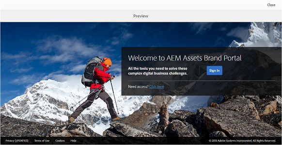
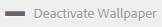

# 월페이퍼, 헤더 및 이메일 메시지 사용자 정의 {#customize-wallpaper-header-and-email-message}

Brand Portal 관리자는 사용자에게 표시되는 인터페이스에 대한 사용자 지정을 제한할 수 있습니다. Brand Portal 로그인 페이지에서 특정 배경 이미지(배경 무늬)를 선택할 수 있습니다. 헤더 이미지를 추가하고 고객 브랜드와 일치하도록 자산 공유 이메일을 사용자 지정할 수도 있습니다.

## 로그인 화면 배경 무늬 {#customize-the-login-screen-wallpaper} 사용자 지정

사용자 정의 브랜드 배경 무늬 이미지가 없는 경우 로그인 페이지에 기본 벽지가 표시됩니다.

1. 맨 위에 있는 AEM 도구 모음에서 Adobe 로고를 클릭하여 관리 도구에 액세스합니다.

   

1. 관리 도구 패널에서 **[!UICONTROL 브랜딩]**&#x200B;을 클릭합니다.

   

1. **[!UICONTROL 브랜딩 구성]** 페이지의 왼쪽 레일에서 기본적으로 **[!UICONTROL 월페이퍼]**&#x200B;가 선택됩니다. 로그인 페이지에 표시되는 기본 배경 이미지가 표시됩니다.

   

1. 새 배경 이미지를 추가하려면 맨 위의 도구 모음에서 **[!UICONTROL 이미지 선택]** 아이콘을 클릭합니다.

   

   다음 중 하나를 수행하십시오.

   * 컴퓨터에서 이미지를 업로드하려면 **[!UICONTROL 업로드]**&#x200B;를 클릭하십시오. 필요한 이미지로 이동하여 업로드합니다.
   * 기존 Brand Portal 이미지를 사용하려면 **[!UICONTROL 기존]**&#x200B;에서 선택을 클릭합니다. 자산 선택기를 사용하여 이미지를 선택합니다.

   

1. 배경 이미지에 대한 머리글 텍스트 및 설명을 지정합니다. 변경 사항을 저장하려면 맨 위의 도구 모음에서 **[!UICONTROL 저장]** 을 클릭합니다.

1. 맨 위의 도구 모음에서 **[!UICONTROL 미리 보기]** 아이콘을 클릭하여 이미지와 함께 Brand Portal 인터페이스의 미리 보기를 생성합니다.

   

   

1. 기본 배경 무늬를 활성화하거나 비활성화하려면 **[!UICONTROL 브랜딩 구성 > 월페이퍼]** 페이지에서 다음을 수행하십시오.

   * Brand Portal 로그인 페이지에 기본 월페이퍼 이미지를 표시하려면 맨 위의 도구 모음에서 **[!UICONTROL 월페이퍼 비활성화]**&#x200B;를 클릭합니다. 사용자 지정 이미지가 비활성화되었음을 확인하는 메시지가 표시됩니다.

   

   * Brand Portal 로그인 페이지에서 사용자 지정 이미지를 복원하려면 도구 모음에서 **[!UICONTROL 월페이퍼 활성화]** 를 클릭합니다. 이미지가 복원되었음을 확인하는 메시지가 표시됩니다.

   

   * **[!UICONTROL 저장]**&#x200B;을 클릭하여 변경 내용을 저장합니다.

## 헤더 {#customize-the-header} 사용자 지정

헤더는 Brand Portal에 로그인한 후 여러 Brand Portal 페이지에 표시됩니다.

1. 맨 위에 있는 AEM 도구 모음에서 Adobe 로고를 클릭하여 관리 도구에 액세스합니다.

   

1. 관리 도구 패널에서 **[!UICONTROL 브랜딩]**&#x200B;을 클릭합니다.

   

1. Brand Portal 인터페이스의 페이지 헤더를 사용자 지정하려면 **[!UICONTROL 브랜딩 구성]** 페이지에서 왼쪽 레일에서 **[!UICONTROL 헤더 이미지]**&#x200B;를 선택합니다. 기본 헤더 이미지가 표시됩니다.

   

1. 헤더 이미지를 업로드하려면 **[!UICONTROL 이미지 선택]** 아이콘을 클릭하고 **[!UICONTROL 업로드]**&#x200B;를 선택합니다.

   기존 Brand Portal 이미지를 사용하려면 **[!UICONTROL 기존]**&#x200B;에서 선택하십시오.

   

   자산 선택기를 사용하여 이미지를 선택합니다.

   

1. 헤더 이미지에 URL을 포함하려면 **[!UICONTROL 이미지 URL]** 상자에 지정합니다. 외부 또는 내부 URL을 지정할 수 있습니다. 내부 링크는 상대 링크일 수도 있습니다(예: ).
   [!UICONTROL `/mediaportal.html/content/dam/mac/tenant_id/tags`].
이 링크는 사용자를 태그 폴더로 보냅니다.
변경 사항을 저장하려면 맨 위의 도구 모음에서 **[!UICONTROL 저장]** 을 클릭합니다.

   

1. 맨 위의 도구 모음에서 **[!UICONTROL 미리 보기]** 아이콘을 클릭하여 헤더 이미지가 있는 Brand Portal 인터페이스의 미리 보기를 생성합니다.

   
   

1. 헤더 이미지를 활성화하거나 비활성화하려면 **[!UICONTROL 브랜딩 구성 > 헤더 이미지]** 페이지에서 다음을 수행하십시오.

   * 헤더 이미지가 Brand Portal 페이지에 표시되지 않도록 하려면 맨 위의 도구 모음에서 **[!UICONTROL 헤더 비활성화]** 를 클릭합니다. 이미지가 비활성화되었음을 확인하는 메시지가 표시됩니다.

   

   * 헤더 이미지를 Brand Portal 페이지에 다시 표시하려면, 맨 위의 도구 모음에서 **[!UICONTROL 헤더 활성화]** 를 클릭합니다. 이미지가 활성화되었음을 확인하는 메시지가 표시됩니다.

   

   * **[!UICONTROL 저장]**&#x200B;을 클릭하여 변경 내용을 저장합니다.

## 전자 메일 메시지 {#customize-the-email-messaging} 사용자 지정

자산이 링크로 공유되면 사용자는 링크가 포함된 이메일을 받게 됩니다. 관리자는 이러한 이메일의 메시징, 즉 로고, 설명 및 바닥글을 사용자 지정할 수 있습니다.

1. 맨 위에 있는 AEM 도구 모음에서 Adobe 로고를 클릭하여 관리 도구에 액세스합니다.

   

1. 관리 도구 패널에서 **[!UICONTROL 브랜딩]**&#x200B;을 클릭합니다.

   

1. 자산이 링크로 공유되거나 이메일을 통해 다운로드되고 **[!UICONTROL 컬렉션]**&#x200B;이 공유되면 이메일 알림이 사용자에게 전송됩니다. 이메일 메시지를 사용자 지정하려면 **[!UICONTROL 브랜딩 구성]** 페이지의 왼쪽 레일에서 **[!UICONTROL 이메일 메시지]**&#x200B;를 선택합니다.

   

1. 나가는 전자 메일에 로고를 추가하려면 맨 위의 도구 모음에서 **[!UICONTROL 업로드]**&#x200B;를 클릭합니다.

1. **[!UICONTROL 설명]** 섹션에서 전자 메일 머리글과 바닥글 텍스트를 지정합니다. 변경 사항을 저장하려면 맨 위의 도구 모음에서 **[!UICONTROL 저장]** 을 클릭합니다.

   >[!NOTE]
   >
   >로고에 권장되는 크기를 사용하지 않거나 머리글 및 바닥글 텍스트가 권장 단어 수를 초과하는 경우 전자 메일 메시지의 콘텐츠가 잘 작동하지 않을 수 있습니다.
