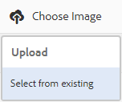
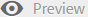

# 월페이퍼, 헤더 및 이메일 메시지 사용자 정의 {#customize-wallpaper-header-and-email-message}

브랜드 포털 관리자는 사용자에게 표시되는 인터페이스에 대한 사용자 지정을 제한할 수 있습니다. 브랜드 포털 로그인 페이지에 대한 특정 배경 이미지(배경 무늬)를 선택할 수 있습니다. 또한 헤더 이미지를 추가하고 고객의 브랜드에 맞게 에셋 공유 이메일을 사용자 정의할 수 있습니다.

## 로그인 화면 배경 무늬 {#customize-the-login-screen-wallpaper} 사용자 정의

사용자 정의 브랜드에 맞는 배경 무늬 이미지가 없는 경우 로그인 페이지에 기본 배경 무늬가 표시됩니다.

1. 상단에 있는 AEM 도구 모음에서 Adobe 로고를 클릭하여 관리 도구에 액세스합니다.

   

1. 관리 도구 패널에서 **[!UICONTROL 브랜딩]**&#x200B;을 클릭합니다.

   

1. **[!UICONTROL 브랜딩 구성]** 페이지의 왼쪽 레일에서 기본적으로 **[!UICONTROL 배경 무늬]**&#x200B;가 선택됩니다. 로그인 페이지에 나타나는 기본 배경 이미지가 표시됩니다.

   

1. 새 배경 이미지를 추가하려면 맨 위의 도구 모음에서 **[!UICONTROL 이미지 선택]** 아이콘을 클릭합니다.

   

   다음 중 하나를 수행하십시오.

   * 컴퓨터에서 이미지를 업로드하려면 **[!UICONTROL 업로드]**&#x200B;를 클릭합니다. 필요한 이미지로 이동하여 업로드합니다.
   * 기존 브랜드 포털 이미지를 사용하려면 **[!UICONTROL 기존]**&#x200B;에서 선택을 클릭합니다. 자산 선택기를 사용하여 이미지를 선택합니다.

   

1. 배경 이미지에 대한 머리글 텍스트와 설명을 지정합니다. 변경 내용을 저장하려면 맨 위의 도구 모음에서 **[!UICONTROL 저장]**&#x200B;을 클릭합니다.

1. 상단에 있는 도구 모음에서 **[!UICONTROL 미리 보기]** 아이콘을 클릭하여 이미지가 포함된 브랜드 포털 인터페이스의 미리 보기를 생성합니다.

   

   

1. 기본 배경 무늬를 활성화하거나 비활성화하려면 **[!UICONTROL 브랜딩 구성 > 배경 무늬]** 페이지에서 다음을 수행합니다.

   * 브랜드 포털 로그인 페이지에 기본 배경 무늬 이미지를 표시하려면 맨 위의 도구 모음에서 **[!UICONTROL 배경 무늬 비활성화]**&#x200B;를 클릭합니다. 사용자 지정 이미지가 비활성화되었음을 확인하는 메시지가 표시됩니다.

   

   * 브랜드 포털 로그인 페이지에서 사용자 지정 이미지를 복원하려면 도구 모음에서 **[!UICONTROL 배경 무늬 활성화]**&#x200B;를 클릭합니다. 이미지가 복원되었다는 메시지가 나타납니다.

   

   * **[!UICONTROL 저장]**&#x200B;을 클릭하여 변경 내용을 저장합니다.

## 헤더 {#customize-the-header} 사용자 지정

헤더는 브랜드 포털에 로그인한 후 다양한 브랜드 포털 페이지에 표시됩니다.

1. 상단에 있는 AEM 도구 모음에서 Adobe 로고를 클릭하여 관리 도구에 액세스합니다.

   

1. 관리 도구 패널에서 **[!UICONTROL 브랜딩]**&#x200B;을 클릭합니다.

   

1. 브랜드 포털 인터페이스에 대한 페이지 헤더를 사용자 정의하려면 **[!UICONTROL 브랜딩 구성]** 페이지에서 왼쪽 레일에서 **[!UICONTROL 머리글 이미지]**&#x200B;를 선택합니다. 기본 헤더 이미지가 표시됩니다.

   

1. 헤더 이미지를 업로드하려면 **[!UICONTROL 이미지 선택]** 아이콘을 클릭하고 **[!UICONTROL 업로드]**&#x200B;를 선택합니다.

   기존 브랜드 포털 이미지를 사용하려면 **[!UICONTROL 기존]**&#x200B;에서 선택을 선택합니다.

   

   자산 선택기를 사용하여 이미지를 선택합니다.

   

1. 헤더 이미지에 URL을 포함하려면 **[!UICONTROL 이미지 URL]** 상자에 URL을 지정합니다. 외부 또는 내부 URL을 지정할 수 있습니다. 내부 링크는 상대적 링크일 수도 있습니다(예:
   [!UICONTROL `/mediaportal.html/content/dam/mac/tenant_id/tags`].
이 링크는 사용자를 태그 폴더로 가리킵니다.
변경 내용을 저장하려면 맨 위의 도구 모음에서 **[!UICONTROL 저장]**&#x200B;을 클릭합니다.

   

1. 맨 위의 도구 모음에서 **[!UICONTROL 미리 보기]** 아이콘을 클릭하여 머리글 이미지가 포함된 브랜드 포털 인터페이스의 미리 보기를 생성합니다.

   
   

1. 헤더 이미지를 활성화 또는 비활성화하려면 **[!UICONTROL 브랜딩 구성 > 헤더 이미지]** 페이지에서 다음을 수행합니다.

   * 머리글 이미지가 브랜드 포털 페이지에 표시되지 않도록 하려면 맨 위의 도구 모음에서 **[!UICONTROL 헤더 비활성화]**&#x200B;를 클릭합니다. 이미지가 비활성화되었음을 알리는 메시지가 표시됩니다.

   

   * 머리글 이미지가 브랜드 포털 페이지에 다시 나타나도록 하려면 맨 위의 도구 모음에서 **[!UICONTROL 머리글]** 활성화를 클릭합니다. 이미지가 활성화되었다는 메시지가 나타납니다.

   

   * **[!UICONTROL 저장]**&#x200B;을 클릭하여 변경 내용을 저장합니다.

## 이메일 메시지 {#customize-the-email-messaging} 사용자 지정

자산을 링크로 공유하면 사용자는 링크가 포함된 이메일을 수신하게 됩니다. 관리자는 이러한 이메일의 메시지, 즉 로고, 설명 및 꼬리말을 사용자 정의할 수 있습니다.

1. 상단에 있는 AEM 도구 모음에서 Adobe 로고를 클릭하여 관리 도구에 액세스합니다.

   

1. 관리 도구 패널에서 **[!UICONTROL 브랜딩]**&#x200B;을 클릭합니다.

   

1. 자산이 링크로 공유되거나 이메일을 통해 다운로드되고 **[!UICONTROL 컬렉션]**&#x200B;이 공유되면 이메일 알림이 사용자에게 전송됩니다. 이메일 메시지를 사용자 정의하려면 **[!UICONTROL 브랜딩 구성]** 페이지에서 왼쪽 레일에서 **[!UICONTROL 이메일 메시지]**&#x200B;를 선택합니다.

   

1. 나가는 이메일에 로고를 추가하려면 맨 위의 도구 모음에서 **[!UICONTROL 업로드]**&#x200B;를 클릭합니다.

1. **[!UICONTROL 설명]** 섹션에서 이메일 머리글과 바닥글 텍스트를 지정합니다. 변경 내용을 저장하려면 맨 위의 도구 모음에서 **[!UICONTROL 저장]**&#x200B;을 클릭합니다.

   >[!NOTE]
   >
   >로고에 대해 권장되는 크기를 사용하지 않거나 머리글 및 바닥글 텍스트가 권장 단어 수를 초과하는 경우 이메일 메시지의 내용이 왜곡되어 나타날 수 있습니다.
