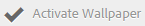

# 배경 무늬, 머리글 및 이메일 메시지 사용자 정의 {#customize-wallpaper-header-and-email-message}

[!DNL Brand Portal] 관리자는 사용자에게 표시되는 인터페이스에 제한된 사용자 지정을 만들 수 있습니다. 로그인 페이지의 특정 배경 이미지 (배경 무늬) 를 선택할 [!DNL Brand Portal] 수 있습니다. 머리글 이미지를 추가하고 고객의 브랜드와 일치하도록 자산을 공유할 수도 있습니다.

## 로그인 화면 배경 무늬 사용자 정의 {#customize-the-login-screen-wallpaper}

사용자 정의 브랜드 배경 무늬 이미지가 없으면 로그인 페이지에 기본 배경 무늬가 표시됩니다.

1. 상단에 [!DNL AEM] 있는 도구 모음에서 Adobe 로고를 클릭하여 관리 도구에 액세스합니다.

   

2. 관리 도구 패널에서 **브랜딩을 클릭합니다**.

   

3. 브랜딩 **구성** 페이지의 왼쪽 레일에서 **기본적으로 배경색이** 선택됩니다. 로그인 페이지에 나타나는 기본 배경 이미지가 표시됩니다.

   

4. 새 배경 이미지를 추가하려면 맨 위의 도구 모음에서 이미지 **선택** 아이콘을 클릭합니다.

   

   다음 중 하나를 수행하십시오.

   * 컴퓨터에서 이미지를 업로드하려면 **업로드를 클릭합니다**. 필요한 이미지를 탐색하여 업로드합니다.
   * 기존 브랜드 포털 이미지를 사용하려면 [기존 항목 선택] 를 클릭합니다 ****. 자산 선택기를 사용하여 이미지를 선택합니다.
   

5. 배경 이미지에 대한 머리글 텍스트와 설명을 지정합니다. 변경 내용을 저장하려면 맨 위의 도구 모음에서 **저장을** 클릭합니다.

6. 상단에 있는 도구 모음에서 **미리 보기** 아이콘을 클릭하여 이미지가 있는 브랜드 포털 인터페이스의 미리 보기를 생성합니다.

   

   

7. 기본 바탕 화면을 활성화하거나 비활성화하려면 브랜딩 **구성** &gt; **배경 무늬** 페이지에서 다음을 수행합니다.

   * 브랜드 포털 로그인 페이지에 기본 바탕 화면 이미지를 표시하려면 맨 위의 **도구 모음에서 [배경 무늬** 비활성화] 를 클릭합니다. 사용자 지정 이미지가 비활성화되었음을 확인하는 메시지가 나타납니다.
   

   * 브랜드 포털 로그인 페이지에서 사용자 지정 이미지를 복원하려면 도구 모음에서 **[배경 화면** 활성화] 를 클릭합니다. 이미지가 복원되었음을 확인하는 메시지가 나타납니다.
   

   * Click **Save** to save the changes.

## 머리글 사용자 지정 {#customize-the-header}

브랜드 포털에 로그인하면 다양한 브랜드 포털 페이지에 머리글이 나타납니다.

1. 맨 위의 AEM 도구 모음에서 Adobe 로고를 클릭하여 관리 도구에 액세스합니다.

   

2. 관리 도구 패널에서 **브랜딩을 클릭합니다**.

   

3. 브랜드 포털 인터페이스의 페이지 헤더를 사용자 정의하려면 **브랜딩** 구성 페이지에서 왼쪽 레일의 **헤더 이미지를** 선택합니다. 기본 머리글 이미지가 표시됩니다.

   

4. 머리글 이미지를 업로드하려면 이미지 **선택** 아이콘을 클릭하고 **업로드를 선택합니다**.

   기존 [!DNL Brand Portal] 이미지를 사용하려면 [기존 이미지에서 **선택**] 를 선택합니다.

   

   자산 선택기를 사용하여 이미지를 선택합니다.

   

5. 머리글 이미지에 URL를 포함하려면 **[이미지 URL** ] 상자에 URL를 지정합니다. 외부 또는 내부 URL를 지정할 수 있습니다. 내부 링크는 다음과 같은 상대 링크일 수도 있습니다.
   `/mediaportal.html/content/dam/mac/tenant_id/tags`.
이 링크는 사용자를 태그 폴더로 리디렉션합니다.
변경 내용을 저장하려면 맨 위의 도구 모음에서 **저장을** 클릭합니다.

   

6. 상단에 있는 도구 모음에서 **미리 보기** 아이콘을 클릭하여 머리글 이미지가 있는 [!DNL Brand Portal] 인터페이스의 미리 보기를 생성합니다.

   
   

7. 머리글 이미지를 활성화하거나 비활성화하려면 브랜딩 **구성** &gt; **헤더 이미지** 페이지에서 다음을 수행합니다.

   * 페이지에 머리글 이미지가 나타나지 않도록 [!DNL Brand Portal] 하려면 상단의 **도구 모음에서 헤더** 비활성화를 클릭합니다. 이미지가 비활성화되었음을 확인하는 메시지가 나타납니다.
   

   * 머리글 이미지가 [!DNL Brand Portal] 페이지에 다시 나타나도록 하려면 **맨 위의 도구 모음에서 헤더** 활성화를 클릭합니다. 이미지가 활성화되었다는 메시지가 나타납니다.
   

   * Click **Save** to save the changes.

## 이메일 메시지 사용자 정의 {#customize-the-email-messaging}

자산이 링크로 공유되면 사용자는 링크가 포함된 이메일을 받게 됩니다. 관리자는 이러한 이메일의 메시징, 즉 로고, 설명 및 바닥글을 사용자 정의할 수 있습니다.

1. 상단에 [!DNL AEM] 있는 도구 모음에서 Adobe 로고를 클릭하여 관리 도구에 액세스합니다.

   

2. 관리 도구 패널에서 **브랜딩을 클릭합니다**.

   

3. 자산을 링크로 공유하거나 이메일을 통해 다운로드하는 경우 [!UICONTROL , 컬렉션이] 공유되는 경우 이메일 알림이 사용자에게 전송됩니다. 이메일 메시지를 사용자 정의하려면, 브랜딩 **구성** 페이지의 왼쪽 레일에서 **이메일 메시지를** 선택합니다.

   

4. 발신 이메일에 로고를 추가하려면 맨 위의 도구 모음에서 **업로드를** 클릭합니다.

5. **설명** 섹션에서 이메일 머리글 및 바닥글 텍스트를 지정합니다. 변경 내용을 저장하려면 맨 위의 도구 모음에서 **저장을** 클릭합니다.

   >[!NOTE]
   >
   >로고에 권장 크기를 사용하지 않거나 머리글과 바닥글 텍스트가 권장 단어 수를 초과하는 경우 이메일 메시지의 컨텐츠가 깨질 수 있습니다.
