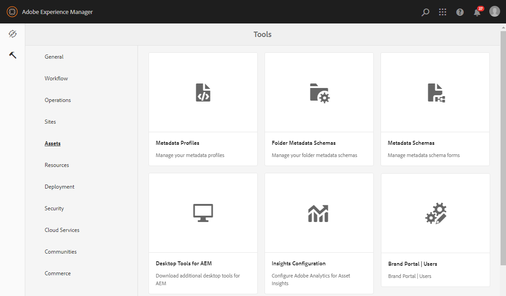

# 자산 소싱 구성 {#configure-asset-sourcing}

AEM 관리자는 AEM **작성자 인스턴스** 내에서 자산 소싱을 구성할 수 있습니다. 관리자는 AEM Web Console 구성에서 자산 소싱 기능 플래그 **구성을 활성화하고** AEM Assets에서 활성 브랜드 포털 사용자 목록을 **업로드합니다**.

>[!NOTE]
>
>구성을 시작하기 전에 AEM 자산 인스턴스가 브랜드 포털과 통합되었는지 확인하십시오. 브랜드 [포털과 AEM 자산 통합 구성을 참조하십시오](https://helpx.adobe.com/experience-manager/6-5/assets/using/brand-portal-configuring-integration.html).

다음 비디오에서는 AEM 작성자 인스턴스에서 자산 소싱을 구성하는 방법을 보여 줍니다.

>[!VIDEO](https://video.tv.adobe.com/v/29771)

## 자산 소싱 활성화 {#enable-asset-sourcing}

AEM 관리자는 AEM 웹 콘솔 구성(예: 구성 관리자) 내에서 자산 소싱을 활성화할 수 있습니다.

**자산 소싱을 활성화하려면**
1. AEM 작성자 인스턴스에 로그인하고 구성 관리자를 엽니다.기본 URL:http:// localhost:4502/system/console/configMgr
1. 키워드 자산 소싱을 사용하여 **검색하여** 자산 소싱 **[!UICONTROL 기능 플래그 구성을 찾습니다.]**
1. 자산 **[!UICONTROL 소싱 기능 플래그 구성을]**클릭하여 구성 창을 엽니다
1. 확인란 **[!UICONTROL feature.flag.active.status 활성화]**
1. **[!UICONTROL 저장]**을 클릭합니다.

## 브랜드 포털 사용자 목록 업로드 {#upload-bp-user-list}

AEM 관리자는 AEM 자산에 활성 브랜드 포털 사용자 목록이 포함된 브랜드 포털 사용자 구성(.csv) 파일을 업로드할 수 있습니다. 기여도 폴더는 사용자 목록에 정의된 활성 브랜드 포털 사용자만 공유할 수 있습니다. 관리자는 구성 파일에 새 사용자를 추가하고 수정된 사용자 목록을 업로드할 수도 있습니다.

>[!NOTE]
>
>CSV 파일의 형식은 벌크 사용자 가져오기에 대해 관리 콘솔에서 지원되는 형식과 동일합니다. 이메일, 이름 및 성은 필수입니다.

관리자는 AEM 관리 콘솔에서 새 사용자를 추가할 수 있습니다. 자세한 내용은 사용자 [관리를](brand-portal-adding-users.md) 참조하십시오. 관리 콘솔에서 사용자를 추가한 후, 이러한 사용자를 브랜드 포털 사용자 구성 파일에 추가한 다음 기여도 폴더에 액세스할 수 있는 권한을 할당할 수 있습니다.

**브랜드 포털 사용자 목록을 업로드하려면:**
1. AEM 작성자 인스턴스에 로그인기본 URL:http://로컬 호스트:4502/aem/start.html
1. 도구 **패널에서** 자산  > 브랜드 포털 **[!UICONTROL 사용자로 이동합니다.]**   
1. 브랜드 포털 업로드 기여자 창이 열립니다.
로컬 컴퓨터에서 검색하고 활성 브랜드 포털 사용자 목록이 포함된 **구성(.csv) 파일을** 업로드합니다.
1. **[!UICONTROL 저장]**을 클릭합니다.   

관리자는 기여도 폴더를 구성하는 동안 이 사용자 목록에서 특정 사용자/그룹에 대한 액세스 권한을 제공할 수 있습니다.

자세한 내용은 기여도 [폴더](brand-portal-contribution-folder.md)구성을 참조하십시오.
