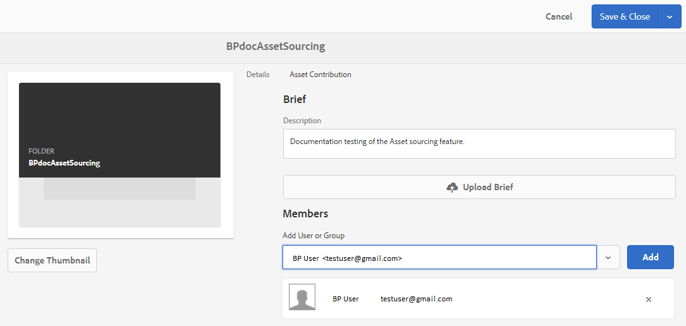

# 기여도 폴더 속성 {#configure-contribution-folder-properties} 구성

AEM 관리자는 기여도 폴더의 속성을 구성하는 동안 다음 활동을 수행합니다.

* **설명 추가**:기여도 폴더에 대한 높은 수준의 설명을 제공합니다.
* **업로드 개요**:자산 관련 정보가 포함된 자산 요구 사항 문서를 업로드합니다.
* **작성자 추가**:기여도 폴더에 대한 액세스 권한을 부여할 브랜드 포털 사용자를 추가합니다.

자산 요구 사항은 기여자(브랜드 포털 사용자)가 기여도 폴더의 요구 사항과 요구 사항을 이해하는 데 도움이 되도록 관리자가 제공하는 세부 정보를 참조하십시오. 관리자는 기여도 폴더 및 자산 관련 정보(예: 목적, 이미지 유형, 최대 크기 등)에 추가해야 하는 자산 유형에 대한 간단한 정보가 포함된 자산 요구 사항 문서를 업로드합니다.

**기여도 폴더 속성을 구성하려면:**

1. AEM 작성자 인스턴스에 로그인
기본 URL:http:// localhost:4502/aem/start.html
1. **[!UICONTROL 자산 > 파일]**&#x200B;으로 이동하고 기여도 폴더를 찾습니다.
1. 기여도 폴더를 선택하고 **[!UICONTROL 속성]**&#x200B;을 클릭하여 폴더 속성 창을 엽니다.

   

   

1. **[!UICONTROL 자산 기여도]** 탭으로 이동합니다.
1. 기여도 폴더의 상위 수준 **[!UICONTROL 설명]**&#x200B;을 입력합니다.
1. **[!UICONTROL 개요 업로드]**&#x200B;를 클릭하여 로컬 컴퓨터에서 찾고 **자산 요구 사항 문서**&#x200B;를 업로드합니다.

   

1. **[!UICONTROL 사용자 또는 그룹 추가]** 필드에서 기여도 폴더를 공유할 브랜드 포털 사용자를 추가합니다. 이러한 사용자는 브랜드 포털 인터페이스를 사용하여 기여도 폴더에 액세스하여 콘텐트를 업로드할 수 있습니다.
1. **[!UICONTROL 저장]**&#x200B;을 클릭합니다.

   

>[!NOTE]
>
>현재는 그룹을 기여도 폴더에 할당할 수 없습니다.
>
>검색 결과는 AEM Assets에 구성된 브랜드 포털 사용자 목록을 기반으로 합니다. 업데이트된 브랜드 포털 사용자 목록이 있는지 확인합니다. [브랜드 포털 사용자 목록 업로드](brand-portal-configure-asset-sourcing.md)를 참조하십시오.
