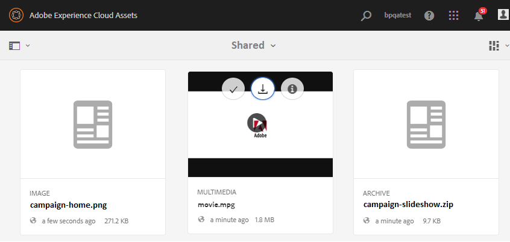

# 자산 요구 사항 다운로드 {#using-asset-souring-in-bp}

브랜드 포털 사용자는 AEM 사용자가 기여도 폴더를 공유할 때마다 이메일/펄스 알림을 자동으로 수신하므로, SHARED 폴더에서 기본 자산(참조 컨텐츠) **을** 다운로드하여 자산 요구 사항을 이해할 수 있습니다.

브랜드 포털 사용자는 다음 활동을 수행하여 자산 요구 사항을 다운로드합니다.

* **다운로드 요약**:자산 유형, 목적, 지원되는 형식, 최대 자산 크기 등과 같은 자산 관련 정보가 포함된 기여도 폴더에 첨부된 요약(자산 요구 사항 문서)을 다운로드합니다.
* **기본 자산**&#x200B;다운로드:필요한 자산 유형을 이해하는 데 사용할 수 있는 기본 자산을 다운로드합니다. 브랜드 포털 사용자는 이러한 자산을 참조로 사용하여 기여도를 위한 새 자산을 만들 수 있습니다.

브랜드 포털 대시보드에는 새로 공유된 기여도 폴더와 함께 브랜드 포털 사용자에게 허용된 모든 기존 폴더가 반영됩니다. 이 예에서는 브랜드 포털 사용자가 새로 만든 기여도 폴더에만 액세스할 수 있고 다른 기존 폴더는 사용자와 공유되지 않습니다.

**자산 요구 사항을 다운로드하려면**

1. 브랜드 포털 인스턴스에 로그인합니다.
1. 브랜드 포털 대시보드에서 기여도 폴더를 선택합니다.
1. Click **[!UICONTROL Properties]** . 자산 기여도 폴더 세부 사항을 표시하는 속성 창이 열립니다.
   
1. Download **[!UICONTROL Brief]** 를 클릭하여  로컬 컴퓨터에서 자산 요구 사항 문서를 다운로드합니다.
   
1. 브랜드 포털 대시보드로 돌아갑니다.
1. 을 클릭하여 기여도 폴더를 열면 기여도 폴더 내에 두 개의 하위 폴더(**[!UICONTROL 공유]** 및 **[!UICONTROL 신규]** )가표시됩니다. SHARED 폴더에는 관리자가 공유한 모든 기준 자산(참조 콘텐트)이 포함됩니다.
1. 로컬 컴퓨터의 **[!UICONTROL 모든 기준]** 에셋이 포함된 SHARED 폴더를 다운로드할 수 있습니다.
또는 공유 폴더를 열고 **[!UICONTROL 다운로드]** 아이콘을 클릭하여 **개별 파일/폴더를** 다운로드할  수있습니다.
   

간략한(자산 요구 사항 문서)을 살펴보고 자산 요구 사항을 이해하려면 기준 자산을 참조하십시오. 이제 기여도를 위한 새 자산을 만들고 기여도 폴더에 업로드할 수 있습니다. 기여도 [폴더에](brand-portal-upload-assets-to-contribution-folder.md)자산 업로드를 참조하십시오.

