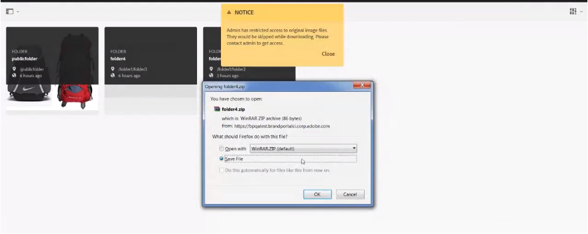

# 자산 다운로드 {#download-assets}

<!-- Before update in Download experience - 26th Aug 2020 by Vishabh.
 All users can simultaneously download multiple assets and folders accessible to them from Brand Portal. This way, approved brand assets can be securely distributed for offline use. Read on to know how to download approved assets from Brand Portal, and what to expect from the [download performance](../using/brand-portal-download-assets.md#main-pars-header).
-->

Adobe Experience Manager 에셋 브랜드 포털은 사용자가 브랜드 포털에서 액세스할 수 있는 여러 에셋과 폴더를 동시에 다운로드할 수 있도록 함으로써 다운로드 환경을 향상시킵니다. 이렇게 하면 승인된 브랜드 자산을 오프라인으로 사용할 수 있도록 안전하게 배포할 수 있습니다. 브랜드 포털에서 승인된 자산을 다운로드하는 방법 및 [다운로드 성능을 통해 얻을 수 있는 기대 사항에 대해 자세히 알아보십시오](../using/brand-portal-download-assets.md#expected-download-performance).

>[!NOTE]
>
>브랜드 포털에서 에셋을 다운로드하기 전에 브라우저 익스텐션에 IBM Aspera Connect 3.9.9를 설치합니다.

<!--
**Types of renditions in Brand Portal:**

* Original asset rendition

  It is the original binary of the asset uploaded in AEM Assets. 
  
  
* System renditions

  These are the thumbnail renditions which are automatically generated in AEM Assets based on the "DAM update asset" workflow. 
  
* Custom renditions

  These are the additional renditions that an asset might have and its dynamic renditions. Any user can create additional custom renditions, whereas, only the AEM administrator can create dynamic renditions of an image in AEM Assets. To know more, see [how to apply image presets or dynamic renditions](../using/brand-portal-image-presets.md).     
-->

## 자산 다운로드 구성 {#configure-download}

다운로드 구성을 통해 브랜드 포털 관리자는 브랜드 포털 사용자가 자산을 다운로드할 수 있는 변환 세트를 정의할 수 있습니다. 관리자는 브랜드 포털 인터페이스에서 자산 **[!UICONTROL 다운로드]** 설정을 구성할 수 있습니다.

사용 가능한 구성은 다음과 같습니다.

* **[!UICONTROL 빠른 다운로드]**

   에셋을 신속하게 다운로드할 수 있습니다. 자세한 내용은 브랜드 포털에서 다운로드 시간을 단축하기 위한 [가이드를 참조하십시오](../using/accelerated-download.md).

* **[!UICONTROL 사용자 지정 표현물]**

   자산의 사용자 지정 및 (또는) 동적 변환을 다운로드합니다.
원본 자산 및 시스템에서 생성한 표현물을 제외한 모든 자산 표현물을 사용자 지정 표현물로 부릅니다. 여기에는 자산에 사용할 수 있는 동적 표현뿐만 아니라 정적 표현물도 포함됩니다. 모든 사용자는 AEM Assets에서 사용자 정의 정적 변환을 만들 수 있지만, AEM 관리자만 사용자 정의 동적 변환을 만들 수 있습니다. 자세한 내용은 이미지 사전 설정 또는 동적 표현물을 [적용하는 방법을 참조하십시오.](../using/brand-portal-image-presets.md)

* **[!UICONTROL 시스템 표현물]**

   시스템에서 생성한 자산 표현물을 다운로드합니다. &quot;DAM 에셋 업데이트&quot; 워크플로우를 기반으로 AEM Assets에서 자동으로 생성되는 축소판입니다.

관리자로 브랜드 포털 테넌트에 로그인하고 **[!UICONTROL 도구]** > **[!UICONTROL 다운로드로 이동합니다]**. 기본적으로 **[!UICONTROL 빠른 다운로드]** 구성은 **[!UICONTROL 다운로드 설정에서 활성화됩니다]**.

관리자는 모든 조합을 활성화하여 자산 다운로드 프로세스를 구성할 수 있습니다.

구성에 따라 다운로드 워크플로우는 독립 실행형 에셋, 여러 에셋, 에셋이 포함된 폴더, 라이선스되거나 라이선스가 부여되지 않은 에셋을 포함하는 폴더, 공유 링크를 사용하여 에셋 다운로드에도 일관되게 유지됩니다.

* 사용자 **[!UICONTROL 지정 표현물]** 및 **[!UICONTROL 시스템 표현물]** 구성이 모두 꺼진 경우, 자산의 원본 표현물은 추가 대화 상자 없이 다운로드됩니다.

<!--
If all the three download configurations are turned-off, or only the **[!UICONTROL Fast Download]** configuration is enabled, the original assets are directly downloaded on your local system with no additional step required.
Test.. 
-->

* 사용자 **[!UICONTROL 지정 표현물]** 또는 **[!UICONTROL 시스템 표현물]** 구성 중 어느 것도 활성화되면 **[!UICONTROL 원본 자산을 해당 표현물과 함께 다운로드할지, 아니면 특정 표현물만 다운로드할지 선택할 수 있는 추가]** 다운로드대화 상자가 나타납니다.

>[!NOTE]
>
>관리자만 만료된 자산을 다운로드할 수 있습니다. 만료된 자산에 대한 자세한 내용은 자산의 디지털 권한 [관리를 참조하십시오](../using/manage-digital-rights-of-assets.md).

## 자산 다운로드 단계 {#steps-to-download-assets}

다음은 브랜드 포털에서 자산을 포함하는 자산 또는 폴더를 다운로드하는 단계입니다.

1. 브랜드 포털 인터페이스에서 다음 중 하나를 수행합니다.

   * 다운로드할 폴더 또는 자산을 선택합니다. 상단에 있는 도구 모음에서 **[!UICONTROL 다운로드]** 아이콘을 클릭합니다.

      

   * 특정 자산이나 폴더를 다운로드하려면 포인터를 자산이나 폴더 위에 올려놓은 다음 빠른 작업 축소판에서 **[!UICONTROL 사용 가능한 다운로드]** 아이콘을 클릭합니다.

      

      >[!NOTE]
      >
      >처음 에셋을 다운로드하고 있지만 브라우저에 IBM Aspera Connect가 설치되지 않은 경우 Aspera 다운로드 가속기를 설치하라는 메시지가 표시됩니다.

      >[!NOTE]
      >
      >다운로드하려는 에셋에 라이센스 자산도 포함되어 있는 경우 **[!UICONTROL 저작권 관리]** 페이지로 리디렉션됩니다. 이 페이지에서 자산을 선택하고 **[!UICONTROL 동의]**&#x200B;를 클릭한 다음 **[!UICONTROL 다운로드를 클릭합니다]**. 동의하지 않으면 라이선스가 부여된 에셋이 다운로드되지 않습니다.
      > 
      >라이선스로 보호된 자산은 [사용권 계약을 첨부하고](https://helpx.adobe.com/experience-manager/6-5/assets/using/drm.html#DigitalRightsManagementinAssets) , Experience Manager 자산에 자산의 [메타데이터 속성을](https://helpx.adobe.com/experience-manager/6-5/assets/using/drm.html#DigitalRightsManagementinAssets) 설정하여수행합니다.

      

      [다운로드 설정]에서 **[!UICONTROL 사용자 지정]** 또는 **[!UICONTROL 시스템 변환]** 구성 **[!UICONTROL 이 활성화된 경우]**[ **[!UICONTROL 다운로드] 대화 상자가 기본적으로 선택된 FacebookAsset(s)기본 설정]** **** 과 함께 나타납니다. 빠른 **[!UICONTROL 다운로드]** 구성을 사용하는 경우 기본적으로 **[!UICONTROL 다운로드 가속]** 사용 확인란이 선택되어 있습니다.

      

      >[!NOTE]
      >
      >다운로드 자산이 이미지 파일이고, 사용자는 **[!UICONTROL 다운로드]** 대화 상자에서 **[!UICONTROL 자산]** 확인란만 선택하지만 관리자가 이미지 파일의 [원본 변환에 액세스할 수 있도록](../using/brand-portal-adding-users.md#main-pars-procedure-202029708) 승인하지는 않은 경우 이미지 파일이 다운로드되지 않고 관리자가 원래 변환에 액세스하도록 제한되었다는 알림이 표시됩니다.

      

1. 원본 자산 외에 변환을 다운로드하려면 **[!UICONTROL 변환]** 확인란을 선택합니다. 그러나 사용자 정의 표현물과 함께 시스템에서 생성된 표현물을 다운로드하려면 시스템 표현물 **[!UICONTROL 제외]** 확인란을 선택 취소합니다.

   

   * 표현물만 다운로드하려면 자산 **[!UICONTROL 확인란을]** 취소하십시오.

      >[!NOTE]
      >
      >기본적으로 자산만 다운로드됩니다. 그러나 관리자가 이미지 파일의 원본 변환에 액세스할 수 있도록 [허가하지 않은 경우 이미지 파일의 원본 변환이 다운로드되지 않습니다](../using/brand-portal-adding-users.md#main-pars-procedure-202029708).

   * 링크를 통해 선택한 자산을 다른 사용자와 공유하려면 **[!UICONTROL 이메일]** 확인란을 선택합니다. 다운로드 링크가 있는 사용자에게 이메일 알림이 전송됩니다. 공유 링크에서 자산을 다운로드하는 방법을 알려면 공유 링크에서 자산 [다운로드를 참조하십시오](../using/brand-portal-link-share.md#main-pars-header-1703469193).

      

      >[!NOTE]
      >
      >이메일 알림의 다운로드 링크는 45일 후에 만료됩니다.
      >
      >관리자는 브랜딩 기능을 사용하여 이메일 메시지, 즉 로고, 설명 및 바닥글 등을 사용자 정의할 [수](../using/brand-portal-branding.md) 있습니다.

   * 미리 정의된 이미지 사전 설정을 선택하거나 다운로드 대화 상자에서 사용자 정의 동적 **[!UICONTROL 변환을]** 만들 수 있습니다.

      자산 및 해당 변환에 [사용자 정의 이미지 사전 설정을 적용하려면](../using/brand-portal-image-presets.md#applyimagepresetswhendownloadingimages)동적 변환 **** 확인란을 선택합니다. 이미지 사전 설정 속성(크기, 형식, 색상 공간, 해상도 및 이미지 수정자 등)을 지정하여 자산 및 해당 변환을 다운로드하는 동안 사용자 정의 이미지 사전 설정을 적용합니다. 동적 표현물만 다운로드하려면 자산 **[!UICONTROL 확인란을]** 취소하십시오.

      

      >[!NOTE]
      >
      >브랜드 포털에서는 Hybird 및 Scene 7 모드 모두에서 Dynamic Media 구성을 지원합니다.
      >
      >(*AEM 작성자 인스턴스가&#x200B;**Dynamic Media Hybrid 모드에서 실행 중인 경우***)      >자산의 다이내믹 변환을 미리 보거나 다운로드하려면 다이내믹 미디어가 활성화되어 있고 자산의 피라미드형 tiff 변환이 자산이 게시된 AEM Assets 작성자 인스턴스에 있는지 확인합니다. 자산이 브랜드 포털에 게시되면 해당 Pyramid 변환도 게시됩니다.

   * 자산을 다운로드하는 동안 브랜드 포털 폴더 계층을 유지하려면 **[!UICONTROL 각 자산에 대해 별도의 폴더]** 만들기 확인란을 선택합니다. 기본적으로 브랜드 포털 폴더 계층은 무시되며 모든 자산은 로컬 시스템의 한 폴더에 다운로드됩니다.

1. 다운로드를 **[!UICONTROL 클릭합니다]**.

   자산(및 선택한 표현물)은 로컬 폴더에 zip 파일로 다운로드됩니다. 그러나 단일 자산이 변환되지 않고 다운로드되는 경우 zip 파일이 만들어지지 않습니다.

   관리자가 원래 표현물에 대한 액세스 권한을 [부여하지 않은](../using/brand-portal-adding-users.md#main-pars-procedure-202029708)경우 선택한 자산의 원본 표현물은 다운로드되지 않습니다.

   >[!NOTE]
   >
   >개별적으로 다운로드한 자산은 자산 다운로드 보고서에서 볼 수 있습니다. 그러나 에셋이 들어 있는 폴더를 다운로드한 경우 폴더 및 에셋이 에셋 다운로드 보고서에 표시되지 않습니다.

## 예상 다운로드 성능 {#expected-download-performance}

로컬 인터넷 연결 및 서버 지연과 같은 요인에 따라, 서로 다른 클라이언트 위치의 사용자에 대해 파일 다운로드 경험이 다를 수 있습니다. 다양한 클라이언트 위치에서 관측되는 2GB 파일의 예상 다운로드 성능은 다음과 같습니다. 미국 오리건 주의 브랜드 포털 서버는 다음과 같습니다.

| 클라이언트 위치 | 클라이언트와 서버 간의 지연 | 예상 다운로드 속도 | 2GB 파일 다운로드 시간 |
|-------------------------|-----------------------------------|-------------------------|------------------------------------|
| 미국 서부(캘리포니아 주) | 18밀리초 | 7.68MB/s | 4분 |
| 미국 서부(오레곤) | 42밀리초 | 3.84MB/s | 9분 |
| 미국 동부(버지니아 주) | 85밀리초 | 1.61MB/s | 21분 |
| APAC(도쿄) | 124밀리초 | 1.13MB/s | 30분 |
| 노이다 | 275밀리초 | 0.5MB/s | 68분 |
| 시드니 | 175밀리초 | 0.49MB/s | 69분 |
| 런던 | 179밀리초 | 0.32MB/s | 106분 |
| 싱가포르 | 196밀리초 | 0.5MB/s | 68분 |

>[!NOTE]
>
>인용된 데이터는 테스트 조건에서 관찰되며, 다양한 지연 및 대역폭을 사용하는 다른 위치에 있는 사용자에 대해 다를 수 있습니다.

