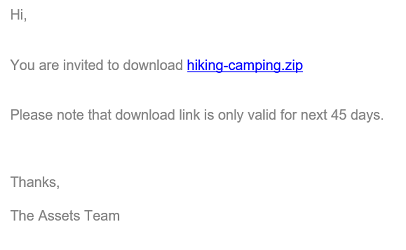

# 자산 다운로드 {#download-assets-from-bp}

Adobe Experience Manager Assets Brand Portal은 사용자가 Brand Portal에서 액세스할 수 있는 에셋과 폴더를 동시에 다운로드할 수 있도록 함으로써 다운로드 경험을 향상시킵니다. 이렇게 하면 승인된 브랜드 자산을 오프라인용으로 안전하게 배포할 수 있습니다. Brand Portal에서 에셋(승인된 에셋)을 다운로드하는 방법과 [다운로드 성능](#expected-download-performance).

>[!NOTE]
>
>Brand Portal 2020.10.0(및 이상)에서 **[!UICONTROL 빠른 다운로드]** 설정은 자산의 가속화된 다운로드를 위해 IBM Aspera Connect를 사용하는 기본적으로 활성화됩니다. IBM Aspera Connect 3.9.9 설치(`https://www.ibm.com/docs/en/aspera-connect/3.9.9`)를 클릭하여 Brand Portal에서 에셋을 다운로드할 수 있습니다. 자세한 내용은 [Brand Portal에서 다운로드를 가속화하기 위한 안내서](../using/accelerated-download.md).
>
>IBM Aspera Connect를 사용하지 않고 일반 다운로드 프로세스를 계속하려면 Brand Portal 관리자에게 문의하여 을 끄십시오. **[!UICONTROL 빠른 다운로드]** 설정.

## 에셋 다운로드 구성 {#configure-download}

Brand Portal 관리자는 Brand Portal 사용자에 대한 에셋 다운로드 및 사용자 그룹 설정을 구성하여 Brand Portal 인터페이스에서 에셋 표현물에 액세스하고 다운로드할 수 있습니다.

>[!NOTE]
>
>사용자 인터페이스에 적용되는 다운로드 설정을 사용하면 Brand Portal 사용자가 에셋 렌디션을 쉽게 구성하고 다운로드할 수 있는 셀프서비스 환경을 제공할 수 있습니다. 예를 들어 애플리케이션 레이어에서 에셋 다운로드를 제한하지 않습니다. 사용자는 전체 URL 경로로 에셋 표현물에 액세스하고 다운로드할 수 있습니다.

Brand Portal 인터페이스에서 에셋 렌디션에 액세스하고 다운로드하는 작업은 다음 구성으로 정의됩니다.

* 다운로드 설정 활성화
* 사용자 그룹 설정 구성

### 다운로드 설정 활성화 {#enable-download-settings}

관리자는 해당 에셋을 활성화할 수 있습니다 **[!UICONTROL 다운로드 설정]** Brand Portal 사용자가 다운로드할 수 있는 렌디션 세트를 정의합니다.

사용 가능한 설정은 다음과 같습니다.

* **[!UICONTROL 빠른 다운로드]**

   IBM Aspera Connect를 사용하여 에셋을 신속하게 다운로드할 수 있습니다. 기본적으로 **[!UICONTROL 빠른 다운로드]** 설정은 다음에서 활성화됩니다. **[!UICONTROL 다운로드 설정]**.

* **[!UICONTROL 사용자 지정 표현물]**

   에셋의 사용자 지정 및 (또는) 동적 렌디션을 다운로드할 수 있습니다.

   원래 에셋 및 시스템 생성 렌디션이 아닌 모든 에셋 렌디션을 사용자 지정 렌디션이라고 합니다. 자산에 사용할 수 있는 정적 렌디션과 동적 렌디션이 포함되어 있습니다. 모든 사용자는 Experience Manager Assets에서 사용자 정의 정적 렌디션을 만들 수 있지만 사용자 정의 동적 렌디션은 관리자만 만들 수 있습니다. 자세한 내용은 [이미지 사전 설정 또는 동적 변환 적용 방법](../using/brand-portal-image-presets.md).

* **[!UICONTROL 시스템 표현물]**

   에셋의 시스템 생성 렌디션을 다운로드할 수 있습니다.

   DAM 자산 업데이트 워크플로우를 기반으로 Experience Manager Assets에서 자동으로 생성되는 썸네일입니다.

* **[!UICONTROL 에셋 다운로드]**

   각 에셋에 대해 별도의 폴더에 렌디션을 다운로드할 수 있습니다. 이 설정은 폴더, 컬렉션 및 에셋(20개 이상의 에셋)의 대량 다운로드에 적용할 수 있습니다.

관리자로 Brand Portal 테넌트에 로그인하고 다음 위치로 이동합니다. **[!UICONTROL 도구]** > **[!UICONTROL 다운로드]**.

관리자는 Brand Portal 사용자가 에셋 렌디션에 액세스하고 다운로드할 수 있도록 모든 설정을 활성화할 수 있습니다.

>[!NOTE]
>
>관리자만 만료된 에셋을 다운로드할 수 있습니다. 만료된 에셋에 대한 자세한 내용은 [자산의 디지털 권한 관리](../using/manage-digital-rights-of-assets.md).

### 사용자 그룹 설정 구성 {#configure-user-group-settings}

이외에도 **[!UICONTROL 다운로드 설정]**, Brand Portal 관리자는 다양한 사용자 그룹에 대한 설정을 추가로 구성하여 원본 에셋 및 그 렌디션을 보고 다운로드 할 수 있습니다.

관리자로 Brand Portal 테넌트에 로그인하고 다음 위치로 이동합니다. **[!UICONTROL 도구]** > **[!UICONTROL 사용자]**. 다음에서 **[!UICONTROL 사용자 역할]** 페이지, 다음으로 이동 **[!UICONTROL 그룹]** 사용자 그룹에 대한 보기 및(또는) 다운로드 설정을 구성하는 탭입니다.

>[!NOTE]
>
>사용자가 여러 그룹에 추가되고 이러한 그룹 중 하나에 제한이 있는 경우 해당 사용자에게는 제한이 적용됩니다.

구성에 따라 다운로드 워크플로우는 독립 실행형 에셋, 여러 에셋, 에셋이 포함된 폴더, 라이선스가 있는 에셋 또는 라이선스가 없는 에셋, 공유 링크를 사용한 에셋 다운로드에 대해 일정하게 유지됩니다.

다음 매트릭스는 사용자가 다음 항목에 따라 렌디션에 액세스할 수 있는지 여부를 정의합니다. [다운로드 구성](#configure-download):

| **다운로드 설정: 사용자 지정 표현물** | **다운로드 설정: 시스템 렌디션** | **사용자 그룹 설정: 원본 다운로드** | **사용자 그룹 설정: 렌디션 다운로드** | **결과** |
|---|---|---|---|---|
| 켬 | 켬 | 켬 | 켬 | 모든 렌디션 보기 및 다운로드 |
| 켬 | 켬 | 끔 | 끔 | 원본 에셋 보기 |
| 끔 | 끔 | 켬 | 켬 | 원본 에셋 보기 및 다운로드 |
| 켬 | 끔 | 켬 | 켬 | 원본 에셋 및 사용자 지정 렌디션 보기 및 다운로드 |
| 끔 | 켬 | 켬 | 켬 | 원본 에셋 및 시스템 렌디션 보기 및 다운로드 |
| 켬 | 끔 | 끔 | 끔 | 원본 에셋 보기 |
| 끔 | 켬 | 끔 | 끔 | 원본 에셋 보기 |
| 끔 | 끔 | 끔 | 켬 | 원본 에셋 보기 |
| 끔 | 끔 | 켬 | 끔 | 원본 에셋 보기 및 다운로드 |
| 끔 | 끔 | 끔 | 끔 | 원본 에셋 보기 |

## 자산 다운로드 {#download-assets}

Brand Portal 사용자는 Brand Portal 인터페이스에서 여러 에셋, 에셋이 포함된 폴더 및 컬렉션을 다운로드할 수 있습니다.

>[!NOTE]
>
>에셋 렌디션에 액세스하거나 다운로드할 수 있는 권한이 없는 경우 Brand Portal 관리자에게 문의하십시오.

사용자가 표현물에 액세스할 수 있는 경우 향상된 기능이 제공됩니다 **[!UICONTROL 다운로드]** 대화 상자에서 다음 기능을 사용할 수 있습니다.

* 다운로드 목록에서 사용 가능한 모든 에셋 렌디션을 표시합니다.
* 다운로드에 필요하지 않은 자산의 렌디션을 제외합니다.
* 한 번의 클릭으로 유사한 모든 에셋 유형에 동일한 렌디션 세트를 적용합니다.
* 서로 다른 에셋 유형에 대해 서로 다른 렌디션 세트를 적용합니다.
* 각 에셋에 대해 별도의 폴더를 만듭니다.
* 선택한 에셋 및 해당 렌디션을 다운로드합니다.

>[!NOTE]
>
>다음 **[!UICONTROL 다운로드]** 대화 상자는 다음과 같은 경우에만 표시됩니다. **[!UICONTROL 사용자 지정 표현물]** 및 (또는) **[!UICONTROL 시스템 표현물]** 이(가) 다음에서 활성화됨: **[!UICONTROL 다운로드 설정]**.

### 에셋 다운로드 단계 {#bulk-download}

Brand Portal 인터페이스에서 에셋 또는 에셋이 포함된 폴더를 다운로드하는 단계는 다음과 같습니다.

1. Brand Portal 테넌트에 로그인합니다. 기본적으로 **[!UICONTROL 파일]** 보기는 게시된 모든 에셋과 폴더를 포함하는 열립니다.

   다음 중 하나를 수행하십시오.

   * 다운로드할 에셋 또는 폴더를 선택합니다. 맨 위에 있는 도구 모음에서 **[!UICONTROL 다운로드]** 아이콘.

      

   * 에셋의 특정 에셋 렌디션을 다운로드하려면 에셋 위로 포인터를 가져간 다음 **[!UICONTROL 다운로드]** 빠른 작업 썸네일에서 사용할 수 있는 아이콘.

      

      >[!NOTE]
      >
      >에셋을 처음 다운로드하고 브라우저에 IBM Aspera Connect가 설치되어 있지 않은 경우 Aspera 다운로드 가속기를 설치하라는 메시지가 표시됩니다(`https://www.ibm.com/docs/en/aspera-connect/3.9.9`).

      >[!NOTE]
      >
      >다운로드하는 에셋에 라이센스가 있는 에셋도 포함되어 있으면 로 리디렉션됩니다. **[!UICONTROL 저작권 관리]** 페이지를 가리키도록 업데이트하는 중입니다. 이 페이지에서 자산을 선택하고 **[!UICONTROL 동의]**&#x200B;을 클릭한 다음 을 클릭합니다 **[!UICONTROL 다운로드]**. 동의하지 않기로 선택한 경우 라이센스가 부여된 에셋이 다운로드되지 않습니다.
      > 
      >라이선스로 보호된 자산에는 [라이선스 계약 첨부됨](https://experienceleague.adobe.com/docs/experience-manager-65/assets/administer/drm.html) 에셋의 [메타데이터 속성](https://experienceleague.adobe.com/docs/experience-manager-65/assets/administer/drm.html) Experience Manager Assets.

      

1. 다음 **[!UICONTROL 다운로드]** 선택한 에셋을 모두 나열하는 대화 상자가 열립니다.

   에셋을 클릭하여 사용 가능한 렌디션을 보고 다운로드할 렌디션에 해당하는 확인란을 선택합니다.

   개별 에셋에 대한 렌디션을 수동으로 선택 또는 제외하거나 **적용** 아이콘 유사한 에셋 유형(이 예제의 모든 이미지 파일)에 대해 다운로드할 렌디션 세트를 선택합니다. 다음에서 **[!UICONTROL 모두 적용]** 대화 상자, 클릭 **[!UICONTROL 완료]** 를 클릭하여 유사한 모든 에셋에 규칙을 적용합니다.

   

   필요한 경우 다운로드 목록에서 자산을 클릭하여 제거할 수도 있습니다. **제거** 아이콘.

   

   에셋을 다운로드하는 동안 Brand Portal 폴더 계층 구조를 유지하려면 **[!UICONTROL 각 자산에 대해 별도의 폴더 만들기]** 확인란.

   다운로드 버튼은 선택한 항목의 수를 반영합니다. 규칙 적용이 끝나면 **[!UICONTROL 다운로드 항목]**.

   

1. 기본적으로 **[!UICONTROL 빠른 다운로드]** 설정은 다음에서 활성화됩니다. **[!UICONTROL 다운로드 설정]**. 따라서 IBM Aspera Connect를 사용하여 가속화된 다운로드를 허용하는 확인 상자가 나타납니다.

   을(를) 계속하려면 **[!UICONTROL 빠른 다운로드]**, 클릭 **[!UICONTROL 허용]**. 선택한 모든 렌디션은 IBM Aspera Connect를 사용하여 zip 폴더로 다운로드됩니다.

   IBM Aspera Connect를 사용하지 않으려면 **[!UICONTROL 거부]**. If **[!UICONTROL 빠른 다운로드]** 이 거부되거나 실패하면 오류 메시지가 표시됩니다. 다음을 클릭합니다. **[!UICONTROL 일반 다운로드]** 단추를 클릭하여 자산을 계속 다운로드합니다.

<!-- removed the known issue from step 2 as it is fixed in 2022.02.0 release.
   >[!CAUTION]
   >
   >(**Experience Manager Assets as a Cloud Service** only) The following known issue will be fixed in the upcoming release:
   >
   >The download dialog lists the smart crop renditions of the selected asset, however, the user cannot download the smart crop renditions.
-->

>[!NOTE]
>
>다음과 같은 경우 **[!UICONTROL 빠른 다운로드]** 관리자가 설정을 해제하면 IBM Aspera Connect를 사용하지 않고 선택한 렌디션을 zip 폴더에서 직접 다운로드합니다.

>[!NOTE]
>
>다음과 같은 경우 **[!UICONTROL 에셋 다운로드]** 설정은 다음에서 활성화됩니다. **[!UICONTROL 다운로드 설정]**, 에셋 렌디션은 zip 폴더 내의 각 에셋에 대해 별도의 폴더로 다운로드됩니다.
>  
>공유 링크에서 에셋을 다운로드하는 경우 에셋 렌디션은 zip 폴더 내의 각 에셋에 대해 별도의 폴더로 다운로드됩니다.
>
>폴더, 컬렉션 또는 20개가 넘는 자산을 다운로드하도록 선택한 경우 **[!UICONTROL 다운로드]** 대화 상자를 건너뛰고 동적 변환을 제외한 사용자가 액세스할 수 있는 모든 에셋 변환을 zip 폴더에 다운로드합니다.

>[!NOTE]
>
>Brand Portal은 하이브리드 및 Scene 7 모드 모두에서 Dynamic Media 구성을 지원합니다.
>
>(*Experience Manager Assets 작성자 인스턴스가에서 실행 중인 경우&#x200B;**Dynamic Media 하이브리드 모드***)
>
>에셋의 동적 렌디션을 미리 보거나 다운로드하려면 dynamic media가 활성화되고 에셋의 피라미드 tiff 렌디션이 에셋이 게시된 Experience Manager Assets 작성자 인스턴스에 존재하는지 확인하십시오. 자산이 Experience Manager Assets에서 Brand Portal으로 게시되면 피라미드형 tiff 표현물도 게시됩니다.

그렇지 않은 경우 [관리자가 원본 렌디션에 대한 액세스 권한을 부여함](../using/brand-portal-adding-users.md#main-pars-procedure-202029708)로 설정되어 있는 경우에는 선택한 에셋의 원본 렌디션이 다운로드되지 않습니다.

<!-- This issue has been resolved, check with engineering.
>[!NOTE]
>
>Once you have downloaded the asset renditions, the **[!UICONTROL Download]** button is disabled to avoid creating duplicate copies of the renditions. To download more (missing or another copy of renditions), refresh the browser to re-enable the download button.
-->

### 자산 세부 사항 페이지에서 자산 다운로드 {#download-assets-from-asset-details-page}

다운로드 워크플로우 외에도 에셋 세부 사항 페이지에서 개별 에셋에 대한 렌디션을 직접 다운로드하는 다른 방법이 있습니다.

사용자는 여러 에셋 렌디션을 미리 보고 특정 렌디션을 선택하고 에셋 렌디션을 **[!UICONTROL 표현물]** 패널을 열지 않고도 에셋 세부 사항 페이지의 **[!UICONTROL 다운로드]** 대화 상자.

다음은 에셋 세부 정보 페이지에서 에셋 렌디션을 다운로드하는 단계입니다.

1. Brand Portal 테넌트에 로그인하고 에셋을 클릭하여 에셋 세부 사항 페이지를 엽니다.
1. 왼쪽의 오버레이 아이콘을 클릭한 다음 를 클릭합니다 **[!UICONTROL 표현물]**.

   

1. 다음 **[!UICONTROL 표현물]** 패널 은 에셋을 기반으로 액세스 가능한 모든 에셋 렌디션을 나열합니다. [다운로드 구성](#configure-download).

   다운로드할 특정 렌디션을 선택하고 **[!UICONTROL 다운로드 항목]**.

   

1. 기본적으로 **[!UICONTROL 빠른 다운로드]** 설정은 다음에서 활성화됩니다. **[!UICONTROL 다운로드 설정]**. 따라서 IBM Aspera Connect를 사용하여 가속화된 다운로드를 허용하는 확인 상자가 나타납니다.

   을(를) 계속하려면 **[!UICONTROL 빠른 다운로드]**, 클릭 **[!UICONTROL 허용]**. 선택한 모든 렌디션은 IBM Aspera Connect를 사용하여 zip 폴더로 다운로드됩니다.

   사용을 거부하는 경우 **[!UICONTROL 빠른 다운로드]**&#x200B;로 설정하면 오류 메시지가 표시됩니다. 다음을 클릭합니다. **[!UICONTROL 일반 다운로드]** 단추를 클릭하여 자산을 계속 다운로드합니다.

<!-- removed the known issue from step 3 as it is fixed in 2022.02.0 release.
   >[!CAUTION]
   >
   >(**Experience Manager Assets as a Cloud Service** only) The following known issues will be fixed in the upcoming release:
   >
   >The **[!UICONTROL Renditions]** panel does not list all the static renditions of the assets that are published to Brand Portal after December 16, 2021.
   >
   >The **[!UICONTROL Renditions]** panel lists the smart crop renditions of the asset, however, the user cannot preview or download the smart crop renditions.
-->

>[!NOTE]
>
>다음과 같은 경우 **[!UICONTROL 빠른 다운로드]** 관리자가 설정을 해제하면 IBM Aspera Connect를 사용하지 않고 선택한 렌디션을 zip 폴더에서 직접 다운로드합니다.

>[!NOTE]
>
>개별적으로 다운로드되는 에셋은 에셋 다운로드 보고서에 표시됩니다. 그러나 에셋이 들어 있는 폴더를 다운로드하면 폴더 및 에셋이 에셋 다운로드 보고서에 표시되지 않습니다.

<!--
>[!NOTE]
>
>Assets that are individually downloaded are visible in the assets download report. However, if a folder containing assets is downloaded, the folder and assets are not displayed in the assets download report.
-->

<!-- Backup of content before updating the new feature docs.
## Configure asset download {#configure-download}

The download configuration allows the Brand Portal administrators to define the set of renditions available to the Brand Portal users for downloading the assets. The administrator can configure the asset **[!UICONTROL Download]** settings from the Brand Portal interface. 

The available configurations are:

* **[!UICONTROL Fast Download]** 

  Enables high-speed download of the assets. To know more, see [guide to accelerate downloads from Brand Portal](../using/accelerated-download.md).

* **[!UICONTROL Custom Renditions]** 
  
  Download custom and (or) dynamic renditions of the assets. 
  All the asset renditions other than the original asset and system-generated renditions are called as custom renditions. It includes static as well as dynamic renditions available for the asset. Any user can create a custom static rendition in AEM Assets, whereas, only the AEM administrator can create custom dynamic renditions. To know more, see [how to apply image presets or dynamic renditions](../using/brand-portal-image-presets.md)

* **[!UICONTROL System Renditions]** 

  Download system-generated renditions of the assets. These are the thumbnails which are automatically generated in AEM Assets based on the "DAM update asset" workflow. 

Log in to your Brand Portal tenant as an administrator and navigate to **[!UICONTROL Tools]** > **[!UICONTROL Download]**. By default, the **[!UICONTROL Fast Download]** configuration is enabled in the **[!UICONTROL Download Settings]**. 

The administrators can enable any combination to configure the asset download process.

Based on the configuration, the download workflow remains constant for stand-alone assets, multiple assets, folders containing assets, licensed or unlicensed assets, and downloading assets using share link. 

* If both **[!UICONTROL Custom Renditions]** and **[!UICONTROL System Renditions]** configurations are turned-off, the original renditions of the assets are downloaded without any additional dialog being presented to the users.    

* If any of the **[!UICONTROL Custom Renditions]** or **[!UICONTROL System Renditions]** configuration is enabled, an additional **[!UICONTROL Download]** dialog box appears wherein you can choose whether to download the original asset along with its renditions, or download only specific renditions. 

>[!NOTE]
>
>Only the administrators can download the expired assets. For more information about expired assets, see [manage digital rights of assets](../using/manage-digital-rights-of-assets.md).

## Steps to download assets {#steps-to-download-assets}

Following are the steps to download assets or folders containing assets from Brand Portal:

1. From the Brand Portal interface, do one of the following:

   * Select the folders or assets you want to download. From the toolbar at the top, click the **[!UICONTROL Download]** icon.

     

   * To download a specific asset or folder, hover the pointer over the asset or folder and click the **[!UICONTROL Download]** icon available in the quick action thumbnails.

     

     >[!NOTE]
     >
     >If you are downloading the assets for the first time and do not have IBM Aspera Connect installed in your browser, it will prompt you to install the Aspera download accelerator. 

     >[!NOTE]
     >
     >If the assets you are downloading also include licensed assets, you are redirected to the **[!UICONTROL Copyright Management]** page. In this page, select the assets, click **[!UICONTROL Agree]**, and then click **[!UICONTROL Download]**. If you choose to disagree, licensed assets are not downloaded. 
     > 
     >License-protected assets have [license agreement attached]() to them, which is done by setting asset's [metadata property]() in Experience Manager Assets.

     

     
     >[!NOTE]
     >
     >Ensure to select all the required asset renditions while downloading them from the asset details page, and click **[!UICONTROL Download]**. The selected renditions are downloaded to your local machine.
     > 
     >Once you download, the **[!UICONTROL Download]** button is disabled to avoid creating duplicate copies of the downloaded renditions. To download more (missing or another copy of renditions), refresh the browser to re-enable the download button.

     If any of the **[!UICONTROL Custom Renditions]** or **[!UICONTROL System Renditions]** configuration is enabled in the **[!UICONTROL Download Settings]**, the **[!UICONTROL Download]** dialog appears with the **[!UICONTROL Asset(s)]** check box selected by default. If the **[!UICONTROL Fast Download]** configuration is enabled, the **[!UICONTROL Enable download acceleration]** check box is selected by default.

     

     >[!NOTE]
     >
     >If the downloading assets are image files, and you select only the **[!UICONTROL Asset(s)]** check box in the **[!UICONTROL Download]** dialog but are not [authorized by the administrator to have access to the original renditions of image files](../using/brand-portal-adding-users.md#main-pars-procedure-202029708) then no image files are downloaded and a notification appears, stating that you have been restricted by the administrator to access original renditions.

     

1. To download the renditions in addition to the original assets, select the **[!UICONTROL Rendition(s)]** check box. However, if you want to download the system-generated renditions along with the custom renditions, clear the **[!UICONTROL Exclude System Renditions]** check box.

   

   * To download only the renditions, clear the **[!UICONTROL Asset(s)]** check box.

     >[!NOTE]
     >
     >By default, only the assets are downloaded. However, original renditions of image files are not downloaded if you are not [authorized by the administrator to have access to the original renditions of image files](../using/brand-portal-adding-users.md#main-pars-procedure-202029708).

    * To share the selected assets with other users through a link, select the **[!UICONTROL Email]** check box. An email notification is sent to the users with the download link. To know how to download assets from shared links, see [downloading assets from shared links](../using/brand-portal-link-share.md#main-pars-header-1703469193).  

      

      >[!NOTE]
      >
      >The download link on email notification expires after 45 days.
      >
      >The administrators can customize email messages, that is, logo, description, and footer, using the [Branding](../using/brand-portal-branding.md) feature.

    * You can select a predefined image preset or create a custom dynamic rendition from the **[!UICONTROL Download]** dialog box. 

      To apply a [custom image preset to the asset and its renditions](../using/brand-portal-image-presets.md#applyimagepresetswhendownloadingimages), select the **[!UICONTROL Dynamic Rendition(s)]** check box. Specify the image preset properties (such as size, format, color space, resolution, and image modifier) to apply the custom image preset while downloading the asset and its renditions. To download only the dynamic renditions, clear the **[!UICONTROL Asset(s)]** check box.

      

      >[!NOTE]
      >
      >Brand Portal supports configuring Dynamic Media in both - Hybird and Scene 7 mode. 
      >
      >(*If AEM author instance is running on **Dynamic Media Hybrid mode***)
      >
      >To preview or download dynamic renditions of an asset, ensure that the dynamic media is enabled and the asset's Pyramid tiff rendition exists at the AEM Assets author instance from where the assets have been published. When an asset is published to Brand Portal, its Pyramid tiff rendition is also published.
      
  
    * To preserve the Brand Portal folder hierarchy while downloading assets, select the **[!UICONTROL Create separate folder for each asset]** check box. By default, the Brand Portal folder hierarchy is ignored and all the assets are downloaded in one folder in your local system.

1. Click **[!UICONTROL Download]**.

   The assets (and renditions if selected) are downloaded as a zip file to your local folder. However, no zip file is created if a single asset is downloaded without any of the renditions. 

   If you are not [authorized by the administrator to have access to the original renditions](../using/brand-portal-adding-users.md#main-pars-procedure-202029708), the original renditions of the selected assets are not downloaded. 

   >[!NOTE]
   >
   >Assets that are individually downloaded are visible in the assets download report. However, if a folder containing assets is downloaded, the folder and assets are not displayed in the assets download report.
-->

## 예상 다운로드 성능 {#expected-download-performance}

파일 다운로드 경험은 로컬 인터넷 연결 및 서버 지연과 같은 요인에 따라 다양한 클라이언트 위치의 사용자에게 달라질 수 있습니다. 미국 오레곤에 있는 Brand Portal 서버에서 다른 클라이언트 위치에서 관찰된 2GB 파일의 예상 다운로드 성능은 다음과 같습니다.

| 클라이언트 위치 | 클라이언트와 서버 간 지연 | 예상 다운로드 속도 | 2GB 파일을 다운로드하는 데 걸린 시간 |
|-------------------------|-----------------------------------|-------------------------|------------------------------------|
| 미국 서부(캘리포니아 북부) | 18밀리초 | 7.68MB/s | 4분 |
| 미국 서부(오레곤) | 42밀리초 | 3.84MB/s | 9분 |
| 미국 동부(버지니아 북부) | 85밀리초 | 1.61MB/s | 21분 |
| APAC(도쿄) | 124밀리초 | 1.13MB/초 | 30분 |
| 노이다 | 275밀리초 | 0.5MB/초 | 68분 |
| 시드니 | 175밀리초 | 0.49MB/초 | 69분 |
| 런던 | 179밀리초 | 0.32MB/초 | 106분 |
| 싱가포르 | 196밀리초 | 0.5MB/초 | 68분 |

>[!NOTE]
>
>인용된 데이터는 테스트 조건에서 관찰되며, 이는 다양한 지연 시간 및 대역폭을 관찰하는 다양한 위치의 사용자에 대해 달라질 수 있습니다.
