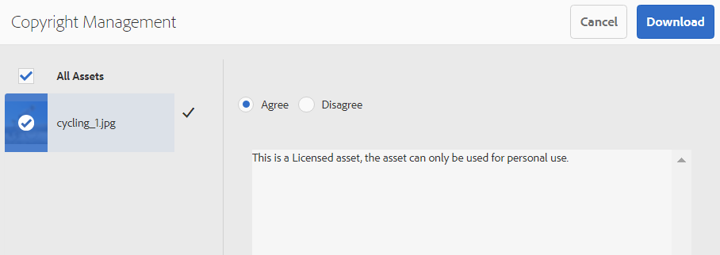
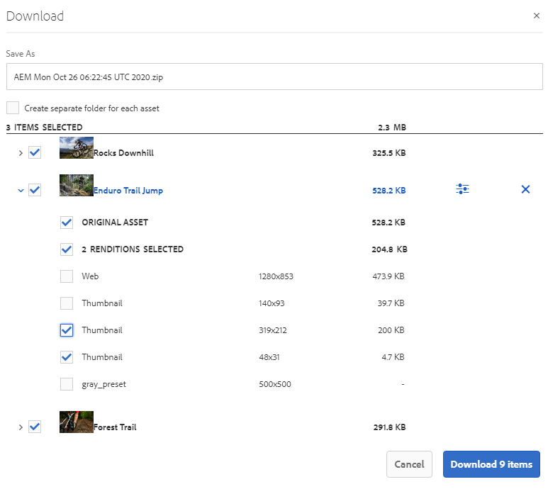

# 브랜드 포털에서 에셋 다운로드 {#download-assets-from-bp}

<!-- Before update in Download experience - 26th Aug 2020 comment by Vishabh.
 All users can simultaneously download multiple assets and folders accessible to them from Brand Portal. This way, approved brand assets can be securely distributed for offline use. Read on to know how to download approved assets from Brand Portal, and what to expect from the [download performance](../using/brand-portal-download-assets.md#main-pars-header).
-->

Adobe Experience Manager 에셋 브랜드 포털은 사용자가 브랜드 포털에서 액세스할 수 있는 여러 에셋과 폴더를 동시에 다운로드할 수 있도록 함으로써 다운로드 환경을 향상시킵니다. 이렇게 하면 승인된 브랜드 자산을 오프라인으로 사용할 수 있도록 안전하게 배포할 수 있습니다. 브랜드 포털에서 승인된 자산을 다운로드하는 방법 및 [다운로드 성능을 통해 얻을 수 있는 기대 사항에 대해 자세히 알아보십시오](../using/brand-portal-download-assets.md#expected-download-performance).

>[!NOTE]
>
>브랜드 포털 2020.10.0 이상 버전에서는 기본적으로 **[!UICONTROL 빠른 다운로드]** 설정이 활성화되어 에셋 다운로드 속도를 높여줍니다. 브랜드 포털에서 에셋을 다운로드하기 전에 브라우저 익스텐션에 IBM Aspera Connect 3.9.9를 설치합니다.
>
>IBM Aspera Connect를 사용하지 않고 일반적인 다운로드 프로세스를 계속하려면 브랜드 포털 관리자에게 문의하여 **[!UICONTROL 빠른 다운로드]** 설정을 끄십시오.

## 자산 다운로드 구성 {#configure-download}

브랜드 포털 관리자는 브랜드 포털 사용자의 자산 다운로드 설정 및 권한을 구성하여 브랜드 포털 인터페이스에서 자산 표현물에 액세스하고 다운로드할 수 있도록 할 수 있습니다.

브랜드 포털에서 변환에 액세스하고 다운로드하는 것은 다음 구성으로 정의됩니다.

* 다운로드 설정 사용
* 다운로드 권한 구성

### 다운로드 설정 사용 {#enable-download-settings}

관리자는 자산 다운로드 설정 **[!UICONTROL 을]** 활성화하여 브랜드 포털 사용자가 다운로드할 수 있는 변환 세트를 정의할 수 있습니다.

사용 가능한 설정은 다음과 같습니다.

* **[!UICONTROL 빠른 다운로드]**

   IBM Aspera Connect를 사용하여 에셋을 빠르게 다운로드할 수 있습니다. 기본적으로 [다운로드 설정]에서 **[!UICONTROL 빠른 다운로드]** 설정이 **[!UICONTROL 활성화됩니다]**.

   자세한 내용은 브랜드 포털에서 다운로드 시간을 단축하기 위한 [가이드를 참조하십시오](../using/accelerated-download.md).

* **[!UICONTROL 사용자 지정 표현물]**

   자산의 사용자 지정 및(또는) 동적 표현물을 다운로드할 수 있습니다.

   원본 자산 및 시스템 생성 표현물 이외의 모든 자산 표현물을 사용자 지정 표현물이라고 합니다. 여기에는 자산에 사용할 수 있는 동적 표현뿐만 아니라 정적 표현물도 포함됩니다. 모든 사용자는 AEM Assets에서 사용자 정의 정적 변환을 만들 수 있지만, AEM 관리자만 사용자 정의 동적 변환을 만들 수 있습니다. 자세한 내용은 이미지 사전 설정 또는 동적 표현물을 [적용하는 방법을 참조하십시오](../using/brand-portal-image-presets.md).

* **[!UICONTROL 시스템 표현물]**

   시스템에서 생성한 자산 표현물을 다운로드할 수 있습니다.

   &quot;DAM 에셋 업데이트&quot; 워크플로우를 기반으로 AEM Assets에서 자동으로 생성되는 축소판입니다.

관리자로 브랜드 포털 테넌트에 로그인하고 **[!UICONTROL 도구]** > **[!UICONTROL 다운로드로 이동합니다]**.

관리자는 브랜드 포털 사용자가 표현물에 액세스하고 다운로드할 수 있도록 모든 설정 조합을 활성화할 수 있습니다.

>[!NOTE]
>
>관리자만 만료된 자산을 다운로드할 수 있습니다. 만료된 자산에 대한 자세한 내용은 자산의 디지털 권한 [관리를 참조하십시오](../using/manage-digital-rights-of-assets.md).

### 다운로드 권한 구성 {#configure-download-permissions}

브랜드 포털 관리자는 **[!UICONTROL 다운로드 설정]**&#x200B;외에, 원본 에셋 및 해당 표현물을 보고 다운로드할 수 있도록 다른 사용자 그룹에 대한 권한을 추가로 구성할 수 있습니다.

관리자로 브랜드 포털 테넌트에 로그인하고 **[!UICONTROL 도구]** > **[!UICONTROL 사용자로 이동합니다]**. [ **[!UICONTROL 사용자 역할]** ] 페이지에서 **[!UICONTROL 그룹]** 탭으로 이동하여 사용자 그룹에 대한 보기 및 (또는) 다운로드 권한을 구성합니다.

>[!NOTE]
>
>사용자가 여러 그룹에 추가되고 해당 그룹 중 하나에 제한이 있는 경우 해당 제한이 사용자에게 적용됩니다.

구성에 따라 다운로드 워크플로우는 독립 실행형 에셋, 여러 에셋, 에셋이 포함된 폴더, 라이선스되거나 라이선스가 부여되지 않은 에셋을 포함하는 폴더, 공유 링크를 사용하여 에셋 다운로드에도 일관되게 유지됩니다.

다음 매트릭스는 사용자가 [다운로드 구성에 따라 변환에 액세스할 수 있는지 여부를 정의합니다](#configure-download).

| **다운로드 설정:사용자 정의 표현물** | **다운로드 설정:시스템 변환** | **사용자 그룹 권한:원본 다운로드** | **사용자 그룹 권한:표현물 다운로드** | **결과** |
|---|---|---|---|---|
| 켬 | 켬 | 켬 | 켬 | 모든 변환 보기 및 다운로드 |
| 켬 | 켬 | 끔 | 끔 | 원본 자산 보기 |
| 끔 | 끔 | 켬 | 켬 | 원본 에셋 보기 및 다운로드 |
| 켬 | 끔 | 켬 | 켬 | 원본 자산 및 사용자 정의 표현물 보기 및 다운로드 |
| 끔 | 켬 | 켬 | 켬 | 원본 자산 및 시스템 변환 보기 및 다운로드 |
| 켬 | 끔 | 끔 | 끔 | 원본 자산 보기 |
| 끔 | 켬 | 끔 | 끔 | 원본 자산 보기 |
| 끔 | 끔 | 끔 | 켬 | 원본 자산 보기 |
| 끔 | 끔 | 켬 | 끔 | 원본 에셋 보기 및 다운로드 |
| 끔 | 끔 | 끔 | 끔 | 원본 자산 보기 |

## 자산 다운로드 {#download-assets}

브랜드 포털 사용자는 브랜드 포털 인터페이스에서 여러 자산, 자산이 들어 있는 폴더 및 컬렉션을 다운로드할 수 있습니다.

>[!NOTE]
>
>변환에 액세스하거나 다운로드할 권한이 없는 경우 브랜드 포털 관리자에게 문의하십시오.

사용자에게 변환에 대한 액세스 권한이 있는 경우 다음 기능이 포함된 향상된 **[!UICONTROL 다운로드]** 대화 상자가 제공됩니다.
* 다운로드 목록에서 모든 자산의 사용 가능한 모든 표현물을 봅니다.
* 다운로드할 필요가 없는 자산의 표현물을 제외합니다.
* 한 번의 클릭으로 모든 유사한 자산 유형에 동일한 표현물 세트를 적용합니다.
* 다양한 자산 유형에 대해 다른 표현물 세트를 적용합니다.
* 각 자산 변환에 대해 별도의 폴더를 만듭니다.
* 선택한 자산 및 해당 표현물을 다운로드합니다.

>[!NOTE]
>
>다운로드 **[!UICONTROL 대화 상자는]** 자산을 다운로드하도록 선택하고 **[!UICONTROL 사용자 지정 표현물]** 또는 **[!UICONTROL 시스템 표현물]** 이 다운로드 설정 **[!UICONTROL 에서 활성화된 경우에만]**&#x200B;나타납니다.

### 자산 다운로드 단계 {#bulk-download}

브랜드 포털 인터페이스에서 자산이 들어 있는 자산 또는 폴더를 다운로드하는 단계는 다음과 같습니다.

1. 브랜드 포털 테넌트에 로그인합니다. 기본적으로 게시된 모든 자산 및 폴더를 **[!UICONTROL 포함하는 파일]** 보기가 열립니다.

   다음 중 하나를 수행하십시오.

   * 다운로드할 자산 또는 폴더를 선택합니다. 상단에 있는 도구 모음에서 **[!UICONTROL 다운로드]** 아이콘을 클릭합니다.

      

   * 자산의 특정 에셋 표현물을 다운로드하려면 포인터를 에셋 위에 올려놓은 다음 빠른 작업 축소판에서 사용 가능한 **[!UICONTROL 다운로드]** 아이콘을 클릭합니다.

      

      >[!NOTE]
      >
      >처음 에셋을 다운로드하고 있지만 브라우저에 IBM Aspera Connect가 설치되지 않은 경우 Aspera 다운로드 가속기를 설치하라는 메시지가 표시됩니다.

      >[!NOTE]
      >
      >다운로드하려는 에셋에 라이센스 자산도 포함되어 있는 경우 **[!UICONTROL 저작권 관리]** 페이지로 리디렉션됩니다. 이 페이지에서 자산을 선택하고 **[!UICONTROL 동의]**&#x200B;를 클릭한 다음 **[!UICONTROL 다운로드를 클릭합니다]**. 동의하지 않으면 라이선스가 부여된 에셋이 다운로드되지 않습니다.
      > 
      >라이선스로 보호된 자산은 [사용권 계약을 첨부하고](https://helpx.adobe.com/experience-manager/6-5/assets/using/drm.html#DigitalRightsManagementinAssets) , Experience Manager 자산에 자산의 [메타데이터 속성을](https://helpx.adobe.com/experience-manager/6-5/assets/using/drm.html#DigitalRightsManagementinAssets) 설정하여수행합니다.

      

1. 선택한 모든 자산이 **[!UICONTROL 나열된 다운로드]** 대화 상자가 열립니다.

   사용 가능한 변환을 보려면 자산을 클릭하고 다운로드할 변환에 해당하는 확인란을 선택합니다.

   개별 자산에 대한 표현물을 수동으로 선택하거나 제외하거나 **적용** 아이콘을 클릭하여 다운로드용으로 선택한 모든 유사한 자산 유형(이 예제의 모든 이미지 파일)에 동일한 표현물 세트를 적용할 수 있습니다. 완료를 **[!UICONTROL 클릭하여]** 적용된 규칙을 확인합니다.

   

   다운로드 목록(필요한 경우)에서 **제거** 아이콘을 클릭하여 자산을 제거할 수도 있습니다.

   

   자산을 다운로드하는 동안 브랜드 포털 폴더 계층을 유지하려면 **[!UICONTROL 각 자산에 대해 별도의 폴더]** 만들기 확인란을 선택합니다. 기본적으로 브랜드 포털 폴더 계층은 무시되며 모든 자산은 zip 폴더에 다운로드됩니다.

   다운로드 단추는 선택한 항목의 수를 반영합니다. 규칙 적용을 마치면 항목 **[!UICONTROL 다운로드를 클릭합니다]**.

   

1. 기본적으로 다운로드 설정 **[!UICONTROL 에서 빠른 다운로드]** 설정이 **[!UICONTROL 활성화되어 있습니다]**. 따라서 IBM Aspera Connect를 사용하여 가속화된 다운로드를 허용하는 확인 상자가 나타납니다.

   빠른 다운로드 **[!UICONTROL 를]**&#x200B;계속 사용하려면 **[!UICONTROL 허용을 클릭합니다]**. 선택한 모든 변환이 IBM Aspera Connect를 사용하여 zip 폴더에 다운로드됩니다.

   IBM Aspera Connect를 사용하지 않으려면 [ **[!UICONTROL 거부]를 클릭합니다]**. 빠른 **[!UICONTROL 다운로드가]** 거부되거나 실패할 경우 시스템은 오류 메시지를 채웁니다. [ **[!UICONTROL 일반 다운로드]** ] 단추를 클릭하여 자산을 계속 다운로드합니다. 선택한 변환은 IBM Aspera Connect를 사용하지 않고 zip 폴더에 다운로드됩니다.

>[!NOTE]
>
>관리자가 **[!UICONTROL 빠른 다운로드]** 설정을 해제하면 선택한 변환이 IBM Aspera Connect를 사용하지 않고 zip 폴더에서 직접 다운로드됩니다.

>[!NOTE]
>
>다운로드용으로 20개 이상의 자산을 선택한 경우 **[!UICONTROL 다운로드]** 대화 상자를 건너뛰고 동적 변환을 제외한 사용자가 액세스할 수 있는 모든 변환이 zip 폴더에 직접 다운로드됩니다.
>
>자산 및 컬렉션이 포함된 폴더를 다운로드하는 동안 동일한 비헤이비어가 이어집니다. 동적 표현물을 제외한 액세스 가능한 표현물은 zip 폴더에 직접 다운로드됩니다.

>[!NOTE]
>
>브랜드 포털에서는 하이브리드 모드와 장면 7 모드 모두에서 다이내믹 미디어 구성을 지원합니다.
>
>(*AEM 작성자 인스턴스가&#x200B;**Dynamic Media Hybrid 모드에서 실행 중인 경우***)
>
>자산의 다이내믹 변환을 미리 보거나 다운로드하려면 다이내믹 미디어가 활성화되어 있고 자산의 피라미드형 tiff 변환이 자산이 게시된 AEM Assets 작성자 인스턴스에 있는지 확인합니다. AEM에서 Brand Portal에 자산이 게시되면 해당 Pyramid Tiff 변환도 게시됩니다.

관리자가 원래 표현물에 대한 액세스 권한을 [부여하지 않은](../using/brand-portal-adding-users.md#main-pars-procedure-202029708)경우 선택한 자산의 원본 표현물은 다운로드되지 않습니다.

<!-- This issue has been resolved, check with engineering.
>[!NOTE]
>
>Once you have downloaded the asset renditions, the **[!UICONTROL Download]** button is disabled to avoid creating duplicate copies of the renditions. To download more (missing or another copy of renditions), refresh the browser to re-enable the download button.
-->

### 자산 세부 사항 페이지에서 자산 다운로드 {#download-assets-from-asset-details-page}

다운로드 워크플로우 외에도 자산 세부 사항 페이지에서 직접 개별 자산에 대한 변환을 다운로드하는 다른 방법이 있습니다.

사용자는 [다운로드] 대화 상자를 열지 않고도 다른 변환을 미리 보고, 특정 표현물을 선택한 다음 자산 세부 정보 페이지의 **[!UICONTROL 표현물]** 패널에서 직접 **[!UICONTROL 다운로드할]** 수 있습니다.

자산 세부 사항 페이지에서 자산 표현물을 다운로드하는 단계는 다음과 같습니다.

1. 브랜드 포털 테넌트에 로그인하고 자산을 클릭하여 자산 세부 사항 페이지를 엽니다.
1. 왼쪽의 오버레이 아이콘을 클릭한 다음 표현물을 **[!UICONTROL 클릭합니다]**.

   

1. [ **[!UICONTROL 표현물]** ] 패널에는 자산 [다운로드 구성을 기준으로 액세스할 수 있는 모든 자산 표현물이 나열됩니다](#configure-download).

   다운로드할 특정 변환을 선택하고 항목 **[!UICONTROL 다운로드를 클릭합니다]**.

   

1. 기본적으로 다운로드 설정 **[!UICONTROL 에서 빠른 다운로드]** 설정이 **[!UICONTROL 활성화되어 있습니다]**. 따라서 IBM Aspera Connect를 사용하여 가속화된 다운로드를 허용하는 확인 상자가 나타납니다.

   빠른 다운로드 **[!UICONTROL 를]**&#x200B;계속 사용하려면 **[!UICONTROL 허용을 클릭합니다]**. 선택한 모든 변환이 IBM Aspera Connect를 사용하여 zip 폴더에 다운로드됩니다.

   빠른 다운로드 사용을 거부하는 경우 **[!UICONTROL 시스템에서 오류]**&#x200B;메시지를 채웁니다. 다운로드를 계속하려면 **[!UICONTROL 일반 다운로드]** 단추를 클릭하십시오. 선택한 변환은 IBM Aspera Connect를 사용하지 않고 zip 폴더에 다운로드됩니다.

>[!NOTE]
>
>관리자가 **[!UICONTROL 빠른 다운로드]** 설정을 해제하면 선택한 변환이 IBM Aspera Connect를 사용하지 않고 zip 폴더에서 직접 다운로드됩니다.

>[!NOTE]
>
>개별적으로 다운로드한 자산은 자산 다운로드 보고서에서 볼 수 있습니다. 그러나 에셋이 들어 있는 폴더를 다운로드한 경우 폴더 및 에셋이 에셋 다운로드 보고서에 표시되지 않습니다.

<!--
>[!NOTE]
>
>Assets that are individually downloaded are visible in the assets download report. However, if a folder containing assets is downloaded, the folder and assets are not displayed in the assets download report.
-->

<!-- Backup of content before updating the new feature docs.
## Configure asset download {#configure-download}

The download configuration allows the Brand Portal administrators to define the set of renditions available to the Brand Portal users for downloading the assets. The administrator can configure the asset **[!UICONTROL Download]** settings from the Brand Portal interface. 

The available configurations are:

* **[!UICONTROL Fast Download]** 

  Enables high-speed download of the assets. To know more, see [guide to accelerate downloads from Brand Portal](../using/accelerated-download.md).

* **[!UICONTROL Custom Renditions]** 
  
  Download custom and (or) dynamic renditions of the assets. 
  All the asset renditions other than the original asset and system-generated renditions are called as custom renditions. It includes static as well as dynamic renditions available for the asset. Any user can create a custom static rendition in AEM Assets, whereas, only the AEM administrator can create custom dynamic renditions. To know more, see [how to apply image presets or dynamic renditions](../using/brand-portal-image-presets.md)

* **[!UICONTROL System Renditions]** 

  Download system-generated renditions of the assets. These are the thumbnails which are automatically generated in AEM Assets based on the "DAM update asset" workflow. 

Log in to your Brand Portal tenant as an administrator and navigate to **[!UICONTROL Tools]** > **[!UICONTROL Download]**. By default, the **[!UICONTROL Fast Download]** configuration is enabled in the **[!UICONTROL Download Settings]**. 

The administrators can enable any combination to configure the asset download process.

Based on the configuration, the download workflow remains constant for stand-alone assets, multiple assets, folders containing assets, licensed or unlicensed assets, and downloading assets using share link. 

* If both **[!UICONTROL Custom Renditions]** and **[!UICONTROL System Renditions]** configurations are turned-off, the original renditions of the assets are downloaded without any additional dialog being presented to the users.    

* If any of the **[!UICONTROL Custom Renditions]** or **[!UICONTROL System Renditions]** configuration is enabled, an additional **[!UICONTROL Download]** dialog box appears wherein you can choose whether to download the original asset along with its renditions, or download only specific renditions. 

>[!NOTE]
>
>Only the administrators can download the expired assets. For more information about expired assets, see [manage digital rights of assets](../using/manage-digital-rights-of-assets.md).

## Steps to download assets {#steps-to-download-assets}

Following are the steps to download assets or folders containing assets from Brand Portal:

1. From the Brand Portal interface, do one of the following:

   * Select the folders or assets you want to download. From the toolbar at the top, click the **[!UICONTROL Download]** icon.

     

   * To download a specific asset or folder, hover the pointer over the asset or folder and click the **[!UICONTROL Download]** icon available in the quick action thumbnails.

     

     >[!NOTE]
     >
     >If you are downloading the assets for the first time and do not have IBM Aspera Connect installed in your browser, it will prompt you to install the Aspera download accelerator. 

     >[!NOTE]
     >
     >If the assets you are downloading also include licensed assets, you are redirected to the **[!UICONTROL Copyright Management]** page. In this page, select the assets, click **[!UICONTROL Agree]**, and then click **[!UICONTROL Download]**. If you choose to disagree, licensed assets are not downloaded. 
     > 
     >License-protected assets have [license agreement attached](https://helpx.adobe.com/experience-manager/6-5/assets/using/drm.html#DigitalRightsManagementinAssets) to them, which is done by setting asset's [metadata property](https://helpx.adobe.com/experience-manager/6-5/assets/using/drm.html#DigitalRightsManagementinAssets) in Experience Manager Assets.

     

     
     >[!NOTE]
     >
     >Ensure to select all the required asset renditions while downloading them from the asset details page, and click **[!UICONTROL Download]**. The selected renditions are downloaded to your local machine.
     > 
     >Once you download, the **[!UICONTROL Download]** button is disabled to avoid creating duplicate copies of the downloaded renditions. To download more (missing or another copy of renditions), refresh the browser to re-enable the download button.

     If any of the **[!UICONTROL Custom Renditions]** or **[!UICONTROL System Renditions]** configuration is enabled in the **[!UICONTROL Download Settings]**, the **[!UICONTROL Download]** dialog appears with the **[!UICONTROL Asset(s)]** check box selected by default. If the **[!UICONTROL Fast Download]** configuration is enabled, the **[!UICONTROL Enable download acceleration]** check box is selected by default.

     

     >[!NOTE]
     >
     >If the downloading assets are image files, and you select only the **[!UICONTROL Asset(s)]** check box in the **[!UICONTROL Download]** dialog but are not [authorized by the administrator to have access to the original renditions of image files](../using/brand-portal-adding-users.md#main-pars-procedure-202029708) then no image files are downloaded and a notification appears, stating that you have been restricted by the administrator to access original renditions.

     

1. To download the renditions in addition to the original assets, select the **[!UICONTROL Rendition(s)]** check box. However, if you want to download the system-generated renditions along with the custom renditions, clear the **[!UICONTROL Exclude System Renditions]** check box.

   

   * To download only the renditions, clear the **[!UICONTROL Asset(s)]** check box.

     >[!NOTE]
     >
     >By default, only the assets are downloaded. However, original renditions of image files are not downloaded if you are not [authorized by the administrator to have access to the original renditions of image files](../using/brand-portal-adding-users.md#main-pars-procedure-202029708).

    * To share the selected assets with other users through a link, select the **[!UICONTROL Email]** check box. An email notification is sent to the users with the download link. To know how to download assets from shared links, see [downloading assets from shared links](../using/brand-portal-link-share.md#main-pars-header-1703469193).  

      

      >[!NOTE]
      >
      >The download link on email notification expires after 45 days.
      >
      >The administrators can customize email messages, that is, logo, description, and footer, using the [Branding](../using/brand-portal-branding.md) feature.

    * You can select a predefined image preset or create a custom dynamic rendition from the **[!UICONTROL Download]** dialog box. 

      To apply a [custom image preset to the asset and its renditions](../using/brand-portal-image-presets.md#applyimagepresetswhendownloadingimages), select the **[!UICONTROL Dynamic Rendition(s)]** check box. Specify the image preset properties (such as size, format, color space, resolution, and image modifier) to apply the custom image preset while downloading the asset and its renditions. To download only the dynamic renditions, clear the **[!UICONTROL Asset(s)]** check box.

      

      >[!NOTE]
      >
      >Brand Portal supports configuring Dynamic Media in both - Hybird and Scene 7 mode. 
      >
      >(*If AEM author instance is running on **Dynamic Media Hybrid mode***)
      >
      >To preview or download dynamic renditions of an asset, ensure that the dynamic media is enabled and the asset's Pyramid tiff rendition exists at the AEM Assets author instance from where the assets have been published. When an asset is published to Brand Portal, its Pyramid tiff rendition is also published.
      
  
    * To preserve the Brand Portal folder hierarchy while downloading assets, select the **[!UICONTROL Create separate folder for each asset]** check box. By default, the Brand Portal folder hierarchy is ignored and all the assets are downloaded in one folder in your local system.

1. Click **[!UICONTROL Download]**.

   The assets (and renditions if selected) are downloaded as a zip file to your local folder. However, no zip file is created if a single asset is downloaded without any of the renditions. 

   If you are not [authorized by the administrator to have access to the original renditions](../using/brand-portal-adding-users.md#main-pars-procedure-202029708), the original renditions of the selected assets are not downloaded. 

   >[!NOTE]
   >
   >Assets that are individually downloaded are visible in the assets download report. However, if a folder containing assets is downloaded, the folder and assets are not displayed in the assets download report.
-->

## 예상 다운로드 성능 {#expected-download-performance}

로컬 인터넷 연결 및 서버 지연과 같은 요인에 따라, 서로 다른 클라이언트 위치의 사용자에 대해 파일 다운로드 경험이 다를 수 있습니다. 다양한 클라이언트 위치에서 관측되는 2GB 파일의 예상 다운로드 성능은 다음과 같습니다. 미국 오리건 주의 브랜드 포털 서버는 다음과 같습니다.

| 클라이언트 위치 | 클라이언트와 서버 간의 지연 | 예상 다운로드 속도 | 2GB 파일 다운로드 시간 |
|-------------------------|-----------------------------------|-------------------------|------------------------------------|
| 미국 서부(캘리포니아 주) | 18밀리초 | 7.68MB/s | 4분 |
| 미국 서부(오레곤) | 42밀리초 | 3.84MB/s | 9분 |
| 미국 동부(버지니아 주) | 85밀리초 | 1.61MB/s | 21분 |
| APAC(도쿄) | 124밀리초 | 1.13MB/s | 30분 |
| 노이다 | 275밀리초 | 0.5MB/s | 68분 |
| 시드니 | 175밀리초 | 0.49MB/s | 69분 |
| 런던 | 179밀리초 | 0.32MB/s | 106분 |
| 싱가포르 | 196밀리초 | 0.5MB/s | 68분 |

>[!NOTE]
>
>인용된 데이터는 테스트 조건에서 관찰되며, 다양한 지연 및 대역폭을 사용하는 다른 위치에 있는 사용자에 대해 다를 수 있습니다.

