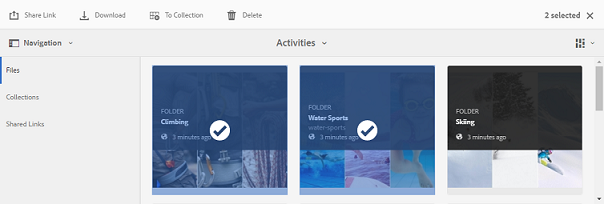

# 에셋 다운로드 {#download-assets}

모든 사용자는 브랜드 포털에서 액세스 가능한 여러 에셋과 폴더를 동시에 다운로드할 수 있습니다. 이렇게 하면 승인된 브랜드 에셋을 오프라인으로 사용할 수 있도록 안전하게 배포할 수 있습니다. 브랜드 포털에서 승인된 에셋을 다운로드하는 방법 및 [다운로드 성능을 예상할 수 있는 방법을 읽어](../using/brand-portal-download-users.md#main-pars-header)보십시오.

>[!NOTE]
>
>관리자만 만료된 에셋을 다운로드할 수 있습니다. 만료된 자산에 대한 자세한 내용은 자산의 디지털 권한 [관리를](../using/manage-digital-rights-of-assets.md)참조하십시오.

## 자산을 다운로드하는 단계 {#steps-to-download-assets}

브랜드 포털용 에셋이 포함된 에셋 또는 폴더를 다운로드하려면 다음 단계를 따르십시오.

1. 브랜드 포털 인터페이스에서 다음 중 하나를 수행합니다.

   * 다운로드할 폴더 또는 자산을 선택합니다. 상단에 있는 도구 모음에서 **[!UICONTROL 다운로드]** 아이콘을 클릭합니다.
   

   * 단일 폴더 또는 자산을 다운로드하려면 포인터를 폴더 또는 자산 위에 놓습니다. 빠른 작업 썸네일에서 **[!UICONTROL 다운로드]** 아이콘을 클릭합니다.
   

   >[!NOTE]
   >
   >다운로드하는 자산에 라이선스가 부여된 에셋이 포함되어 있는 경우에도 **[!UICONTROL 저작권 관리]** 페이지로 리디렉션됩니다. 이 페이지에서 자산을 선택하고 **[!UICONTROL 동의를]**&#x200B;클릭한 다음 **[!UICONTROL 다운로드를]**&#x200B;클릭합니다. 동의하지 않으면 라이센스가 부여된 에셋이 다운로드되지 않습니다.\
   >라이센스 보호된 자산은 [AEM 자산에서 자산의](https://helpx.adobe.com/experience-manager/6-5/assets/using/drm.html#DigitalRightsManagementinAssets) [메타데이터 속성을](https://helpx.adobe.com/experience-manager/6-5/assets/using/drm.html#DigitalRightsManagementinAssets) 설정하여 수행되는 라이센스 계약을 따르게 됩니다.

   

   기본적으로 자산 옵션이 선택되어 **[!UICONTROL 있는 다운로드]** **[!UICONTROL 대화]** 상자가 나타납니다.

   

   >[!NOTE]
   >
   >다운로드하는 자산이 이미지 파일이고, 관리자가 다운로드 대화 상자에서 **[!UICONTROL 에셋]** 옵션만 선택해야 하지만, 관리자가 이미지 파일의 원본 변환에 액세스할 [수 있는 권한을 부여받지 않은](../using/brand-portal-adding-users.md#main-pars-procedure-202029708) 경우, 관리자가 원본 변환에 액세스하도록 제한했다는 내용의 알림 메시지와 이미지 파일이 다운로드되지 않았습니다.

   

2. 자산 외에 자산의 표현물을 다운로드하려면 **[!UICONTROL 표현물을 선택합니다]**. 하지만 자동 생성된 표현물이 사용자 지정 표현물과 함께 다운로드되도록 하려면 기본적으로 선택된 자동 생성된 표현물 ****&#x200B;제외를 선택 취소합니다.

   

   표현물만 다운로드하려면 **[!UICONTROL 자산을 선택 취소합니다]**.

   >[!NOTE]
   >
   >기본적으로 에셋만 다운로드됩니다. 그러나 관리자가 이미지 파일의 원본 변환에 액세스할 [수 있는 권한이 없으면 이미지 파일의 원본 변환이 다운로드되지](../using/brand-portal-adding-users.md#main-pars-procedure-202029708)않습니다.

   * 브랜드 포털에서 에셋 파일의 다운로드를 가속화하려면 [다운로드 가속 **[!UICONTROL 활성화]** ] 옵션을 선택하고 마법사를 [따릅니다](../using/accelerated-download.md#main-pars-header-405749062). 에셋 다운로드 빠른 참조에 대한 자세한 내용은 [브랜드 포털에서 다운로드 시간을 단축하기 위한 가이드를](../using/accelerated-download.md)참조하십시오.

   * 자산 및 해당 표현물에 사용자 지정 이미지 사전 설정을 적용하려면 **[!UICONTROL 다이내믹 표현물을 선택합니다]**. 자산 및 해당 변환을 다운로드하는 동안 사용자 지정 이미지 사전 설정을 적용하려면 사용자 지정 이미지 사전 설정 속성 (크기, 형식, 색상 공간, 해상도 및 이미지 수정자) 를 지정합니다. Dynamic 표현물, delesect **[!UICONTROL 만 다운로드하려면]**
   

   >[!NOTE]
   >
   >자산의 동적 표현물을 미리 보거나 다운로드하려면, 자산이 게시된 위치에서 AEM 작성자 인스턴스에 다이내믹 미디어가 활성화되어 있고 자산의 피라미드형 TIFF 변환이 있는지 확인하십시오. 에셋을 브랜드 포털에 게시하면 피라미드형 TIFF 표현물도 게시됩니다. 브랜드 포털에서 피라미드 TIFF 변환을 생성하는 방법은 없습니다.

   * 자산을 다운로드하는 동안 브랜드 포털 폴더 계층 구조를 유지하려면 각 자산에 대해 별도의 폴더 **[!UICONTROL 만들기를 선택합니다]**. 기본적으로 브랜드 포털 폴더 계층은 무시되고 모든 자산은 로컬 시스템의 한 폴더에서 다운로드됩니다.

   * 에셋을 다운로드할 수 있는 링크가 있는 사용자에게 이메일 알림을 보내려면 **[!UICONTROL [이메일]**] 를 선택합니다.
   

   >[!NOTE]
   >
   >이메일 알림의 다운로드 링크는 45 일 후 만료됩니다.
   >
   >관리자는 [브랜드](../using/brand-portal-branding.md) 기능을 사용하여 이메일 메시지, 즉 로고, 설명 및 바닥글을 사용자 정의할 수 있습니다.

3. ****&#x200B;다운로드를 클릭합니다.

   자산 (및 선택한 경우 변환) 는 로컬 폴더에 zip 파일로 다운로드됩니다. 단, 변환 없이 단일 자산이 다운로드되는 경우 ZIP 파일이 만들어지므로 빠른 다운로드가 보장됩니다.

   관리자가 원래 표현물에 대한 액세스 권한을 [부여받지 않은 경우 선택한 자산의 원래 표현물은 다운로드되지 않습니다](../using/brand-portal-adding-users.md#main-pars-procedure-202029708).

   >[!NOTE]
   >
   >개별적으로 선택하고 다운로드한 자산은 다운로드한 자산 보고서에 표시됩니다. 그러나 자산이 들어 있는 폴더를 다운로드하는 경우 자산이나 자산이 다운로드된 자산 보고서에 표시되지 않습니다.

   공유 링크에서 에셋을 다운로드하는 방법에 대해 알려면 공유 링크에서 에셋 [다운로드를 참조하십시오](../using/brand-portal-link-share.md#main-pars-header-1703469193).

## 예상 다운로드 성능 {#expected-download-performance}

로컬 인터넷 연결 및 서버 지연과 같은 요인에 따라 다른 클라이언트 위치의 사용자에 따라 파일 다운로드 경험이 달라질 수 있습니다. 다른 클라이언트 위치에서 관찰되는 2 GB 파일의 예상 다운로드 성능은 미국 오레곤 지역의 브랜드 포털 서버를 통해 다음과 같습니다.

| 클라이언트 위치 | 클라이언트와 서버 사이의 지연 시간 | 예상 다운로드 속도 | 2 GB 파일을 다운로드하는 데 걸린 시간 |
|-------------------------|-----------------------------------|-------------------------|------------------------------------|
| 미국 서부 (캘리포니아) | 18 밀리초 | 7.68 MB/s | 4 분 |
| 미국 서부 (오레곤) | 42 밀리초 | 3.84 MB/s | 9 분 |
| 미국 동부 (버지니아) | 85 밀리초 | 1.61 MB/초 | 21 분 |
| APAC (도쿄) | 124 밀리초 | 1.13 MB/초 | 30 분 |
| Noida | 275 밀리초 | 0.5 MB/s | 68 분 |
| 시드니 | 175 밀리초 | 0.49 MB/초 | 69 분 |
| 런던 | 179 밀리초 | 0.32 MB/초 | 106 분 |
| 싱가포르 | 196 밀리초 | 0.5 MB/s | 68 분 |

****&#x200B;참고: 인용된 데이터는 테스트 조건 아래에서 관찰되며, 이것은 다양한 지연 및 대역폭을 목격하는 서로 다른 위치의 사용자에 따라 다를 수 있습니다.
