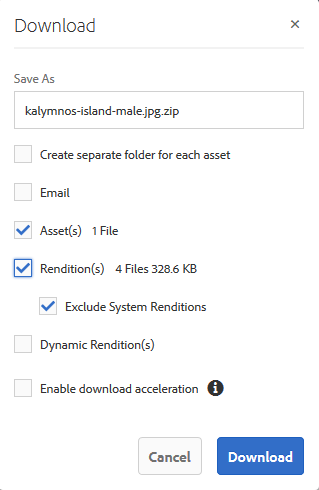

# 자산 다운로드 {#download-assets}

모든 사용자는 브랜드 포털에서 액세스할 수 있는 여러 자산 및 폴더를 동시에 다운로드할 수 있습니다. 이렇게 하면 승인된 브랜드 자산을 오프라인으로 사용할 수 있도록 안전하게 배포할 수 있습니다. 브랜드 포털에서 승인된 자산을 다운로드하는 방법 및 [다운로드 성능을 통해 얻을 수 있는 기대 사항에 대해 자세히 알아보십시오](../using/brand-portal-download-users.md#main-pars-header).

>[!NOTE]
>
>만료된 에셋은 관리자만 다운로드할 수 있습니다. 만료된 자산에 대한 자세한 내용은 자산의 디지털 권한 [관리를 참조하십시오](../using/manage-digital-rights-of-assets.md).

## 자산 다운로드 단계 {#steps-to-download-assets}

브랜드 포털용 에셋이 포함된 에셋 또는 폴더를 다운로드하려면 다음 단계를 수행하십시오.

1. 브랜드 포털 인터페이스에서 다음 중 하나를 수행합니다.

   * 다운로드할 폴더 또는 자산을 선택합니다. 상단에 있는 도구 모음에서 **[!UICONTROL 다운로드]** 아이콘을 클릭합니다.

   

   * 단일 폴더 또는 자산을 다운로드하려면 포인터를 폴더 또는 자산 위로 가져갑니다. 사용 가능한 빠른 작업 축소판에서 **[!UICONTROL 다운로드]** 아이콘을 클릭합니다.

   

   >[!NOTE]
   >
   >다운로드하려는 에셋에 라이센스 자산도 포함되어 있는 경우 **[!UICONTROL 저작권 관리]** 페이지로 리디렉션됩니다. 이 페이지에서 자산을 선택하고 **[!UICONTROL 동의]**&#x200B;를 클릭한 다음 **[!UICONTROL 다운로드를 클릭합니다]**. 동의하지 않으면 라이선스가 부여된 에셋이 다운로드되지 않습니다.\
   >라이선스로 보호된 자산은 [사용권 계약을 첨부하고](https://helpx.adobe.com/experience-manager/6-5/assets/using/drm.html#DigitalRightsManagementinAssets) , 이는 AEM Assets에서 자산의 [메타데이터 속성을](https://helpx.adobe.com/experience-manager/6-5/assets/using/drm.html#DigitalRightsManagementinAssets) 설정하여 수행됩니다.

   

   [ **[!UICONTROL 다운로드]** ] 대화 상자는 기본적으로 **[!UICONTROL 자산]** 옵션이 선택되어나타납니다.

   

   >[!NOTE]
   >
   >다운로드 중인 자산이 이미지 파일이고, 사용자가 [다운로드] 대화 상자에서 **[!UICONTROL 자산 옵션만]** 선택하지만 관리자가 이미지 파일의 원본 변환에 액세스할  권한을 부여하지는 않은 경우 이미지 파일이 다운로드되지 않고 관리자가 원래 변환에 액세스하도록 제한되었다는 알림 메시지가 표시됩니다.

   

1. 자산 외에 자산의 표현물을 다운로드하려면 **[!UICONTROL 변환을 선택합니다]**. 그러나 자동 생성된 변환이 사용자 정의 표현물과 함께 다운로드되도록 하려면 기본적으로 선택된 자동 **[!UICONTROL 생성 표현물]**&#x200B;제외를 선택 취소합니다.

   

   표현물만 다운로드하려면 자산 **[!UICONTROL 을 선택 취소합니다]**.

   >[!NOTE]
   >
   >기본적으로 자산만 다운로드됩니다. 그러나 관리자가 이미지 파일의 원본 변환에 액세스할 수 있도록 [허가하지 않은 경우 이미지 파일의 원본 변환이 다운로드되지 않습니다](../using/brand-portal-adding-users.md#main-pars-procedure-202029708).

   * 브랜드 포털에서 자산 파일 다운로드 속도를 높이려면 다운로드 가속 **** 사용 옵션을 선택하고 마법사를 [따릅니다](../using/accelerated-download.md#main-pars-header-405749062). 에셋 다운로드에 대한 자세한 내용은 브랜드 포털에서 다운로드 시간을 단축하기 위한 [가이드를 참조하십시오](../using/accelerated-download.md).

   * 자산 및 해당 변환에 [사용자 정의 이미지 사전 설정을 적용하려면](../using/brand-portal-image-presets.md#applyimagepresetswhendownloadingimages)동적 변환을 선택합니다 ****. 사용자 정의 이미지 사전 설정 속성(크기, 형식, 색상 공간, 해상도 및 이미지 수정자)을 지정하여 자산 및 해당 변환을 다운로드하는 동안 사용자 정의 이미지 사전 설정을 적용합니다. 동적 표현물만 다운로드하려면 **[!UICONTROL 자산을 선택합니다]**.

   

   >[!NOTE]
   >
   >자산의 동적 변환을 미리 보거나 다운로드하려면, 다이내믹 미디어가 활성화되어 있고 자산이 게시된 AEM 작성자 인스턴스에 자산의 피라미드형 표현물이 있는지 확인하십시오. 자산이 브랜드 포털에 게시되면 해당 Pyramid 변환도 게시됩니다. 브랜드 포털에서 피라미드형 tiff 변환을 생성할 수 있는 방법은 없습니다.

   * 자산을 다운로드하는 동안 브랜드 포털 폴더 계층 구조를 유지하려면 각 자산에 대해 **[!UICONTROL 별도의 폴더 만들기를 선택합니다]**. 기본적으로 브랜드 포털 폴더 계층은 무시되며 모든 자산은 로컬 시스템의 한 폴더에 다운로드됩니다.

   * 자산 다운로드 링크가 있는 사용자에게 이메일 알림을 보내려면 **[!UICONTROL 이메일을 선택합니다]**.

   

   >[!NOTE]
   >
   >이메일 알림의 다운로드 링크가 45일 후 만료됩니다.
   >
   >관리자는 브랜딩 기능을 사용하여 이메일 메시지(로고, 설명 및 바닥글)를 사용자 정의할 [수](../using/brand-portal-branding.md) 있습니다.

1. 다운로드를 **[!UICONTROL 클릭합니다]**.

   자산(및 선택한 표현물)은 로컬 폴더에 ZIP 파일로 다운로드됩니다. 그러나 변환 없이 단일 자산을 다운로드하면 zip 파일이 만들어지지 않으므로 다운로드 시간이 빨라집니다.

   관리자가 원래 표현물에 대한 액세스 권한을 [부여하지 않은 경우 선택한 자산의 원래 표현물이 다운로드되지 않습니다](../using/brand-portal-adding-users.md#main-pars-procedure-202029708).

   >[!NOTE]
   >
   >개별적으로 선택하고 다운로드한 자산은 다운로드한 자산에 표시됩니다. 그러나 에셋이 들어 있는 폴더를 다운로드한 경우 다운로드한 에셋 보고서에 폴더나 에셋이 표시되지 않습니다.

   공유 링크에서 자산을 다운로드하는 방법을 알려면 공유 링크에서 자산 [다운로드를 참조하십시오](../using/brand-portal-link-share.md#main-pars-header-1703469193).

## 예상 다운로드 성능 {#expected-download-performance}

로컬 인터넷 연결 및 서버 지연과 같은 요인에 따라 다른 클라이언트 위치의 사용자에 대해 파일 다운로드 경험이 다를 수 있습니다. 다양한 클라이언트 위치에서 관측되는 2GB 파일의 예상 다운로드 성능은 다음과 같습니다. 미국 오리건 주에 있는 브랜드 포털 서버는 다음과 같습니다.

| 클라이언트 위치 | 클라이언트와 서버 간의 지연 | 예상 다운로드 속도 | 2GB 파일 다운로드 시간 |
|-------------------------|-----------------------------------|-------------------------|------------------------------------|
| 미국 서부(캘리포니아 주) | 18밀리초 | 7.68MB/s | 4분 |
| 미국 서부(오레곤) | 42밀리초 | 3.84MB/s | 9분 |
| 미국 동부(버지니아 주) | 85밀리초 | 1.61MB/s | 21분 |
| APAC(도쿄) | 124밀리초 | 1.13MB/s | 30분 |
| 노이다 | 275밀리초 | 0.5MB/s | 68분 |
| 시드니 | 175밀리초 | 0.49MB/s | 69분 |
| 런던 | 179밀리초 | 0.32MB/s | 106분 |
| 싱가포르 | 196밀리초 | 0.5MB/s | 68분 |

**참고**: 인용된 데이터는 테스트 조건에서 관찰되며, 다양한 지연 및 대역폭을 사용하는 다른 위치에 있는 사용자에 대해 다를 수 있습니다.
