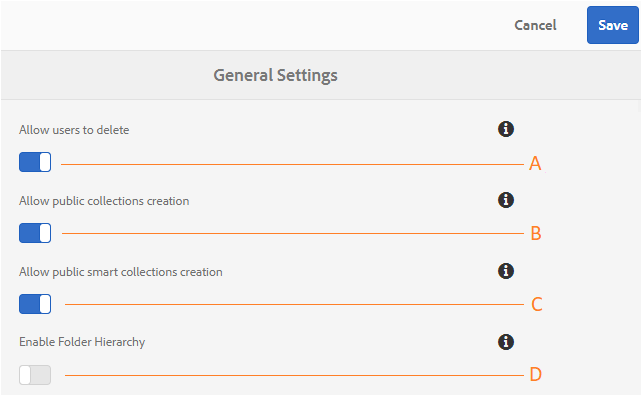

# 관리자 일반 테넌트 구성 {#administer-general-tenant-configurations}

AEM Assets Brand Portal을 통해 조직에서는 특정 테넌트에 대해 다음 기능을 구성할 수 있습니다.

* 관리자별 자산 삭제
* 관리자가 아닌 사용자의 공용 컬렉션 생성
* 관리자가 아닌 사용자에 의한 공용 스마트 컬렉션 생성
* 관리자가 아닌 사용자가 볼 수 있는 공유 폴더의 상위 계층

이러한 구성은 관리 도구 패널에서 **[!UICONTROL 일반 설정]** 구성으로 제공되었습니다.

****   관리자가 Brand Portal에서 자산을 삭제할 수 있도록 하는 구성입니다. (기본값은 활성화됨)

****   관리자가 아닌 사용자가 공개 컬렉션을 만들 수 있도록 구성 (기본값은 활성화됨)

****   관리자가 아닌 사용자가 공개 스마트 컬렉션을 만들 수 있도록 구성할 수 있습니다. (기본값은 활성화됨)

****  공유 폴더의 폴더 계층 구조(루트에서 관리자가 아닌 사용자(편집자, 뷰어, 게스트 사용자)를 표시하는 DC구성 (기본값은 비활성화되어 있음)

## 일반 구성 활성화/비활성화 {#enable-disable-general-configurations}

다음 각 구성을 활성화/비활성화하려면 다음을 수행하십시오.

1. 관리자 권한으로 로그인합니다.
1. 맨 위의 도구 모음에서 관리 도구에 액세스할 AEM 로고를 선택합니다.
1. 관리 도구 패널에서 **[!UICONTROL 일반]**&#x200B;을 선택하여 **[!UICONTROL 일반 설정]** 페이지를 엽니다.
1. 각 전환 스위치를 사용하여 일반 구성을 활성화/비활성화합니다.
1. **[!UICONTROL 변경 사항을 저장합니다.]**
1. 로그아웃하여 변경 사항을 적용합니다.

## 관리자가 Brand Portal에서 자산을 삭제할 수 있도록 허용 {#allow-admin-users-to-delete-assets-from-brand-portal}

**[!UICONTROL 사용자가 구성]** 을 삭제할 수 있도록 허용하면 조직에서 관리자 권한이 있는 사용자가 Brand Portal에서 자산 및 폴더를 삭제하도록 허용(또는 제한할 수 있습니다.)

## 관리자가 아닌 사용자별 공개 컬렉션 생성 허용 {#allow-public-collections-creation-by-non-admins}

[[!UICONTROL 공개 컬렉션 ]](../using/brand-portal-share-collection.md#main-pars-text-1915052376) 만들기 허용, 구성은 관리자가 아닌 사용자가 Brand Portal에서 공개 컬렉션을 만들 수 있는지를 제어합니다. 구성은 기본적으로 활성화되어 있습니다. 구성 조직을 비활성화하여 시스템 공간을 저장할 수 있도록 포털에 수많은 공개 컬렉션이 없도록 할 수 있습니다.

## 관리자가 아닌 사용자가 공개 스마트 컬렉션을 만들 수 있도록 허용 {#allow-public-smart-collections-creation-by-non-admins}

[[!UICONTROL 공개 스마트 컬렉션 ]](../using/brand-portal-searching.md#main-pars-header-500620467) 만들기 허용 구성 관리자가 아닌 사용자가 자신의 검색을 스마트 컬렉션으로 저장하고 해당 테넌트에 대해 공개하도록 할 수 있는지 여부를 제어합니다. 구성은 기본적으로 활성화되어 있습니다. 구성 조직을 비활성화하면 조직의 Brand Portal에서 관리자가 아닌 사용자가 만든 많은 수의 공개 스마트 컬렉션이 생성되지 않을 수 있습니다.

<!-- 
## Allow download acceleration {#allow-download-acceleration}

[[!UICONTROL Allow download acceleration]](../using/accelerated-download.md) configuration lets the organizations to allow accelerated downloads of assets from Brand Portal and shared links, by integrating with IBM Aspera Connect that is an install-on-demand application. The application uses proprietary technology to remove TCP overheads.
-->

## 폴더 계층 구조 사용 {#enable-folder-hierarchy}

[[!UICONTROL 폴더 계층 ]](../using/brand-portal-sharing-folders.md#non-admin-user-access-to-shared-folders) 구성 활성화 를 사용하면 관리자가 아닌 사용자(편집기, 뷰어 및 게스트 사용자)가 로그인한 후 공유 폴더를 보는 방법을 제어할 수 있습니다.
