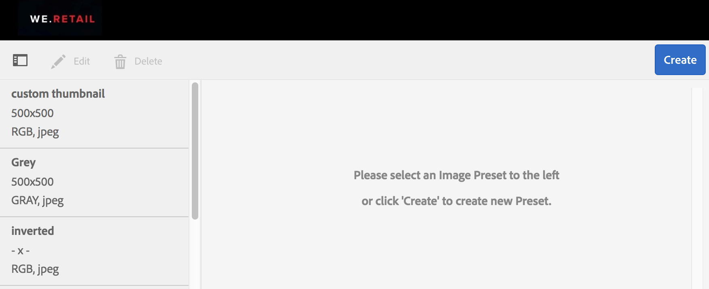

# 이미지 사전 설정 또는 동적 변환 적용 {#apply-image-presets-or-dynamic-renditions}

매크로와 마찬가지로 이미지 사전 설정은 이름 아래에 저장된 크기 및 형식 지정 명령의 사전 정의된 컬렉션입니다. 이미지 사전 설정을 사용하면 AEM Assets Brand Portal에서 다양한 크기, 형식 및 속성의 이미지를 동적으로 제공할 수 있습니다.

이미지 사전 설정은 미리 보고 다운로드할 수 있는 이미지의 동적 렌디션을 생성하는 데 사용됩니다. 이미지 및 해당 표현물을 미리 볼 때 관리자가 설정한 사양에 맞게 이미지를 다시 포맷하기 위한 사전 설정을 선택할 수 있습니다.

(*AEM 작성자 인스턴스가&#x200B;**Dynamic Media Hybrid 모드***에서 실행 중인 경우) Brand Portal에서 자산의 동적 변환을 보려면 Brand Portal에 게시하는 AEM 작성자 인스턴스에 해당 Pyramid Tiff 표현물이 있는지 확인하십시오. 자산을 게시하면 해당 PTIFF 표현물이 Brand Portal에도 게시됩니다.

>[!NOTE]
>
>이미지 및 해당 표현물을 다운로드할 때 기존 사전 설정 중에서 선택할 수 있는 옵션이 없습니다. 대신 사용자 지정 이미지 사전 설정의 속성을 지정할 수 있습니다. 자세한 내용은 [이미지를 다운로드할 때 이미지 사전 설정 적용](../using/brand-portal-image-presets.md#main-pars-text-1403412644)을 참조하십시오.

이미지 사전 설정을 만드는 동안 필요한 매개 변수에 대한 자세한 내용은 [이미지 사전 설정 관리](https://docs.adobe.com/docs/en/AEM/6-0/administer/integration/dynamic-media/image-presets.html)를 참조하십시오.

## 이미지 사전 설정 {#create-an-image-preset} 만들기

AEM 관리자는 자산 세부 사항 페이지에서 동적 변환으로 표시되는 이미지 사전 설정을 만들 수 있습니다. 처음부터 이미지 사전 설정을 만들거나 새 이름으로 기존 이미지 사전 설정을 저장할 수 있습니다. 이미지 사전 설정을 만들 때 이미지 전달용 크기와 서식 명령을 선택합니다. 이미지를 보기 위해 전달하면 선택한 명령에 따라 이미지가 최적화됩니다.

>[!NOTE]
>
>이미지의 동적 변환은 해당 Pyramid TIFF를 사용하여 만들어집니다. 자산에 Pyramid TIFF를 사용할 수 없는 경우 해당 자산에 대한 동적 변환을 Brand Portal에서 가져올 수 없습니다.
>
>AEM 작성자 인스턴스가 **Dynamic Media Hybrid 모드**&#x200B;에서 실행 중인 경우 이미지 자산의 Pyramid TIFF 표현물이 AEM 리포지토리에 만들어지고 저장됩니다.
>
>반면에 AEM 작성자 인스턴스가 **Dynamic Media Scene 7 모드**&#x200B;에서 실행 중인 경우 Scene 7 서버에 이미지 자산의 피라미드형 TIFF 표현물이 있습니다.
>
>이러한 자산이 brand portal에 게시되면 이미지 사전 설정이 적용되고 동적 변환이 표시됩니다.

1. 맨 위에 있는 AEM 도구 모음에서 Adobe 로고를 클릭하여 관리 도구에 액세스합니다.

1. 관리 도구 패널에서 **[!UICONTROL 이미지 사전 설정]**&#x200B;을 클릭합니다.

   

1. 이미지 사전 설정 페이지에서 **[!UICONTROL 만들기]**&#x200B;를 클릭합니다.

   

1. **[!UICONTROL 이미지 사전 설정 편집]** 페이지에서 이름을 포함하여 **[!UICONTROL 기본]** 및 **[!UICONTROL 고급]** 탭에 값을 적절하게 입력합니다. 옵션은 [이미지 사전 설정 옵션](https://docs.adobe.com/docs/en/AEM/6-0/administer/integration/dynamic-media/image-presets.html#Image%20preset%20options)에 요약되어 있습니다. 사전 설정은 왼쪽 창에 나타나며 다른 자산과 함께 즉시 사용할 수 있습니다.

   

   >[!NOTE]
   >
   >**[!UICONTROL 이미지 사전 설정 편집]** 페이지를 사용하여 기존 이미지 사전 설정의 속성을 편집할 수도 있습니다. 이미지 사전 설정을 편집하려면 이미지 사전 설정 페이지에서 이미지 사전 설정을 선택하고 **[!UICONTROL 편집]**&#x200B;을 클릭합니다.

1. **[!UICONTROL 저장]**&#x200B;을 클릭합니다. 이미지 사전 설정이 만들어지고 이미지 사전 설정 페이지에 표시됩니다.
1. 이미지 사전 설정을 삭제하려면 이미지 사전 설정 페이지에서 이미지 사전 설정을 선택하고 **[!UICONTROL 삭제]**&#x200B;를 클릭합니다. 확인 페이지에서 **[!UICONTROL 삭제]**&#x200B;를 클릭하여 삭제를 확인합니다. 이미지 사전 설정 페이지에서 이미지 사전 설정이 제거됩니다.

## 이미지를 미리 볼 때 이미지 사전 설정 적용 {#apply-image-presets-when-previewing-images}

이미지 및 해당 표현물을 미리 볼 때 기존 사전 설정 중에서 선택하여 관리자가 설정한 사양에 맞게 이미지를 재포맷합니다.

1. Brand Portal 인터페이스에서 이미지를 클릭하여 엽니다.
1. 왼쪽의 오버레이 아이콘을 클릭하고 **[!UICONTROL 표현물]**&#x200B;을 선택합니다.

   

1. **[!UICONTROL 표현물]** 목록에서 적절한 동적 표현물(예: **[!UICONTROL 축소판]**)을 선택합니다. 미리 보기 이미지는 선택한 표현물에 따라 렌더링됩니다.

   

## 이미지 {#apply-image-presets-when-downloading-images} 다운로드 시 이미지 사전 설정 적용

Brand Portal에서 이미지 및 해당 표현물을 다운로드할 때는 기존 이미지 사전 설정에서 선택할 수 없습니다. 그러나 이미지 형식을 다시 지정할 이미지 사전 설정 속성을 사용자 지정할 수 있습니다.

1. Brand Portal 인터페이스에서 다음 중 하나를 수행합니다.

   * 다운로드할 이미지 위에 포인터를 두면 사용 가능한 빠른 작업 축소판에서 **[!UICONTROL 다운로드]** 아이콘을 클릭합니다.

   

   * 다운로드할 이미지를 선택합니다. 맨 위의 도구 모음에서 **[!UICONTROL 다운로드]** 아이콘을 클릭합니다.

   

1. **[!UICONTROL 다운로드]** 대화 상자에서 해당 표현물이 있는 자산을 다운로드할지 여부에 따라 필요한 옵션을 선택합니다.

   

1. 자산의 동적 표현물을 다운로드하려면 **[!UICONTROL 동적 표현물]** 옵션을 선택합니다.
1. 다운로드 중에 이미지 및 해당 표현물을 동적으로 다시 포맷할 위치에 따라 이미지 사전 설정 속성을 사용자 지정합니다. 크기, 형식, 색상 공간, 해상도 및 이미지 수정자를 지정합니다.

   

1. **[!UICONTROL 다운로드]**&#x200B;를 클릭합니다. 사용자 지정 동적 표현물은 다운로드하도록 선택한 이미지 및 표현물과 함께 ZIP 파일로 다운로드됩니다. 그러나 단일 자산을 다운로드하면 zip 파일이 만들어지지 않으므로 다운로드가 빨라집니다.
