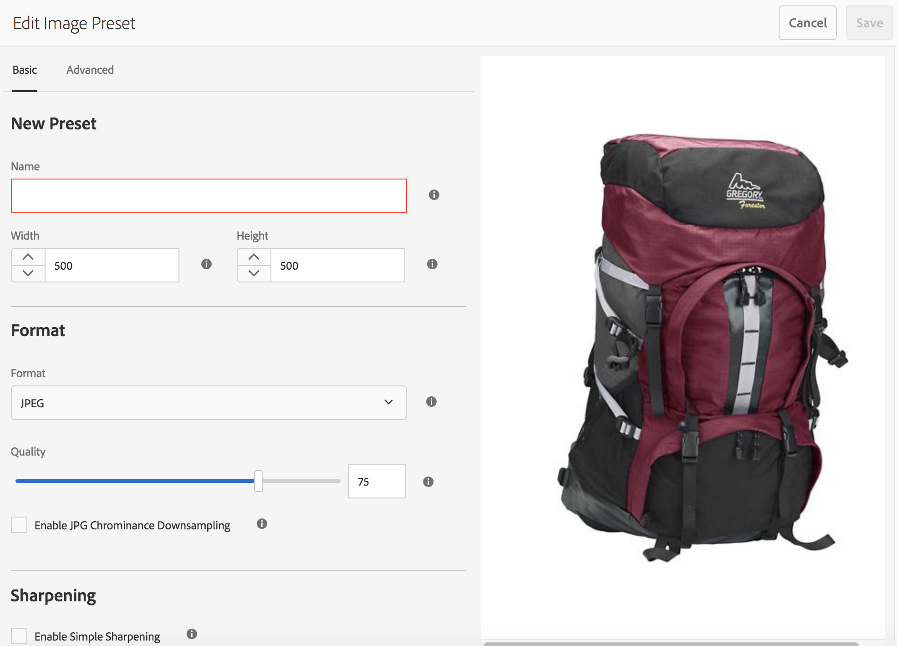
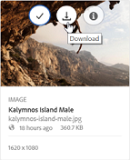
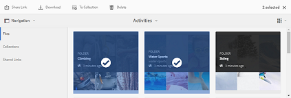

# 이미지 사전 설정 또는 동적 변환 적용 {#apply-image-presets-or-dynamic-renditions}

매크로와 마찬가지로 이미지 사전 설정은 이름 아래에 저장된 크기 조정 및 서식 지정 명령의 미리 정의된 컬렉션입니다. 이미지 사전 설정을 사용하면 Experience Manager Assets Brand Portal에서 다양한 크기, 형식 및 속성의 이미지를 동적으로 전달할 수 있습니다.

이미지 사전 설정은 미리 보고 다운로드할 수 있는 이미지의 동적 변환을 생성하는 데 사용됩니다. 이미지 및 해당 표현물을 미리 볼 때 사전 설정을 선택하여 관리자가 설정한 사양에 맞게 이미지의 형식을 변경할 수 있습니다.

(*Experience Manager Assets 작성자 인스턴스가에서 실행 중인 경우&#x200B;**Dynamic Media 하이브리드 모드***) Brand Portal에서 에셋의 동적 렌디션을 보려면 Brand Portal에 게시한 위치에서 Experience Manager Assets 작성자 인스턴스에 피라미드 tiff 렌디션이 있는지 확인하십시오. 에셋을 게시하면 해당 PTIFF 표현물도 Brand Portal에 게시됩니다.

>[!NOTE]
>
>이미지 및 해당 표현물을 다운로드할 때 기존 사전 설정에서 선택할 수 있는 옵션이 없습니다. 대신 사용자 지정 이미지 사전 설정의 속성을 지정할 수 있습니다. 자세한 내용은 [이미지 다운로드 시 이미지 사전 설정 적용](../using/brand-portal-image-presets.md#main-pars-text-1403412644).

이미지 사전 설정을 만드는 데 필요한 매개 변수에 대한 자세한 내용은 [이미지 사전 설정 관리](../using/brand-portal-image-presets.md).

## 이미지 사전 설정 만들기 {#create-an-image-preset}

Experience Manager Assets 관리자는 에셋 세부 정보 페이지에 동적 변환으로 표시되는 이미지 사전 설정을 만들 수 있습니다. 이미지 사전 설정을 처음부터 만들거나 기존 이미지 사전 설정을 새 이름으로 저장할 수 있습니다. 이미지 사전 설정을 만들 때 이미지 전달 크기 및 서식 명령을 선택합니다. 보기 위해 이미지가 전달되면 선택한 명령에 따라 이미지가 최적화됩니다.

>[!NOTE]
>
>이미지의 동적 변환은 피라미드 TIFF을 사용하여 만들어집니다. 자산에 피라미드 TIFF을 사용할 수 없는 경우 Brand Portal에서 해당 자산에 대한 동적 렌디션을 가져올 수 없습니다.
>
>Experience Manager Assets 작성자 인스턴스가에서 실행 중인 경우 **Dynamic Media 하이브리드 모드**&#x200B;그런 다음 이미지 에셋의 피라미드 TIFF 렌디션이 만들어지고 Experience Manager Assets 저장소에 저장됩니다.
>
>반면 Experience Manager Assets 작성자 인스턴스가에서 실행 중인 경우 **Dynamic Media Scene 7 모드**&#x200B;이미지 에셋의 피라미드 TIFF 렌디션은 Scene 7 서버에 있습니다.
>
>이러한 에셋이 Brand Portal에 게시되면 이미지 사전 설정이 적용되고 동적 변환이 표시됩니다.

1. 상단의 도구 모음에서 Experience Manager 로고를 클릭하여 관리 도구에 액세스합니다.

1. 관리 도구 패널에서 **[!UICONTROL 이미지 사전 설정]**.

   

1. 이미지 사전 설정 페이지에서 **[!UICONTROL 만들기]**.

   

1. 다음에서 **[!UICONTROL 이미지 사전 설정 편집]** 페이지를 만든 후 **[!UICONTROL 기본]** 및 **[!UICONTROL 고급]** 탭(이름 포함)을 적절히 선택합니다. Presets appear in the left pane and can be used on-the-fly with other assets.

   

   >[!NOTE]
   >
   >다음을 사용할 수도 있습니다 **[!UICONTROL 이미지 사전 설정 편집]** 기존 이미지 사전 설정의 속성을 편집할 페이지입니다. 이미지 사전 설정을 편집하려면 이미지 사전 설정 페이지에서 이미지 사전 설정을 선택한 다음 을 클릭합니다 **[!UICONTROL 편집]**.

1. **[!UICONTROL 저장]**&#x200B;을 클릭합니다. 이미지 사전 설정이 생성되어 이미지 사전 설정 페이지에 표시됩니다.
1. 이미지 사전 설정을 삭제하려면 이미지 사전 설정 페이지에서 이미지 사전 설정을 선택한 다음 를 클릭합니다 **[!UICONTROL 삭제]**. 확인 페이지에서 을 클릭합니다. **[!UICONTROL 삭제]** 삭제 확인. 이미지 사전 설정이 이미지 사전 설정 페이지에서 제거됩니다.

## 이미지 미리 보기 시 이미지 사전 설정 적용  {#apply-image-presets-when-previewing-images}

이미지 및 해당 표현물을 미리 볼 때 기존 사전 설정 중에서 선택하여 관리자가 설정한 사양에 맞게 이미지 서식을 다시 지정합니다.

1. Brand Portal 인터페이스에서 이미지를 클릭하여 엽니다.
1. 왼쪽의 오버레이 아이콘을 클릭하고 다음을 선택합니다. **[!UICONTROL 표현물]**.

   

1. 다음에서 **[!UICONTROL 표현물]** 목록에서 적절한 동적 렌디션을 선택합니다. 예를 들면 다음과 같습니다. **[!UICONTROL 축소판]**. 미리 보기 이미지는 선택한 표현물에 따라 렌더링됩니다.

   

## 이미지 다운로드 시 이미지 사전 설정 적용 {#apply-image-presets-when-downloading-images}

Brand Portal에서 이미지 및 해당 표현물을 다운로드할 때 기존 이미지 사전 설정에서 선택할 수 없습니다. 그러나 이미지 형식을 다시 지정할 이미지 사전 설정 속성을 사용자 지정할 수 있습니다.

1. Brand Portal 인터페이스에서 다음 중 하나를 수행합니다.

   * 다운로드할 이미지 위에 포인터를 놓습니다. 사용 가능한 빠른 작업 썸네일에서 **[!UICONTROL 다운로드]** 아이콘.

   

   * 다운로드할 이미지를 선택합니다. 맨 위에 있는 도구 모음에서 **[!UICONTROL 다운로드]** 아이콘.

   

1. 다음에서 **[!UICONTROL 다운로드]** 대화 상자에서 렌디션이 있는 에셋과 없는 에셋 다운로드 여부에 따라 필요한 옵션을 선택합니다.

   

1. 에셋의 동적 렌디션을 다운로드하려면 **[!UICONTROL 동적 렌디션]** 옵션을 선택합니다.
1. 다운로드하는 동안 이미지 및 해당 표현물의 형식을 동적으로 변경할 이미지 사전 설정 속성을 사용자 지정합니다. 크기, 형식, 색상 공간, 해상도 및 이미지 수정자를 지정합니다.

   

1. **[!UICONTROL 다운로드]**&#x200B;를 클릭합니다. 사용자 지정 동적 변환은 다운로드하도록 선택한 이미지 및 변환과 함께 ZIP 파일로 다운로드됩니다. 단, 하나의 에셋을 다운로드하는 경우에는 zip 파일이 만들어지지 않으므로 빠르게 다운로드할 수 있습니다.
