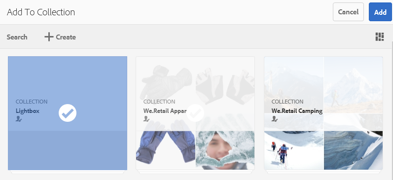
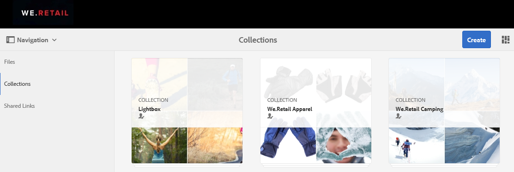

# Lightbox 컬렉션 관리 {#manage-the-lightbox-collection}

[!UICONTROL Lightbox] 는 자산에 손쉽게 액세스할 수 있는 특별한 유형의 컬렉션입니다. 각 사용자는 Brand [!UICONTROL Portal에] 처음 로그인할 때 자동으로 생성되는 전용 Lightbox를 가지고 있습니다. Lightbox [!UICONTROL 컬렉션을] 삭제할 수 없습니다.

## Lightbox에 에셋 추가 {#add-assets-to-lightbox}

Lightbox에 자산을 [!UICONTROL 추가하려면]다음을 수행합니다.

1. Lightbox에 추가할 자산의 위치로 [!UICONTROL 이동하고]자산을 선택합니다.

   

1. 맨 위의 도구 모음에서 컬렉션에 추가 아이콘을 클릭합니다.

   

1. 컬렉션에 **[!UICONTROL 추가 페이지에서]** 기본적으로 [!UICONTROL Lightbox] 컬렉션이 선택됩니다.

   **[!UICONTROL 추가를 클릭합니다]**. 선택한 자산이 Lightbox에 [!UICONTROL 추가됩니다].

   

1. Lightbox에 추가된 자산을 [!UICONTROL 검토하려면]왼쪽 **[!UICONTROL 레일에서]** 컬렉션을 클릭한 다음 Lightbox **[!UICONTROL 컬렉션을]** 클릭합니다.

   

   Lightbox에 추가된 [!UICONTROL 에셋이] Lightbox [!UICONTROL 페이지에] 나타납니다.

   

## Lightbox에서 에셋 제거 {#remove-assets-from-lightbox}

1. Lightbox에서 자산을 [!UICONTROL 검토하려면]왼쪽 **[!UICONTROL 레일에서]** 컬렉션을 클릭한 다음 Lightbox [!UICONTROL 컬렉션을] 클릭합니다.

   

1. 컬렉션에서 제거할 폴더를 선택한 다음 맨 위의 도구 **[!UICONTROL 모음에서]** 제거를 클릭합니다.

   

1. 경고 메시지 상자에서 제거를 클릭하여 **[!UICONTROL 제거를]** 확인합니다.

Lightbox 컬렉션에서 폴더가 [!UICONTROL 삭제됩니다] .
