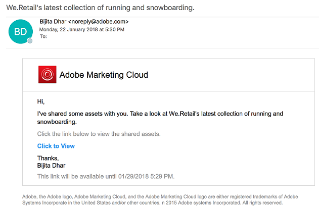

# 자산을 링크로 공유 {#share-assets-as-a-link}

AEM 자산 브랜드 포털 관리자는 여러 자산의 링크를 승인된 내부 사용자 및 파트너 및 공급자를 포함한 외부 개체와 공유할 수 있습니다. 편집자는 공유된 자산만 보고 공유할 수 있습니다.

링크를 통해 자산을 공유하면 수신자가 자산에 액세스하기 위해 브랜드 포털에 로그인할 필요가 없으므로 외부 당사자가 링크를 사용할 수 있습니다.

링크 공유 액세스는 편집자 및 관리자로 제한됩니다. 자세한 내용은 사용자, 그룹 및 사용자 역할 [관리를](../using/brand-portal-adding-users.md#manage-user-roles)참조하십시오.

>[!NOTE]
>
>브랜드 포털에서 링크 공유 기능을 사용하면 최대 5 GB의 ZIP 다운로드가 허용됩니다.

자산을 링크로 공유하려면 다음 단계를 수행하십시오.

1. 왼쪽에 있는 오버레이 아이콘을 클릭하고 **[!UICONTROL 내비게이션을]**&#x200B;선택합니다.

   

2. 왼쪽의 [사이드레일] 에서 **[!UICONTROL [파일]** ] 를 클릭하여 폴더 또는 이미지를 공유합니다. 컬렉션을 공유하려면 **[!UICONTROL 컬렉션을]**&#x200B;클릭합니다.

   

3. 링크로 공유할 폴더 또는 컬렉션을 선택합니다.

   

4. 상단에 있는 도구 모음에서 링크 **[!UICONTROL 공유]** 아이콘을 클릭합니다.

   **[!UICONTROL 링크 공유]** 대화 상자가 나타납니다.

   

   >[!NOTE]
   >
   >링크 **[!UICONTROL 공유]** 필드에 자동으로 생성된 자산 링크가 표시됩니다. 이 링크의 기본 만료 시간은 7 일입니다. 링크를 복사하여 사용자와 별도로 공유하거나 **[!UICONTROL 링크 공유]** 대화 상자에서 공유할 수 있습니다.

5. 이메일 주소 상자에 링크를 공유할 사용자의 이메일 ID를 입력합니다. 여러 사용자와 링크를 공유할 수 있습니다.

   사용자가 조직의 구성원인 경우 드롭다운 목록에 나타나는 제안에서 해당 이메일 ID를 선택합니다. 사용자가 외부 사용자일 경우 전체 이메일 ID를 입력하고 **[!UICONTROL Enter]**&#x200B;키를 누릅니다. 이메일 ID가 사용자 목록에 추가됩니다.

   

6. **[!UICONTROL 제목]** 상자에 공유할 자산의 제목을 입력합니다.
7. **[!UICONTROL 메시지]** 상자에 필요한 경우 메시지를 입력합니다.
8. **[!UICONTROL 만료]** 필드에서 날짜 선택기를 사용하여 링크의 만료 날짜 및 시간을 지정합니다. 기본적으로 만료 날짜는 링크를 공유하는 날짜로부터 7 일로 설정됩니다.

   링크를 통해 공유된 자산은 **[!UICONTROL 만료]** 필드에 지정된 날짜 및 시간을 지나서 만료됩니다. 브랜드 포털의 사용자 역할에 따라 허용되는 활동의 동작 및 만료된 자산의 동작에 대한 자세한 내용은 자산의 디지털 권한 [관리를 참조하십시오](../using/manage-digital-rights-of-assets.md#asset-expiration).

9. **[!UICONTROL 공유를 클릭합니다]**. 링크가 사용자와 공유되었음을 확인하는 메시지가 나타납니다. 사용자는 링크가 포함된 이메일을 수신합니다.

   

   >[!NOTE]
   >
   >관리자는 [브랜딩](../using/brand-portal-branding.md) 기능을 사용하여 로고, 설명 및 바닥글을 사용자 정의하는 이메일 메시지를 사용자 정의할 수 있습니다.

## 공유 링크에서 에셋 다운로드 {#download-assets-from-shared-links}

공유 에셋을 보려면 이메일의 링크를 클릭합니다. AEM 링크 공유 페이지가 열립니다.

공유 에셋을 다운로드하려면 다음을 수행하십시오.

1. 자산을 클릭한 다음 도구 모음에서 **[!UICONTROL 다운로드]** 아이콘을 클릭합니다.

   

   >[!NOTE]
   >
   >현재 파일 형식에 따라 특정 자산에 대한 미리 보기 및 썸네일만 생성할 수 있습니다. 지원되는 파일 형식에 대한 자세한 내용은 자산 포맷에 대한 [미리 보기 및 축소판 지원을 참조하십시오](#preview-thumbnail-support).

   >[!NOTE]
   >
   >다운로드하는 자산에 라이선스가 부여된 에셋이 포함되어 있는 경우에도 **[!UICONTROL 저작권 관리]** 페이지로 리디렉션됩니다. 이 페이지에서 라이선스가 부여된 에셋을 선택하고 **[!UICONTROL 동의를]**&#x200B;클릭한 다음 **[!UICONTROL 다운로드를]**&#x200B;클릭합니다. 동의하지 않으면 라이선스가 없는 에셋만 다운로드됩니다.\
   >라이센스 보호된 자산은에 첨부된 [라이센스 계약을](https://helpx.adobe.com/experience-manager/6-5/assets/using/drm.html#DigitalRightsManagementinAssets) 가지며, 이는 자산의 [메타데이터 속성을](https://helpx.adobe.com/experience-manager/6-5/assets/using/drm.html#DigitalRightsManagementinAssets) 설정하여 수행됩니다 [!DNL AEM Assets].

   

   [!UICONTROL 다운로드] 대화 상자가 나타납니다.
   

   * 링크로 공유된 에셋 파일의 다운로드를 가속화하려면 [다운로드 가속 **[!UICONTROL 활성화]** ] 옵션을 선택하고 마법사를 [따릅니다](../using/accelerated-download.md#download-workflow-using-file-accelerator). 브랜드 포털에서 에셋을 신속하게 다운로드할 수 있는 방법에 대한 자세한 내용은 [브랜드 포털에서 다운로드 시간을 단축하기 위한 가이드를](../using/accelerated-download.md)참조하십시오.
[! Uicontrol
2. 공유 링크에서 에셋 외에 자산의 표현물을 다운로드하려면 **[!UICONTROL [표현물]** ] 옵션을 선택합니다. When you do so, **exclude system rendition]** 옵션이 기본적으로 선택되어 나타납니다. 이렇게 하면 기본 표현물을 승인된 자산 또는 사용자 정의 표현물과 함께 다운로드할 수 없습니다.

   하지만 자동 생성된 표현물이 사용자 지정 표현물과 함께 다운로드되도록 하려면 시스템 변환 **[!UICONTROL 제외]** 옵션을 선택 취소합니다.

   >[!NOTE]
   >
   >링크를 링크로 공유한 사용자가 원래 변환에 액세스할 수 있는 [권한이 없으면 공유 링크를 사용하여 원래 표현물을 다운로드할](../using/brand-portal-adding-users.md#manage-group-roles-and-privileges)수 없습니다.

   

3. 다운로드를 탭/클릭합니다 ****. 자산 (및 선택한 경우 변환) 는 로컬 폴더에 zip 파일로 다운로드됩니다. 단, 변환 없이 단일 자산이 다운로드되는 경우 ZIP 파일이 만들어지므로 빠른 다운로드가 보장됩니다.

>[!NOTE]
>
>브랜드 포털은 파일 크기당 5 GB 보다 큰 에셋을 다운로드하는 것을 제한합니다.

## 자산 포맷에 대한 미리 보기 및 축소판 지원 {#preview-thumbnail-support}

다음 매트릭스에는 브랜드 포털이 썸네일 및 미리 보기를 지원하는 에셋 형식이 나와 있습니다.

| 에셋 형식 | 썸네일 지원 | 미리 보기 지원 |
|--------------|-------------------|-----------------|
| PNG | ✓ | ✓ |
| GIF | ✓ | ✓ |
| TIFF | ✓ | ✕ |
| JPEG | ✓ | ✓ |
| BMP | ✓ | ✕ |
| PNM * | NA | NA |
| pgm * | NA | NA |
| PBM * | NA | NA |
| PPM * | NA | NA |
| PSD | ✓ | ✕ |
| EPS | NA | ✕ |
| DNG | ✓ | ✕ |
| PICT | ✓ | ✕ |
| PSB * | ✓ | ✕ |
| jpg | ✓ | ✓ |
| AI | ✓ | ✕ |
| DOC | ✕ | ✕ |
| DOCX | ✕ | ✕ |
| odt * | ✕ | ✕ |
| PDF | ✓ | ✕ |
| HTML | ✕ | ✕ |
| RTF | ✕ | ✕ |
| TXT | ✓ | ✕ |
| XLS | ✕ | ✕ |
| XLSX | ✕ | ✕ |
| ODS | ✕ | ✕ |
| PPT | ✓ | ✕ |
| PPTX | ✕ | ✕ |
| ODP | ✕ | ✕ |
| INDD | ✓ | ✕ |
| PS | ✕ | ✕ |
| QXP | ✕ | ✕ |
| EPUB | ✓ | ✕ |
| AAC | ✕ | ✕ |
| MIDI | ✕ | ✕ |
| 3GP | ✕ | ✕ |
| MP3 | ✕ | ✕ |
| MP4 | ✕ | ✕ |
| OGA | ✕ | ✕ |
| OGG | ✕ | ✕ |
| RA | ✕ | ✕ |
| WAV | ✕ | ✕ |
| WMA | ✕ | ✕ |
| DVI | ✕ | ✕ |
| FLV | ✕ | ✕ |
| M4V | ✕ | ✕ |
| MPG | ✕ | ✕ |
| OGV | ✕ | ✕ |
| MOV | ✕ | ✕ |
| wmv | ✕ | ✕ |
| SWF | ✕ | ✕ |
| TGZ | NA | ✕ |
| JAR | ✓ | ✕ |
| RAR | NA | ✕ |
| TAR | NA | ✕ |
| ZIP | ✓ | ✕ |

다음 범례는 행렬에 사용된 심볼을 설명합니다.

| 기호 | 의미 |
|---|---|
| ✓ | 이 파일 형식은 이 기능을 지원합니다. |
| ✕ | 이 파일 형식은 이 기능을 지원하지 않습니다. |
| NA | 이 기능은 이 파일 형식에는 적용되지 않습니다. |
| * | 이 기능은 AEM 작성자 인스턴스에서는 이 파일 형식에 대한 Add-on 지원을 필요로 하지만 브랜드 포털에 에셋을 게시한 후에는 브랜드 포털에 추가해야 합니다. |

## 링크로 공유된 에셋 공유 취소 {#unshare-assets-shared-as-a-link}

이전에 공유 에셋을 링크로 공유하려면 다음을 수행하십시오.

1. 링크로 공유한 자산을 보려면 왼쪽의 오버레이 아이콘을 클릭하고 **[!UICONTROL [탐색]**] 를 선택합니다.

   

2. Siderail에서 **[!UICONTROL 공유 링크를 클릭합니다]**.

   

3. 표시된 목록에서 공유한 링크를 검토합니다.
4. 목록에서 링크를 공유하려면 해당 링크를 선택하고 링크 항목 옆에 있는 저장소 아이콘을 클릭하거나 상단에 있는 도구 모음에서 **[!UICONTROL 공유 취소]** 아이콘을 클릭합니다.

   

   >[!NOTE]
   >
   >공유 링크의 표시는 사용자별로 다릅니다. 이 기능은 임차인의 모든 사용자가 공유하는 모든 링크를 표시하지 않습니다.

5. 경고 메시지 상자에서 **[!UICONTROL [계속]** ] 를 클릭하여 [공유 취소] 를 확인합니다. 링크 항목이 공유 링크 목록에서 제거됩니다.
