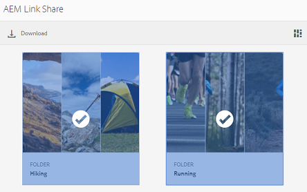

# 링크로 자산 공유 {#share-assets-as-a-link}

AEM Assets 브랜드 포털 관리자는 파트너 및 벤더를 비롯한 승인된 내부 사용자 및 외부 엔티티와 여러 자산의 링크를 공유할 수 있습니다. 편집자는 공유된 에셋만 보고 공유할 수 있습니다.

수신자가 자산에 액세스하기 위해 브랜드 포털에 로그인하지 않아도 되기 때문에 링크를 통해 자산을 공유하는 것은 외부 당사자가 사용할 수 있도록 하는 편리한 방법입니다.

링크 공유 액세스는 편집자와 관리자로 제한됩니다. 자세한 내용은 사용자, 그룹 [및 사용자 역할 관리를 참조하십시오](../using/brand-portal-adding-users.md#manage-user-roles).

>[!NOTE]
>
>브랜드 포털의 링크 공유 기능을 사용하여 최대 5GB의 zip 다운로드를 사용할 수 있습니다.

자산을 링크로 공유하려면 다음 단계를 따르십시오.

1. 왼쪽의 오버레이 아이콘을 클릭하고 [탐색]을 **[!UICONTROL 선택합니다]**.

   

1. 왼쪽에 있는 사이더에서 **[!UICONTROL 파일]** 을 클릭하여 폴더나 이미지를 공유합니다. 컬렉션을 공유하려면 **[!UICONTROL 컬렉션을 클릭합니다]**.

   

1. 링크로 공유할 폴더 또는 컬렉션을 선택합니다.

   

1. 상단에 있는 도구 모음에서 링크 **[!UICONTROL 공유]** 아이콘을 클릭합니다.

   [ **[!UICONTROL 링크 공유]** ] 대화 상자가 나타납니다.

   

   >[!NOTE]
   >
   >링크 **[!UICONTROL 공유]** 필드는 자동으로 생성된 자산 링크를 표시합니다. 이 링크의 기본 만료 시간은 7일입니다. 링크를 복사하고 사용자와 별도로 공유하거나 **[!UICONTROL 링크 공유]** 대화 상자에서 공유할 수 있습니다.

1. 이메일 주소 상자에 링크를 공유할 사용자의 이메일 ID를 입력합니다. 여러 사용자와 링크를 공유할 수 있습니다.

   사용자가 조직의 구성원인 경우 드롭다운 목록에 표시되는 제안에서 이메일 ID를 선택합니다. 사용자가 외부에 있는 경우 전체 이메일 ID를 입력하고 Enter 키를 **[!UICONTROL 누릅니다]**. 이메일 ID가 사용자 목록에 추가됩니다.

   

1. 제목 **** 상자에 공유할 자산의 제목을 입력합니다.
1. 메시지 **** 상자에 필요한 경우 메시지를 입력합니다.
1. 만료 **** 필드에서 날짜 선택기를 사용하여 링크에 대한 만료 날짜 및 시간을 지정합니다. 기본적으로 만료 날짜는 링크를 공유하는 날짜로부터 7일로 설정됩니다.

   링크를 통해 공유된 자산은 만료 필드에 지정된 날짜 및 시간을 지난 후 **[!UICONTROL 만료됩니다]** . 만료된 자산의 동작 및 브랜드 포털의 사용자 역할에 따른 허용 가능한 활동의 변경에 대한 자세한 내용은 자산의 디지털 권한 [관리를 참조하십시오](../using/manage-digital-rights-of-assets.md#asset-expiration).

1. **[!UICONTROL 공유]**&#x200B;를 클릭합니다. 링크가 사용자와 공유되었다는 메시지가 나타납니다. 사용자는 링크가 포함된 이메일을 수신합니다.

   

   >[!NOTE]
   >
   >관리자는 로고, 설명 및 바닥글을 사용자 정의하는 [브랜딩](../using/brand-portal-branding.md) 기능을 포함하는 이메일 메시지를 사용자 정의할 수 있습니다.

## 공유 링크에서 에셋 다운로드 {#download-assets-from-shared-links}

공유 자산을 보려면 이메일의 링크를 클릭합니다. AEM 링크 공유 페이지가 열립니다.

공유 자산을 다운로드하려면

1. 자산을 클릭한 다음 도구 모음에서 **[!UICONTROL 다운로드]** 아이콘을 클릭합니다.

   

   >[!NOTE]
   >
   >현재 파일 포맷에 따라 특정 자산에 대해서만 미리 보기와 축소판을 생성할 수 있습니다. 지원되는 파일 포맷에 대한 자세한 내용은 에셋 포맷 [에 대한 미리 보기 및 축소판 지원을 참조하십시오](#preview-thumbnail-support).

   >[!NOTE]
   >
   >다운로드하려는 에셋에 라이센스 자산도 포함되어 있는 경우 **[!UICONTROL 저작권 관리]** 페이지로 리디렉션됩니다. 이 페이지에서 라이센스 자산을 선택하고 **[!UICONTROL 동의]**&#x200B;를 클릭한 다음 **[!UICONTROL 다운로드를 클릭합니다]**. 동의하지 않으면 라이센스가 없는 자산만 다운로드됩니다.\
   >라이선스로 보호된 에셋에는 [라이선스 계약이](https://helpx.adobe.com/experience-manager/6-5/assets/using/drm.html#DigitalRightsManagementinAssets) 첨부되어 [있으므로 에셋의](https://helpx.adobe.com/experience-manager/6-5/assets/using/drm.html#DigitalRightsManagementinAssets) 메타데이터 속성을 [!DNL AEM Assets]에서 설정할 수 있습니다.

   

   다운로드 **[!UICONTROL 대화]** 상자가 나타납니다.

   

   * 링크로 공유된 에셋 파일의 다운로드 속도를 높이려면 다운로드 가속 **** 사용 옵션을 선택하고 마법사를 [따릅니다](../using/accelerated-download.md#download-workflow-using-file-accelerator). 브랜드 포털에서 에셋을 빠르게 다운로드하는 방법에 대한 자세한 내용은 [가이드 를 통해 브랜드 포털에서 다운로드를 가속화할 수 있습니다](../using/accelerated-download.md).

1. 공유 링크의 자산 외에 자산의 표현물을 다운로드하려면 **[!UICONTROL 변환 옵션을]** 선택합니다. 이렇게 하면 기본적으로 선택된 시스템 **[!UICONTROL 표현물]** 제외 옵션이 나타납니다. 이렇게 하면 승인된 자산이나 사용자 정의 표현물과 함께 즉시 사용 가능한 표현물을 다운로드할 수 없습니다.

   그러나 자동 생성된 변환이 사용자 정의 표현물과 함께 다운로드되도록 하려면 [시스템 표현물 **[!UICONTROL 제외] 옵션을 선택 취소합니다]** .

   >[!NOTE]
   >
   >링크로 자산을 공유한 사용자가 관리자가 원래 변환에 액세스할 수 있도록 [권한을 부여하지 않은 경우 원본 변환은 공유 링크를 사용하여 다운로드되지 않습니다](../using/brand-portal-adding-users.md#manage-group-roles-and-privileges).

   

1. 다운로드를 탭/ **[!UICONTROL 클릭합니다]**. 자산(및 선택한 표현물)은 로컬 폴더에 ZIP 파일로 다운로드됩니다. 그러나 변환 없이 단일 자산을 다운로드하면 zip 파일이 만들어지지 않으므로 다운로드 시간이 빨라집니다.

>[!NOTE]
>
>브랜드 포털에서는 파일 크기인 5GB보다 큰 다운로드 에셋을 제한합니다.

## 에셋 포맷에 대한 미리 보기 및 축소판 지원 {#preview-thumbnail-support}

다음 매트릭스는 브랜드 포털에서 축소판 및 미리 보기를 지원하는 자산 형식을 나열합니다.

| 자산 형식 | 축소판 지원 | 미리 보기 지원 |
|--------------|-------------------|-----------------|
| PNG | ✓ | ✓ |
| GIF | ✓ | ✓ |
| TIFF | ✓ | ✕ |
| JPEG | ✓ | ✓ |
| BMP | ✓ | ✕ |
| PNM* | NA | NA |
| PGM* | NA | NA |
| PBM* | NA | NA |
| PPM* | NA | NA |
| PSD | ✓ | ✕ |
| EPS | NA | ✕ |
| DNG | ✓ | ✕ |
| PICT | ✓ | ✕ |
| PSB* | ✓ | ✕ |
| JPG | ✓ | ✓ |
| AI | ✓ | ✕ |
| DOC | ✕ | ✕ |
| DOCX | ✕ | ✕ |
| ODT* | ✕ | ✕ |
| PDF | ✓ | ✕ |
| HTML | ✕ | ✕ |
| RTF | ✕ | ✕ |
| TXT | ✓ | ✕ |
| XLS | ✕ | ✕ |
| XLSX | ✕ | ✕ |
| ODS | ✕ | ✕ |
| PPT | ✓ | ✕ |
| PPTX | ✕ | ✕ |
| ODP | ✕ | ✕ |
| INDD | ✓ | ✕ |
| PS | ✕ | ✕ |
| QXP | ✕ | ✕ |
| EPUB | ✓ | ✕ |
| AAC | ✕ | ✕ |
| MIDI | ✕ | ✕ |
| 3GP | ✕ | ✕ |
| MP3 | ✕ | ✕ |
| MP4 | ✕ | ✕ |
| OGA | ✕ | ✕ |
| OGG | ✕ | ✕ |
| RA | ✕ | ✕ |
| WAV | ✕ | ✕ |
| WMA | ✕ | ✕ |
| DVI | ✕ | ✕ |
| FLV | ✕ | ✕ |
| M4V | ✕ | ✕ |
| MPG | ✕ | ✕ |
| OGV | ✕ | ✕ |
| MOV | ✕ | ✕ |
| WMV | ✕ | ✕ |
| SWF | ✕ | ✕ |
| TGZ | NA | ✕ |
| JAR | ✓ | ✕ |
| RAR | NA | ✕ |
| TAR | NA | ✕ |
| ZIP | ✓ | ✕ |

다음 범례에서는 행렬에 사용된 기호에 대해 설명합니다.

| 심볼 | 의미 |
|---|---|
| ✓ | 이 파일 형식은 이 기능을 지원합니다. |
| ✕ | 이 파일 형식은 이 기능을 지원하지 않습니다. |
| NA | 이 기능은 이 파일 형식에는 적용되지 않습니다. |
| * | 이 기능을 사용하려면 AEM 작성자 인스턴스의 이 파일 형식에 대한 추가 기능이 필요하지만 에셋이 브랜드 포털에 게시된 후에는 브랜드 포털에서는 지원되지 않습니다 |

## 링크로 공유된 에셋 공유 취소 {#unshare-assets-shared-as-a-link}

이전에 공유한 자산을 링크로 공유하지 않으려면 다음을 수행합니다.

1. 링크로 공유한 자산을 보려면 왼쪽의 오버레이 아이콘을 클릭하고 **[!UICONTROL 탐색을 선택합니다]**.

   

1. 사이드레이에서 공유 링크 **[!UICONTROL 를 클릭합니다]**.

   

1. 표시된 목록에서 공유한 링크를 검토합니다.
1. 목록에서 링크를 공유하지 않으려면 링크를 선택하고 링크 항목 옆에 있는 저장소 아이콘 또는 맨 위에 있는 도구 모음에서 **[!UICONTROL 공유]** 취소 아이콘을 클릭합니다.

   

   >[!NOTE]
   >
   >공유 링크의 표시는 사용자별로 다릅니다. 이 기능은 테넌트의 모든 사용자가 공유하는 모든 링크를 표시하지 않습니다.

1. 경고 메시지 상자에서 **[!UICONTROL 계속을]** 클릭하여 공유 해제를 확인합니다. 링크 항목이 공유 링크 목록에서 제거됩니다.
