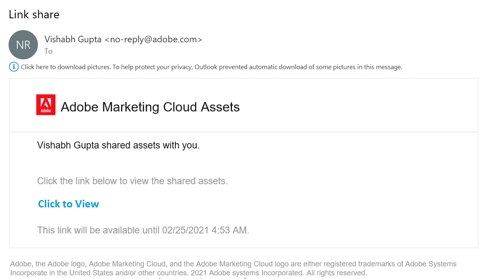
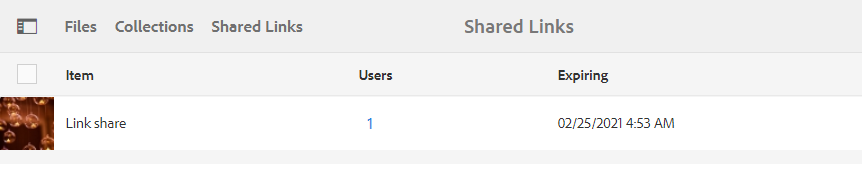

# 링크로 자산 공유 {#share-assets-as-a-link}

Adobe Experience Manager Assets Brand Portal 관리자는 파트너 및 공급업체 등 승인된 내부 사용자 및 외부 엔티티와 여러 자산의 링크를 공유할 수 있습니다. 편집자는 공유된 자산만 보고 공유할 수 있습니다.

링크를 통해 자산을 공유하는 것은 수신자가 Brand Portal에 로그인하여 자산에 액세스할 필요가 없으므로 외부 당사자가 자산을 사용할 수 있도록 하는 편리한 방법입니다.

<!-- Link sharing access is restricted to editors and administrators. 
-->

자세한 내용은 [사용자, 그룹 및 사용자 역할 관리](../using/brand-portal-adding-users.md#manage-user-roles)를 참조하십시오.

>[!NOTE]
>
>Brand Portal의 링크 공유 기능을 사용하면 최대 5GB의 zip 다운로드가 허용됩니다.

다음은 링크로 자산을 공유하는 단계입니다.

1. Brand Portal 테넌트에 로그인합니다. 기본적으로 게시된 모든 자산 및 폴더가 포함된 **[!UICONTROL 파일]** 보기가 열립니다.

1. 공유할 자산 또는 폴더를 선택하거나 **[!UICONTROL 컬렉션]** 보기로 이동하여 만든 컬렉션을 공유하십시오.

   

1. 맨 위의 도구 모음에서 **[!UICONTROL 링크 공유]** 아이콘을 클릭합니다.

   **[!UICONTROL 링크 공유]** 대화 상자가 나타납니다.

   

   * 이메일 주소 상자에 링크를 공유할 사용자의 이메일 ID를 입력합니다. 여러 사용자와 링크를 공유할 수 있습니다. 사용자가 조직의 구성원인 경우 드롭다운 목록에 나타나는 제안에서 이메일 ID를 선택합니다. 사용자가 외부 사용자라면 전체 이메일 ID를 입력하고 **[!UICONTROL Enter]** 키를 누릅니다.이메일 ID가 사용자 목록에 추가됩니다.

      

   * **[!UICONTROL 제목]** 상자에 공유할 자산의 제목을 입력합니다.
   * **[!UICONTROL 메시지]** 상자에 필요한 경우 메시지를 입력합니다.
   * **[!UICONTROL 만료]** 필드에서 날짜 선택기를 사용하여 링크에 대한 만료 날짜 및 시간을 지정합니다. 기본적으로 만료 날짜는 링크를 공유하는 날짜부터 7일로 설정됩니다.
   * 수신자가 원본 변환을 다운로드할 수 있도록 하려면 **[!UICONTROL 원본 파일 다운로드 허용]** 확인란을 활성화합니다.

   링크를 통해 공유된 자산은 **[!UICONTROL 만료]** 필드에 지정된 날짜 및 시간을 교차하면 만료됩니다. 만료된 자산의 동작 및 Brand Portal의 사용자 역할에 따라 허용되는 활동의 변경에 대한 자세한 내용은 [자산의 디지털 권한 관리](../using/manage-digital-rights-of-assets.md#asset-expiration)를 참조하십시오.

   >[!NOTE]
   >
   >링크의 기본 만료 시간은 7일입니다. 링크는 **[!UICONTROL 링크 공유]** 대화 상자를 사용하여 사용자에게 이메일로 전송되어야 하며, 링크를 별도로 복사하고 공유하지 마십시오.

1. **[!UICONTROL 공유]**&#x200B;를 클릭합니다. 링크가 사용자와 공유되는지 확인하는 메시지가 나타납니다. 사용자는 공유 링크가 포함된 이메일을 받게 됩니다.

   

   >[!NOTE]
   >
   >관리자는 [브랜딩](../using/brand-portal-branding.md) 기능을 사용하여 로고, 설명 및 바닥글을 사용자 지정하는 것을 포함하는 이메일 메시지를 사용자 지정할 수 있습니다.

## 공유 링크에서 자산 다운로드 {#download-assets-from-shared-links}

이메일의 링크를 클릭하여 공유 자산에 액세스합니다. AEM 링크 공유 페이지가 열립니다.

공유 자산을 다운로드하려면 다음을 수행하십시오.

1. 자산 또는 폴더를 클릭한 다음 도구 모음에서 **[!UICONTROL 다운로드]** 아이콘을 클릭합니다.

   

   >[!NOTE]
   >
   >현재 파일 형식에 따라 특정 자산에 대해서만 미리 보기 및 축소판을 생성할 수 있습니다. 지원되는 파일 형식에 대한 자세한 내용은 [자산 형식에 대한 미리 보기 및 축소판 지원](#preview-thumbnail-support)을 참조하십시오.

1. **[!UICONTROL 다운로드]** 대화 상자가 나타납니다.

   

1. 기본적으로 **[!UICONTROL 빠른 다운로드]** 설정은 **[!UICONTROL 다운로드 설정]**&#x200B;에서 활성화됩니다. 따라서 IBM Aspera Connect를 사용하여 확인 상자가 계속 다운로드됩니다.

   **[!UICONTROL 빠른 다운로드]**&#x200B;를 계속 사용하려면 **[!UICONTROL 허용]**&#x200B;을 클릭하십시오.

   선택한 모든 표현물은 각 자산에 대한 별도의 폴더를 포함하는 zip 폴더에서 다운로드됩니다.

   >[!NOTE]
   >
   >폴더, 컬렉션 또는 20개 이상의 자산을 다운로드하도록 선택한 경우, **[!UICONTROL 다운로드]** 대화 상자를 건너뛰고 동적 변환을 제외한 사용자가 액세스할 수 있는 모든 자산 표현물을 zip 폴더에 다운로드합니다. zip 폴더 내의 각 자산에 대해 별도의 폴더가 만들어집니다.

   >[!NOTE]
   >
   >링크로 자산을 공유한 사용자가 원래 표현물](../using/brand-portal-adding-users.md#manage-group-roles-and-privileges)에 액세스할 수 있도록 관리자가 인증하지 않은 경우 공유 링크를 사용하여 원래 표현물이 다운로드되지 않습니다.[

>[!NOTE]
>
>Brand Portal에서는 파일 크기보다 5GB보다 큰 자산의 다운로드를 제한합니다.

<!--
1. The **[!UICONTROL Download]** dialog box appears.

   

    * To speed up the download of asset files shared as the link, select **[!UICONTROL Enable download acceleration]** option and [follow the wizard](../using/accelerated-download.md#download-workflow-using-file-accelerator). To know more about the fast download of assets on Brand Portal refer [Guide to accelerate downloads from Brand Portal](../using/accelerated-download.md).
    
1. To download the renditions of assets in addition to the assets from the shared link, select **[!UICONTROL Rendition(s)]** option. When you do so, **[!UICONTROL Exclude System Renditions]** option appears that is selected by default. This prevents the download of out-of-the-box renditions along with approved assets or their custom renditions.

   However, to allow auto-generated renditions to download along with custom renditions, deselect the **[!UICONTROL Exclude System Renditions]** option.

   >[!NOTE]
   >
   >Original renditions are not downloaded using the shared link if the user who shared the assets as a link is not [authorized by the administrator to have access to the original renditions](../using/brand-portal-adding-users.md#manage-group-roles-and-privileges).

   

1. Click **[!UICONTROL Download]**. The assets (and renditions if selected) are downloaded as a ZIP file to your local folder. However, no zip file is created if a single asset is downloaded without any of the renditions, thereby ensuring speedy download.

>[!NOTE]
>
>Brand Portal restricts downloading assets larger than 5GB per file size.
-->

## 자산 형식 {#preview-thumbnail-support}에 대한 미리 보기 및 축소판 지원

다음 매트릭스에서는 Brand Portal에서 축소판 및 미리 보기를 지원하는 자산 형식을 나열합니다.

| 자산 형식 | 축소판 지원 | 미리 보기 지원 |
|--------------|-------------------|-----------------|
| PNG | ✓ | ✓ |
| GIF | ✓ | ✓ |
| TIFF | ✓ | ✕ |
| JPEG | ✓ | ✓ |
| BMP | ✓ | ✕ |
| PNM* | NA | NA |
| PGM* | NA | NA |
| PBM* | NA | NA |
| PPM* | NA | NA |
| PSD | ✓ | ✕ |
| EPS | NA | ✕ |
| DNG | ✓ | ✕ |
| PICT | ✓ | ✕ |
| PSB* | ✓ | ✕ |
| JPG | ✓ | ✓ |
| AI | ✓ | ✕ |
| DOC | ✕ | ✕ |
| DOCX | ✕ | ✕ |
| ODT* | ✕ | ✕ |
| PDF | ✓ | ✕ |
| HTML | ✕ | ✕ |
| RTF | ✕ | ✕ |
| TXT | ✓ | ✕ |
| XLS | ✕ | ✕ |
| XLSX | ✕ | ✕ |
| ODS | ✕ | ✕ |
| PPT | ✓ | ✕ |
| PPTX | ✕ | ✕ |
| ODP | ✕ | ✕ |
| INDD | ✓ | ✕ |
| PS | ✕ | ✕ |
| QXP | ✕ | ✕ |
| EPUB | ✓ | ✕ |
| AAC | ✕ | ✕ |
| MIDI | ✕ | ✕ |
| 3GP | ✕ | ✕ |
| MP3 | ✕ | ✕ |
| MP4 | ✕ | ✕ |
| OGA | ✕ | ✕ |
| OGG | ✕ | ✕ |
| RA | ✕ | ✕ |
| WAV | ✕ | ✕ |
| WMA | ✕ | ✕ |
| DVI | ✕ | ✕ |
| FLV | ✕ | ✕ |
| M4V | ✕ | ✕ |
| MPG | ✕ | ✕ |
| OGV | ✕ | ✕ |
| 이동 | ✕ | ✕ |
| WMV | ✕ | ✕ |
| SWF | ✕ | ✕ |
| TGZ | NA | ✕ |
| JAR | ✓ | ✕ |
| RAR | NA | ✕ |
| TAR | NA | ✕ |
| ZIP | ✓ | ✕ |

다음 범례에서는 매트릭스에 사용된 기호를 설명합니다.

| 기호 | 의미 |
|---|---|
| ✓ | 이 파일 형식은 이 기능을 지원합니다 |
| ✕ | 이 파일 형식은 이 기능을 지원하지 않습니다 |
| NA | 이 기능은 이 파일 형식에는 적용할 수 없습니다 |
| * | 이 기능을 사용하려면 AEM 작성자 인스턴스에서 이 파일 형식에 대한 추가 지원이 필요하지만, Brand Portal에 자산을 게시한 후에는 Brand Portal에서 지원하지 않습니다 |

## 링크로 공유된 자산 공유 해제 {#unshare-assets-shared-as-a-link}

이전에 공유한 자산을 링크로 공유 해제하려면 다음을 수행하십시오.

1. Brand Portal에 로그인하면 기본적으로 **[!UICONTROL 파일]** 보기가 열립니다. 링크로 공유한 자산을 보려면 **[!UICONTROL 공유 링크]** 보기로 이동합니다.

1. 표시된 목록에서 공유한 링크를 검토합니다.

   

1. 목록에서 링크 공유를 취소하려면 링크를 선택하고 맨 위의 도구 모음에서 **[!UICONTROL 공유 안 함]** 아이콘을 클릭합니다.

   

   >[!NOTE]
   >
   >공유 링크의 표시는 사용자별로 다릅니다. 이 기능은 테넌트의 모든 사용자가 공유하는 모든 링크를 표시하지 않습니다.

1. 경고 메시지 상자에서 **[!UICONTROL 계속]**&#x200B;을 클릭하여 공유 해제를 확인합니다. 링크의 항목이 공유 링크 목록에서 제거됩니다.
