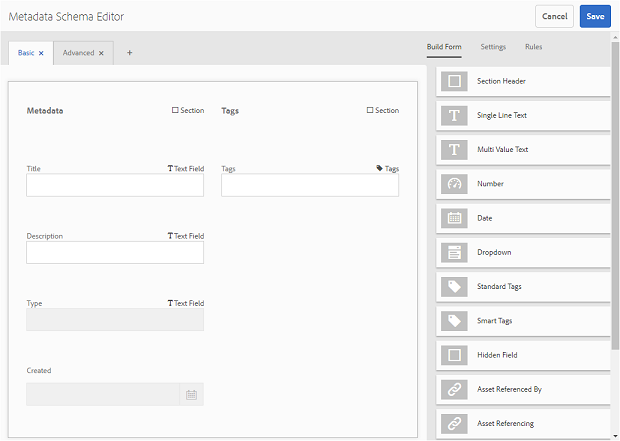
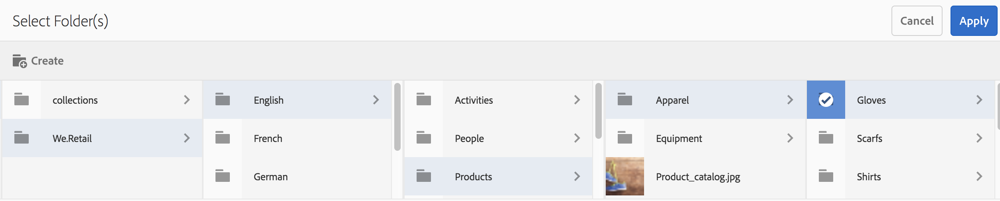

# 메타데이터 스키마 양식 사용 {#use-the-metadata-schema-form}

메타데이터 스키마는 속성 페이지의 레이아웃과 특정 스키마를 사용하는 자산에 대해 표시되는 메타데이터 속성을 설명합니다. 자산에 적용하는 스키마는 속성 페이지에 표시되는 메타데이터 필드를 결정합니다.

각 **[!UICONTROL 자산의]**속성 페이지에는 자산의 MIME 유형에 따라 기본 메타데이터 속성이 포함됩니다. 관리자는 메타데이터 스키마 편집기를 사용하여 기존 스키마를 수정하거나 사용자 정의 메타데이터 스키마를 추가할 수 있습니다. AEM Assets 브랜드 포털에서는 다양한 MIME 유형의 자산에 대한 기본 양식을 제공합니다. 그러나 이러한 자산에 대한 사용자 정의 양식을 추가할 수도 있습니다.

## 메타데이터 스키마 양식 추가 {#add-a-metadata-schema-form}

새 메타데이터 스키마 양식을 만들려면 다음을 수행합니다.

1. 맨 위의 AEM 도구 모음에서 Adobe 로고를 클릭하여 관리 도구에 액세스합니다.

   

1. 관리 도구 패널에서 메타데이터 스키마를 **[!UICONTROL 클릭합니다]**.

   

1. 메타데이터 스키마 **[!UICONTROL 양식]**페이지에서 만들기를**[!UICONTROL &#x200B;클릭합니다]**.

   

1. 스키마 **[!UICONTROL 양식 만들기]**대화 상자에서 스키마 양식의 제목을 지정한 다음 만들기를 클릭하여**[!UICONTROL &#x200B;양식]** 작성 프로세스를 완료합니다.

   

## Edit a metadata schema form {#edit-a-metadata-schema-form}

새로 추가되거나 기존 메타데이터 스키마 양식을 편집할 수 있습니다. 메타데이터 스키마 양식에는 탭 내의 탭 및 양식 항목을 포함하여 상위 항목에서 파생된 콘텐트가 포함됩니다. 이러한 양식 항목을 메타데이터 노드 내의 필드에 매핑하거나 구성할 수 있습니다.

새 탭 또는 양식 항목을 메타데이터 스키마 양식에 추가할 수 있습니다. 파생된 탭 및 양식 항목(상위에서)은 잠긴 상태입니다. 하위 수준에서 변경할 수 없습니다.

메타데이터 스키마 양식을 편집하려면 다음을 수행합니다.

1. 맨 위의 AEM 도구 모음에서 Adobe 로고를 클릭하여 관리 도구에 액세스합니다.

   

1. 관리 도구 패널에서 메타데이터 스키마를 **[!UICONTROL 클릭합니다]**.
1. [ **[!UICONTROL 메타데이터 스키마 양식]**] 페이지에서 스키마 양식을 선택하여 해당 속성을 편집합니다(예:**[!UICONTROL &#x200B;컬렉션]**).

   

   >[!NOTE]
   >
   >편집되지 않은 템플릿은 템플릿 앞에 잠금 기호를 표시합니다. 템플릿을 사용자 지정하면 템플릿이 사라지기 전에 잠금 기호가 사라집니다.

1. 맨 위의 도구 모음에서 편집을 **[!UICONTROL 클릭합니다]**.

   메타데이터 **[!UICONTROL 스키마 편집기]**페이지가**[!UICONTROL &#x200B;열리고]** 기본 **[!UICONTROL 탭이]**왼쪽에 열리고양식 작성탭이오른쪽에 열립니다.

1. 메타데이터 **[!UICONTROL 스키마 편집기]**페이지에서**[!UICONTROL &#x200B;양식 작성]** 탭의 구성 요소 유형 목록에서 하나 이상의 구성 요소를 **[!UICONTROL 기본]**설정**[!UICONTROL &#x200B;탭에 드래그하여 자산의 속성]** 페이지를 사용자정의합니다.

   

1. 구성 요소를 구성하려면 구성 요소를 선택하고 설정 탭에서 해당 속성을 **[!UICONTROL 수정합니다]**.

### 양식 작성 탭의 구성 요소 {#components-in-the-build-form-tab}

양식 **[!UICONTROL 작성]**탭에는 스키마 양식에서 사용할 수 있는 항목이 나열됩니다. [**[!UICONTROL &#x200B;설정]** ] 탭에서는 [양식 작성] 탭에서 선택하는 각 항목의 **[!UICONTROL 속성을 제공합니다]**. 다음 표에는 양식 작성 탭에서 사용할 수 있는 양식**[!UICONTROL &#x200B;항목이]** 나열됩니다.

| 구성 요소 이름 | 설명 |
|---------------------|--------------------------------------------------------------------------------------------------------------------------------------------------------------------------------------------------------------------------------------------------------------------------------------------|
| **[!UICONTROL 섹션 머리글]** | 공통 구성 요소 목록에 대한 섹션 머리글을 추가합니다. |
| **[!UICONTROL 한 줄 텍스트]** | 단일 행 텍스트 속성을 추가합니다. 문자열로 저장됩니다. |
| **[!UICONTROL 다중 값 텍스트]** | 다중 값 텍스트 속성을 추가합니다. 문자열 배열로 저장됩니다. |
| **[!UICONTROL 번호]** | 숫자 구성 요소를 추가합니다. |
| **[!UICONTROL 날짜]** | 날짜 구성 요소를 추가합니다. |
| **[!UICONTROL 드롭다운]** | 드롭다운 목록을 추가합니다. |
| **[!UICONTROL 표준 태그]** | 태그 추가. **** 참고:예를 들어, 관리자가 AEM에서 메타데이터 스키마 양식을 게시하는 `/etc/tags/mac/<tenant_id>/<custom_tag_namespace>`경우 경로 값을 변경해야 할 수 있습니다. 여기서 경로에는 임차인 정보가 포함되어 있지 않습니다 `/etc/tags/<custom_tag_namespace>`. |
| **[!UICONTROL 스마트 태그]** | AEM 스마트 태그 Add-on을 구매하고 구성한 경우 태그가 자동으로 검색됩니다. |
| **[!UICONTROL 숨김 필드]** | 숨김 필드를 추가합니다. 에셋을 저장할 때 POST 매개 변수로 전송됩니다. |
| **[!UICONTROL 자산 참조자]** | 이 구성 요소를 추가하여 자산에서 참조하는 자산 목록을 봅니다. |
| **[!UICONTROL 자산 참조]** | 자산을 참조하는 자산 목록을 표시하는 데 추가합니다. |
| **[!UICONTROL 자산 등급]** | AEM Assets에서 추가한 자산의 평균 등급은 브랜드 포털에 게시되기 전에 측정됩니다. |
| **[!UICONTROL 상황에 맞는 메타데이터]** | 자산의 속성 페이지에서 다른 메타데이터 탭의 표시를 제어하기 위해 추가합니다. |

>[!NOTE]
>
>제품 **[!UICONTROL 참조가]**작동하지 않으므로 사용하지 마십시오.

#### 메타데이터 구성 요소 편집 {#edit-the-metadata-component}

양식에서 메타데이터 구성 요소의 속성을 편집하려면 구성 요소를 클릭하고 설정 **[!UICONTROL 탭에서 해당 속성을]**편집합니다.

* **[!UICONTROL 필드 레이블]**:자산의 속성 페이지에 표시되는 메타데이터 속성의 이름입니다.

* **[!UICONTROL 속성에 매핑]**:이 속성의 값은 자산 노드가 CRX 저장소에 저장된 자산 노드의 상대 경로/이름을 제공합니다. &quot;로 시작합니다**./**&quot;를 참조하십시오.

다음은 이 속성에 유효한 값입니다.

— `./jcr:content/metadata/dc:title`:자산의 메타데이터 노드에 값을 속성으로 [!UICONTROL `dc:title`]저장합니다.

— `./jcr:created`:자산의 노드에 jcr 속성을 표시합니다. 보기 속성에 이러한 속성을 구성하는 경우 해당 속성이 보호되므로 편집 비활성화 상태로 표시하는 것이 좋습니다. 그렇지 않으면 자산의 속성을 저장할 때 &quot;자산을 수정하지 못했습니다&quot;라는 오류가 발생합니다.

* **[!UICONTROL 자리 표시자]**:이 속성을 사용하여 사용자에게 메타데이터 속성과 관련된 정보를 제공합니다.
* **[!UICONTROL 필수]**:이 속성을 사용하여 속성 페이지에서 메타데이터 속성을 필수로 표시합니다.
* **[!UICONTROL 편집 비활성화]**:이 속성을 사용하여 속성 페이지에서 메타데이터 속성을 편집할 수 없게 만듭니다.
* **[!UICONTROL 읽기 전용으로]**빈 필드 표시:값이 없더라도 속성 페이지에 메타데이터 속성을 표시하려면 이 속성을 표시합니다. 기본적으로 메타데이터 속성에 값이 없으면 속성 페이지에 나열되지 않습니다.
* **[!UICONTROL 설명]**:이 속성을 사용하여 메타데이터 구성 요소에 대한 간단한 설명을 추가합니다.
* **[!UICONTROL 삭제 아이콘]**:스키마 양식에서 구성 요소를 삭제하려면 이 아이콘을 클릭합니다.

>[!NOTE]
>
>모든 메타데이터 필드는 자산의 메타데이터 편집기 양식에서 읽기 전용입니다. 자산을 브랜드 포털에 게시하려면 먼저 자산의 메타데이터를 AEM 자산에서 편집해야 합니다.

#### 스키마 양식의 탭 추가 또는 삭제 {#add-or-delete-a-tab-in-the-schema-form}

기본 스키마 양식에는 기본 **[!UICONTROL 및]**고급**[!UICONTROL &#x200B;탭이]** 포함되어 있습니다. 스키마 편집기를 사용하여 탭을 추가하거나 삭제할 수 있습니다.

* 스키마 양식에 새 탭을 추가하려면 **[!UICONTROL +]**를 클릭합니다. 기본적으로 새 탭의 이름은 &quot;Unnamed-1&quot;입니다. 설정 탭에서 이름을 수정할**[!UICONTROL &#x200B;수]** 있습니다.

* 탭을 삭제하려면 **[!UICONTROL x]**를 클릭합니다. Click**[!UICONTROL  Save]** to save the changes.

## 폴더에 메타데이터 스키마 적용 {#apply-a-metadata-schema-to-a-folder}

브랜드 포털을 통해 메타데이터 스키마를 사용자 정의하고 제어할 수 있으므로 자산의 **[!UICONTROL 속성]**페이지에 사용자가 표시하도록 선택한 특정 정보만 표시됩니다. 속성 페이지에 표시되는 메타데이터를**[!UICONTROL &#x200B;제어하려면]** 메타데이터 스키마 양식에서 필요한 메타데이터를 제거하고 특정 폴더에 적용합니다.

메타데이터 스키마 양식을 폴더에 적용하려면 다음을 수행합니다.

1. 맨 위의 AEM 도구 모음에서 Adobe 로고를 클릭하여 관리 도구에 액세스합니다.

   

1. 관리 도구 패널에서 메타데이터 스키마를 **[!UICONTROL 클릭합니다]**.

1. [ **[!UICONTROL 메타데이터 스키마 양식]**] 페이지에서 자산에 적용할 스키마 양식(예:**[!UICONTROL &#x200B;의류]**)을 선택합니다.

   

1. 맨 위의 도구 모음에서 폴더에 **[!UICONTROL 적용을 클릭합니다]**.

1. 폴더 **[!UICONTROL 선택]**페이지에서**[!UICONTROL &#x200B;옷]** 메타데이터 스키마를 적용할 폴더(예: Gloves)로 **[!UICONTROL 이동합니다]**.

   

1. 적용을 **[!UICONTROL 클릭하여]**메타데이터 스키마 양식을 폴더에 적용합니다.

   Clothing **[!UICONTROL 메타데이터 스키마 양식에서 사용할 수 있는 메타데이터는 Gloves]**폴더에**[!UICONTROL &#x200B;적용되며]** 폴더의 **[!UICONTROL 속성]**페이지에 표시됩니다.

   

>[!NOTE]
>
>중첩 스키마를 포함하는 스키마를 비디오 파일이 들어 있는 폴더에 적용하는 경우 비디오 파일에 대한 메타데이터 속성이 제대로 렌더링되지 않을 수 있습니다. 메타데이터 속성이 올바르게 렌더링되도록 하려면 중첩된 스키마를 제거하고 상위 스키마만 폴더에 적용합니다.

## Delete a metadata schema form {#delete-a-metadata-schema-form}

브랜드 포털을 사용하면 사용자 정의 스키마 양식만 삭제할 수 있습니다. 기본 스키마 양식/템플릿을 삭제할 수 없습니다. 그러나 이러한 양식에서 사용자 정의 변경 사항을 삭제할 수 있습니다.

양식을 삭제하려면 양식을 선택하고 삭제 **[!UICONTROL 아이콘을 클릭합니다]**.

>[!NOTE]
>
>기본 양식의 사용자 지정 변경 내용을 삭제하면 **[!UICONTROL 메타데이터]**스키마 인터페이스의 양식 이름 앞에 잠금 기호가 다시 표시되어 양식이 기본 상태로 되돌려짐을 나타냅니다.

## MIME 형식에 대한 스키마 양식 {#schema-forms-for-mime-types}

### MIME 유형에 대한 새 양식 추가 {#adding-new-forms-for-mime-types}

기본 양식 외에도 다양한 MIME 유형의 자산에 대한 사용자 정의 양식을 추가하거나 적절한 양식 유형 아래에 새 양식을 만들 수 있습니다. 예를 들어 **[!UICONTROL 이미지/png]**하위 유형에 대한 새 템플릿을 추가하려면 &quot;이미지&quot; 양식 아래에 양식을 만듭니다. 스키마 양식의 제목은 하위 유형 이름입니다. 이 경우 제목은 &quot;png&quot;입니다.

#### 다양한 MIME 유형에 대한 기존 스키마 템플릿 사용 {#using-an-existing-schema-template-for-various-mime-types}

다른 MIME 유형에 기존 템플릿을 사용할 수 있습니다. 예를 들어 MIME 형식 **이미지/png** 자산의 경우 **이미지/jpeg**&#x200B;양식을 사용합니다.

이 경우 CRX [!UICONTROL `/etc/dam/metadataeditor/mimetypemappings`] 저장소에서 새 노드를 만듭니다. 노드의 이름을 지정하고 다음 속성을 정의합니다.

| **이름** | **유형** | **값** |
|---|---|---|
| exposedmimetype | 문자열 | image/jpeg |
| mimetypes | String[] | image/png |

* **exposedmimetype**:매핑할 기존 양식의 이름
* **mimetypes**:exposedmimetype 속성에 정의된 양식을 사용하는 **MIME** 형식 목록

브랜드 포털은 다음 MIME 유형 및 스키마 양식을 매핑합니다.

| **스키마 양식** | **MIME 유형** |
|---|---|
| image/jpeg | image/pjpeg |
| image/tiff | image/x-tiff |
| application/pdf | application/postscript |
| application/x-ImageSet | Multipart/Related; type=application/x-ImageSet |
| application/x-SpinSet | Multipart/Related; type=application/x-SpinSet |
| application/x-mixedMediaSet | Multipart/Related; type=application/x-MixedMediaSet |
| video/quicktime | video/x-quicktime |
| video/mpeg4 | video/mp4 |
| 비디오/avi | video/avi, video/msvideo, video/x-msvideo |
| video/wmv | video/x-ms-wmv |
| 비디오/flv | video/x-flv |

다음은 기본 메타데이터 속성 목록입니다.

* jcr:content/metadata/cq:tags
* jcr:content/metadata/dc:format
* jcr:content/metadata/dam:status
* jcr:content/metadata/videoCodec
* jcr:content/metadata/audioCodec
* jcr:content/metadata/dc:title
* jcr:content/metadata/dc:description
* jcr:content/metadata/xmpMM:InstanceID
* jcr:content/metadata/xmpMM:DocumentID
* jcr:content/metadata/dam:sha1
* jcr:content/metadata/dam:solutionContext
* jcr:content/metadata/video비트 전송률
* jcr:content/metadata/audio비트 전송률
* jcr:content/usages/usedBy
* jcr:content/jcr:lastModified
* jcr:content/metadata/prism:expirationDate
* jcr:content/onTime
* jcr:content/offTime
* jcr:content/metadata/dam:size
* jcr:content/metadata/tiff:ImageWidth
* jcr:content/metadata/tiff:ImageLength
