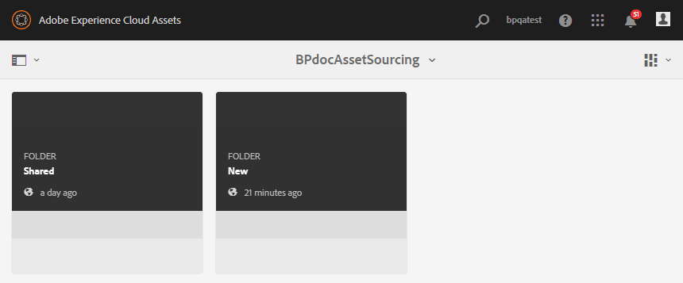
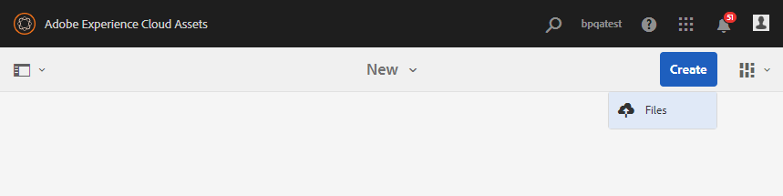

# AEM Assets {#using-asset-souring-in-bp}에 기여도 폴더 게시

적절한 권한이 있는 브랜드 포털 사용자는 여러 자산 또는 여러 자산이 포함된 폴더를 기여도 폴더에 업로드할 수 있습니다. 그러나 브랜드 포털 사용자는 **NEW** 폴더에만 자산을 업로드할 수 있습니다. **SHARED** 폴더는 기여도에 대한 새 자산을 만드는 동안 브랜드 포털 사용자가 사용할 수 있는 기본 자산(참조 콘텐츠)의 배포를 위한 것입니다.

기여도 폴더에 액세스할 권한이 있는 브랜드 포털 사용자는 다음 활동을 수행할 수 있습니다.

* [자산 요구 사항 다운로드](#download-asset-requirements)
* [기여도 폴더에 새 자산 업로드](#uplad-new-assets-to-contribution-folder)
* [AEM Assets에 기여도 폴더 게시](#publish-contribution-folder-to-aem)

## 자산 요구 사항 다운로드 {#download-asset-requirements}

브랜드 포털 사용자는 AEM 사용자가 기여도 폴더를 공유할 때마다 이메일/펄스 알림을 자동으로 수신하여 **SHARED** 폴더에서 개요(자산 요구 사항) 문서를 다운로드할 수 있을 뿐만 아니라 기본 자산(참조 콘텐츠)을 다운로드할 수 있습니다.

브랜드 포털 사용자는 다음 활동을 수행하여 자산 요구 사항을 다운로드합니다.

* **다운로드 요약**:자산 유형, 목적, 지원되는 형식, 최대 자산 크기 등과 같은 자산 관련 정보가 포함된 기여도 폴더에 첨부된 요약(자산 요구 문서)을 다운로드합니다.
* **기본 자산 다운로드**:필요한 자산 유형을 이해하는 데 사용할 수 있는 기본 자산을 다운로드합니다. 브랜드 포털 사용자는 이러한 자산을 참조로 사용하여 기여도를 위한 새 자산을 만들 수 있습니다.

브랜드 포털 대시보드에는 새로 공유된 기여도 폴더와 함께 브랜드 포털 사용자에게 허용된 모든 기존 폴더가 반영됩니다. 이 예에서 브랜드 포털 사용자는 새로 만든 기여도 폴더에만 액세스할 수 있고 다른 기존 폴더는 사용자와 공유되지 않습니다.

**자산 요구 사항을 다운로드하려면**

1. 브랜드 포털 인스턴스에 로그인합니다.
1. 브랜드 포털 대시보드에서 기여도 폴더를 선택합니다.
1. **[!UICONTROL 속성]** 을 클릭합니다. 자산 기여도 폴더 세부 사항을 표시하는 속성 창이 열립니다.
   
1. 로컬 컴퓨터에서 자산 요구 사항 문서를 다운로드하려면 **[!UICONTROL Download Brief]** 를 클릭합니다.
   
1. 브랜드 포털 대시보드로 돌아갑니다.
1. 기여도 폴더를 열려면 을 클릭하십시오. 기여도 폴더 내에 **[!UICONTROL SHARED]** 및 **[!UICONTROL NEW]**&#x200B;라는 두 개의 하위 폴더가 표시됩니다. SHARED 폴더에는 관리자가 공유한 모든 기준 자산(참조 콘텐트)이 포함됩니다.
1. 로컬 컴퓨터의 모든 기준 에셋이 포함된 **[!UICONTROL SHARED]** 폴더를 다운로드할 수 있습니다.
또는 **[!UICONTROL SHARED]** 폴더를 열고 **다운로드** 아이콘 을 클릭하여 개별 파일/폴더를 다운로드할 수 있습니다.
   

간략한(자산 요구 사항 문서)으로 이동하여 자산 요구 사항을 이해하려면 기준 자산을 참조하십시오. 이제 기여도를 위해 새 자산을 만들고 기여도 폴더에 업로드할 수 있습니다.

## 기여도 폴더 {#uplad-new-assets-to-contribution-folder}에 자산 업로드

자산 요구 사항을 살펴본 후 브랜드 포털 사용자는 기여도를 위한 새 자산을 만들고 기여도 폴더 내의 NEW 폴더에 업로드할 수 있습니다.

>[!NOTE]
>
>브랜드 포털 사용자는 NEW 폴더에만 자산을 업로드할 수 있습니다.
>
>모든 브랜드 포털 테넌트에 대한 최대 업로드 제한은 모든 기여도 폴더에 누적 적용되는 **10** GB입니다.

>[!NOTE]
>
>기여도를 위해 다른 브랜드 포털 사용자가 사용할 수 있도록 기여도 폴더를 AEM Assets에 게시한 후 업로드 공간을 해제하는 것이 좋습니다.
>
>브랜드 포털 임차인의 업로드 한도를 **10** GB 이상으로 늘려야 하는 경우, 요구 사항을 지정하려면 Adobe 지원 센터에 문의하십시오.

**새 자산을 업로드하려면:**

1. 브랜드 포털 인스턴스에 로그인합니다.
브랜드 포털 대시보드에는 새로 공유된 기여도 폴더와 함께 브랜드 포털 사용자에게 허용된 모든 기존 폴더가 반영됩니다.

1. 기여도 폴더를 선택하고 을 클릭하여 엽니다. 기여도 폴더에는 **[!UICONTROL SHARED]** 및 **[!UICONTROL NEW]**&#x200B;라는 2개의 하위 폴더가 있습니다.

1. **[!UICONTROL NEW]** 폴더를 클릭합니다.

   

1. **[!UICONTROL 만들기]** > **[!UICONTROL 파일]**&#x200B;을 클릭하여 여러 에셋이 포함된 개별 파일 또는 폴더(.zip)를 업로드합니다.

   

1. 자산(파일 또는 폴더)을 찾아 **[!UICONTROL NEW]** 폴더로 업로드합니다.

   

모든 자산 또는 폴더를 NEW 폴더에 업로드한 후 기여도 폴더를 AEM Assets에 게시합니다.

## AEM Assets {#publish-contribution-folder-to-aem}에 기여도 폴더 게시

브랜드 포털 사용자는 AEM 작성자 인스턴스에 액세스할 필요 없이 기여도 폴더를 AEM Assets에 게시할 수 있습니다.

자산 요구 사항을 검토하고 기여도 폴더 내의 **NEW** 폴더에 새로 만든 자산을 업로드합니다.

**기여도 폴더를 게시하려면:**

1. 브랜드 포털 인스턴스에 로그인합니다.

1. 브랜드 포털 대시보드에서 기여도 폴더를 선택합니다.
1. **[!UICONTROL AEM에 게시]**&#x200B;를 클릭합니다.

   

   

게시 워크플로우의 다른 단계에서 브랜드 포털 사용자 및 관리자에게 이메일/펄스 알림이 전송됩니다.
1. **큐에**  있음 - 게시 워크플로가 브랜드 포털에서 트리거될 때 브랜드 포털 사용자 및 브랜드 포털 관리자에게 알림이 전송됩니다.

1. **완료**  - 기여도 폴더가 AEM Assets에 성공적으로 게시되면 브랜드 포털 사용자 및 브랜드 포털 관리자에게 알림이 전송됩니다.

새로 만든 에셋을 AEM Assets에 게시하면 브랜드 포털 사용자는 NEW 폴더에서 해당 에셋을 삭제할 수 있습니다. 반면에 브랜드 포털 관리자는 NEW 및 SHARED 폴더 모두에서 자산을 삭제할 수 있습니다.

기여도 폴더를 만드는 목적이 달성되면 브랜드 포털 관리자는 기여도 폴더를 삭제하여 다른 사용자의 업로드 공간을 해제할 수 있습니다.

**게시 작업 상태**

관리자가 브랜드 포털에서 AEM Assets으로 게시한 자산 기여도 폴더의 상태를 보기 위해 활용할 수 있는 2개의 보고서가 있습니다.

* 브랜드 포털에서 **[!UICONTROL 도구]** > **[!UICONTROL 자산 기여도 상태]**&#x200B;로 이동합니다. 이 보고서는 게시 워크플로우의 다른 단계에서 모든 게시 작업의 상태를 반영합니다.

   

* AEM Assets 작성자 인스턴스에서 **[!UICONTROL 도구]** > **[!UICONTROL 작업]**&#x200B;으로 이동합니다. 이 보고서는 모든 게시 작업의 최종 상태(성공 또는 오류)를 반영합니다.

   

>[!NOTE]
>
>Cloud Service의 AEM Assets 사용자 인터페이스는 약간의 차이가 있을 수 있지만 워크플로우는 변경되지 않습니다.

