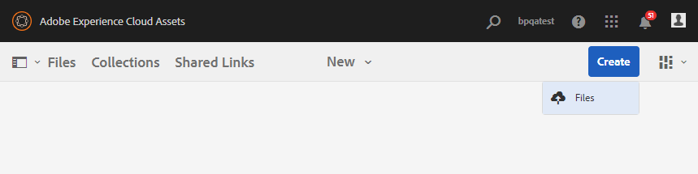
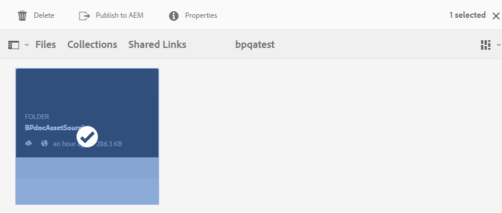

# 기여도 폴더를 AEM Assets {#using-asset-souring-in-bp}에 게시

적절한 권한이 있는 Brand Portal 사용자는 여러 자산 또는 여러 자산이 들어 있는 폴더를 기여도 폴더에 업로드할 수 있습니다. 그러나 Brand Portal 사용자는 **NEW** 폴더에만 자산을 업로드할 수 있습니다. **공유** 폴더는 기여도를 위한 새 자산을 만드는 동안 Brand Portal 사용자가 사용할 수 있는 기준 자산(참조 컨텐츠)의 배포를 위한 것입니다.

기여도 폴더에 액세스할 수 있는 권한이 있는 Brand Portal 사용자는 다음 활동을 수행할 수 있습니다.

* [자산 요구 사항 다운로드](#download-asset-requirements)
* [기여도 폴더에 새 자산 업로드](#uplad-new-assets-to-contribution-folder)
* [AEM Assets에 기여도 폴더 게시](#publish-contribution-folder-to-aem)

## 자산 요구 사항 다운로드 {#download-asset-requirements}

Brand Portal 사용자는 기여 폴더가 AEM 사용자가 공유될 때마다 자동으로 이메일/펄스 알림을 수신하여, **SHARED** 폴더에서 간단한(자산 요구 사항) 문서를 다운로드하고 기본 자산(참조 컨텐츠)을 다운로드하여 자산 요구 사항을 이해할 수 있습니다.

Brand Portal 사용자는 다음 활동을 수행하여 자산 요구 사항을 다운로드합니다.

* **다운로드 개요**:자산 유형, 목적, 지원되는 형식, 최대 자산 크기 등과 같은 자산 관련 정보가 있는 기여도 폴더에 첨부된 간략한(자산 요구 문서)을 다운로드합니다.
* **기준 자산 다운로드**:필요한 자산 유형을 이해하는 데 사용할 수 있는 기준 자산을 다운로드합니다. Brand Portal 사용자는 이러한 자산을 참조로 사용하여 기여할 새 자산을 만들 수 있습니다.

Brand Portal 대시보드는 새 공유 기여도 폴더와 함께 Brand Portal 사용자에게 허용된 모든 기존 폴더를 반영합니다. 이 예에서 Brand Portal 사용자는 새로 만든 기여도 폴더에만 액세스할 수 있고, 다른 기존 폴더는 사용자와 공유되지 않습니다.

**자산 요구 사항을 다운로드하려면 다음을 수행하십시오.**

1. Brand Portal 인스턴스에 로그인합니다.
1. Brand Portal 대시보드에서 기여 폴더를 선택합니다.
1. **[!UICONTROL 속성]**&#x200B;을 클릭합니다. 기여도 폴더 세부 사항이 포함된 속성 창이 열립니다.

   

   

1. **[!UICONTROL Download Brief]** 옵션을 클릭하여 로컬 시스템에서 자산 요구 사항 문서를 다운로드합니다.

   

1. Brand Portal 대시보드로 돌아갑니다.
1. 기여도 폴더를 열려면 클릭하십시오. 기여도 폴더에&#x200B;**[!UICONTROL SHARED]** 및 **[!UICONTROL NEW]** 하위 폴더가 표시됩니다. 공유 폴더에는 관리자가 공유하는 모든 기준 자산(참조 컨텐츠)이 포함되어 있습니다.
1. 로컬 컴퓨터의 모든 기준 자산을 포함하는 **[!UICONTROL SHARED]** 폴더를 다운로드할 수 있습니다.
또는 **[!UICONTROL SHARED]** 폴더를 열고 **다운로드** 아이콘을 클릭하여 개별 파일/폴더를 다운로드할 수 있습니다.

   

   

간략한(자산 요구 사항 문서)을 살펴보고 자산 요구 사항을 이해하려면 기준 자산을 참조하십시오. 이제 기여도를 위한 새 자산을 만들고 기여도 폴더에 업로드할 수 있습니다.

## 자산을 기여도 폴더에 업로드 {#uplad-new-assets-to-contribution-folder}

자산 요구 사항을 거친 후 Brand Portal 사용자는 기여할 새 자산을 만들고 기여도 폴더 내의 NEW 폴더에 업로드할 수 있습니다.

>[!NOTE]
>
>Brand Portal 사용자는 NEW 폴더에만 자산을 업로드할 수 있습니다.
>
>모든 Brand Portal 임차인에 대한 최대 업로드 제한은 모든 기여도 폴더에 누적 적용되는 **10** GB입니다.

>[!NOTE]
>
>기여도 폴더를 AEM Assets에 게시한 후 업로드 공간을 해제하여 다른 Brand Portal 사용자가 기여하기 위해 사용할 수 있도록 하는 것이 좋습니다.
>
>Brand Portal 테넌트의 업로드 제한을 **10** GB 이상으로 연장해야 하는 경우 요구 사항을 지정하는 Adobe 지원 센터에 문의하십시오.

**새 자산을 업로드하려면 다음을 수행하십시오.**

1. Brand Portal 인스턴스에 로그인합니다.
Brand Portal 대시보드는 새 공유 기여도 폴더와 함께 Brand Portal 사용자에게 허용된 모든 기존 폴더를 반영합니다.

1. 기여도 폴더를 선택하고 을(를) 클릭하여 엽니다. 기여도 폴더에는 **[!UICONTROL SHARED]** 및 **[!UICONTROL NEW]**&#x200B;라는 두 개의 하위 폴더가 있습니다.

1. **[!UICONTROL NEW]** 폴더를 클릭합니다.

   

1. **[!UICONTROL 만들기]** > **[!UICONTROL 파일]**&#x200B;을 클릭하여 여러 개의 자산이 들어 있는 개별 파일 또는 폴더(.zip)를 업로드합니다.

   

1. 자산(파일 또는 폴더)을 **[!UICONTROL NEW]** 폴더로 찾아보고 업로드합니다.

   

모든 자산 또는 폴더를 새 폴더에 업로드한 후 기여도 폴더를 AEM Assets에 게시합니다.

## 기여도 폴더를 AEM Assets {#publish-contribution-folder-to-aem}에 게시

Brand Portal 사용자는 AEM 작성자 인스턴스에 액세스하지 않아도 기여도 폴더를 AEM Assets에 게시할 수 있습니다.

자산 요구 사항을 통과했는지 확인하고 기여도 폴더 내의 **NEW** 폴더에 새로 만든 자산을 업로드합니다.

**기여도 폴더를 게시하려면 다음을 수행하십시오.**

1. Brand Portal 인스턴스에 로그인합니다.

1. Brand Portal 대시보드에서 기여 폴더를 선택합니다.
1. **[!UICONTROL AEM에 게시]**&#x200B;를 클릭합니다.

   

   

게시 워크플로우의 여러 단계에서 Brand Portal 사용자 및 관리자에게 이메일/펄스 알림이 전송됩니다.
1. **큐에 있음**  - Brand Portal에서 게시 작업 과정이 트리거될 때 Brand Portal 사용자 및 Brand Portal 관리자에게 알림이 전송됩니다.

1. **완료**  - 기여도 폴더가 AEM Assets에 성공적으로 게시되면 Brand Portal 사용자 및 Brand Portal 관리자에게 알림이 전송됩니다.

새로 만든 자산을 AEM Assets에 게시하면 Brand Portal 사용자는 새 폴더에서 삭제할 수 있습니다. 반면에 Brand Portal 관리자는 NEW 및 SHARED 폴더 모두에서 자산을 삭제할 수 있습니다.

기여 폴더를 만드는 목적이 달성되면 Brand Portal 관리자는 기여 폴더를 삭제하여 다른 사용자의 업로드 공간을 해제할 수 있습니다.

## 작업 상태 {#publishing-job-status} 게시 중

관리자가 Brand Portal에서 AEM Assets으로 게시된 자산 기여 폴더의 상태를 보는 데 사용할 수 있는 두 개의 보고서가 있습니다.

* Brand Portal에서 **[!UICONTROL 도구]** > **[!UICONTROL 자산 기여 상태]**&#x200B;로 이동합니다. 이 보고서는 게시 작업 과정의 여러 단계에 있는 모든 게시 작업 상태를 반영합니다.

   

* AEM Assets(온-프레미스 또는 관리 서비스)에서 **[!UICONTROL 자산]** > **[!UICONTROL 작업]**&#x200B;으로 이동합니다. 이 보고서는 모든 게시 작업의 최종 상태(성공 또는 오류)를 반영합니다.

   

* Cloud Service으로 AEM Assets에서 **[!UICONTROL 자산]** > **[!UICONTROL 작업]**&#x200B;으로 이동합니다.

   또는 전역 탐색에서 **[!UICONTROL 작업]**&#x200B;으로 직접 이동할 수 있습니다.

   이 보고서는 Brand Portal에서 AEM Assets으로 자산을 Cloud Service으로 가져오는 것을 포함하여 모든 게시 작업의 최종 상태(성공 또는 오류)를 반영합니다.

   

<!--
>[!NOTE]
>
>Currently, no report is generated in AEM Assets as a Cloud Service for the Asset Sourcing workflow. 
-->
