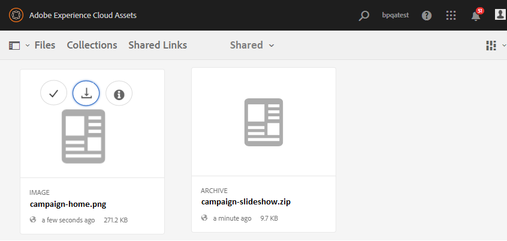

# Experience Manager Assets에 기여도 폴더 게시 {#using-asset-souring-in-bp}

적절한 권한이 있는 Brand Portal 사용자는 여러 자산 또는 여러 자산이 들어 있는 폴더를 기여도 폴더에 업로드할 수 있습니다. 그러나 Brand Portal 사용자는 자산을 **신규** 폴더를 입력합니다. 다음 **공유** 폴더는 기여도에 대한 새 자산을 만드는 동안 Brand Portal 사용자가 사용할 수 있는 기준 자산(참조 컨텐츠)의 배포를 위한 것입니다.

기여도 폴더에 액세스할 수 있는 권한이 있는 Brand Portal 사용자는 다음 활동을 수행할 수 있습니다.

* [자산 요구 사항 다운로드](#download-asset-requirements)
* [기여도 폴더에 새 자산 업로드](#uplad-new-assets-to-contribution-folder)
* [Experience Manager Assets에 기여도 폴더 게시](#publish-contribution-folder-to-aem)

## 자산 요구 사항 다운로드 {#download-asset-requirements}

Brand Portal 사용자는 기여 폴더가 Experience Manager Assets 사용자가 공유될 때마다 자동으로 이메일/펄스 알림을 수신하여, 사용자로부터 간단한(자산 요구 사항) 문서를 다운로드하거나 기준 자산(참조 컨텐츠)을 다운로드할 수 있습니다 **공유** 폴더를 삭제하여 자산 요구 사항을 파악합니다.

Brand Portal 사용자는 다음 활동을 수행하여 자산 요구 사항을 다운로드합니다.

* **개요 다운로드**: 자산 유형, 목적, 지원되는 형식, 최대 자산 크기 등과 같은 자산 관련 정보가 있는 기여도 폴더에 첨부된 간략한(자산 요구 문서)을 다운로드합니다.
* **기준 자산 다운로드**: 필요한 자산 유형을 이해하는 데 사용할 수 있는 기준 자산을 다운로드합니다. Brand Portal 사용자는 이러한 자산을 참조로 사용하여 기여할 새 자산을 만들 수 있습니다.

Brand Portal 대시보드는 새 공유 기여도 폴더와 함께 Brand Portal 사용자에게 허용된 모든 기존 폴더를 반영합니다. 이 예에서 Brand Portal 사용자는 새로 만든 기여도 폴더에만 액세스할 수 있고, 다른 기존 폴더는 사용자와 공유되지 않습니다.

**자산 요구 사항을 다운로드하려면 다음을 수행하십시오.**

1. Brand Portal 인스턴스에 로그인합니다.
1. Brand Portal 대시보드에서 기여 폴더를 선택합니다.
1. 클릭 **[!UICONTROL 속성]**. 기여도 폴더 세부 사항이 포함된 속성 창이 열립니다.

   

   

1. 을(를) 클릭합니다. **[!UICONTROL 개요 다운로드]** 로컬 시스템에서 자산 요구 사항 문서를 다운로드하는 옵션.

   

1. Brand Portal 대시보드로 돌아갑니다.
1. 기여도 폴더를 열려면 클릭합니다. 두 개의 하위 폴더가 표시됩니다.**[!UICONTROL 공유]** 및 **[!UICONTROL 신규]** 기여도 폴더 내에 있어야 합니다. 공유 폴더에는 관리자가 공유하는 모든 기준 자산(참조 컨텐츠)이 포함되어 있습니다.
1. 을 다운로드할 수 있습니다 **[!UICONTROL 공유]** 로컬 시스템의 모든 기준 자산을 포함하는 폴더입니다.
또는 **[!UICONTROL 공유]** 폴더를 클릭하고 **다운로드** 아이콘을 사용하여 개별 파일/폴더를 다운로드할 수 있습니다.

   

   

간략한(자산 요구 사항 문서)을 살펴보고 자산 요구 사항을 이해하려면 기준 자산을 참조하십시오. 이제 기여도를 위한 새 자산을 만들고 기여도 폴더에 업로드할 수 있습니다.

## 기여도 폴더에 자산 업로드 {#uplad-new-assets-to-contribution-folder}

자산 요구 사항을 거친 후 Brand Portal 사용자는 기여할 새 자산을 만들고 기여도 폴더 내의 NEW 폴더에 업로드할 수 있습니다. 사용자는 여러 자산을 자산 기여 폴더에 업로드할 수 있습니다. 그러나 한 번에 하나의 폴더만 만들 수 있습니다.

>[!NOTE]
>
>Brand Portal 사용자는 자산을 업로드할 수 있습니다(최대 **2개** NEW 폴더에 GB(파일 크기당)를 추가합니다.
>
>모든 Brand Portal 테넌트에 대한 최대 업로드 제한은 다음과 같습니다 **10**&#x200B;모든 기여도 폴더에 누적 적용되는 GB입니다.
>
>Brand Portal에 업로드된 자산은 표현물에 대해 처리되지 않으며 미리 보기를 포함하지 않습니다.

>[!NOTE]
>
>기여도 폴더를 Experience Manager Assets에 게시한 후 업로드 공간을 해제하여 다른 Brand Portal 사용자가 기여하기 위해 사용할 수 있도록 하는 것이 좋습니다.
>
>Brand Portal 테넌트의 업로드 제한을 초과해야 하는 경우 **10** GB, 고객 지원 센터에 요구 사항을 알려주십시오.

**새 자산을 업로드하려면 다음을 수행하십시오.**

1. Brand Portal 인스턴스에 로그인합니다.
Brand Portal 대시보드는 새 공유 기여도 폴더와 함께 Brand Portal 사용자에게 허용된 모든 기존 폴더를 반영합니다.

1. 기여도 폴더를 선택하고 을(를) 클릭하여 엽니다. 기여도 폴더에는 두 개의 하위 폴더가 있습니다. **[!UICONTROL 공유]** 및 **[!UICONTROL 신규]**.

1. 을(를) 클릭합니다. **[!UICONTROL 신규]** 폴더를 입력합니다.

   

1. 클릭 **[!UICONTROL 만들기]** > **[!UICONTROL 파일]** 여러 자산이 들어 있는 개별 파일 또는 폴더(.zip)를 업로드합니다.

   

1. 자산(파일 또는 폴더)을 **[!UICONTROL 신규]** 폴더를 입력합니다.

   

모든 자산 또는 폴더를 새 폴더에 업로드한 후 기여도 폴더를 Experience Manager Assets에 게시합니다.

## Experience Manager Assets에 기여도 폴더 게시 {#publish-contribution-folder-to-aem}

Brand Portal 사용자는 Experience Manager 작성자 인스턴스에 액세스하지 않아도 기여도 폴더를 Experience Manager Assets에 게시할 수 있습니다.

자산 요구 사항을 살펴보았는지 확인하고 새로 만든 자산을 업로드하십시오. **신규** 기여도 폴더 내에 있는 폴더입니다.

**기여도 폴더를 게시하려면 다음을 수행하십시오.**

1. Brand Portal 인스턴스에 로그인합니다.

1. Brand Portal 대시보드에서 기여 폴더를 선택합니다.
1. 클릭 **[!UICONTROL AEM에 게시]**.

   

   

게시 워크플로우의 여러 단계에서 Brand Portal 사용자 및 관리자에게 이메일/펄스 알림이 전송됩니다.

1. **큐에 있음** - Brand Portal에서 게시 작업 과정이 트리거될 때 Brand Portal 사용자 및 Brand Portal 관리자에게 알림이 전송됩니다.

1. **완료** - 기여도 폴더가 Experience Manager Assets에 성공적으로 게시되면 Brand Portal 사용자 및 Brand Portal 관리자에게 알림이 전송됩니다.

새로 만든 자산을 Experience Manager Assets에 게시하면 Brand Portal 사용자는 새 폴더에서 삭제할 수 있습니다. 반면에 Brand Portal 관리자는 NEW 및 SHARED 폴더 모두에서 자산을 삭제할 수 있습니다.

기여 폴더를 만드는 목적이 달성되면 Brand Portal 관리자는 기여 폴더를 삭제하여 다른 사용자의 업로드 공간을 해제할 수 있습니다.

## 게시 작업 상태 {#publishing-job-status}

관리자가 Brand Portal에서 Experience Manager Assets으로 게시된 자산 기여 폴더의 상태를 보는 데 사용할 수 있는 두 개의 보고서가 있습니다.

* Brand Portal에서 **[!UICONTROL 도구]** > **[!UICONTROL 자산 기여 상태]**. 이 보고서는 게시 작업 과정의 여러 단계에 있는 모든 게시 작업 상태를 반영합니다.

   

* Experience Manager Assets(온-프레미스 또는 관리 서비스)에서 **[!UICONTROL 자산]** > **[!UICONTROL 작업]**. 이 보고서는 모든 게시 작업의 최종 상태(성공 또는 오류)를 반영합니다.

   

* Experience Manager Assets as a Cloud Service에서 **[!UICONTROL 자산]** > **[!UICONTROL 작업]**.

   또는 로 바로 이동할 수 있습니다. **[!UICONTROL 작업]** 전역 탐색에서 를 클릭합니다.

   이 보고서는 Brand Portal에서 Experience Manager Assets으로 자산 가져오기를 포함하여 모든 게시 작업의 최종 상태(성공 또는 오류)를 반영합니다.

   

<!--
>[!NOTE]
>
>Currently, no report is generated in AEM Assets as a Cloud Service for the Asset Sourcing workflow. 
-->
