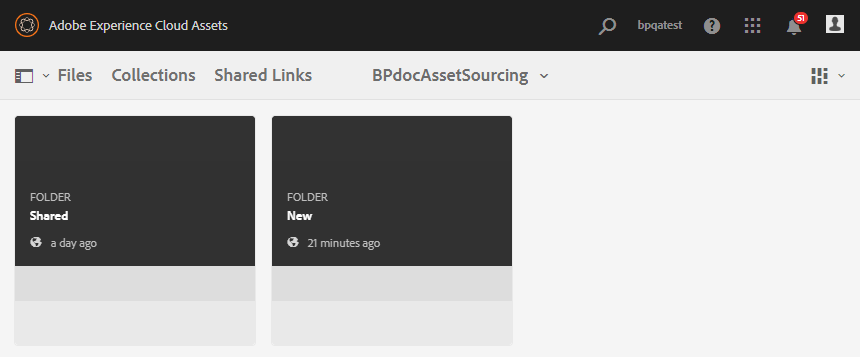

# Experience Manager Assets에 대한 Publish 기여 폴더 {#using-asset-souring-in-bp}

적절한 권한이 있는 Brand Portal 사용자는 여러 에셋 또는 여러 에셋이 포함된 폴더를 기여도 폴더에 업로드할 수 있습니다. 그러나 Brand Portal 사용자는 **NEW** 폴더에만 에셋을 업로드할 수 있습니다. **SHARED** 폴더는 기여를 위해 새 자산을 만드는 동안 Brand Portal 사용자가 사용할 수 있는 기준 자산(참조 컨텐츠)을 배포하기 위한 것입니다.

기여 폴더에 액세스할 수 있는 권한이 있는 Brand Portal 사용자는 다음 활동을 수행할 수 있습니다.

* [에셋 요구 사항 다운로드](#download-asset-requirements)
* [기여 폴더에 새 에셋 업로드](#uplad-new-assets-to-contribution-folder)
* [Experience Manager Assets에 대한 Publish 기여 폴더](#publish-contribution-folder-to-aem)

## 에셋 요구 사항 다운로드 {#download-asset-requirements}

Brand Portal 사용자는 기여 폴더를 Experience Manager Assets 사용자가 공유할 때마다 자동으로 이메일/펄스 알림을 수신하므로, 자산 요구 사항을 이해할 수 있도록 **SHARED** 폴더에서 간단한(자산 요구 사항) 문서를 다운로드하고 기준 자산(참조 컨텐츠)을 다운로드할 수 있습니다.

Brand Portal 사용자는 다음 활동을 수행하여 에셋 요구 사항을 다운로드합니다.

* **개요 다운로드**: 기여 폴더에 첨부된 개요(자산 요구 사항 문서)를 다운로드합니다. 여기에는 자산 유형, 목적, 지원되는 형식, 최대 자산 크기 등의 자산 관련 정보가 포함되어 있습니다.
* **기본 에셋 다운로드**: 필요한 에셋 유형을 이해하는 데 사용할 수 있는 기본 에셋을 다운로드합니다. Brand Portal 사용자는 이러한 에셋을 참조로 사용하여 기여를 위한 새 에셋을 만들 수 있습니다.

Brand Portal 대시보드는 새로 공유된 기여 폴더와 함께 Brand Portal 사용자에게 허용된 모든 기존 폴더를 반영합니다. 이 예에서 Brand Portal 사용자는 새로 생성된 기여 폴더에만 액세스할 수 있으며 다른 기존 폴더는 사용자와 공유되지 않습니다.

**자산 요구 사항을 다운로드하려면:**

1. Brand Portal 인스턴스에 로그인.
1. Brand Portal 대시보드에서 기여도 폴더를 선택합니다.
1. **[!UICONTROL 속성]**&#x200B;을 클릭합니다. 기여도 폴더 세부 정보가 포함된 속성 창이 열립니다.

   

   

1. 로컬 컴퓨터에서 자산 요구 사항 문서를 다운로드하려면 **[!UICONTROL 개요 다운로드]** 옵션을 클릭하십시오.

   

1. Brand Portal 대시보드로 돌아갑니다.
1. 기여도 폴더를 열려면 클릭하세요. 기여도 폴더 내에 **[!UICONTROL SHARED]** 및 **[!UICONTROL NEW]** 하위 폴더가 두 개 있습니다. 공유 폴더에는 관리자가 공유하는 모든 기준 에셋(참조 콘텐츠)이 포함됩니다.
1. 로컬 컴퓨터의 모든 기본 자산이 포함된 **[!UICONTROL SHARED]** 폴더를 다운로드할 수 있습니다.
또는 **[!UICONTROL 공유]** 폴더를 열고 **다운로드** 아이콘을 클릭하여 개별 파일/폴더를 다운로드할 수 있습니다.

   

   

개요(자산 요구 사항 문서)를 살펴보고 기준 자산을 참조하여 자산 요구 사항을 이해합니다. 이제 기여에 대한 새 자산을 만들고 기여도 폴더에 업로드할 수 있습니다.

## 기여 폴더에 자산 업로드 {#upload-new-assets-to-contribution-folder}

에셋 요구 사항을 살펴본 후 Brand Portal 사용자는 기여를 위한 새 에셋을 만들고 기여 폴더 내의 NEW 폴더에 업로드할 수 있습니다. 사용자는 여러 에셋을 에셋 기여 폴더에 업로드할 수 있습니다. 단, 한 번에 하나의 폴더만 만들 수 있습니다.

>[!NOTE]
>
>Brand Portal 사용자는 에셋(파일 크기당 최대 **2** GB)을 NEW 폴더에 업로드할 수 있습니다.
>
>Brand Portal 테넌트의 최대 업로드 제한은 **10** GB이며 모든 기여 폴더에 누적됩니다.
>
>Brand Portal에 업로드된 에셋은 렌디션에 대해 처리되지 않으며 미리 보기를 포함하지 않습니다.

>[!NOTE]
>
>다른 Brand Portal 사용자가 기여도를 위해 사용할 수 있도록 Experience Manager Assets에 기여 폴더를 게시한 후 업로드 공간을 해제하는 것이 좋습니다.
>
>Brand Portal 테넌트의 업로드 제한을 **10** GB 이상으로 확장해야 하는 경우 요구 사항을 지정하여 고객 지원 센터에 문의하십시오.

**새 자산을 업로드하려면:**

1. Brand Portal 인스턴스에 로그인.
Brand Portal 대시보드는 새로 공유된 기여 폴더와 함께 Brand Portal 사용자에게 허용된 모든 기존 폴더를 반영합니다.

1. 기여도 폴더를 선택하고 을(를) 클릭하여 엽니다. 기여도 폴더에 두 개의 하위 폴더(**[!UICONTROL 공유]** 및 **[!UICONTROL 새로 만들기]**)가 있습니다.

1. **[!UICONTROL 새]** 폴더를 클릭합니다.

   

1. **[!UICONTROL 만들기]** > **[!UICONTROL 파일]**&#x200B;을 클릭하여 여러 자산이 포함된 개별 파일 또는 폴더(.zip)를 업로드합니다.

   

1. 에셋(파일 또는 폴더)을 찾아 **[!UICONTROL NEW]** 폴더에 업로드합니다.

   

모든 에셋 또는 폴더를 NEW 폴더에 업로드한 후 기여도 폴더를 Experience Manager Assets에 게시합니다.

## Experience Manager Assets에 대한 Publish 기여 폴더 {#publish-contribution-folder-to-aem}

Brand Portal 사용자는 Experience Manager 작성자 인스턴스에 액세스할 필요 없이 기여도 폴더를 Experience Manager Assets에 게시할 수 있습니다.

에셋 요구 사항을 충족하는지 확인하고 기여도 폴더 내의 **NEW** 폴더에 새로 만든 에셋을 업로드하십시오.

**기여 폴더를 게시하려면:**

1. Brand Portal 인스턴스에 로그인.

1. Brand Portal 대시보드에서 기여도 폴더를 선택합니다.
1. **[!UICONTROL AEM에 Publish]**&#x200B;를 클릭합니다.

   

   

이메일/펄스 알림은 게시 작업 과정의 여러 단계에 있는 Brand Portal 사용자 및 관리자에게 전송됩니다.

1. **큐에 있음** - Brand Portal에서 게시 워크플로우가 트리거될 때 Brand Portal 사용자 및 Brand Portal 관리자에게 알림이 전송됩니다.

1. **완료** - 기여도 폴더가 Experience Manager Assets에 게시되면 Brand Portal 사용자 및 Brand Portal 관리자에게 알림이 전송됩니다.

Brand Portal 사용자는 새로 만든 에셋을 Experience Manager Assets에 게시한 후 NEW 폴더에서 삭제할 수 있습니다. 반면 Brand Portal 관리자는 NEW 및 SHARED 폴더 모두에서 에셋을 삭제할 수 있습니다.

기여도 폴더를 만든 목표가 달성되면 Brand Portal 관리자는 기여도 폴더를 삭제하여 다른 사용자의 업로드 공간을 해제할 수 있습니다.

## 게시 작업 상태 {#publishing-job-status}

관리자가 Brand Portal에서 Experience Manager Assets으로 게시된 에셋 기여 폴더의 상태를 보는 데 사용할 수 있는 두 개의 보고서가 있습니다.

* Brand Portal에서 **[!UICONTROL 도구]** > **[!UICONTROL 자산 기여 상태]**&#x200B;로 이동합니다. 이 보고서는 게시 작업 과정의 여러 단계에 있는 모든 게시 작업의 상태를 반영합니다.

  

* Experience Manager Assets(온-프레미스 또는 관리 서비스)에서 **[!UICONTROL Assets]** > **[!UICONTROL 작업]**(으)로 이동합니다. 이 보고서는 모든 게시 작업의 최종 상태(성공 또는 오류)를 반영합니다.

  

* Experience Manager Assetsas a Cloud Service 에서 **[!UICONTROL Assets]** > **[!UICONTROL 작업]**(으)로 이동

  또는 전역 탐색에서 직접 **[!UICONTROL 작업]**(으)로 이동할 수 있습니다.

  이 보고서는 Brand Portal에서 Experience Manager Assetsas a Cloud Service 로 에셋 가져오기를 포함하여 모든 게시 작업의 최종 상태(성공 또는 오류)를 반영합니다.

  

<!--
>[!NOTE]
>
>Currently, no report is generated in AEM Assets as a Cloud Service for the Asset Sourcing workflow. 
-->

## 기여 폴더에서 Experience Manager Assets으로 게시된 에셋 자동 삭제 {#automatically-delete-published-assets-from-contribution-folder}

이제 Brand Portal은 12시간마다 자동 작업을 실행하여 모든 기여 폴더를 스캔하고 AEM에 게시된 모든 에셋을 삭제합니다. 따라서 폴더 크기를 [임계값 제한](#upload-new-assets-to-contribution-folder) 미만으로 유지하기 위해 기여도 폴더의 자산을 수동으로 삭제할 필요가 없습니다. 지난 7일 동안 자동으로 실행된 삭제 작업의 상태를 모니터링할 수도 있습니다. 작업 보고서는 다음 세부 정보를 제공합니다.

* 작업 시작 시간
* 작업 종료 시간
* 작업 상태
* 작업에 포함된 총 자산
* 작업에서 삭제된 총 자산
* 작업 실행의 결과로 사용할 수 있는 총 저장소

  

추가 드릴다운하여 삭제 작업에 포함된 각 에셋의 세부 정보를 볼 수도 있습니다. 자산 제목, 크기, 작성자, 삭제 상태 및 삭제 시간 등 세부 정보가 보고서에 포함됩니다.

>[!NOTE]
>
> * 고객은 Adobe 고객 지원 센터에 자동 삭제 작업 기능을 비활성화하고 다시 활성화하거나 실행 빈도를 변경하도록 요청할 수 있습니다.
> * 이 기능은 Experience Manager 6.5.13.0 이상 릴리스에서 사용할 수 있습니다.

### 삭제 보고서 보기 및 다운로드 {#view-delete-jobs}

삭제 작업에 대한 보고서를 보고 다운로드하려면 다음 작업을 수행하십시오.

1. Brand Portal에서 **[!UICONTROL 도구]**>**[!UICONTROL 자산 기여 상태]**>**[!UICONTROL 삭제 보고서]** 옵션으로 이동합니다.

1. 작업을 선택하고 **[!UICONTROL 보기]**&#x200B;를 클릭하여 보고서를 봅니다.

   삭제 작업에 포함된 각 에셋의 세부 정보를 확인합니다. 자산 제목, 크기, 작성자, 삭제 상태 및 삭제 시간 등 세부 정보가 보고서에 포함됩니다. 작업에 대한 보고서를 CSV 형식으로 다운로드하려면 **[!UICONTROL 다운로드]**&#x200B;를 클릭하십시오.

   보고서에서 에셋의 삭제 상태는 다음과 같은 값을 가질 수 있습니다.

   * **삭제됨** - 기여 폴더에서 에셋이 삭제되었습니다.

   * **찾을 수 없음** - Brand Portal이 기여 폴더에서 자산을 찾을 수 없습니다. 에셋이 이미 폴더에서 수동으로 삭제되었습니다.

   * **건너뜀** - 기여 폴더의 에셋에 사용 가능한 새 버전이 아직 Experience Manager에 게시되지 않아 Brand Portal이 에셋 삭제를 건너뛰었습니다.

   * **실패** - Brand Portal에서 자산을 삭제하지 못했습니다. 삭제 상태가 `Failed`인 에셋을 삭제하려고 세 번 다시 시도합니다. 에셋이 세 번째 삭제 재시도에 실패하면 에셋을 수동으로 삭제해야 합니다.

### 보고서 삭제

Brand Portal을 사용하면 하나 이상의 보고서를 선택하고 수동으로 삭제할 수도 있습니다.

보고서를 삭제하려면 다음 작업을 수행하십시오.

1. **[!UICONTROL 도구]**>**[!UICONTROL 자산 기여 상태]**>**[!UICONTROL 삭제 보고서]** 옵션으로 이동합니다.

1. 하나 이상의 보고서를 선택하고 **[!UICONTROL 삭제]**&#x200B;를 클릭합니다.

