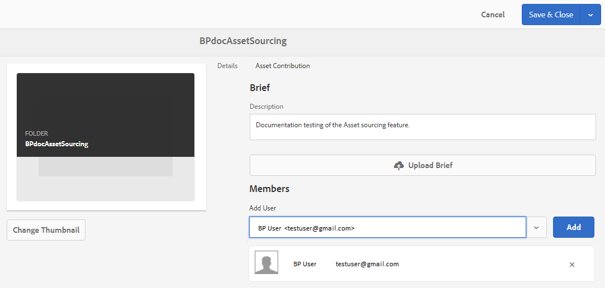

# AEM Assets {#configure-contribution-folder}에서 기여도 폴더 구성

공동 자산 소싱의 경우 AEM 사용자(관리자 및 권한이 있는 비관리 사용자)는 **자산 기여도** 유형의 새 폴더를 만들 수 있으므로, 만들어진 새 폴더가 브랜드 포털 사용자의 자산 제출에 열려 있는지 확인합니다.  이렇게 하면 새로 만든 **기여도** 폴더 내에서 **SHARED** 및 **NEW**&#x200B;라는 2개의 추가 하위 폴더를 만드는 워크플로우가 자동으로 트리거됩니다.

그러면 AEM 사용자는 Brand Portal 사용자가 필요한 정보를 갖도록 하기 위해 기여도 폴더에 추가해야 하는 자산 유형과 기준 자산 세트에 대한 간단한 설명을 **SHARED** 폴더에 업로드하여 자산 요구 사항을 정의합니다. 그러면 관리자는 새로 만든 기여도 폴더를 브랜드 포털에 게시하기 전에 기여도 폴더에 대한 액세스 권한을 활성 브랜드 포털 사용자에게 부여할 수 있습니다.

다음 비디오에서는 AEM Assets에서 기여도 폴더를 구성하는 방법을 보여 줍니다.

>[!VIDEO](https://video.tv.adobe.com/v/30547)

AEM 사용자는 기여도 폴더를 구성하는 동안 다음 활동을 수행합니다.

* [기여도 폴더 만들기](#create-contribution-folder)
* [자산 요구 사항 업로드 및 참가자 할당](#configure-contribution-folder-properties)
* [기준 자산 업로드](#uplad-new-assets-to-contribution-folder)
* [AEM Assets의 기여도 폴더를 브랜드 포털에 게시](#publish-contribution-folder-to-brand-portal)

## 기여도 폴더 {#create-contribution-folder} 만들기

AEM 관리자와 관리자가 아닌 사용자가 새 폴더를 만들 수 있는 권한을 갖고 있는 경우 AEM Assets에서 기여도 폴더를 만들 수 있습니다.
기여도 폴더를 만들려면 자산 기여도 유형의 새 폴더를 만듭니다. 이 폴더를 만들면 브랜드 포털 사용자의 자산 제출 시 새 폴더가 열립니다.  이렇게 하면 기여도 폴더 내에 공유 및 새로 만들기 라는 2개의 추가 하위 폴더가 생성되는 워크플로우가 자동으로 트리거됩니다.

>[!NOTE]
>
>하나의 폴더 내에 여러 기여도 폴더를 만들 수 있습니다. 다른 기여도 폴더 내에 기여도 폴더를 만들지 마십시오.

**기여도 폴더를 만들려면:**
1. AEM Assets 인스턴스에 로그인합니다.

1. **[!UICONTROL 자산]** > **[!UICONTROL 파일]**&#x200B;으로 이동합니다. AEM Assets 저장소의 모든 기존 폴더가 나열됩니다.

1. **[!UICONTROL 만들기]**&#x200B;를 클릭하여 새 폴더를 만듭니다. **[!UICONTROL 폴더]** 만들기 대화 상자가 열립니다.

1. 폴더의 **[!UICONTROL 제목]** 및 **[!UICONTROL 이름]**&#x200B;을 입력하고 **[!UICONTROL 자산 기여도]** 확인란을 선택합니다.
폴더 이름을 지정하려면 공백 없이 소문자를 사용하는 것이 좋습니다.

1. **[!UICONTROL 만들기]**&#x200B;를 클릭합니다. AEM Assets 저장소에 나열된 기여도 폴더를 볼 수 있습니다.

   >[!NOTE]
   >
   >관리자가 아닌 사용자는 자산 기여도 폴더를 만들고 공유할 수 있지만 수정하거나 삭제할 수 없습니다.

   

1. 기여도 폴더를 열려면 클릭하십시오. 기여도 폴더 내에 **[!UICONTROL SHARED]** 및 **[!UICONTROL NEW]**&#x200B;와 같은 두 개의 하위 폴더가 자동으로 생성됩니다.

   

기여도 폴더를 만드는 동안 기여도 폴더 속성을 구성할 수도 있습니다.

## 기여도 폴더 속성 {#configure-contribution-folder-properties} 구성

AEM 관리자는 기여도 폴더의 속성을 구성하는 동안 다음 활동을 수행합니다.

* **설명 추가**:기여도 폴더에 대한 높은 수준의 설명을 제공합니다.
* **업로드 개요**:자산 관련 정보가 포함된 자산 요구 사항 문서를 업로드합니다.
* **작성자 추가**:기여도 폴더에 대한 액세스 권한을 부여할 브랜드 포털 사용자를 추가합니다.

자산 요구 사항은 기여자(브랜드 포털 사용자)가 기여도 폴더의 요구 사항과 요구 사항을 이해하는 데 도움이 되도록 관리자가 제공하는 세부 정보를 참조하십시오. 관리자는 기여도 폴더 및 자산 관련 정보(예: 목적, 이미지 유형, 최대 크기 등)에 추가해야 하는 자산 유형에 대한 간단한 정보가 포함된 자산 요구 사항 문서를 업로드합니다.

**기여도 폴더 속성을 구성하려면:**

1. AEM Assets 인스턴스에 로그인합니다.

1. **[!UICONTROL 자산 > 파일]**&#x200B;으로 이동하고 기여도 폴더를 찾습니다.
1. 기여도 폴더를 선택하고 **[!UICONTROL 속성]**&#x200B;을 클릭하여 폴더 속성 창을 엽니다.

   

   

1. **[!UICONTROL 자산 기여도]** 탭으로 이동합니다.
1. 기여도 폴더의 상위 수준 **[!UICONTROL 설명]**&#x200B;을 입력합니다.
1. **[!UICONTROL 개요 업로드]**&#x200B;를 클릭하여 로컬 컴퓨터에서 찾고 **자산 요구 사항 문서**&#x200B;를 업로드합니다.

   

1. **[!UICONTROL 사용자 추가]** 필드에서 기여도 폴더를 공유할 브랜드 포털 사용자를 추가합니다. 이러한 사용자는 브랜드 포털 인터페이스를 사용하여 기여도 폴더에 액세스하여 콘텐트를 업로드할 수 있습니다.
1. **[!UICONTROL 저장]**&#x200B;을 클릭합니다.

   

>[!NOTE]
>
>검색 결과는 AEM Assets에 구성된 브랜드 포털 사용자 목록을 기반으로 합니다. 업데이트된 브랜드 포털 사용자 목록이 있는지 확인합니다.

## 기여도 폴더 {#uplad-new-assets-to-contribution-folder}에 자산 업로드

브랜드 포털 사용자는 자산 요구 사항을 다운로드하여 기여도의 필요성을 파악할 수 있습니다.
그런 다음 기여도를 위해 새 자산을 만들고 기여도 폴더 내의 NEW 폴더에 업로드할 수 있습니다.

>[!NOTE]
>
>브랜드 포털 사용자는 NEW 폴더에만 자산을 업로드할 수 있습니다.
>
>모든 브랜드 포털 테넌트에 대한 최대 업로드 제한은 모든 기여도 폴더에 누적 적용되는 **10** GB입니다.

새로 만든 에셋을 AEM Assets에 게시하면 브랜드 포털 사용자는 NEW 폴더에서 해당 에셋을 삭제할 수 있습니다. 반면에 브랜드 포털 관리자는 NEW 및 SHARED 폴더 모두에서 자산을 삭제할 수 있습니다.

기여도 폴더를 만드는 목적이 달성되면 브랜드 포털 관리자는 기여도 폴더를 삭제하여 다른 사용자의 업로드 공간을 해제할 수 있습니다.

>[!NOTE]
>
>기여도를 위해 다른 브랜드 포털 사용자가 사용할 수 있도록 기여도 폴더를 AEM Assets에 게시한 후 업로드 공간을 해제하는 것이 좋습니다.
>
>브랜드 포털 임차인의 업로드 한도를 **10** GB 이상으로 늘려야 하는 경우, 요구 사항을 지정하려면 Adobe 지원 센터에 문의하십시오.

**새 자산을 업로드하려면:**

1. 브랜드 포털 인스턴스에 로그인합니다.
브랜드 포털 대시보드에는 새로 공유된 기여도 폴더와 함께 브랜드 포털 사용자에게 허용된 모든 기존 폴더가 반영됩니다.

1. 기여도 폴더를 선택하고 을 클릭하여 엽니다. 기여도 폴더에는 **[!UICONTROL SHARED]** 및 **[!UICONTROL NEW]**&#x200B;라는 2개의 하위 폴더가 있습니다.

1. **[!UICONTROL NEW]** 폴더를 클릭합니다.

   

1. **[!UICONTROL 만들기]** > **[!UICONTROL 파일]**&#x200B;을 클릭하여 여러 에셋이 포함된 개별 파일 또는 폴더(.zip)를 업로드합니다.

   

1. 자산(파일 또는 폴더)을 찾아 **[!UICONTROL NEW]** 폴더로 업로드합니다.

   

모든 자산 또는 폴더를 NEW 폴더에 업로드한 후 기여도 폴더를 AEM Assets에 게시합니다.

## 브랜드 포털 {#publish-contribution-folder-to-brand-portal}에 기여도 폴더 게시

기여도 폴더가 구성되면 AEM 사용자(관리자/비관리 사용자)는 AEM Assets의 기여도 폴더를 브랜드 포털에 게시할 수 있습니다. 기여도 폴더에 액세스할 권한이 있는 브랜드 포털 사용자는 게시 작업이 완료되면 이메일/펄스 알림을 받게 됩니다.

**기여도 폴더를 게시하려면:**

1. AEM Assets 인스턴스에 로그인합니다.

1. **[!UICONTROL 자산 > 파일]**&#x200B;으로 이동하고 브랜드 포털에 게시할 기여도 폴더를 찾습니다.
1. 기여도 폴더를 선택하고 **[!UICONTROL 빠른 게시]** > **[!UICONTROL 브랜드 포털에 게시]**&#x200B;를 클릭합니다.

   

   기여도 폴더가 브랜드 포털에 게시되면 성공 메시지가 표시됩니다.

기여도 폴더에 할당된 브랜드 포털 사용자에게 이메일/펄스 알림이 전송됩니다. 브랜드 포털 사용자는 기여도 폴더에 액세스하여 기여도를 시작할 수 있습니다. 참조: [에셋을 기여도 폴더에 업로드하고 AEM Assets](brand-portal-publish-contribution-folder-to-aem-assets.md)에 게시를 참조하십시오.
