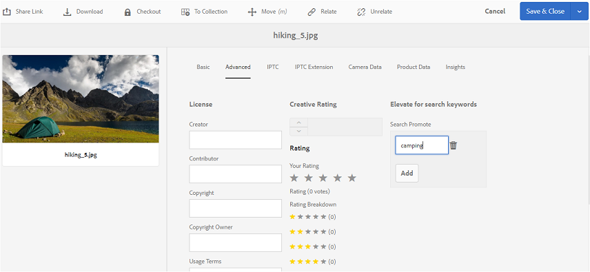

# 태그를 Brand Portal에 게시 {#publish-tags-to-brand-portal}

Experience Manager Assets에서 Brand Portal으로 태그를 게시하는 방법에 대해 알아봅니다.

태그는 자산을 구성하고 자산과 연결된 자산의 검색 가능성을 향상시키는 데 유용합니다. 태그는 자산과 함께 첨부된 키워드 또는 레이블(메타데이터)로 생각할 수 있으며 검색 결과 자산을 빠르게 찾을 수 있습니다. Experience Manager Assets에서 에셋에 태그를 할당하는 방법을 알아보려면 를 참조하십시오. [태그를 사용하여 에셋 구성](https://experienceleague.adobe.com/docs/experience-manager-65/assets/managing/organize-assets.html).

연결된 태그가 있는 자산(및 컬렉션)이 Brand Portal에 게시되면 태그(AEM의 자산 및 컬렉션과 연결됨)가 Brand Portal에 자동으로 게시됩니다. 게시된 태그는 검색을 활성화하여 관련 에셋을 찾는 데 유용합니다.

>[!NOTE]
>
>그러나 태그가 연결된 에셋(및 컬렉션)을 게시하기 전에 태그를 Brand Portal에 독점적으로 게시하는 것이 좋습니다. 이렇게 하면 에셋(및 컬렉션)을 Brand Portal에 보다 빠르게 게시할 수 있습니다.

## 태그 관리 {#manage-tags}

기존 태그를 사용하여 에셋에 첨부하거나 AEM 태그 콘솔에서 새 태그를 만들 수 있습니다(**[!UICONTROL 도구 | 태그 지정 | AEM 태그]**). 두 시나리오 모두에서 먼저 태그를 Brand Portal에 게시한 다음 적절한 자산과 연결해야 합니다.

AEM에서 태그를 만들고, Brand Portal에서 태그를 게시하고, 태그를 적절한 자산(또는 컬렉션)에 연결하려면 다음 단계를 수행하십시오.

1. **태그 만들기**
관리 권한을 사용하여 AEM 작성자 인스턴스에 로그인하고 액세스합니다 **[!UICONTROL AEM 태그]** 전역 탐색의 콘솔:

   1. 선택 **[!UICONTROL 도구]**

   1. 선택 **[!UICONTROL 일반]**

   1. 선택 **[!UICONTROL 태깅]**

1. 선택 **[!UICONTROL 만들기]** 다음을 선택합니다. **[!UICONTROL 태그 만들기]** 옵션을 선택합니다.
1. 지정:

   * **[!UICONTROL 제목]**

      *(필수)* 태그의 표시 제목입니다.
   * **[!UICONTROL 이름]**
      *(필수)* 태그의 이름입니다. 지정하지 않으면 제목에서 올바른 노드 이름이 만들어집니다. 다음을 참조하십시오 [태그 ID](https://experienceleague.adobe.com/docs/experience-manager-65/developing/platform/tagging/framework.html).
   * **설명**

      *(선택 사항)* 태그에 대한 설명.
   * **태그 경로**
태그의 JCR 경로.

1. 선택 **[!UICONTROL 제출]** 를 클릭하여 태그를 만듭니다.

   AEM 인스턴스에 태그를 생성하면 해당 자산의 속성 섹션 또는 태그 관리 섹션 을 사용하여 자산에 태그를 첨부할 수 있습니다.

1. **Brand Portal에 태그 게시**.

   다음으로 이동 **[!UICONTROL AEM 태그]** 콘솔 ([!UICONTROL 도구 | 태그 지정 | AEM 태그])에서 원하는 태그를 선택하고 Brand Portal에 게시합니다.

1. **자산(또는 컬렉션)에 태그 첨부**.

   에셋(또는 컬렉션)을 선택하고 해당 에셋의 속성 섹션 또는 태그 관리 섹션을 사용하여 원하는 태그를 첨부합니다. AEM Assets에서 에셋에 태그를 할당하는 방법에 대한 자세한 내용은 을 참조하십시오. [태그를 사용하여 에셋 구성](https://experienceleague.adobe.com/docs/experience-manager-65/assets/managing/organize-assets.html).

1. **Brand Portal에 에셋(또는 컬렉션) 게시**.\
   에셋(또는 컬렉션)을 Brand Portal에 게시하면 첨부된 태그를 Brand Portal에서도 사용할 수 있습니다.

   Brand Portal의 각 에셋(또는 컬렉션)에서 첨부된 태그를 보려면 Brand Portal에 로그인하고 에셋을 선택하면 속성 섹션에 첨부된 태그가 표시됩니다.

## 검색 승격 {#search-promote}

AEM Assets Brand Portal을 사용하면 키워드 태그를 기반으로 특정 에셋을 검색 결과의 맨 위로 올리도록 할 수 있습니다.

검색 키워드에 대한 자산을 향상시키려면 다음 단계를 따르십시오.

1. 를 엽니다. **[!UICONTROL 속성]** AEM 작성자 인스턴스에 있는 자산의 페이지입니다.
1. 다음으로 이동 **[!UICONTROL 고급]** 탭.
1. 위치 **[!UICONTROL Search Promote]** 다음 범위 내 **[!UICONTROL 검색 키워드에 대한 개선]** 섹션, 선택 **[!UICONTROL 추가]** 검색 키워드나 태그를 추가합니다.

   

1. 변경 사항을 저장합니다.
1. Brand Portal에 자산 게시.
1. Brand Portal에 로그인. 보기 **[!UICONTROL 고급]** 의 탭 **[!UICONTROL 속성]** 에셋의 섹션입니다.
다음 사항에 주의하십시오. **[!UICONTROL Search Promote]** 키워드는 해당 에셋의 속성에도 표시됩니다.
