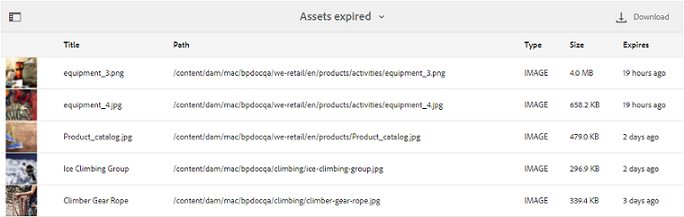
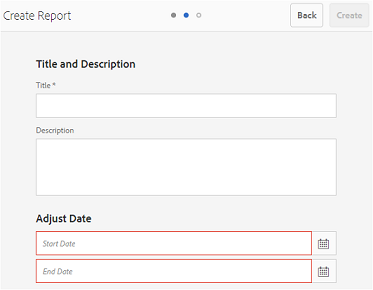

# 보고서를 사용한 작업 {#work-with-reports}

보고 기능은 브랜드 포털 사용을 평가하고 내부 및 외부 사용자가 승인된 자산과 어떻게 상호 작용하는지 아는 데 도움이 됩니다. 관리자는 자산 보고서 페이지에서 항상 사용할 수 있는 브랜드 포털 사용량 보고서를 볼 수 있습니다. 하지만 사용자 로그인 및 링크를 통해 공유되는 자산 다운로드, 만료, 게시 및 자산 보고서에 대한 보고서를 생성하여 자산 보고서 페이지에서 볼 수 있습니다. 이 보고서는 조직 내외부에서 승인된 자산의 채택을 측정하는 주요 성공 지표를 추출할 수 있는 자산 배포를 분석하는 데 유용합니다.

보고서 관리 인터페이스는 직관적이며 저장된 보고서에 액세스할 수 있는 세부화된 옵션과 컨트롤을 포함합니다. 이전에 생성한 모든 보고서가 나열되는 자산 보고서 페이지에서 보고서를 보거나, 다운로드하거나, 삭제할 수 있습니다.

## 보고서 보기 {#view-reports}

보고서를 보려면 다음 단계를 수행합니다.

1. 상단에 있는 도구 모음에서 AEM 로고를 탭/클릭하여 관리 도구에 액세스합니다.

   

1. 관리 도구 패널에서 **[!UICONTROL 보고서 만들기/관리]**&#x200B;를 클릭하여 **[!UICONTROL 자산 보고서]** 페이지를 엽니다.

   

1. 자산 보고서 페이지에서 **[!UICONTROL 사용]** 보고서 및 기타 생성된 보고서에 액세스합니다.

   >[!NOTE]
   >
   >사용 보고서는 브랜드 포털에 생성된 기본 보고서입니다. 만들거나 삭제할 수 없습니다. 그러나 다운로드, 만료, 게시, 링크 공유 및 사용자 로그인 보고서를 만들고, 다운로드하고, 삭제할 수 있습니다.

   보고서를 보려면 보고서 링크를 클릭합니다. 또는 보고서를 선택하고 도구 모음에서 보기 아이콘을 탭/클릭합니다.

   **[!UICONTROL 사용]** 보고서에는 활성 브랜드 포털 사용자 수, 모든 자산이 차지하는 저장소 공간 및 브랜드 포털의 총 자산 수에 대한 정보가 표시됩니다. Admin Console의 제품 프로필에 할당되지 않은 브랜드 포털 사용자는 비활성 사용자로 간주되며 **[!UICONTROL 사용 보고서]**에 반영되지 않습니다.
이 보고서에는 이러한 각 정보 지표에 대해 허용되는 용량도 표시됩니다.

   

   **[!UICONTROL 사용자]** 로그인 보고서는 브랜드 포털에 로그인한 사용자에 대한 정보를 제공합니다. 이 보고서에는 보고서 생성 시간까지 Brand Portal 6.4.2 배포에서 각 사용자의 표시 이름, 이메일 ID, 페르소나(관리자, 뷰어, 편집기, 손님), 그룹, 마지막 로그인, 활동 상태 및 로그인 수가 표시됩니다.

   

   **[!UICONTROL 다운로드]** 보고서 목록 및 특정 날짜 및 시간 범위에서 다운로드한 모든 자산에 대한 세부 정보를 다운로드합니다.

   

   >[!NOTE]
   >
   >자산 **[!UICONTROL 다운로드]** 보고서에는 개별적으로 선택되어 브랜드 포털에서 다운로드한 자산만 표시됩니다. 사용자가 에셋이 포함된 폴더를 다운로드한 경우, 보고서에는 폴더 또는 폴더 내의 자산이 표시되지 않습니다.

   **[!UICONTROL 만료]** 보고서는 특정 기간 동안 만료된 모든 에셋을 나열하고 자세히 설명합니다.

   

   **[!UICONTROL 게시]** 보고서는 지정된 기간 동안 AEM에서 브랜드 포털에 게시되는 모든 에셋을 나열하고 이에 대한 정보를 제공합니다.

   

   >[!NOTE]
   >
   >콘텐츠 조각을 브랜드 포털에 게시할 수 없으므로 보고서 게시는 콘텐츠 조각에 대한 정보를 표시하지 않습니다.

   **[!UICONTROL 링크 공유]** 보고서는 특정 기간 동안 브랜드 포털 인터페이스에서 링크를 통해 공유된 모든 자산을 나열합니다. 또한 이 보고서는 링크를 통해 자산이 공유된 시기, 사용자가 링크를 만료되는 시기, 테넌트에 대한 공유 링크의 수 및 자산 링크가 공유된 사용자에게도 알려줍니다. 링크 공유 보고서 열을 사용자 지정할 수 없습니다.

   

   >[!NOTE]
   >
   >링크 공유 보고서에는 링크를 통해 공유된 자산에 대한 액세스 권한이 있거나 링크를 통해 자산을 다운로드한 사용자가 표시되지 않습니다.
   >
   >공유 링크를 통한 다운로드를 추적하려면 **[!UICONTROL 보고서 만들기]** 페이지에서 **[!UICONTROL 링크 공유 다운로드만]** 옵션을 선택한 후 다운로드 보고서를 생성해야 합니다. 그러나 이 경우 사용자(다운로드한 사람)는 익명으로 처리됩니다.

## 보고서 생성 {#generate-reports}

관리자는 다음과 같은 표준 보고서를 생성하고 관리할 수 있습니다. 이렇게 생성된 보고서는 [액세스된](../using/brand-portal-reports.md#main-pars-header) 이후 버전으로 저장됩니다.

* 사용자 로그인
* 다운로드
* 만료
* 게시
* 공유 링크

다운로드, 만료 및 게시 보고서의 열을 보기 위해 사용자 지정할 수 있습니다. 보고서를 생성하려면 다음 단계를 수행합니다.

1. 상단에 있는 도구 모음에서 AEM 로고를 탭/클릭하여 관리 도구에 액세스합니다.

1. 관리 도구 패널에서 **[!UICONTROL 보고서 만들기/관리]**&#x200B;를 탭/클릭하여 **[!UICONTROL 자산 보고서]** 페이지를 엽니다.

   

1. 자산 보고서 페이지에서 **[!UICONTROL 만들기]**&#x200B;를 탭/클릭합니다.
1. **[!UICONTROL 보고서 만들기]** 페이지에서 만들 보고서를 선택하고 **[!UICONTROL 다음]**&#x200B;을 탭/클릭합니다.

   

1. 보고서 세부 사항을 구성합니다. **[!UICONTROL 다운로드]**, **[!UICONTROL 만료]** 및 **[!UICONTROL 게시]** 보고서에 대한 제목, 설명, 폴더 구조(보고서를 실행하고 생성해야 하는 위치) 및 날짜 범위를 지정합니다.

   

   반면에 **[!UICONTROL 링크 공유 보고서]**&#x200B;에는 제목, 설명 및 날짜 범위 매개 변수만 필요합니다.

   

   >[!NOTE]
   >
   >보고서 제목의 특수 문자 번호 및 %는 보고서 생성 시 하이픈(-)으로 대체됩니다.

1. **[!UICONTROL 다음]**&#x200B;을 탭/클릭하여 다운로드, 만료 및 게시 보고서의 열을 구성합니다.
1. 필요에 따라 해당 확인란을 선택하거나 선택 취소합니다. 예를 들어 **[!UICONTROL 다운로드]** 보고서에서 사용자(자산을 다운로드한 사용자)의 이름을 보려면 **[!UICONTROL 다운로드한 사람]**&#x200B;을 선택합니다. 다음 이미지는 다운로드 보고서에서 기본 열을 선택하는 방법을 보여줍니다.

   

   이러한 보고서에 사용자 지정 열을 추가하여 사용자 지정 요구 사항에 대한 데이터를 더 많이 표시할 수도 있습니다.

   다운로드, 게시 또는 만료 보고서에 사용자 지정 열을 추가하려면 다음 단계를 수행합니다.

   1. 사용자 지정 열을 표시하려면 [!UICONTROL 사용자 지정 열] 내에서 **[!UICONTROL 추가]**&#x200B;를 탭/클릭합니다.
   1. **[!UICONTROL 열 이름]** 필드에 열 이름을 지정합니다.
   1. 속성 선택기를 사용하여 열을 매핑해야 하는 속성을 선택합니다.

      
또는 속성 경로 필드에 경로를 입력합니다.

      

      사용자 지정 열을 더 추가하려면 **추가**&#x200B;를 탭/클릭하고 2단계 및 3단계를 반복합니다.

1. **[!UICONTROL 만들기]**&#x200B;를 탭/클릭합니다. 보고서 생성이 시작되었음을 알리는 메시지가 표시됩니다.

## 보고서 다운로드 {#download-reports}

보고서를 .csv 파일로 저장하고 다운로드하려면 다음 중 하나를 수행합니다.

* 자산 보고서 페이지에서 보고서를 선택하고 맨 위의 도구 모음에서 **[!UICONTROL 다운로드]**&#x200B;를 탭/클릭합니다.

* 자산 보고서 페이지에서 보고서를 엽니다. 보고서 페이지의 맨 위에서 **[!UICONTROL 다운로드]** 옵션을 선택합니다.

## 보고서 삭제 {#delete-reports}

기존 보고서를 삭제하려면 **[!UICONTROL 자산 보고서]** 페이지에서 보고서를 선택하고 맨 위의 도구 모음에서 **[!UICONTROL 삭제]**&#x200B;를 탭/클릭합니다.

>[!NOTE]
>
>**[!UICONTROL 사용자]** 보고서를 삭제할 수 없습니다.
