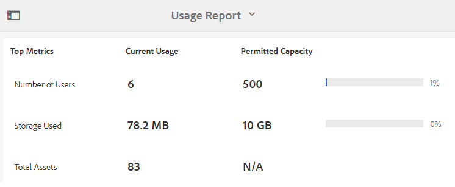

# 보고서를 사용한 작업 {#work-with-reports}

보고 기능은 Brand Portal 사용을 평가하고 내부 및 외부 사용자가 승인된 자산과 상호 작용하는 방법을 아는 데 유용합니다. 관리자는 자산 보고서 페이지에서 항상 사용할 수 있는 Brand Portal 사용량 보고서를 볼 수 있습니다. 그러나 사용자 로그인 및 링크를 통해 다운로드, 만료, 게시 및 공유되는 자산에 대한 보고서는 자산 보고서 페이지에서 생성하고 볼 수 있습니다. 이러한 보고서는 자산 배포를 분석하는 데 도움이 되며, 이를 통해 조직 내/외부에서 승인된 자산의 채택을 측정하는 주요 성공 지표를 도출할 수 있습니다.

보고서 관리 인터페이스는 직관적이고, 저장된 보고서에 액세스하기 위한 세분화된 옵션과 컨트롤을 포함합니다. 이전에 생성된 모든 보고서가 나열된 자산 보고서 페이지에서 보고서를 보거나, 다운로드하거나 삭제할 수 있습니다.

## 보고서 보기 {#view-reports}

보고서를 보려면 다음 단계를 수행합니다.

1. 상단의 도구 모음에서 Experience Manager 로고를 탭/클릭하여 관리 도구에 액세스합니다.

   

1. 관리 도구 패널에서 **[!UICONTROL 보고서 만들기/관리]** 열다 **[!UICONTROL 자산 보고서]** 페이지를 가리키도록 업데이트하는 중입니다.

   

1. 액세스 **[!UICONTROL 사용]** 자산 보고서 페이지에서 보고서 및 기타 생성된 보고서.

   >[!NOTE]
   >
   >사용량 보고서는 Brand Portal에서 생성된 기본 보고서입니다. 만들거나 삭제할 수 없습니다. 그러나 다운로드, 만료, 게시, 링크 공유 및 사용자 로그인 보고서를 생성, 다운로드 및 삭제할 수 있습니다.

   보고서를 보려면 보고서 링크를 클릭합니다. 또는 보고서를 선택하고 도구 모음에서 보기 아이콘을 탭하거나 클릭합니다.

   **[!UICONTROL 사용 보고서]** Brand Portal의 활성 Brand Portal 사용자 수, 모든 에셋이 사용 중인 저장소 공간 및 총 에셋 수에 대한 정보를 표시합니다. Admin Console의 제품 프로필에 할당되지 않은 Brand Portal 사용자는 비활성 사용자로 간주되며 에 반영되지 않습니다 **[!UICONTROL 사용 보고서]**.
또한 이 보고서에는 이러한 각 정보 지표에 대해 허용되는 능력이 표시됩니다.

   

   **[!UICONTROL 사용자 로그인]** 보고서는 Brand Portal에 로그인한 사용자에 대한 정보를 제공합니다. 이 보고서는 Brand Portal 6.4.2 배포에서 보고서 생성 시까지의 각 사용자의 표시 이름, 이메일 ID, 가상 사용자(관리자, 뷰어, 편집기, 게스트), 그룹, 마지막 로그인, 활동 상태 및 로그인 횟수를 보여줍니다.

   

   **[!UICONTROL 다운로드]** 보고서 는 특정 날짜 및 시간 범위에서 다운로드된 모든 에셋에 대한 세부 사항을 나열합니다.

   

   >[!NOTE]
   >
   >에셋 **[!UICONTROL 다운로드]** 보고서는 Brand Portal에서 개별적으로 선택하고 다운로드한 에셋만 표시합니다. 사용자가 에셋이 포함된 폴더를 다운로드한 경우 보고서에는 폴더 또는 폴더 내 에셋이 표시되지 않습니다.

   **[!UICONTROL 만료]** 보고서는 특정 기간에 만료된 모든 자산을 나열하고 자세히 설명합니다.

   

   **[!UICONTROL 게시]** 보고서는 지정된 시간대에 Experience Manager Assets에서 Brand Portal으로 게시된 모든 에셋에 대한 정보를 나열하고 제공합니다.

   

   >[!NOTE]
   >
   >컨텐츠 조각은 Brand Portal에 게시할 수 없으므로 보고서 게시에는 컨텐츠 조각에 대한 정보가 표시되지 않습니다.

   **[!UICONTROL 링크 공유 보고서]** Brand Portal 인터페이스의 링크를 통해 공유되는 모든 자산을 특정 시간대에 나열합니다. 또한 이 보고서는 링크가 공유된 에셋이 언제 링크를 통해 공유되었고, 어떤 사용자에 의해 링크가 만료되며, 테넌트(및 에셋 링크를 공유한 사용자)에 대한 공유 링크의 수를 알려줍니다. 링크 공유 보고서의 열은 사용자 지정할 수 없습니다.

   

   >[!NOTE]
   >
   >링크 공유 보고서에는 링크를 통해 공유된 에셋에 액세스할 수 있거나 링크를 통해 에셋을 다운로드한 사용자가 표시되지 않습니다.
   >
   >공유 링크를 통해 다운로드를 추적하는 경우 을 선택한 후 다운로드 보고서를 생성해야 합니다 **[!UICONTROL 링크 공유 다운로드만]** 옵션 켜기 **[!UICONTROL 보고서 만들기]** 페이지를 가리키도록 업데이트하는 중입니다. 그러나 이 경우 사용자(다운로드자)는 익명입니다.

## 보고서 생성 {#generate-reports}

관리자는 다음과 같은 표준 보고서를 생성하고 관리할 수 있으며, 생성된 보고서는 저장되므로 [액세스됨](../using/brand-portal-reports.md#main-pars-header) 나중에:

* 사용자 로그인
* 다운로드
* 만료
* 게시
* 공유 링크

다운로드, 만료 및 게시 보고서의 열은 보기에 맞게 사용자 지정할 수 있습니다. 보고서를 생성하려면 다음 단계를 수행합니다.

1. 상단의 도구 모음에서 Experience Manager 로고를 탭/클릭하여 관리 도구에 액세스합니다.

1. 관리 도구 패널에서 을 탭/클릭합니다 **[!UICONTROL 보고서 만들기/관리]** 열다 **[!UICONTROL 자산 보고서]** 페이지를 가리키도록 업데이트하는 중입니다.

   

1. In the Asset Reports page, tap/click **[!UICONTROL Create]**.
1. 다음에서 **[!UICONTROL 보고서 만들기]** 페이지를 만들고, 만들 보고서를 선택한 다음 탭/클릭합니다 **[!UICONTROL 다음]**.

   

1. 보고서 세부 사항을 구성합니다. 제목, 설명, 폴더 구조(보고서를 실행하고 통계를 생성해야 하는 위치) 및 날짜 범위를 지정합니다. **[!UICONTROL 다운로드]**, **[!UICONTROL 만료]**, 및 **[!UICONTROL 게시]** 보고서.

   

   반면, **[!UICONTROL 링크 공유 보고서]** 제목, 설명 및 날짜 범위 매개 변수만 있으면 됩니다.

   

   >[!NOTE]
   >
   >보고서 제목의 특수 문자 # 및 %는 보고서 생성 시 하이픈(-)으로 대체됩니다.

1. 탭/클릭 **[!UICONTROL 다음]**&#x200B;를 클릭하여 다운로드, 만료 및 게시 보고서의 열을 구성합니다.
1. 필요에 따라 적절한 확인란을 선택하거나 선택 취소합니다. 예를 들어 에셋을 다운로드한 사용자의 이름을 보려면 **[!UICONTROL 다운로드]** 보고서, 선택 **[!UICONTROL 다운로드한 사람:]**. 다음 이미지는 다운로드 보고서에서 기본 열을 선택하는 방법을 보여줍니다.

   

   이러한 보고서에 사용자 정의 열을 추가하여 사용자 정의 요구 사항에 더 많은 데이터를 표시할 수도 있습니다.

   다운로드, 게시 또는 만료 보고서에 사용자 정의 열을 추가하려면 다음 단계를 수행합니다.

   1. 사용자 정의 열을 표시하려면 을 탭/클릭합니다 **[!UICONTROL 추가]** 다음 범위 내 [!UICONTROL 사용자 정의 열].
   1. 열 이름 지정 **[!UICONTROL 열 이름]** 필드.
   1. 속성 선택기를 사용하여 열이 매핑되어야 하는 속성을 선택합니다.

      
또는 속성 경로 필드에 경로를 입력합니다.

      

      사용자 정의 열을 더 추가하려면 탭/클릭합니다 **추가** 2단계와 3단계를 반복합니다.

1. **[!UICONTROL 만들기]**&#x200B;를 탭/클릭합니다. 보고서 생성이 시작되었음을 알리는 메시지가 표시됩니다.

## 보고서 다운로드 {#download-reports}

보고서를 .csv 파일로 저장하고 다운로드하려면 다음 중 하나를 수행합니다.

* 자산 보고서 페이지에서 보고서를 선택하고 탭/클릭합니다 **[!UICONTROL 다운로드]** 을 클릭하여 제품에서 사용할 수 있습니다.

* 자산 보고서 페이지에서 보고서를 엽니다. 선택 **[!UICONTROL 다운로드]** 보고서 페이지 상단의 옵션입니다.

## 보고서 삭제 {#delete-reports}

기존 보고서를 삭제하려면 다음 위치에서 보고서를 선택합니다 **[!UICONTROL 자산 보고서]** 페이지 및 탭/클릭 **[!UICONTROL 삭제]** 을 클릭하여 제품에서 사용할 수 있습니다.

>[!NOTE]
>
>**[!UICONTROL 사용]** 보고서를 삭제할 수 없습니다.
