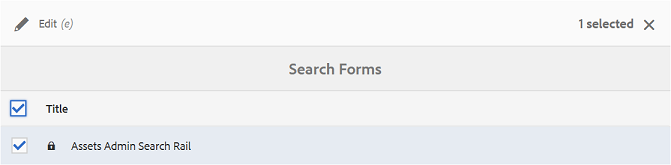

# 사용자 정의 검색 패싯 사용 {#use-custom-search-facets}

관리자는 필터 패널에 검색 [!UICONTROL 설명] 을 추가하여 검색을 사용자 정의하고 검색 기능을 활용할 수 있습니다.

브랜드 포털은 승인된 브랜드 자산의 세부 검색을 [위한 패싯 검색을](../using/brand-portal-searching.md#search-using-facets-in-filters-panel) 지원합니다. 이는 필터 [**패널&#x200B;**에 의해 가능합니다](../using/brand-portal-searching.md#search-using-facets-in-filters-panel). 검색 패싯은 관리 도구에서 양식&#x200B;**[!UICONTROL 검색을 통해 필터]**패널에서 사용할 수 있습니다. 관리 도구의 검색 양식 페이지에 자산 관리 검색 레일이라고 하는 기본 검색 양식이 있습니다. 그러나 관리자는 검색 조건자를 추가, 수정 또는 제거하여 기본 검색 양식(자산 관리자 검색 레일)을 편집하여 검색 기능을 다양한 용도로 사용할 수 있도록 함으로써 기본 필터 패널을 사용자 정의할 수 있습니다.

다양한 검색 조건자를 사용하여 필터 패널을 사용자 정의할 **[!UICONTROL 수]** 있습니다. 예를 들어 속성 조건자를 추가하여 이 술어에 지정한 단일 속성과 일치하는 자산을 검색합니다. 옵션 조건자를 추가하여 특정 속성에 대해 지정한 하나 이상의 값과 일치하는 자산을 검색합니다. 날짜 범위 술어를 추가하여 지정된 날짜 범위 내에서 만든 자산을 검색합니다.

>[!NOTE]
>
>AEM에서는 조직에서 브랜드 포털에서 동일한 양식을 다시 만드는 대신 AEM Author [에서 브랜드 포털로 사용자 지정된 검색 양식을](../using/publish-schema-search-facets-presets.md#publish-search-facets-to-brand-portal) 게시할 수 있습니다.

## 검색 설명 추가 {#add-a-search-predicate}

필터 패널에 검색 **[!UICONTROL 조건자를]** 추가하려면:

1. 관리 도구에 액세스하려면 상단에 있는 도구 모음에서 AEM 로고를 클릭합니다.

   

1. 관리 도구 패널에서 양식 **[!UICONTROL 검색을 클릭합니다]**.

   

1. 양식 **[!UICONTROL 검색]** 페이지에서 **[!UICONTROL 자산 관리 검색 레일을 선택합니다]**.

   

1. 상단에 표시되는 도구 모음에서 편집 **[!UICONTROL 을]** 클릭하여 편집 검색 양식을 엽니다.

   

1. 검색 [!UICONTROL 양식] 편집 페이지에서 설명 [!UICONTROL 선택] 탭에서 기본 창으로 술어를드래그합니다. 예를 들어 속성 설명 **[!UICONTROL 을 드래그합니다]**.

   속성 **** 필드가 기본 창에 나타나고 오른쪽의 **[!UICONTROL 설정]** 탭에 속성 예측이 표시됩니다.

   

   >[!NOTE]
   >
   >설정 탭의 헤더 레이블은 **[!UICONTROL 선택한 설명]** 유형을 식별합니다.

1. [ **[!UICONTROL 설정]** ] 탭에서 속성 설명 레이블, 자리 표시자 텍스트 및 설명을 입력합니다.

   * 지정된 **[!UICONTROL 속성]**&#x200B;값에 따라 자산의 부분 구문 검색(및 와일드카드 검색)을 허용하려는 경우 부분 검색을 선택합니다. 기본적으로 술어는 전체 텍스트 검색을 지원합니다.
   * 속성 값 **[!UICONTROL 을 기반으로 한 자산 검색을 대/소문자를 구분하지 않도록 하려면 [대/소문자]**&#x200B;무시]를 선택합니다. 기본적으로 검색 필터에서 속성 값 검색은 대/소문자를 구분합니다.

   >[!NOTE]
   >
   >부분 검색 **[!UICONTROL 확인란을]** 선택하면 **[!UICONTROL 기본적으로 대/소문자]** 무시가 선택됩니다.

1. 속성 **[!UICONTROL 이름]** 필드에서 속성 선택기를 열고 검색이 수행되는 속성을 선택합니다. 또는 속성의 이름을 입력합니다. 예를 들어, enter `  jcr :content/metadata/dc:title` or `./jcr:content/metadata/dc:title`.

   

1. 완료를 **[!UICONTROL 클릭하여]** 설정을 저장합니다.
1. [ [!UICONTROL 자산] ] 사용자 인터페이스에서 오버레이 아이콘을 클릭하고 **[!UICONTROL 필터]** 를 선택하여 **[!UICONTROL 필터]** 패널로이동합니다. 속성 **[!UICONTROL 설명]** 이 패널에 추가됩니다.

   

1. 속성 텍스트 상자에 검색할 자산의 제목을 **** 입력합니다. 예: &quot;Adobe&quot; 검색을 수행하면 제목이 &quot;Adobe&quot;와 일치하는 자산이 검색 결과에 표시됩니다.

## 검색 설명 목록 {#list-of-search-predicates}

속성 **[!UICONTROL 설명]** 추가 방식과 유사하게, 필터 **[!UICONTROL 패널에 다음]** 조건자를 추가할 수 있습니다.

| **설명 이름** | **설명** | **속성** |
|-------|-------|----------|
| **[!UICONTROL 경로 브라우저]** | 특정 위치에서 에셋을 검색하도록 조건자를 검색합니다. **참고:** *로그인한 사용자의 경우 [필터]의 경로 브라우저는 사용자와 공유된 폴더(및 해당 상위 항목)의 컨텐츠 구조만 표시합니다.*   관리자 사용자는 경로 브라우저를 사용하여 해당 폴더로 이동하여 모든 폴더의 에셋을 검색할 수 있습니다.   반면에 관리자가 아닌 사용자는 경로 브라우저의 해당 폴더로 이동하여 폴더의 에셋을 검색할 수 있습니다(관리자가 아닌 사용자는 액세스 가능). | <ul><li>필드 레이블</li><li>경로</li><li>설명</li></ul> |
| **[!UICONTROL 속성]** | 특정 메타데이터 속성을 기반으로 자산을 검색합니다. **참고:** *부분 검색을 선택하면 기본적으로 대/소문자 무시 옵션이 선택되어 있습니다*. | <ul><li>필드 레이블</li><li>자리 표시자</li><li>속성 이름</li><li>부분 검색</li><li>대소문자 구분 안 함</li><li> 설명</li></ul> |
| **[!UICONTROL 다중 값 속성]** | 속성 조건자와 비슷하지만, 입력 값과 일치하는 구분 기호(기본값은 COMMA[,])로 구분된 여러 입력 값이 결과로 반환됩니다. | <ul><li>필드 레이블</li><li>자리 표시자</li><li>속성 이름</li><li>구분 기호 지원</li><li>대소문자 구분 안 함</li><li>설명</li></ul> |
| **[!UICONTROL 태그]** | 검색 조건자를 사용하여 태그를 기반으로 자산을 검색합니다. 태그 목록에서 다양한 태그를 채우도록 경로 속성을 구성할 수 있습니다. *참고: 예를 들어, 관리자가 AEM에서 검색 양식을 게시하고 경로 [!UICONTROL `/etc/tags/mac/<tenant_id>/<custom_tag_namespace>`]에 테넌트 정보가 포함되지 않는 경우 경로 값을 변경해야 할 수 있습니다(예: [!UICONTROL `/etc/tags/<custom_tag_namespace>`]). | <ul><li>필드 레이블</li><li>속성 이름</li><li>경로</li><li>설명</li></ul> |
| **[!UICONTROL 경로]** | 특정 위치에서 에셋을 검색하도록 조건자를 검색합니다. | <ul><li>필드 레이블</li><li>경로</li><li>설명</li></ul> |  |
| **[!UICONTROL 상대적 날짜]** | 검색 조건자를 사용하여 자산의 생성 상대 날짜를 기준으로 자산을 검색합니다. | <ul><li>필드 레이블</li><li>속성 이름</li><li>상대적 날짜</li></ul> |
| **[!UICONTROL 범위]** | 검색 조건자를 사용하여 지정된 속성 값 범위 내의 자산을 검색합니다. 필터 패널에서 범위에 대한 최소 및 최대 속성 값을 지정할 수 있습니다. | <ul><li>필드 레이블</li><li>속성 이름</li><li>설명</li></ul> |
| **[!UICONTROL 날짜 범위]** | 검색 조건자를 사용하여 날짜 속성에 대해 지정된 범위 내에서 만들어진 자산을 검색합니다. 필터 패널에서 시작 및 종료 날짜를 지정할 수 있습니다. | <ul><li>필드 레이블</li><li>자리 표시자</li><li>속성 이름</li><li>범위 텍스트(시작)</li><li>범위 텍스트(끝)</li><li>설명</li></ul> |
| **[!UICONTROL 날짜]** | 날짜 속성을 기반으로 한 슬라이더 기반의 자산 검색에 대한 설명 검색 | <ul><li>필드 레이블</li><li>속성 이름</li><li>설명</li></ul> |
| **[!UICONTROL 파일 크기]** | 검색 조건자를 사용하여 크기를 기준으로 자산을 검색합니다. | <ul><li>필드 레이블</li><li>속성 이름</li><li>경로</li><li>설명</li></ul> |
| **[!UICONTROL 마지막으로 수정된 자산]** | 검색 조건자를 사용하여 마지막으로 수정한 날짜를 기준으로 자산을 검색합니다. | <ul><li>필드 레이블</li><li>속성 이름</li><li>설명</li></ul> |
| **[!UICONTROL 승인 상태]** | 검색 조건자를 사용하여 승인 메타데이터 속성을 기반으로 자산을 검색합니다. 기본 속성 이름은 **dam:status입니다**. | <ul><li>필드 레이블</li><li>속성 이름</li><li>설명</li></ul> |
| **[!UICONTROL 체크아웃 상태]** | 검색 조건자를 사용하여 AEM Assets에서 자산을 게시했을 때 자산의 체크 아웃 상태를 기반으로 자산을 검색합니다. | <ul><li>필드 레이블</li><li>속성 이름</li><li>설명</li></ul> |
| **[!UICONTROL 체크아웃 기준]** | 검색 조건자를 사용하여 자산을 체크 아웃한 사용자를 기반으로 자산을 검색합니다. | <ul><li>필드 레이블</li><li>속성 이름</li><li>설명</li></ul> |
| **[!UICONTROL 만료 상태]** | 만료 상태에 따라 에셋을 검색할 조건자를 검색합니다. | <ul><li>필드 레이블</li><li>속성 이름</li><li>설명</li></ul> |
| **[!UICONTROL 컬렉션 구성원]** | 검색 조건자를 사용하여 자산이 컬렉션의 일부인지 여부를 기반으로 자산을 검색합니다. | 설명 |
| **[!UICONTROL 숨김]** | 이 술어는 최종 사용자에게 명시적으로 표시되지 않으며, 일반적으로 검색 결과 유형을 **dam:Asset로 제한하는 모든 숨겨진 제약 조건에 사용됩니다**. | <ul><li>필드 레이블</li><li>속성 이름</li><li>설명</li></ul> |

>[!NOTE]
>
>이러한 **[!UICONTROL 조건자가 브랜드 포털에서]**&#x200B;작동하지 않으므로 옵션 설명 **[!UICONTROL ,]**&#x200B;게시 상태 설명 **[!UICONTROL 및]** 등급 설명을 사용하지 마십시오.

## 검색 설명 삭제 {#delete-a-search-predicate}

검색 조건자를 삭제하려면 다음 단계를 따르십시오.

1. 관리 도구에 액세스하려면 Adobe 로고를 클릭합니다.

   

1. 관리 도구 패널에서 양식 **[!UICONTROL 검색을 클릭합니다]**.

   

1. 양식 **[!UICONTROL 검색]** 페이지에서 **[!UICONTROL 자산 관리 검색 레일을 선택합니다]**.

   

1. 상단에 표시되는 도구 모음에서 편집 **[!UICONTROL 을]** 클릭하여 편집 검색 양식을 엽니다.

   

1. 검색 양식 [!UICONTROL 편집] 페이지의 기본 창에서 삭제할 조건자를 선택합니다. 예를 들어 속성 설명 **[!UICONTROL 을 선택합니다]**.

   오른쪽의 **[!UICONTROL 설정]** 탭에는 속성 설명 필드가 표시됩니다.

1. 속성 설명을 삭제하려면 저장소 아이콘을 클릭합니다. 필드 **[!UICONTROL 삭제]** 대화 상자에서 **[!UICONTROL 삭제를]** 클릭하여 삭제 작업을 확인합니다.

   속성 **[!UICONTROL 설명]** 필드가 주 창에서 제거되고 **[!UICONTROL 설정]** 탭이 비어 있게 됩니다.

   

1. 변경 내용을 저장하려면 도구 모음 **[!UICONTROL 에서 완료를]** 클릭합니다.
1. [ **[!UICONTROL 자산]** ] 사용자 인터페이스에서 오버레이 아이콘을 클릭하고 **[!UICONTROL 필터]** 를 선택하여 **[!UICONTROL 필터]** 패널로이동합니다. 속성 **[!UICONTROL 설명]** 이 패널에서 제거됩니다.

   
