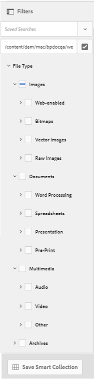
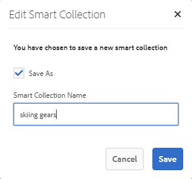

# Brand Portal에서 자산 검색 {#search-assets-on-brand-portal}

브랜드 포털 검색 기능을 사용하면 옴니서치 및 필터를 사용하여 검색 범위를 좁히는 데 도움이 되는 패싯 검색을 사용하여 관련 자산을 신속하게 검색할 수 있습니다. 나중에 검색을 스마트 컬렉션으로 저장할 수도 있습니다.

## Omnisearch를 사용하여 자산 검색 {#search-assets-using-omnisearch}

브랜드 포털에서 자산을 검색하려면

1. 도구 모음에서 검색 **[!UICONTROL 아이콘을 클릭하거나]**&quot;**[!UICONTROL /]**&quot; 키를 눌러 Omnisearch를 시작합니다.

   

1. 검색 상자에 검색할 자산에 대한 키워드를 입력합니다.

   

   >[!NOTE]
   >
   >검색 제안이 표시되려면 3자 이상이 필요합니다.

1. 관련 자산에 빠르게 액세스하려면 드롭다운 목록에 표시되는 관련 제안에서 선택합니다.

   

   *omnisearch를 사용한 자산 검색*

스마트 태그 자산 검색 비헤이비어에 대한 자세한 내용은 검색 결과 및 비헤이비어를 참조하십시오.

## 필터 패널에서 패싯을 사용하여 검색 {#search-using-facets-in-filters-panel}

필터 패널에서 검색 패싯을 사용하면 검색 경험에 세부기간을 추가하고 검색 기능을 효율적으로 사용할 수 있습니다. 검색 패싯은 복잡한 검색을 수행할 수 있도록 해주는 여러 차원(예측)을 사용합니다. 원하는 세부 수준으로 드릴다운하여 보다 집중적인 검색을 수행할 수 있습니다.

예를 들어, 이미지를 찾고 있는 경우 비트맵과 벡터 이미지 중 어느 것을 원하는지 선택할 수 있습니다. 파일 유형 검색 패싯에서 이미지의 MIME 유형을 지정하여 검색 범위를 더 줄일 수 있습니다. 마찬가지로 문서를 검색할 때 형식(예: PDF 또는 MS Word 형식)을 지정할 수 있습니다. 

[ **[!UICONTROL 필터]**] 패널에는**[!UICONTROL &#x200B;경로 브라우저]**, **[!UICONTROL 경로 유형]**,**[!UICONTROL &#x200B;파일 크기]**, 파일 **[!UICONTROL 방향,]******위치, 상태 및 시간 초과, 시간 초과, 그러나 기본 검색 양식에서 조건자를 추가하거나 제거하여 필터 [패널에서](../using/brand-portal-search-facets.md) 사용자 정의 검색 패싯을 ****추가하거나 특정 검색 패싯을 제거할 수 있습니다. 브랜드 포털에서 사용 가능한[검색 예측 목록을 참조하십시오](../using/brand-portal-search-facets.md#list-of-search-predicates).

사용 가능한 [검색 패싯을](../using/brand-portal-search-facets.md)사용하여 검색에 필터를 적용하려면:

1. 오버레이 아이콘을 클릭하고 필터를 **[!UICONTROL 선택합니다]**.

   

1. 왼쪽의 **[!UICONTROL [필터]**] 패널에서 적절한 옵션을 선택하여 관련 필터를 적용합니다.
예를 들어 다음 표준 필터를 사용합니다.

   * **[!UICONTROL 경로]**브라우저를 사용하여 특정 디렉토리에서 자산을 검색합니다. 경로 브라우저에 대한 조건자의 기본 검색 경로는 기본 검색 양식을 편집하여 구성할 수`/content/dam/mac/<tenant-id>/`있는 경로입니다.
   >[!NOTE]
   >
   >관리자가 아닌 사용자에게 필터 [!UICONTROL 패널의] 경로 브라우저는 [!UICONTROL 해당] 사용자와 공유된 폴더의 컨텐츠 구조만 표시합니다.\
   >사용자를 관리하기 위해 경로 브라우저를 사용하면 브랜드 포털의 모든 폴더로 이동할 수 있습니다.

   * **[!UICONTROL 파일]**유형을 사용하여 원하는 에셋 파일의 유형(이미지, 문서, 멀티미디어, 아카이브)을 지정합니다. 또한 검색의 범위를 좁힐 수 있습니다. 예를 들어 문서의 이미지 또는 형식(PDF 또는 MS Word)에 대한 MIME 유형(Tiff, Bitmap, GIMP Images)을 지정할 수 있습니다.
   * **[!UICONTROL 파일]**크기를 기준으로 자산을 검색할 수 있습니다. 크기 범위의 하한과 상한을 지정하여 검색 범위를 좁히고 검색할 측정 단위를 지정할 수 있습니다.
   * **[!UICONTROL 승인(승인됨, 변경사항 요청, 거부됨, 보류 중) 및 만료와 같은 자산 상태에 따라 자산을 검색하는 상태]**.
   * **[!UICONTROL 자산의]**등급을 기준으로 자산을 검색하는 평균 등급.
   * **[!UICONTROL 자산의 방향]**(가로, 세로, 정사각형)을 기준으로 자산을 검색하는 방향입니다.
   * **[!UICONTROL 자산의 스타일(컬러, 단색)을 기반으로 자산을 검색하려면 스타일을]**지정합니다.
   * **[!UICONTROL 비디오 형식을]**기반으로 비디오 에셋을 검색할 수 있는 비디오 형식(DVI, Flash, MPEG4, MPEG, OGG Theora, QuickTime, Windows Media, WebM).
   기본 검색 양식을 편집하여 필터 패널에서 [사용자 정의 검색 패싯을](../using/brand-portal-search-facets.md) 사용할 수 있습니다.

   * **[!UICONTROL 속성]**설명(검색 양식에서 사용되는 경우)을 사용하면 조건자가 매핑되는 메타데이터 속성과 일치하는 자산을 검색할 수 있습니다.\
      예를 들어 속성 조건자가 에 매핑된 경우 [!UICONTROL `jcr:content /metadata/dc:title`]해당 제목을 기준으로 자산을 검색할 수 있습니다.\
      속성 [!UICONTROL 조건자는] 다음에 대한 텍스트 검색을 지원합니다.

      **부분 구문**
속성 조건부에서 부분 구문을 사용하여 자산 검색을 허용하도록 검색 양식에서 **[!UICONTROL 부분 검색]**확인란을 활성화합니다.\
      자산 메타데이터에 사용된 단어/구문을 정확히 지정하지 않더라도 원하는 자산을 검색할 수 있습니다.\
      다음을 작업을 수행할 수 있습니다.
      * 필터 패널의 패싯에서 검색된 구문에서 발생하는 단어를 지정합니다. For example, if you search for the term **climb** (and Property Predicate is mapped to [!UICONTROL `dc:title`] property), then all the assets with the word **climb** in their title phrase are returned.
      * 검색한 구문에서 발생하는 단어의 일부와 와일드카드 문자(*)를 지정하여 간격을 채웁니다.
예를 들어 다음을 검색할 수 있습니다.
         * **climb*** 제목 구문에 &quot;hide&quot;로 시작하는 단어가 있는 모든 자산을 반환합니다.
         * ***climb** 는 제목 구문에 &quot;climb&quot;로 끝나는 단어가 포함된 모든 자산을 반환합니다.
         * ***climb*** 제목 구문에 &quot;climb&quot;로 구성된 단어가 포함된 모든 자산을 반환합니다.
      **대/소문자를 구분하지 않는 텍스트**&#x200B;속성 조건자에서 대/소문자를 구분하지 않는 검색을 허용하려면 검색 양식에서 **[!UICONTROL 대]**소문자 무시 확인란을 활성화합니다. 기본적으로 속성 조건자에 대한 텍스트 검색은 대소문자를 구분합니다.
   >[!NOTE]
   >
   >부분 검색 **[!UICONTROL 확인란을 선택하면]**기본적으로**[!UICONTROL &#x200B;대소문자]** 무시가 선택됩니다.

   

   검색 결과는 적용된 필터에 따라 검색 결과 수와 함께 표시됩니다.

   

   검색 결과 카운트가 있는 자산 검색 결과.

1. 검색 결과에서 항목을 쉽게 탐색하고 검색 쿼리를 다시 실행하지 않고도 브라우저의 뒤로 단추를 사용하여 동일한 검색 결과로 돌아갈 수 있습니다.

## 검색을 스마트 컬렉션으로 저장 {#save-your-searches-as-smart-collection}

검색 설정을 스마트 컬렉션으로 저장하여 나중에 동일한 설정을 다시 실행하지 않고도 동일한 검색을 빠르게 반복할 수 있습니다.

검색 설정을 스마트 컬렉션으로 저장하려면

1. 스마트 컬렉션 **[!UICONTROL 저장을 탭/클릭하고]**스마트 컬렉션의 이름을 제공합니다.

   모든 사용자가 스마트 컬렉션을 액세스할 수 있도록 하려면 [공용]을 **[!UICONTROL 선택합니다]**. 스마트 컬렉션이 만들어져서 저장된 검색 목록에 추가되었음을 확인하는 메시지가 표시됩니다.

   >[!NOTE]
   >
   >관리자가 아닌 사용자는 조직의 브랜드 포털에서 관리자가 아닌 사용자가 만든 많은 수의 공개 스마트 컬렉션을 공유하지 못하도록 할 수 있습니다. 조직은 관리 도구 패널에서 **[!UICONTROL 사용 가능한 일반]**설정에서 공개 스마트 컬렉션 생성**** 허용 구성을 비활성화할 수 있습니다.

   

1. 스마트 컬렉션을 다른 이름으로 저장하고 공개 확인란을 선택하거나 **[!UICONTROL 지우려면 스마트]**컬렉션**[!UICONTROL &#x200B;편집을 클릭합니다]**.

   

1. 스마트 **[!UICONTROL 컬렉션 편집]**대화 상자에서 다른**[!UICONTROL &#x200B;이름으로]** 저장을 선택하고 스마트 컬렉션의 이름을 입력합니다. **[!UICONTROL 저장]**을 클릭합니다.

   
