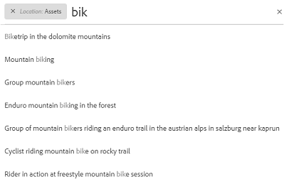

# Brand Portal에서 자산 검색 {#search-assets-on-brand-portal}

Brand Portal 검색 기능을 사용하면 omnisearch 및 필터를 사용하는 패싯 검색을 사용하여 관련 자산을 빠르게 검색할 수 있으므로 검색 범위를 더 좁힐 수 있습니다. 나중에 검색을 스마트 컬렉션으로 저장할 수도 있습니다.

## Omnisearch {#search-assets-using-omnisearch}를 사용하여 자산 검색

Brand Portal에서 자산을 검색하려면 다음을 수행하십시오.

1. 도구 모음에서 **[!UICONTROL 검색]** 아이콘을 클릭하거나 &quot;**[!UICONTROL /]**&quot; 키를 눌러 Omnisearch를 시작합니다.

   

1. 검색 상자에서 검색할 자산에 대한 키워드를 입력합니다.

   

   >[!NOTE]
   >
   >검색 제안이 표시되려면 omnisearch에 3자 이상이 필요합니다.

1. 드롭다운 목록에 나타나는 관련 제안 중에서 선택하여 관련 자산에 빠르게 액세스합니다.

   

   *omnisearch를 사용한 자산 검색*

스마트 태그가 지정된 자산의 검색 동작에 대해 알아보려면 [검색 결과 및 동작 이해](https://helpx.adobe.com/experience-manager/6-5/assets/using/search-assets.html)를 참조하십시오.

## 필터 패널 {#search-using-facets-in-filters-panel}에서 패싯을 사용하여 검색

필터 패널의 검색 패싯을 사용하면 검색 환경에 세부 사항을 추가하여 검색 기능을 효율적으로 수행할 수 있습니다. 검색 패싯에서는 복잡한 검색을 수행할 수 있는 여러 차원(설명)을 사용합니다. 보다 집중된 검색을 위해 원하는 세부 정보로 쉽게 드릴다운할 수 있습니다.

예를 들어, 이미지를 찾는 경우 비트맵과 벡터 이미지 중 어느 것을 선택할지 선택할 수 있습니다. 파일 유형 검색 패싯에서 이미지에 대한 MIME 유형을 지정하여 검색 범위를 더 줄일 수 있습니다. 마찬가지로, 문서를 검색할 때 PDF 또는 MS Word 형식과 같은 형식을 지정할 수 있습니다. 

**[!UICONTROL 필터]** 패널에는 - **[!UICONTROL 경로 브라우저]**, **[!UICONTROL 파일 유형]**, **[!UICONTROL 파일 크기]**, **[!UICONTROL 상태]** 및 **[!UICONTROL 방향]**&#x200B;과 같은 몇 가지 표준 패싯이 포함되어 있습니다. 그러나 [사용자 정의 검색 패싯](../using/brand-portal-search-facets.md)을 추가하거나, 기본 검색 양식에서 조건자를 추가하거나 제거하여 **[!UICONTROL 필터]** 패널에서 특정 검색 패싯을 제거할 수 있습니다. Brand Portal](../using/brand-portal-search-facets.md#list-of-search-predicates)에서 사용 가능하고 사용 가능한 [검색 조건자 목록을 참조하십시오.

사용 가능한 [검색 패싯](../using/brand-portal-search-facets.md)을 사용하여 필터를 검색에 적용하려면:

1. 오버레이 아이콘을 클릭하고 **[!UICONTROL 필터]**&#x200B;를 선택합니다.

   

1. 왼쪽의 **[!UICONTROL 필터]** 패널에서 적절한 옵션을 선택하여 관련 필터를 적용합니다.
예를 들어, 다음 표준 필터를 사용하십시오.

   * **[!UICONTROL 경로]** 특정 디렉터리에서 자산을 검색하는 브라우저입니다. 경로 브라우저에 대한 조건부의 기본 검색 경로는 `/content/dam/mac/<tenant-id>/`입니다. 기본 검색 양식을 편집하여 구성할 수 있습니다.
   >[!NOTE]
   >
   >관리자가 아닌 사용자를 위해 [!UICONTROL 필터] 패널의 [!UICONTROL 경로 브라우저]는 사용자와 공유되는 폴더(및 상위 폴더)의 컨텐츠 구조만 표시합니다.\
   >관리자 사용자에게 경로 브라우저를 사용하면 Brand Portal의 모든 폴더로 이동할 수 있습니다.

   * **[!UICONTROL 파일]** 유형 을 사용하여 찾고 있는 자산 파일의 유형(이미지, 문서, 멀티미디어, 아카이브)을 지정합니다. 또한 검색 범위를 좁힐 수 있습니다. 예를 들어 문서의 이미지 또는 형식(PDF 또는 MS Word)에 대한 MIME 유형(Tiff, Bitmap, GIMP 이미지)을 지정할 수 있습니다.
   * **[!UICONTROL 파일]** 크기 기준으로 자산을 검색합니다. 검색 범위를 좁힐 수 있도록 크기 범위의 하한과 상한을 지정하고 검색할 측정 단위를 지정할 수 있습니다.
   * **** 승인(승인, 변경 요청, 거부, 보류 중) 및 만료와 같은 자산 상태를 기반으로 자산을 검색하는 상태.
   * **[!UICONTROL 자산]** 등급을 기준으로 자산을 검색하는 평균 등급.
   * **** 방향 자산의 방향(가로, 세로, 사각형)을 기반으로 자산을 검색합니다.
   * **** 자산의 스타일(컬러, 모노크롬)을 기반으로 자산을 검색하려면 클릭합니다.
   * **[!UICONTROL 비디오]** 포맷에서 비디오 자산을 검색할 수 있습니다(DVI, Flash, MPEG4, MPEG, OGG Theora, QuickTime, Windows Media, WebM).

   기본 검색 양식을 편집하여 필터 패널에서 [사용자 정의 검색 패싯](../using/brand-portal-search-facets.md)을 사용할 수 있습니다.

   * **[!UICONTROL 속성]** 조건검색 양식에서 사용하는 경우 조건부가 매핑된 메타데이터 속성과 일치하는 자산을 검색할 수 있습니다.\
      예를 들어 속성 조건부가 [!UICONTROL `jcr:content /metadata/dc:title`]에 매핑된 경우 해당 제목을 기준으로 자산을 검색할 수 있습니다.\
      [!UICONTROL 속성 조건자]는 다음에 대한 텍스트 검색을 지원합니다.

      **부분 구문**
속성 조건부에서 부분 구문을 사용하여 자산 검색을 허용하도록 검색 양식에서 **[!UICONTROL 부분 검색]** 확인란을 활성화합니다.\
      자산 메타데이터에 사용된 단어/구문을 정확히 지정하지 않더라도 원하는 자산을 검색할 수 있습니다.\
      다음을 작업을 수행할 수 있습니다.
      * 필터 패널에서 패싯의 검색한 구문에서 발생하는 단어를 지정합니다. 예를 들어 **climb**(및 속성 조건부가 [!UICONTROL `dc:title`] 속성에 매핑됨)이라는 용어를 검색하면 제목 구문에 **climb**&#x200B;이라는 단어가 포함된 모든 자산이 반환됩니다.
      * 검색한 구문에서 발생하는 단어의 일부와 와일드카드 문자(*)를 지정하여 간격을 채웁니다.
예를 들어 다음을 검색할 수 있습니다.
         * **climb*** 은 제목 구문에서 &quot;climb&quot;으로 시작하는 단어가 있는 모든 자산을 반환합니다.
         * **&#39;climb&#39;이라는** 단어가 등장하는 모든 재산을 자신의 직책에 &#39;climb&#39;이라는 글자로 바꿉니다.
         * ***climb*** 은 제목 구문에 &quot;climb&quot;이라는 문자가 포함된 모든 자산을 반환합니다.

속성 조건부에서 대소문자를 구분하지 않는 검색을 허용하려면       **대/소문자 구분**
텍스트Property 조건부에서 대소문자를 구분하지 않는 검색을 허용하려면  **[!UICONTROL Search Form]** 에서 Ignore Caseckbox를 활성화합니다. 기본적으로 속성 조건부의 텍스트 검색은 대소문자를 구분합니다.
   >[!NOTE]
   >
   >**[!UICONTROL 부분 검색]** 확인란을 선택하면 기본적으로 **[!UICONTROL 대/소문자 무시]**&#x200B;가 선택됩니다.

   

   검색 결과는 검색 결과 수와 함께 적용된 필터에 따라 표시됩니다.

   

   검색 결과 카운트가 있는 자산 검색 결과.

1. 검색 결과에서 항목을 쉽게 탐색하고 검색 쿼리를 다시 실행하지 않고 브라우저의 뒤로 단추를 사용하여 동일한 검색 결과로 돌아갈 수 있습니다.

## 검색을 스마트 컬렉션으로 저장 {#save-your-searches-as-smart-collection}

검색 설정을 스마트 컬렉션으로 저장하여 나중에 동일한 설정을 다시 실행하지 않고도 동일한 검색을 빠르게 반복할 수 있습니다.

검색 설정을 스마트 컬렉션으로 저장하려면 다음을 수행합니다.

1. **[!UICONTROL 스마트 컬렉션 저장]**&#x200B;을 탭/클릭하고 스마트 컬렉션 이름을 입력합니다.

   모든 사용자가 스마트 컬렉션에 액세스할 수 있도록 하려면 **[!UICONTROL 공용]**&#x200B;을 선택합니다. 스마트 컬렉션이 생성되어 저장된 검색 목록에 추가되었음을 확인하는 메시지가 표시됩니다.

   >[!NOTE]
   >
   >관리자가 아닌 사용자는 조직의 Brand Portal에서 관리자가 아닌 사용자가 만든 많은 수의 공개 스마트 컬렉션을 방지하기 위해 스마트 컬렉션을 공개하도록 제한할 수 있습니다. 조직은 관리 도구 패널에서 사용할 수 있는 **[!UICONTROL 일반]** 설정에서 **[!UICONTROL 공개 스마트 컬렉션 생성 허용]** 구성을 비활성화할 수 있습니다.

   

1. 스마트 컬렉션을 다른 이름으로 저장하고 **[!UICONTROL 공용]** 확인란을 선택하거나 선택 취소하려면 **[!UICONTROL 스마트 컬렉션 편집]**&#x200B;을 클릭합니다.

   

1. **[!UICONTROL 스마트 컬렉션 편집]** 대화 상자에서 **[!UICONTROL 다른 이름으로 저장]**&#x200B;을 선택하고 스마트 컬렉션 이름을 입력합니다. **[!UICONTROL 저장]**&#x200B;을 클릭합니다.

   
