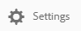

# 컬렉션 공유 {#share-collections}

컬렉션은 Adobe Experience Manager 자산 브랜드 포털에 함께 저장된 관련 자산 그룹을 나타냅니다. 사용자는 모든 검색 또는 패싯 검색을 [적용하여 관련 자산을](brand-portal-searching.md) 필터링하고 함께 저장하여 간편하게 액세스하여 다른 브랜드 포털 사용자와 공유할 수 있습니다.

관리자는 인가된 브랜드 포털 사용자와 컬렉션을 공유하고 공유를 취소할 수 있습니다. 편집자와 뷰어는 본인이 만든 컬렉션, 공유된 컬렉션 및 공개 컬렉션을 보고 공유할 수 있습니다.

>[!NOTE]
>
>편집자는 공개 컬렉션을 비공개 컬렉션으로 변경할 수 없으므로 **[!UICONTROL 컬렉션 설정 대화 상자에서 공개 컬렉션]** 확인란을 사용할 수 **[!UICONTROL 없습니다]** .

## 컬렉션 공유 {#share-collection}

다음은 승인된 브랜드 포털 사용자와 컬렉션을 공유하는 단계입니다.

1. 브랜드 포털 테넌트에 로그인합니다. 기본적으로 게시된 모든 자산 및 폴더를 **[!UICONTROL 포함하는 파일]** 보기가 열립니다.

1. 상단에 있는 빠른 탐색 메뉴에서 **[!UICONTROL 컬렉션을 클릭합니다]**.

1. 컬렉션 **[!UICONTROL 콘솔에서]** 다음 중 하나를 수행합니다.

   * 공유할 컬렉션 위로 포인터를 가져갑니다. 컬렉션에 사용할 수 있는 빠른 작업 축소판에서 **[!UICONTROL 설정]** 아이콘을 클릭합니다.

      

   * 공유할 컬렉션을 선택합니다. 상단에 있는 도구 모음에서 **[!UICONTROL 설정을 클릭합니다]**.

      

1. 컬렉션 **[!UICONTROL 설정]** 대화 상자에서 컬렉션을 공유할 사용자를 선택하고 사용자의 전역 역할과 일치하는 역할을 선택합니다. 예를 들어 전역 편집기에 편집기 역할을 지정하고 전역 뷰어에 뷰어 역할을 지정합니다.

   또는 그룹 멤버십과 역할에 관계없이 모든 사용자가 컬렉션을 사용할 수 있도록 하려면 **[!UICONTROL 공개 컬렉션]** 확인란을 선택하여 공개하십시오.

   >[!NOTE]
   >
   >하지만 시스템 공간을 저장할 수 있도록 관리자가 아닌 사용자는 공개 컬렉션을 만들 수 없도록 제한할 수 있습니다. 조직은 관리 도구 패널에서 사용 가능한 **[!UICONTROL 일반]** 설정에서 공개 컬렉션 제작 **** 허용 구성을 비활성화할 수 있습니다.

   

   편집자는 공개 컬렉션을 비공개 컬렉션으로 변경할 수 없으므로 **[!UICONTROL 컬렉션 설정 대화 상자에서 공개 컬렉션]** 확인란을 사용할 수 **[!UICONTROL 없습니다]** .

   

1. 사용자를 추가하려면 **[!UICONTROL 추가]** 단추를 클릭한 다음 **[!UICONTROL 저장을 클릭합니다]**. 컬렉션은 사용자와 공유됩니다.

   >[!NOTE]
   >
   >사용자 역할은 컬렉션 내의 자산 및 폴더에 대한 액세스를 관리합니다. 사용자에게 자산에 대한 액세스 권한이 없는 경우 빈 컬렉션은 사용자와 공유됩니다. 또한 사용자의 역할은 컬렉션에 사용할 수 있는 작업에 적용됩니다.

## 컬렉션 공유 취소 {#unshare-a-collection}

이전에 공유한 컬렉션의 공유를 취소하려면 다음을 수행하십시오.

1. 컬렉션 **[!UICONTROL 콘솔에서]** 공유를 취소할 컬렉션을 선택합니다.

   상단에 있는 도구 모음에서 **[!UICONTROL 설정을 클릭합니다]**.

   

1. 컬렉션 **[!UICONTROL 설정]** 대화 상자의 **[!UICONTROL 멤버]** 섹션 **[!UICONTROL 에서 사용자]** 옆에 있는x기호를 클릭하여 컬렉션에 액세스할 수 있는 사용자 목록에서 해당 기호를 제거합니다.

   

1. 경고 메시지가 나타납니다. 컬렉션 **[!UICONTROL 공유를]** 취소하려면 확인을 클릭합니다.

1. 저장을 **[!UICONTROL 클릭하여]** 변경 사항을 적용합니다.

   사용자가 공유 목록에서 제거되면 공유되지 않은 컬렉션은 사용자의 **[!UICONTROL 컬렉션]** 콘솔에서 제거됩니다.

<!--
1. Click the overlay icon on the left, and choose **[!UICONTROL Navigation]**.

   

1. From the siderail on the left, click **[!UICONTROL Collections]**.

   

1. From the **[!UICONTROL Collections]** console, do one of the following:

    * Hover the pointer over the collection you want to share. From the quick action thumbnails available for the collection, click the **[!UICONTROL Settings]** icon.

   

    * Select the collection you want to share. From the toolbar at the top, click **[!UICONTROL Settings]**.
    
   

1. In the [!UICONTROL Collection Settings] dialog box, select the users or groups with whom you want to share the collection and select the role for a user or a group to match their global role. For example, assign the Editor role to a global editor, the Viewer role to a global viewer.

   Alternatively, to make the collection available to all users irrespective of their group membership and role, make it public by selecting the **[!UICONTROL Public Collection]** check-box.

   >[!NOTE]
   >
   >However, non-admin users can be restricted from creating public collections, to avoid having numerous public collections so that system space can be saved. Organizations can disable the **[!UICONTROL Allow public collections creation]** configuration from [!UICONTROL General] settings available in admin tools panel.

   

   Editors cannot change a public collection to a non-public collection and, therefore, do not have **[!UICONTROL Public Collection]** check-box available in **[!UICONTROL Collection Settings]** dialog.

   

1. Select **[!UICONTROL Add]**, and then **[!UICONTROL Save]**. The collection is shared with the chosen users.

   >[!NOTE]
   >
   >A user's role governs access to the assets and folders inside a collection. If a user does not have access to assets, an empty collection is shared with the user. Also, a user's role governs the actions available for collections.

## Unshare a collection {#unshare-a-collection}

To unshare a previously shared collection, do the following:

1. From the **[!UICONTROL Collections]** console, select the collection you want to unshare.

   In the toolbar, click **[!UICONTROL Settings]**.

   

1. On the **[!UICONTROL Collection Settings]** dialog box, under **[!UICONTROL Members]**, click the **[!UICONTROL x]** symbol next to users or groups to remove them from the list of users you shared the collection with.

   

1. In the warning message box, click **[!UICONTROL Confirm]** to confirm unshare.

   Click **[!UICONTROL Save]**.

1. Log in to Brand Portal with the credentials of the user you removed from the shared list. The collection is removed from the **[!UICONTROL Collections]** console.
-->