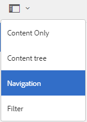

# 브랜드 포털에서 컬렉션 공유 {#share-collections-bp}

AEM Assets 브랜드 포털 관리자는 컬렉션 또는 스마트 컬렉션을 권한이 있는 사용자와 공유 및 공유 해제할 수 있습니다. 편집자는 자신이 만든 컬렉션, 공유된 컬렉션 및 공개 컬렉션만 보고 공유할 수 있습니다. 그러나 편집자는 공개 컬렉션을 비공개 컬렉션으로 변경할 수 없습니다.

>[!NOTE]
>
>편집자는 공개 컬렉션을 비공개 컬렉션으로 변경할 수 없으므로 컬렉션 설정 [!UICONTROL 대화 상자에서] 공개 컬렉션 [!UICONTROL 확인란을 사용할 수] 없습니다.

## 컬렉션 공유 {#share-collection}

컬렉션을 공유하려면 다음 단계를 따르십시오.

1. 왼쪽의 오버레이 아이콘을 클릭하고 [탐색]을 **[!UICONTROL 선택합니다]**.

   

2. 왼쪽에 있는 사이드레일에서 컬렉션을 **[!UICONTROL 클릭합니다]**.

   

3. 컬렉션 **[!UICONTROL 콘솔에서]** 다음 중 하나를 수행합니다.

   * 공유할 컬렉션 위로 포인터를 가져갑니다. 컬렉션에 사용할 수 있는 빠른 작업 축소판에서 설정 **[!UICONTROL 아이콘을 클릭합니다]** .
   

   * 공유할 컬렉션을 선택합니다. 맨 위의 도구 모음에서 설정을 **[!UICONTROL 클릭합니다]**.
   

4. 컬렉션 [!UICONTROL 설정] 대화 상자에서 컬렉션을 공유할 사용자나 그룹을 선택하고 전역 역할과 일치시킬 사용자 또는 그룹의 역할을 선택합니다. 예를 들어 전역 편집기에 편집기 역할을 지정하고 전역 뷰어에 뷰어 역할을 할당할 수 있습니다.

   또는 그룹 멤버십과 역할에 관계없이 모든 사용자가 컬렉션을 사용할 수 있도록 하려면 공개 컬렉션 **[!UICONTROL 확인란을 선택하여]** 공개하십시오.

   >[!NOTE]
   >
   >그러나 관리자가 아닌 사용자는 공개 컬렉션을 만들 수 없도록 제한할 수 있으므로 시스템 공간을 저장할 수 있습니다. 조직은 관리 도구 패널에서 **[!UICONTROL 사용 가능한 일반]** 설정에서 공개 컬렉션 생성  구성 허용을 비활성화할 수 있습니다.

   

   편집자는 공개 컬렉션을 비공개 컬렉션으로 변경할 수 없으므로 컬렉션 설정 [!UICONTROL 대화 상자에서] 공개 컬렉션 [!UICONTROL 확인란을 사용할 수] 없습니다.

   

5. 추가를 **[!UICONTROL 선택한]**&#x200B;다음 저장을 **[!UICONTROL 선택합니다]**. 컬렉션은 선택한 사용자와 공유됩니다.

   >[!NOTE]
   >
   >사용자의 역할은 컬렉션 내의 자산 및 폴더에 대한 액세스를 관리합니다. 사용자에게 자산에 대한 액세스 권한이 없는 경우 빈 컬렉션은 사용자와 공유됩니다. 또한 사용자의 역할은 컬렉션에 사용할 수 있는 작업에 적용됩니다.

## 컬렉션 공유 취소 {#unshare-a-collection}

이전에 공유한 컬렉션의 공유를 취소하려면 다음을 수행하십시오.

1. 컬렉션 [!UICONTROL 콘솔에서] 공유를 취소할 컬렉션을 선택합니다.

   도구 모음에서 설정을 **[!UICONTROL 클릭합니다]**.

   

2. 컬렉션 [!UICONTROL 설정] 대화 상자의 [!UICONTROL 멤버]아래에서 **[!UICONTROL 사용자]** 또는 그룹 옆에 있는x기호를 클릭하여 컬렉션을 공유한 사용자의 목록에서 제거합니다.

   

3. 경고 메시지 상자에서 확인을 클릭하여 **[!UICONTROL 공유]** 해제를 확인합니다.

   **[!UICONTROL 저장을 클릭합니다]**.

4. 공유 목록에서 제거한 사용자의 자격 증명으로 브랜드 포털에 로그인합니다. 컬렉션이 컬렉션 **[!UICONTROL 콘솔에서 제거됩니다]** .
