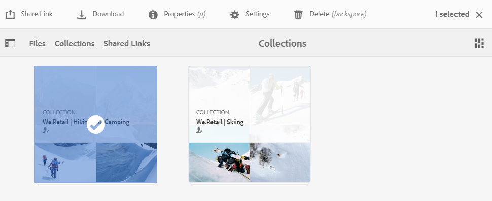

# 컬렉션 공유 {#share-collections}

컬렉션은 Adobe Experience Manager Assets Brand Portal에 함께 저장된 관련 에셋 그룹을 나타냅니다. 사용자는 다음 방법으로 스마트 컬렉션을 만들 수 있습니다. [omnisearch 또는 facet 검색을 적용하여 관련 에셋 필터링](brand-portal-searching.md) 간편하게 액세스하고 다른 Brand Portal 사용자와 공유할 수 있도록 여러 파일을 함께 저장할 수 있습니다.

<!--The administrators can share and unshare a collection with the authorized Brand Portal users. Editors and viewers can view and share the collections created by them, shared with them, and public collections.-->

컬렉션은 이메일을 통해 링크로 공유됩니다. 공유 링크에 액세스할 수 있는 모든 사용자는 컬렉션을 열 수 있지만 공유 전자 메일은 모든 사용자에게 전달할 수 있습니다. 또한, [공유 링크](https://experienceleague.adobe.com/docs/experience-manager-brand-portal/using/share/brand-portal-link-share.html?lang=en) 은 임시적이며 제한된 기간 동안에만 액세스할 수 있습니다. 또는 사용자를 컬렉션에 영구 멤버로 초대할 수 있습니다. 컬렉션에는 다음과 같은 사용자 유형이 있습니다.

* **관리자** 권한이 있는 Brand Portal 사용자와 컬렉션을 공유하거나 공유를 해제할 수 있습니다. 특정 컬렉션에 다른 사용자를 초대하고 해당 컬렉션에서 자신의 역할을 정의할 수 있습니다. 또한 관리자는 공용 컬렉션을 만들 수 있습니다.

* **편집자** 컬렉션을 만들고 공유할 수 있습니다. 특정 컬렉션에 다른 사용자를 초대하고 해당 컬렉션에서 자신의 역할을 정의할 수 있습니다. 또한 편집자 또는 소유자로 컬렉션에 초대된 경우 컬렉션을 공유할 수도 있습니다.

* **뷰어** 비공개 컬렉션만 만들 수 있습니다. 소유자로 초대된 경우에도 컬렉션을 공유할 수 없습니다.

>[!NOTE]
>
>편집자는 공용 컬렉션을 비공용 컬렉션으로 변경할 수 없으므로 **[!UICONTROL 공개 컬렉션]** 에서 사용할 수 있는 확인란 **[!UICONTROL 컬렉션 설정]** 대화 상자.

## 컬렉션 공유 {#share-collection}

다음은 승인된 Brand Portal 사용자와 컬렉션을 공유하는 절차입니다.

1. Brand Portal 테넌트에 로그인합니다. 기본적으로 **[!UICONTROL 파일]** 보기는 게시된 모든 에셋과 폴더를 포함하는 열립니다.

1. 맨 위에 있는 빠른 탐색에서 **[!UICONTROL 컬렉션]**.

1. 다음에서 **[!UICONTROL 컬렉션]** console에서 다음 중 하나를 수행합니다.

   * 공유할 컬렉션 위에 포인터를 놓습니다. 컬렉션에 사용할 수 있는 빠른 작업 썸네일에서 **[!UICONTROL 설정]** 아이콘.

     

   * 공유할 컬렉션을 선택합니다. 맨 위에 있는 도구 모음에서 를 클릭합니다. **[!UICONTROL 설정]**.

     

1. 다음에서 **[!UICONTROL 컬렉션 설정]** 대화 상자에서 컬렉션을 공유할 사용자를 선택한 다음 글로벌 역할과 일치시킬 사용자 역할을 선택합니다. 예를 들어 편집기 역할을 전역 편집기에 할당하고 뷰어 역할을 전역 뷰어에 할당합니다.

   또는 그룹 멤버십 및 역할에 관계없이 모든 사용자가 컬렉션을 사용할 수 있도록 하려면 다음을 선택하여 공개합니다. **[!UICONTROL 공개 컬렉션]** 확인란.

   >[!NOTE]
   >
   >그러나 시스템 공간을 절약할 수 있도록 많은 공용 컬렉션이 있는 것을 방지하기 위해 관리자가 아닌 사용자는 공용 컬렉션 만들기를 제한할 수 있습니다. 조직에서 다음을 비활성화할 수 있습니다. **[!UICONTROL 공개 컬렉션 만들기 허용]** 다음에서 구성 **[!UICONTROL 일반]** 관리 도구 패널에서 사용할 수 있는 설정.

   

   편집자는 공개 컬렉션을 비공개 컬렉션으로 변경할 수 없으므로 **[!UICONTROL 공개 컬렉션]** 에서 사용할 수 있는 확인란 **[!UICONTROL 컬렉션 설정]** 대화 상자.

   

1. 다음을 클릭합니다. **[!UICONTROL 추가]** 단추를 클릭하여 사용자를 추가한 다음 **[!UICONTROL 저장]**. 컬렉션이 사용자와 공유됩니다.

   >[!NOTE]
   >
   >사용자의 역할은 컬렉션 내의 에셋 및 폴더에 대한 액세스를 제어합니다. 사용자에게 에셋에 대한 액세스 권한이 없는 경우 빈 컬렉션이 사용자와 공유됩니다. 또한 사용자 역할은 컬렉션에 사용할 수 있는 작업을 제어합니다.

## 컬렉션 공유 해제 {#unshare-a-collection}

이전에 공유한 컬렉션에 대한 공유를 해제하려면 다음을 수행합니다.

1. 다음에서 **[!UICONTROL 컬렉션]** 콘솔에서 공유를 해제할 컬렉션을 선택합니다.

   맨 위에 있는 도구 모음에서 를 클릭합니다. **[!UICONTROL 설정]**.

   

1. 다음에서 **[!UICONTROL 컬렉션 설정]** 대화 상자, **[!UICONTROL 구성원]** 섹션에서 **[!UICONTROL x]** 컬렉션에 액세스할 수 있는 사용자 목록에서 제거할 사용자 옆의 기호입니다.

   

1. 경고 메시지가 나타납니다. 클릭 **[!UICONTROL 확인]** 컬렉션 공유를 해제합니다.

1. 클릭 **[!UICONTROL 저장]** 를 눌러 변경 사항을 적용합니다.

   사용자가 공유 목록에서 제거되면 공유되지 않은 컬렉션이 사용자의 **[!UICONTROL 컬렉션]** 콘솔.

<!--
1. Click the overlay icon on the left, and choose **[!UICONTROL Navigation]**.

   

1. From the siderail on the left, click **[!UICONTROL Collections]**.

   

1. From the **[!UICONTROL Collections]** console, do one of the following:

    * Hover the pointer over the collection you want to share. From the quick action thumbnails available for the collection, click the **[!UICONTROL Settings]** icon.

   

    * Select the collection you want to share. From the toolbar at the top, click **[!UICONTROL Settings]**.
    
   

1. In the [!UICONTROL Collection Settings] dialog box, select the users or groups with whom you want to share the collection and select the role for a user or a group to match their global role. For example, assign the Editor role to a global editor, the Viewer role to a global viewer.

   Alternatively, to make the collection available to all users irrespective of their group membership and role, make it public by selecting the **[!UICONTROL Public Collection]** check-box.

   >[!NOTE]
   >
   >However, non-admin users can be restricted from creating public collections, to avoid having numerous public collections so that system space can be saved. Organizations can disable the **[!UICONTROL Allow public collections creation]** configuration from [!UICONTROL General] settings available in admin tools panel.

   

   Editors cannot change a public collection to a non-public collection and, therefore, do not have **[!UICONTROL Public Collection]** check-box available in **[!UICONTROL Collection Settings]** dialog.

   

1. Select **[!UICONTROL Add]**, and then **[!UICONTROL Save]**. The collection is shared with the chosen users.

   >[!NOTE]
   >
   >A user's role governs access to the assets and folders inside a collection. If a user does not have access to assets, an empty collection is shared with the user. Also, a user's role governs the actions available for collections.

## Unshare a collection {#unshare-a-collection}

To unshare a previously shared collection, do the following:

1. From the **[!UICONTROL Collections]** console, select the collection you want to unshare.

   In the toolbar, click **[!UICONTROL Settings]**.

   

1. On the **[!UICONTROL Collection Settings]** dialog box, under **[!UICONTROL Members]**, click the **[!UICONTROL x]** symbol next to users or groups to remove them from the list of users you shared the collection with.

   

1. In the warning message box, click **[!UICONTROL Confirm]** to confirm unshare.

   Click **[!UICONTROL Save]**.

1. Log in to Brand Portal with the credentials of the user you removed from the shared list. The collection is removed from the **[!UICONTROL Collections]** console.
-->
