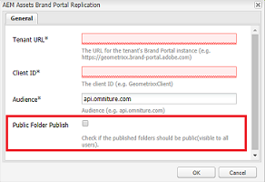

# Brand Portal에서 폴더 공유 {#share-folders}

Assets은 에셋 수집을 지원하지 않으므로 사전 구성된 Experience Manager Brand Portal 작성자 인스턴스에서 Brand Portal에 에셋을 게시해야 합니다.

## Brand Portal의 폴더 공유 워크플로 {#folder-sharing-workflow-in-brand-portal}

다음은 폴더 공유 워크플로 및 사용자 액세스에 대해 설명합니다.

* 기본적으로 Experience Manager Assets에서 Brand Portal으로 게시된 모든 폴더는 복제를 구성하는 동안 [공개]로 표시되지 않는 한 Brand Portal 관리자만 볼 수 있습니다.
* 관리자는 **[!UICONTROL 폴더 속성]** 콘솔을 사용하여 선택적 사용자 또는 그룹과 폴더를 공유합니다. 폴더가 공유되는 사용자 또는 그룹만 Brand Portal에 로그인한 후 폴더를 볼 수 있습니다. 폴더가 다른 사용자에게 표시되지 않습니다.
* 관리자는 **[!UICONTROL 폴더 속성]** 콘솔의 **[!UICONTROL 공용 폴더]** 확인란을 통해 폴더를 공개하도록 선택할 수도 있습니다. 공개 폴더는 모든 사용자가 볼 수 있습니다.

* 사용자 역할 및 권한과 관계없이 사용자가 Brand Portal에 로그인하면 모든 공용 폴더 및 해당 폴더와 직접 공유되거나 해당 폴더가 속한 그룹과 공유되는 폴더가 표시됩니다. 비공개 폴더 또는 다른 사용자와 공유된 폴더가 모든 사용자에게 표시되지 않습니다.

### Brand Portal에서 사용자 그룹과 폴더 공유 {#sharing-folders-with-user-groups-on-brand-portal}

폴더 에셋에 대한 액세스 권한은 하위 폴더의 설정에 관계없이 상위 폴더의 액세스 권한에 따라 다릅니다. 하위 폴더는 상위 폴더에서 ACL을 상속하므로 이 동작은 AEM의 [ACL](https://experienceleague.adobe.com/docs/experience-manager-65/administering/security/security.html)에서 제어됩니다. 예를 들어 폴더 A에 폴더 C가 포함된 폴더 B가 있는 경우 폴더 A에 대한 액세스 권한이 있는 사용자 그룹(또는 사용자)도 폴더 B와 폴더 C에 대해 동일한 액세스 권한을 갖습니다. 폴더 B가 A의 하위 폴더이면 ACL을 상속하고 폴더 C가 B의 하위 폴더이면 ACL을 상속합니다.

마찬가지로 폴더 B에만 액세스할 수 있는 권한을 가진 사용자 그룹(또는 사용자)은 폴더 C에는 동일한 액세스 권한을 가지지만 폴더 A에는 동일한 액세스 권한을 가지지 않습니다. 따라서 노출된 대부분의 자산이 하위 폴더에 배치되고 하위 폴더에서 루트 폴더로 액세스가 제한될 수 있도록 조직이 콘텐츠를 정렬하는 것이 좋습니다.

### 공개 폴더 게시 {#public-folder-publish}

Brand Portal 복제를 구성하는 동안 **[!UICONTROL 공용 폴더 Publish]** 옵션을 선택하지 않으면 관리자가 아닌 사용자(예: 편집자 및 뷰어)는 AEM Assets에서 Brand Portal으로 게시된 자산에 액세스할 수 없습니다.

**[!UICONTROL 공용 폴더 Publish]** 옵션이 비활성화된 경우 관리자는 공유 기능을 사용하여 관리자가 아닌 사용자와 이러한 에셋을 특별히 공유해야 합니다.

>[!NOTE]
>
>**[!UICONTROL 공용 폴더 Publish]**&#x200B;을(를) 활성화하는 옵션은 AEM 6.3.2.1 이상에서 사용할 수 있습니다.

## 공유 폴더 액세스 {#access-to-shared-folders}

다음 매트릭스에서는 다양한 사용자 역할에 대한 에셋 공유/공유 해제에 대한 액세스 권한 및 권한에 대해 설명합니다.

|               | AEM Assets에서 Brand Portal으로 게시된 모든 폴더에 대한 액세스 | 공유 폴더 액세스 | 폴더 권한 공유/공유 해제 |
|---------------|-----------|-----------|------------|
| 관리자 | 예 | 예 | 예 |
| 편집기 | 아니요* | 예, 해당 사용자와 공유되거나 해당 사용자가 속한 그룹과 공유되는 경우에만 | 예. 폴더 또는 폴더가 속한 그룹과 공유된 폴더만 해당됩니다. |
| 뷰어 | 아니요* | 예, 해당 사용자와 공유되거나 해당 사용자가 속한 그룹과 공유되는 경우에만 | 아니요 |
| 게스트 사용자 | 아니요* | 예, 해당 사용자와 공유되거나 해당 사용자가 속한 그룹과 공유되는 경우에만 | 아니요 |

>[!NOTE]
>
>AEM Author로 Brand Portal 복제를 구성하는 동안 기본적으로 **[!UICONTROL 공용 폴더 Publish]** 옵션이 비활성화됩니다. 이 옵션이 활성화되면 기본적으로 모든 사용자(관리자가 아닌 사용자도 Brand Portal에 게시된 폴더에 액세스할 수 있습니다.

### 관리자가 아닌 사용자가 공유 폴더에 액세스 {#non-admin-user-access-to-shared-folders}

관리자가 아닌 사용자는 Brand Portal에서 사용자와 공유된 폴더에만 액세스할 수 있습니다. 그러나 이러한 폴더가 로그인할 때 포털에 표시되는 방식은 **[!UICONTROL 폴더 계층 구조 사용]** 구성의 설정에 따라 다릅니다.

**구성이 비활성화된 경우**

관리자가 아닌 사용자는 랜딩 페이지, Brand Portal 로그인 시 사용자와 공유된 모든 폴더를 볼 수 있습니다.

**구성이 활성화된 경우**

관리자가 아닌 사용자는 Brand Portal에 로그인하면 폴더 트리(루트 폴더에서 시작)와 각 상위 폴더 내에 배치된 공유 폴더를 볼 수 있습니다.

이러한 상위 폴더는 가상 폴더이며 가상 폴더에서 작업을 수행할 수 없습니다. 잠금 아이콘으로 이러한 가상 폴더를 인식할 수 있습니다.

공유 폴더와 달리 마우스를 가리거나 **[!UICONTROL 카드 보기]**&#x200B;에서 선택할 때 작업 작업이 표시되지 않습니다. **[!UICONTROL 열 보기]** 및 **[!UICONTROL 목록 보기]**&#x200B;에서 가상 폴더를 선택할 때 **[!UICONTROL 개요]** 단추가 표시됩니다.

>[!NOTE]
>
>가상 폴더의 기본 썸네일은 첫 번째 공유 폴더의 썸네일 이미지입니다.

   

## 폴더 공유 {#how-to-share-folders}

Brand Portal의 사용자와 폴더를 공유하려면 다음 단계를 따르십시오.

1. 왼쪽의 오버레이 아이콘을 클릭하고 **[!UICONTROL 탐색]**&#x200B;을 선택합니다.

   

1. 왼쪽의 사이드레일에서 **[!UICONTROL 파일]**&#x200B;을 선택합니다.

   

1. Brand Portal 인터페이스에서 공유할 폴더를 선택합니다.

   

1. 상단의 도구 모음에서 **[!UICONTROL 공유]**&#x200B;를 선택합니다.

   

   [!UICONTROL 폴더 속성] 콘솔이 나타납니다.

   

1. 기본 이름을 사용자에게 표시하지 않으려면 **[!UICONTROL 폴더 속성]** 콘솔에서 **[!UICONTROL 폴더 제목]** 필드에 폴더 제목을 지정합니다.
1. **[!UICONTROL 사용자 추가]** 목록에서 폴더를 공유할 사용자 또는 그룹을 선택하고 **[!UICONTROL 추가]**를 클릭합니다.
폴더를 게스트 사용자만 공유하고 다른 사용자는 공유하지 않으려면 **[!UICONTROL 구성원]** 드롭다운에서 **[!UICONTROL 익명 사용자]**&#x200B;를 선택하십시오.

   

   >[!NOTE]
   >
   >그룹 멤버십 및 역할에 관계없이 모든 사용자가 폴더를 사용할 수 있도록 하려면 **[!UICONTROL 공용 폴더]** 확인란을 선택하여 공개하십시오.

1. 필요한 경우 **[!UICONTROL 썸네일 변경]**&#x200B;을 클릭하여 폴더의 썸네일 이미지를 수정합니다.
1. **[!UICONTROL 저장]**&#x200B;을 클릭합니다.

1. 공유 폴더에 액세스하려면 폴더를 공유한 사용자의 자격 증명으로 Brand Portal에 로그인합니다. 인터페이스에서 공유 폴더를 검토합니다.

## 폴더 공유 안 함 {#unshare-the-folders}

이전에 공유한 폴더의 공유를 해제하려면 다음 단계를 수행하십시오.

1. Brand Portal 인터페이스에서 공유를 해제할 폴더를 선택합니다.

   

1. 상단의 도구 모음에서 **[!UICONTROL 공유]**&#x200B;를 클릭합니다.
1. **[!UICONTROL 폴더 속성]** 콘솔의 **[!UICONTROL 구성원]**&#x200B;에서 사용자 옆에 있는 **[!UICONTROL x]** 기호를 클릭하여 폴더를 공유한 사용자 목록에서 제거합니다.

   

1. 경고 메시지 상자에서 **[!UICONTROL 확인]**을 클릭하여 공유 취소를 확인합니다.
**[!UICONTROL 저장]**&#x200B;을 클릭합니다.

1. 공유 목록에서 제거한 사용자의 자격 증명으로 Brand Portal에 로그인합니다. 해당 폴더는 사용자의 Brand Portal 인터페이스에서 더 이상 사용할 수 없습니다.
