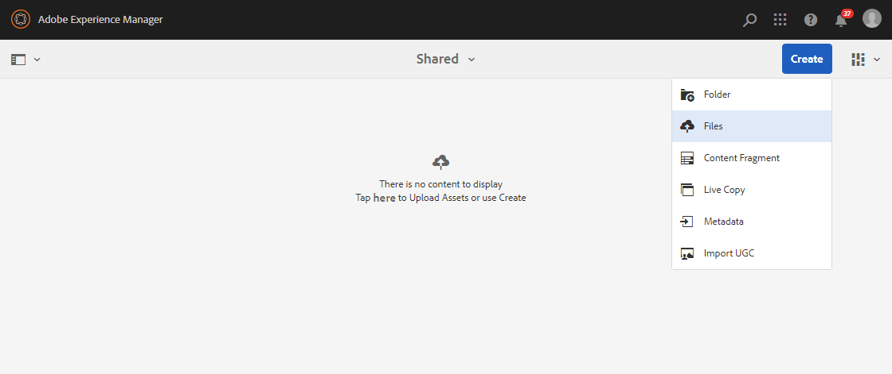
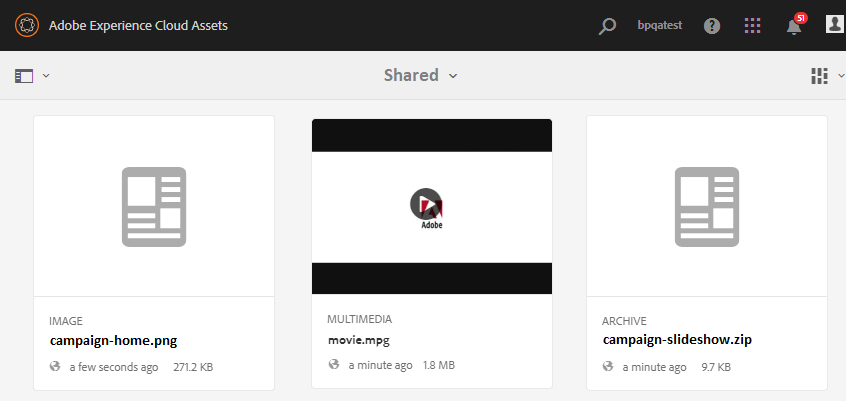

# 기준 자산 업로드 {#upload-baseline-assets}

AEM 관리자는 **SHARED** 폴더에 기본 자산을 업로드하여 브랜드 포털 사용자가 기여도에 필요한 자산 유형을 이해할 수 있도록 합니다. 이러한 자산은 기여도를 위한 새 자산을 만드는 동안 브랜드 포털 사용자가 참조 콘텐츠로 사용할 수 있습니다.

**기준 자산을 업로드하려면:**

1. AEM 작성자 인스턴스에 로그인합니다.
기본 URL: http:// localhost:4502/aem/start.html
1. **[!UICONTROL 자산 > 파일]**&#x200B;으로 이동하고 기준 자산을 업로드하려는 기여도 폴더를 찾습니다.
1. 기여도 폴더를 열려면 을 클릭하십시오. 기여도 폴더 내에 **[!UICONTROL SHARED]** 및 **[!UICONTROL NEW]**&#x200B;라는 두 개의 하위 폴더가 표시됩니다.
1. **[!UICONTROL SHARED]** 폴더를 클릭합니다.
1. 개별 자산을 업로드하려면 **[!UICONTROL 만들기 > 파일]** 을 클릭합니다.
또는 **[!UICONTROL 만들기 > 폴더]**를 클릭하여 여러 에셋이 포함된 폴더(.zip)를 업로드합니다.
   
1. **[!UICONTROL SHARED]** 폴더에서 기준선 에셋(파일/폴더)을 찾아보고 업로드합니다.
   

업로드가 완료되면 관리자는 기여도 폴더를 브랜드 포털에 게시할 수 있습니다. 참조: [브랜드 포털](brand-portal-publish-contribution-folder-to-brand-portal.md)에 기여도 폴더 게시.