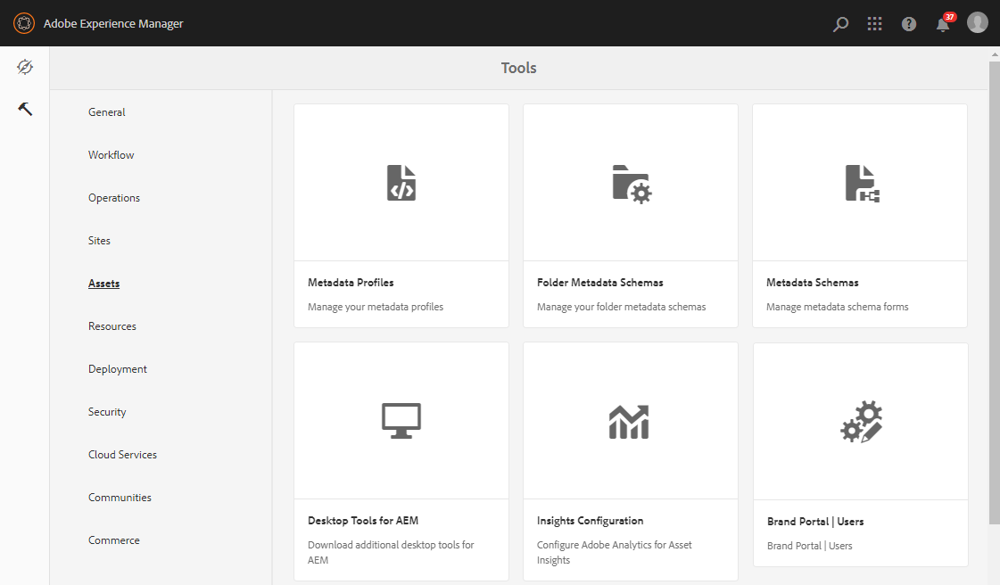

# 브랜드 포털 사용자 목록 업로드 {#upload-bp-user-list}

AEM 관리자는 AEM 자산에 활성 브랜드 포털 사용자 목록이 포함된 브랜드 포털 사용자 구성(.csv) 파일을 업로드할 수 있습니다. 기여도 폴더는 사용자 목록에 정의된 활성 브랜드 포털 사용자만 공유할 수 있습니다. 관리자는 구성 파일에 새 사용자를 추가하고 수정된 사용자 목록을 업로드할 수도 있습니다.

관리자는 AEM 관리 콘솔에서 새 사용자를 추가할 수 있습니다. 자세한 내용은 사용자 [관리를](brand-portal-adding-users.md) 참조하십시오. 관리 콘솔에서 사용자를 추가한 후, 이러한 사용자를 브랜드 포털 사용자 구성 파일에 추가한 다음 기여도 폴더에 액세스할 수 있는 권한을 할당할 수 있습니다.

**브랜드 포털 사용자 목록을 업로드하려면:**
1. AEM 작성자 인스턴스에 로그인기본 URL:http://로컬 호스트:4502/aem/start.html
1. 도구 **패널에서** 자산  &gt; 브랜드 포털 **[!UICONTROL 사용자로 이동합니다.]**
   
1. 브랜드 포털 업로드 기여자 창이 열립니다.
로컬 컴퓨터에서 검색하고 활성 브랜드 포털 사용자 목록이 포함된 **구성(.csv) 파일을** 업로드합니다.
1. **[!UICONTROL 저장을 클릭합니다]**.
   

관리자는 기여도 폴더를 구성하는 동안 이 사용자 목록에서 특정 사용자/그룹에 대한 액세스 권한을 제공할 수 있습니다.

자세한 내용은 기여도 [폴더](brand-portal-contribution-folder.md)구성을 참조하십시오.
