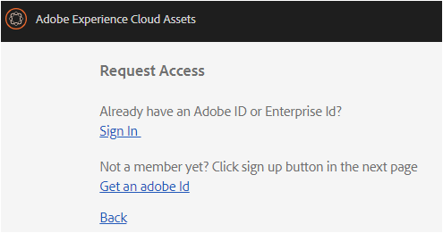
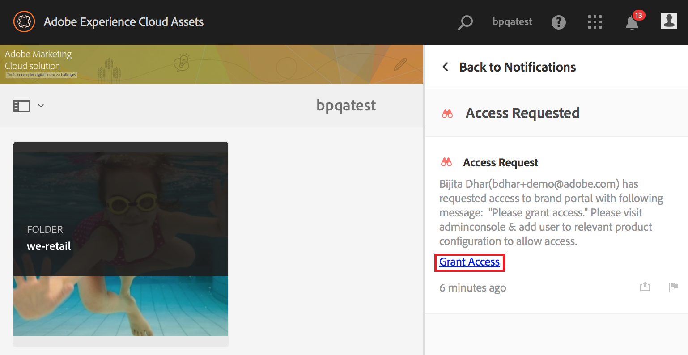

# AEM Assets 브랜드 포털 개요 {#overview-of-aem-assets-brand-portal}

마케터는 고객과 연관성 높은 디지털 컨텐츠를 신속하게 제작, 관리 및 제공하기 위해 채널 파트너와 내부 비즈니스 사용자와 협력해야 합니다. 고객 여정 전반에 걸쳐 적절한 콘텐츠를 적시에 전달하려면 수요, 전환율, 참여도 및 고객 충성도를 강화하는 것이 중요합니다.

그러나 승인된 브랜드 로고, 지침, 캠페인 에셋 또는 제품 샷을 확장된 내부 팀, 파트너 및 리셀러와 효율적이고 안전하게 공유할 수 있는 솔루션을 개발하는 것은 쉽지 않습니다.

**[!DNL Adobe Experience Manager (AEM) Assets Brand Portal]** 승인된 크리에이티브 자산을 모든 디바이스에서 외부 및 내부 비즈니스 사용자에게 손쉽게 획득, 제어 및 안전하게 배포할 수 있습니다. 에셋 공유 효율성을 높이고, 에셋 시장 출시 시간을 단축하며, 비규정 준수 및 권한 없는 액세스의 위험을 줄일 수 있습니다.

브라우저 기반의 포털 환경을 사용하면 승인된 포맷으로 에셋을 손쉽게 업로드, 검색, 검색, 미리 보기 및 내보낼 수 있습니다.

## 브랜드 포털의 사용자 성향 {#Personas}

[!DNL Brand Portal] 는 다음 사용자 역할을 지원합니다.

* 손님 사용자
* 뷰어
* 편집자
* 관리자

다음 표에는 이러한 역할의 사용자가 수행할 수 있는 작업이 나와 있습니다.

|  | **찾아보기** | **검색** | **다운로드** | **폴더 공유** | **컬렉션 공유** | **자산을 링크로 공유** | **관리 도구에 액세스** |
|--- |--- |--- |--- |--- |--- |--- |--- |
| **손님 사용자** | ✓* | ✓* | ✓* | x | x | x | x |
| **뷰어** | ✓ | ✓ | ✓ | x | x | x | x |
| **편집자** | ✓ | ✓ | ✓ | ✓ | ✓ | ✓ | x |
| **관리자** | ✓ | ✓ | ✓ | ✓ | ✓ | ✓ | ✓ |

* 게스트 사용자는 공개 폴더 및 컬렉션에서만 자산을 검색하고 액세스 및 검색할 수 있습니다.

### Guest user {#guest-user}

인증 없이 자산에 [!DNL Brand Portal] 대한 제한된 액세스 권한을 가진 모든 사용자는 게스트 사용자입니다. 손님 세션을 사용하면 공개 폴더 및 컬렉션에 액세스할 수 있습니다. 손님 사용자는 자산 세부 사항을 탐색하여 공개 폴더 및 컬렉션의 전체 자산 보기를 볼 수 있습니다. [!UICONTROL Lightbox 컬렉션에 공개 자산을 검색하고, 다운로드하고], 추가할 수 있습니다.

그러나 손님 세션에서는 컬렉션 및 저장된 검색 만들기에서 제한되며 추가로 공유됩니다. 손님 세션의 사용자는 폴더 및 컬렉션 설정에 액세스할 수 없으며 자산을 링크로 공유할 수 없습니다. 다음은 손님 사용자가 수행할 수 있는 작업 목록입니다.

[공개 자산 찾아보기 및 액세스](browse-assets-brand-portal.md)

[공개 자산 검색](brand-portal-searching.md)

[공개 자산 다운로드](brand-portal-download-users.md)

[[! Uicontrol Lightbox]](brand-portal-light-box.md#add-assets-to-lightbox)

### 뷰어 {#viewer}

표준 [!DNL Brand Portal] 사용자는 일반적으로 뷰어의 역할을 가진 사용자입니다. 이 역할의 사용자는 허용된 폴더, 컬렉션 및 자산에 액세스할 수 있습니다. 또한 자산 (원본 또는 특정 변환) 를 검색하고, 미리 보고, 다운로드하고, 내보내고, 계정 설정을 구성하고, 자산을 검색할 수도 있습니다. 다음은 뷰어에서 수행할 수 있는 작업 목록입니다.

[자산 찾아보기](browse-assets-brand-portal.md)

[자산 검색](brand-portal-searching.md)

[에셋 다운로드](brand-portal-download-users.md)

### 편집자 {#editor}

편집자 역할이 있는 사용자는 사용자가 수행할 수 있는 모든 작업을 수행할 수 있습니다. 또한 편집자는 관리자가 공유하는 파일과 폴더를 볼 수 있습니다. 편집자 역할이 있는 사용자는 다른 사용자와 콘텐트 (파일, 폴더, 컬렉션) 를 공유할 수도 있습니다.

편집자가 수행할 수 있는 작업은 다음과 같은 추가 작업을 수행할 수 있습니다.

[폴더 공유](brand-portal-sharing-folders.md)

[컬렉션 공유](brand-portal-share-collection.md)

[자산을 링크로 공유](brand-portal-link-share.md)

### 관리자 {#administrator}

관리자에는 관리 콘솔에서 시스템 관리자 또는 [!DNL Brand Portal] 제품 관리자로 표시된 사용자가 [!UICONTROL 포함됩니다]. 관리자는 시스템 관리자 및 사용자를 추가 및 제거하고 사전 설정을 정의하며 사용자에게 이메일을 보내고 포털 사용 및 저장소 보고서를 볼 수 있습니다.

관리자는 편집자가 수행할 수 있는 모든 작업과 다음 추가 작업을 수행할 수 있습니다.

[사용자, 그룹 및 사용자 역할 관리](brand-portal-adding-users.md)

[배경 무늬, 페이지 머리글 및 이메일 사용자 정의](brand-portal-branding.md)

[사용자 지정 검색 패싯 사용](brand-portal-search-facets.md)

[메타데이터 스키마 양식 사용](brand-portal-metadata-schemas.md)

[이미지 사전 설정 또는 동적 표현물 적용](brand-portal-image-presets.md)

[보고서를 사용한 작업](brand-portal-reports.md)

위의 작업 이외에 작성자는 다음 작업을 [!DNL AEM Assets] 수행할 수 있습니다.

[[! DNL AEM Assets] 와의 통합 [! DNL 브랜드 포털]](https://helpx.adobe.com/experience-manager/6-5/assets/using/brand-portal-configuring-integration.html)

[[! DNL 브랜드 포털]](https://helpx.adobe.com/experience-manager/6-5/assets/using/brand-portal-publish-folder.html)

[[! DNL 브랜드 포털]](https://helpx.adobe.com/experience-manager/6-5/assets/using/brand-portal-publish-collection.html)

## 브랜드 포털 URL의 대체 별칭 {#tenant-alias-for-portal-url}

[!DNL Brand Portal] 6.4.3 버전에는 [!DNL Brand Portal] 임차인의 기존 URL에 대해 하나의 대체 (별칭) URL 이 있을 수 있습니다. URL에 대체 접두사가 있으면 별칭 URL를 만들 수 있습니다.\
URL의 접두사는 전체 URL [!DNL Brand Portal] 이 아닌 사용자 정의할 수 있습니다. 예를 들어, 기존 도메인 **[!UICONTROL geomettrix.brand-portal.adobe.com]** 이 있는 조직은 요청 시 **[!UICONTROL geomettrixinc.brand-portal.adobe.com]** 를 만들 수 있습니다.

하지만**[!DNL AEM] Author instance can be [configured](https://helpx.adobe.com/experience-manager/6-5/assets/using/brand-portal-configuring-integration.html) only with the tenant ID URL and not with tenant alias (alternate) URL.

>[!NOTE]
>
>기존 포털 URL에서 임차인 이름에 대한 별칭을 얻으려면, 조직이**[!DNL Adobe support] 에 새 임차인 별칭 작성 요청으로 문의해야 합니다. 이 요청은 별칭을 사용할 수 있는지 확인한 다음 별칭을 만들어 처리됩니다.
>
>이전 별칭을 대체하거나 이전 별칭을 삭제하려면 동일한 프로세스를 수행해야 합니다.

## 브랜드 포털에 대한 액세스 요청 {#request-access-to-brand-portal}

사용자는 로그인 화면에서 액세스 권한을 [!DNL Brand Portal] 요청할 수 있습니다. 이러한 요청은 [!DNL Brand Portal] 관리자에게 전송되며 Adobe Admin Console를 통해 사용자에게 액세스 권한을 부여합니다. 액세스 권한이 부여되면 알림 이메일을 받게 됩니다.

액세스를 요청하려면 다음을 수행하십시오.

1. [!DNL Brand Portal] 로그인 페이지에서 액세스 **필요** 여부에 해당하는 **여기를 클릭하십시오.**. 손님 세션에 입장하려면 손님 **액세스에** 해당하는 **여기를 클릭하십시오**.

   

   액세스 **요청** 페이지가 열립니다.

2. 조직의 액세스 [!DNL Brand Portal]권한을 요청하려면 유효한 [!UICONTROL Adobe ID], [!UICONTROL Enterprise ID]또는 [!UICONTROL Federated ID]가 있어야 합니다.

   액세스 **요청** 페이지에서 ID를 사용하여 로그인하거나 (시나리오 1) [!UICONTROL Adobe ID] 를 만듭니다 (시나리오 2).
   

   **시나리오 1**
   1. [!UICONTROL Adobe ID], [!UICONTROL Enterprise ID]또는 [!UICONTROL Federated ID]가 있는 경우 **로그인을 클릭합니다**.
**로그인** 페이지가 열립니다.
   2. [!UICONTROL Adobe ID] 자격 증명을 입력하고 **로그인을**클릭합니다.
      
   액세스 **요청** 페이지가 리디렉션됩니다.
   **시나리오 2**
   1. [!UICONTROL Adobe ID]가 없는 경우 하나를 만들려면 **액세스** **요청** 페이지에서 Adobe ID 가져오기를 클릭합니다.
**로그인** 페이지가 열립니다.
   2. Click **Get an Adobe ID**.
**등록** 페이지가 열립니다.
   3. 이름과 성, 이메일 ID 및 암호를 입력합니다. ****등록을 클릭합니다.
      
   액세스 **요청** 페이지가 리디렉션됩니다.

3. 다음 페이지에는 액세스 요청을 하는 데 사용된 이름과 이메일 ID가 표시됩니다. 관리자의 주석을 그대로 두고 **[제출**] 를 클릭합니다.

   

## 제품 관리자가 액세스 권한 부여 {#grant-access-to-brand-portal}

[!DNL Brand Portal] 제품 관리자는 알림 영역과 받은 편지함의 [!DNL Brand Portal] 이메일을 통해 액세스 요청을 받습니다.

액세스 권한을 부여하려면 제품 관리자가 [!DNL Brand Portal] 알림 영역에서 관련 알림을 클릭한 다음 액세스 권한 부여를 클릭해야 ****합니다.
또는 제품 관리자가 액세스 요청 이메일에 제공된 링크를 따라 방문자를 방문하고 [!DNL Adobe Admin Console] 관련 제품 구성에 추가할 수 있습니다.

[ [! DNL Adobe Admin Console]](https://adminconsole.adobe.com/enterprise/overview) 홈 페이지를 참조하십시오. 사용자를 만들고에 그룹으로 표시되는 제품 프로필 (이전의 제품 구성) 에 할당할 [!DNL Adobe Admin Console] 때 사용합니다 [!DNL Brand Portal]. 에서 [!DNL Admin Console]사용자를 추가하는 방법에 대한 자세한 내용은 사용자 [추가를 참조하십시오](brand-portal-adding-users.md#add-a-user) (사용자를 추가하려면 절차의 4-7 단계를 따르십시오).

## 브랜드 포털 유지 관리 알림 {#brand-portal-maintenance-notification}

[유지 [!DNL Brand Portal] 관리] 는 유지 관리를 위해 다운로드되기 전에 로그인한 후 배너로 표시됩니다 [!DNL Brand Portal]. 샘플 알림:

이 알림을 취소하고 계속 사용할 [!DNL Brand Portal]수 있습니다. 이 알림은 모든 새 세션에 나타납니다.

## 릴리스 및 시스템 정보 {#release-and-system-information}

<!--* [What's new](../using/whats-new.md)-->
* [릴리스 노트](brand-portal-release-notes.md)
* [지원되는 파일 형식](brand-portal-supported-formats.md)

## Related resources {#related-resources}

* [Adobe 고객 지원 센터](https://helpx.adobe.com/marketing-cloud/contact-support.html)
* [AEM 포럼](https://www.adobe.com/go/aod_forums_en)