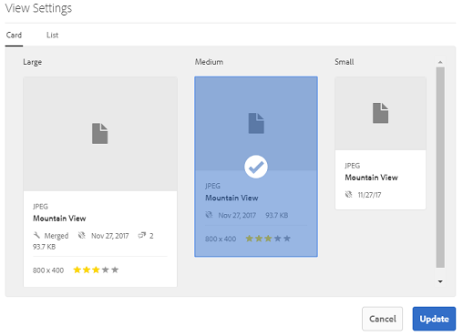
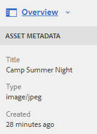

# Brand Portal에서 자산 찾아보기 {#browsing-assets-on-brand-portal}

Experience Manager Assets Brand Portal은 다양한 보기 옵션을 사용하여 리소스를 검색하고, 자산 계층을 탐색하고, 자산을 검색할 수 있도록 해주는 다양한 기능과 사용자 인터페이스 요소를 제공합니다.

맨 위의 도구 모음에 있는 Experience Manager 로고는 관리 도구 패널에 쉽게 액세스할 수 있도록 해줍니다.

 

Brand Portal의 왼쪽 상단에 있는 레일 선택기가 아래로 드롭다운되어 자산을 탐색하고 검색을 간소화하고 리소스를 표시할 수 있습니다.

Brand Portal의 오른쪽 상단에 있는 보기 선택기에서 사용 가능한 보기(카드, 열 및 목록)를 사용하여 자산을 보고, 탐색하고 선택할 수 있습니다.

## 리소스 보기 및 선택 {#viewing-and-selecting-resources}

각 보기, 탐색 및 선택은 모든 보기에서 개념적으로는 같지만 사용 중인 보기에 따라 처리 방식이 약간 다릅니다.

사용 가능한 보기 중 하나에서 리소스를 보고, 탐색하며 선택(추가 작업을 위해)할 수 있습니다.

* 열 보기
* 카드 보기
* 목록 보기

### 카드 보기

카드 보기는 현재 수준에서 각 항목에 대한 정보 카드를 표시합니다. 이러한 카드는 다음 세부 사항을 제공합니다.

* 자산/폴더의 시각적 표현.
* 유형
* 제목
* 이름
* AEM에서 Brand Portal에 자산이 게시된 날짜 및 시간
* 크기
* 크기

카드를 탭하거나 클릭하여 계층 구조를 탐색하거나(빠른 작업이 발생하지 않도록 주의) 헤더](https://helpx.adobe.com/experience-manager/6-5/sites/authoring/using/basic-handling.html#TheHeader)에서 [탐색 표시를 사용하여 위로 다시 탐색할 수 있습니다.

#### 관리자가 아닌 사용자를 위한 카드 보기

카드 보기에서 관리자가 아닌 사용자에게 폴더 계층 구조 정보를 표시합니다(편집기, 뷰어 및 게스트 사용자). 이 기능을 사용하면 상위 계층 구조와 관련하여 사용자가 액세스하는 폴더의 위치를 알 수 있습니다.
폴더 계층 정보는 다른 폴더 계층 구조와 공유된 다른 폴더와 유사한 이름을 가진 폴더를 구분할 때 특히 유용합니다. 관리자가 아닌 사용자가 공유된 자산의 폴더 구조를 모를 경우 이름이 비슷한 자산/폴더가 혼동되는 것 같습니다.

* 각 카드에 표시된 경로는 카드 크기에 맞게 잘립니다. 그러나 사용자는 전체 경로를 잘린 경로 위로 마우스를 가져가면 도구 설명으로 볼 수 있습니다.

**자산 속성을 보는 개요 옵션**

관리자가 아닌 사용자(편집기, 뷰어, 게스트 사용자)가 선택한 자산/폴더의 자산 속성을 볼 수 있는 개요 옵션을 사용할 수 있습니다. 개요 옵션이 표시됩니다.

* 를 클릭합니다.
* 드롭다운 목록에서 레일 선택기 를 선택합니다.

자산/폴더를 선택하는 동안 **[!UICONTROL 개요]** 옵션을 선택할 때 사용자가 자산을 만든 제목, 경로 및 시간을 볼 수 있습니다. 반면에, 자산 세부 사항 페이지에서 개요 옵션을 선택하면 자산의 메타데이터를 볼 수 있습니다.

#### 카드 보기에서 설정 보기

**[!UICONTROL 보기]** 설정 대화 상자가 보기 선택기에서  **[!UICONTROL 보기]** 설정을 선택할 때 열립니다. 카드 보기에서 자산 축소판의 크기를 조정할 수 있습니다. 이 방법으로 뷰를 개인화하고 표시되는 축소판 수를 제어할 수 있습니다.

### 목록 보기

목록 보기에는 현재 수준의 각 리소스에 대한 정보가 표시됩니다. 목록 보기에는 다음 세부 사항이 제공됩니다.

* 자산의 축소판 이미지
* 이름
* 제목
* 로케일
* 유형
* Dimension
* 크기
* 등급
* 자산 계층 구조를 보여주는 폴더 경로*
* Brand Portal에 자산을 게시하는 날짜

경로 열을 사용하면 폴더 계층 구조에서 자산 위치를 쉽게 식별할 수 있습니다. 리소스 이름을 탭/클릭하여 계층 구조를 탐색하고 헤더](https://helpx.adobe.com/experience-manager/6-5/sites/authoring/using/basic-handling.html#TheHeader)에서 [탐색 표시를 사용하여 백업할 수 있습니다.

<!--
Comment Type: draft lastmodifiedby="mgulati" lastmodifieddate="2018-08-17T03:12:05.096-0400" type="annotation">Removed:- "Selecting assets in list view To select all items in the list, use the checkbox at the upper left of the list. When all items in the list are selected, this check box appears checked. To deselect all, click or tap the checkbox. When only some items are selected, it appears with a minus sign. To select all, click or tap the checkbox. To deselect all, click or tap the checkbox again. You can change the order of items using the dotted vertical bar at the far right of each item in the list. Tap/click the vertical selection bar and drag the item to a new position in the list."
 -->

### 목록 보기의 설정 보기

목록 보기에는 기본적으로 첫 번째 열로 자산 **[!UICONTROL 이름]**&#x200B;이 표시됩니다. 자산 **[!UICONTROL 제목]**, **[!UICONTROL 로케일]**, **[!UICONTROL 유형]**, **[!UICONTROL Dimension]**, **[!UICONTROL 크기]**, **[!UICONTROL 등급]**&#x200B;과 같은 추가 정보가 표시됩니다. 그러나 **[!UICONTROL 보기 설정]**&#x200B;을 사용하여 표시할 열을 선택할 수 있습니다.

### 열 보기

일련의 계단식 열을 통해 컨텐츠 트리를 탐색하려면 열 보기를 사용합니다. 이 보기는 자산 계층 구조를 시각화하고 트래버스하는 데 도움이 됩니다.

첫 번째(가장 왼쪽) 열에서 리소스를 선택하면 오른쪽의 두 번째 열에 하위 리소스가 표시됩니다. 두 번째 열에서 리소스를 선택하면 오른쪽의 세 번째 열에 하위 리소스가 표시됩니다.

리소스 이름 또는 리소스 이름 오른쪽에 있는 V자형 화살표를 탭하거나 클릭하여 트리에서 위아래로 탐색할 수 있습니다.

* 탭하거나 클릭하면 리소스 이름 및 V자형 화살표가 강조 표시됩니다.
* 축소판을 탭하거나 클릭하면 리소스가 선택됩니다.
* 선택하면 축소판에 확인 표시가 겹쳐지며 리소스 이름이 강조 표시됩니다.
* 선택한 리소스의 세부 정보가 마지막 열에 표시됩니다.

열 보기에서 자산을 선택하면, 자산의 시각적 표현이 다음 세부 정보와 함께 마지막 열에 표시됩니다.

* 제목
* 이름
* 크기
* AEM에서 Brand Portal에 자산이 게시된 날짜 및 시간
* 크기
* 유형
* 자산의 세부 사항 페이지로 이동하려면 더 자세히 선택 사항

<!--
Comment Type: draft

<h3>Selecting Resources</h3>
-->

<!--
Comment Type: draft

Selecting a specific resource depends on a combination of the view and the device:

-->

<!--
Comment Type: draft

<table border="1" cellpadding="1" cellspacing="0" width="100%">
<tbody>
<tr>
<td> </td>
<td>Select</td>
<td>Deselect</td>
</tr>
<tr>
<td>Column View  </td>
<td>
<ul>
<li>Desktop:  Mouseover, then use the check mark quick action</li>
<li>Mobile device:  Tap the thumbnail</li>
</ul> </td>
<td>
<ul>
<li>Desktop:  Click the thumbnail</li>
<li>Mobile device:  Tap the thumbnail</li>
</ul> </td>
</tr>
<tr>
<td>Card View  </td>
<td>
<ul>
<li>Desktop:  Mouseover, then use the check mark quick action</li>
<li>Mobile device:  Tap-and-hold the card</li>
</ul> </td>
<td>
<ul>
<li>Desktop:  Click the card</li>
<li>Mobile device:  Tap the card</li>
</ul> </td>
</tr>
<tr>
<td>List View</td>
<td>
<ul>
<li>Desktop:  Mouseover, then use the check mark quick action</li>
<li>Mobile device:  Tap the thumbnail</li>
</ul> </td>
<td>
<ul>
<li>Desktop:  Click the thumbnail</li>
<li>Mobile device:  Tap the thumbnail</li>
</ul> </td>
</tr>
</tbody>
</table>
-->

<!--
Comment Type: draft

Deselecting All
-->

<!--
Comment Type: draft

In all cases, as you select items the count of the items selected is displayed at the upper right of the toolbar.

You can deselect all items and exit selection mode by clicking or tapping the X next to the count.

-->

<!--
Comment Type: draft

In all views, all items can be deselected by tapping escape on the keyboard if you are using a desktop device.

-->

## 컨텐츠 트리 {#content-tree}

이러한 보기 외에도 트리 보기를 사용하여 원하는 자산 또는 폴더를 보고 선택하는 동안 자산 계층을 드릴다운할 수 있습니다.

트리 보기를 열려면 왼쪽 상단에 있는 레일 선택기를 탭/클릭하고 메뉴에서 **[!UICONTROL 컨텐츠 트리]**&#x200B;를 선택합니다.

컨텐츠 계층 구조에서 원하는 자산으로 이동합니다.

## 자산 세부 정보 {#asset-details}

자산 세부 사항 페이지를 사용하여 자산을 보거나, 다운로드하거나, 자산의 링크를 공유하거나, 컬렉션으로 이동하거나, 해당 속성 페이지를 볼 수 있습니다. 또한 동일한 폴더의 다른 자산의 세부 사항 페이지를 연속적으로 탐색할 수 있습니다.

자산의 메타데이터를 보거나 다양한 표현물을 보려면 자산 세부 사항 페이지에서 레일 선택기를 사용합니다.

자산 세부 사항 페이지에서 사용 가능한 모든 자산 렌디션을 보고 미리 볼 변환을 선택할 수 있습니다.

자산 속성 페이지를 열려면 상단 막대에서 **[!UICONTROL 속성 (p)]** 옵션을 사용합니다.

자산 관계도 AEM에서 Brand Portal으로 게시되므로 자산의 속성 페이지에서 모든 관련 자산(소스 또는 AEM에서 파생된 자산)의 목록을 볼 수도 있습니다.
