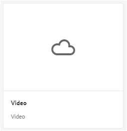

# Brand Portal에서 동적 비디오 지원 {#dynamic-video-support-on-brand-portal}

다이내믹 미디어 지원을 통해 브랜드 포털에서 비디오를 미리 보고 재생할 수 있습니다. 또한 포털과 공유 링크에서 동적 변환을 다운로드합니다.
브랜드 포털 사용자는 다음을 수행할 수 있습니다.

* 자산 세부 사항 페이지, 카드 보기 및 링크 공유 미리 보기 페이지에서 비디오를 미리 볼 수 있습니다.
* 자산 세부 사항 페이지에서 비디오 인코딩을 재생합니다.
* 자산 세부 사항 페이지의 표현물 탭에서 동적 표현물을 봅니다.
* 비디오가 포함된 비디오 코드 및 폴더를 다운로드합니다.

>[!NOTE]
>
>비디오를 사용하여 작업하고 브랜드 포털에 게시하려면 AEM 작성자 인스턴스가 Dynamic Media Hybrid 모드 또는 Dynamic Media **[!DNL Scene 7]** 모드에서 설정되어 있어야 합니다.

비디오를 미리 보고 재생하고 다운로드하려면 브랜드 포털에서 관리자에게 다음 두 가지 구성을 표시합니다.

* [다이내믹 미디어 하이브리드 ](#configure-dm-hybrid-settings)
구성AEM 작성자 인스턴스가 다이내믹 미디어 하이브리드 모드에서 실행 중인 경우
* [동적  [!DNL Scene 7] ](#configure-dm-scene7-settings)
미디어 구성AEM 작성자 인스턴스가 다이내믹 미디어 **[!DNL Scene 7]** 모드에서 실행 중인 경우
브랜드 포털 테넌트가 복제되는 AEM 작성자 인스턴스에서 설정한 구성을 기준으로 이러한 구성 중 하나를 설정합니다.

>[!NOTE]
>
>동적 비디오는 **[!UICONTROL Scene7Connect]** 실행 모드에서 실행되는 AEM 작성자로 구성된 브랜드 포털 테넌트에서 지원되지 않습니다.

## 동적 비디오는 어떻게 재생됩니까?{#how-are-dynamic-videos-played}

브랜드 포털에서 다이내믹 미디어 구성([하이브리드](../using/dynamic-video-brand-portal.md#configure-dm-hybrid-settings) 또는 [[!DNL Scene 7]](../using/dynamic-video-brand-portal.md#configure-dm-scene7-settings) 구성)이 설정된 경우 동적 변환이 **[!DNL Scene 7]** 서버에서 가져옵니다. 비디오 인코딩은 지연 없이 미리 보고 재생되며 품질은 왜곡되지 않습니다.

비디오 인코딩은 브랜드 포털 저장소에 저장되지 않으며 **[!DNL Scene 7]** 서버에서 반입되므로 AEM 작성자 인스턴스 및 브랜드 포털의 다이내믹 미디어 구성이 동일한지 확인하십시오.

>[!NOTE]
>
>비디오 뷰어 및 뷰어 사전 설정은 브랜드 포털에서 지원되지 않습니다. 비디오가 미리 보고 브랜드 포털의 기본 뷰어에서 재생됩니다.

## 전제 조건 {#prerequisites}

브랜드 포털에서 다이내믹 비디오를 사용하려면 다음을 확인하십시오.

* **DM(Dynamic Media)**
모드에서 AEM 작성자 시작 [Dynamic Media Hybrid 모드 또는 ](https://helpx.adobe.com/experience-manager/6-5/assets/using/config-dynamic.html#EnablingDynamicMedia) Dynamic  [Mediamode에서 AEM 작성자 인스턴스(브랜드 포털이 구성된  [!DNL Scene 7] AEM 작성자 인스턴스)를 ](https://helpx.adobe.com/experience-manager/6-5/assets/using/config-dms7.html#EnablingDynamicMediainScene7mode)시작합니다.
* **AEM Author에서**
Dynamic Media 서비스 구성AEM Author가 실행 중인 Dynamic Media 모드를 기반으로 하는 Cloud Services Author에서 Dynamic Media 서비스 구성 [Dynamic Services 또는 ](https://helpx.adobe.com/experience-manager/6-5/assets/using/config-dynamic.html#ConfiguringDynamicMediaCloudServices) Dynamic MediaServices의  [[!DNL Scene 7] Dynamic Services 또는Cloud](https://helpx.adobe.com/experience-manager/6-5/assets/using/config-dms7.html#ConfiguringDynamicMediaCloudServices) 의 Creative CloudMediaAuthor **MediaTwitter를에서**   ****   **** 설정합니다.
* **브랜드**
포털에서 다이내믹 미디어 구성AEM 작성자의 Dynamic Media 클라우드 구성을 기반으로  [브랜드 포털 관리 도구에서 ](#configure-dm-hybrid-settings) 다이내믹 미디어  [[!DNL Scene 7] ](#configure-dm-scene7-settings)  설정 또는설정을 구성합니다.
다이내믹 미디어 하이브리드 및 다이내믹 미디어 **[!UICONTROL S7]**&#x200B;의 기능을 사용하는 경우, [별도의 브랜드 포털 테넌트](#separate-tenants)이 다이내믹 미디어 **[!UICONTROL Scene7]** 모드로 구성된 AEM 작성자 인스턴스에 사용되도록 하십시오.
* **브랜드**
포털에 비디오 인코딩이 적용된 폴더 게시  [비디오 인코딩](https://helpx.adobe.com/experience-manager/6-5/assets/using/video-profiles.html) 을 적용하고 AEM 작성자 인스턴스의 리치 미디어 에셋이 포함된 폴더를 브랜드 포털에 게시합니다.
* **보안 미리 보기가**
활성화된 경우 SPS에서 IP허용 목록에 추가하다를 가져옵니다. **[!DNL Scene 7]** 보안 미리  [설정된 다이내믹 미디어](https://docs.adobe.com/content/help/en/dynamic-media-classic/using/upload-publish/testing-assets-making-them-public.html) (회사에서 사용할 수  **[!DNL Scene 7]** 있는  [보안 미리 보기](https://docs.adobe.com/content/help/en/dynamic-media-classic/using/upload-publish/testing-assets-making-them-public.html#testing-the-secure-testing-service) 가 있는) 를 사용하는 경우, 관리자가 SPS **[!UICONTROL 를]** 사용하는 허용 목록에 추가하다IPsIPsSPS 를 사용하여EPS 를(Flash Flash Publishing Flash System) UI를 사용하는 UI를 사용하는를 사용하는를 사용하는를 사용하는를 사용하는를 사용하는 VOS를 사용하는 VOS 를 사용하는 VOS 를 사용하는 VOS 를 사용하는 관리자를 사용하는를 사용하는를 사용하는를 사용하는를 사용하는인를 사용하는 EPS 를 사용하는 관리자를 사용하는를 사용하여를 사용하는 관리자를
송신 IP는 다음과 같습니다.

| **지역** | **송신 IP** |
|--- |--- |
| NA | 130.248.160.66, 52.151.32.108 |
| EMEA | 185.34.189.1 |
| APAC | 63.140.44.54 |

이러한 송신 IP를 허용하려면 [보안 테스트 서비스](https://docs.adobe.com/content/help/en/dynamic-media-classic/using/upload-publish/testing-assets-making-them-public.html#testing-the-secure-testing-service)에 대한 계정 준비를 참조하십시오.

## 우수 사례

브랜드 포털(및 공유 링크)에서 다이내믹 비디오 자산을 성공적으로 미리 보고, 재생하고 다운로드하려면 다음 방법을 따르십시오.

### Dynamic Media Hybrid 및 Dynamic Media Scene 7 모드를 위한 세입자 구분 {#separate-tenants}

다이내믹 미디어 **[!DNL Scene 7]** 및 다이내믹 미디어 하이브리드 기능을 모두 사용하는 경우 다이내믹 미디어 하이브리드 및 다이내믹 미디어 **[!DNL Scene 7]** 모드로 구성된 AEM 작성자 인스턴스에 대해 다른 브랜드 포털 테넌트를 사용하는 것이 좋습니다. 

### AEM 작성자 인스턴스 및 브랜드 포털에서 동일한 구성 세부 사항

**[!UICONTROL 제목]**, **[!UICONTROL 등록 ID]**, **[!UICONTROL 비디오 서비스 URL]**(인 **[!UICONTROL 다이내믹 미디어 하이브리드]**) 및 **[!UICONTROL 제목]**, 자격 증명(**[!UICONTROL 이메일)]** 및 암호), **[!UICONTROL 지역]**, **[!UICONTROL 회사]**(다이내믹 미디어 **[!DNL Scene 7]**)-은 브랜드 포털과 **[!UICONTROL AEM 클라우드 구성]**&#x200B;에서 동일합니다.

### 다이내믹 미디어 장면 7 모드를 위한 공용 허용 목록에 추가하다 송신 IP

Dynamic Media **[!UICONTROL Scene 7]**-having [-secure preview enabled](https://docs.adobe.com/content/help/en/dynamic-media-classic/using/upload-publish/testing-assets-making-them-public.html)-가 브랜드 포털에 비디오 자산을 제공하는 데 사용되는 경우, **[!UICONTROL Scene7]**은 스테이징 환경 또는 내부 응용 프로그램을 위한 전용 이미지 서버를 설정합니다. 이 서버에 대한 모든 요청은 원본 IP 주소를 확인합니다. 수신 요청이 승인된 IP 주소 목록 내에 없으면 실패 응답이 반환됩니다.
따라서 **[!UICONTROL Scene-7]** 회사 관리자는 **[!UICONTROL SPS]**(Scene-7 Publishing System) flash UI를 통해 회사의 **[!UICONTROL 보안 테스트]** 환경에 대해 승인된 IP 주소 목록을 구성합니다. 해당 지역의 송신 IP가 승인된 목록에 추가되어 있는지 확인합니다(다음 항목부터).
이러한 송신 IP를 허용하려면 [보안 테스트 서비스](https://docs.adobe.com/content/help/en/dynamic-media-classic/using/upload-publish/testing-assets-making-them-public.html#testing-the-secure-testing-service)에 대한 계정 준비를 참조하십시오.
송신 IP는 다음과 같습니다.

| **지역** | **송신 IP** |
|--- |--- |
| 북미 | 130.248.160.66, 52.151.32.108 |
| EMEA | 185.34.189.1 |
| APAC | 63.140.44.54 |

## 동적 미디어(하이브리드) 설정 구성 {#configure-dm-hybrid-settings}

AEM 작성자 인스턴스가 다이내믹 미디어 하이브리드 모드에서 실행 중인 경우 관리 도구 패널의 **[!UICONTROL 비디오]** 타일을 사용하여 Dynamic Media 게이트웨이 설정을 구성합니다.

>[!NOTE]
>
>[비디오 인코딩 프로필](https://helpx.adobe.com/experience-manager/6-5/assets/using/video-profiles.html)은(는) 브랜드 포털에 게시되지 않습니다. 대신 **[!UICONTROL Scene 7]** 서버에서 가져옵니다. 따라서 비디오 인코딩이 브랜드 포털에서 성공적으로 재생되도록 하려면 구성 세부 사항이 AEM 작성자 인스턴스의 [[!UICONTROL Scene7 클라우드 구성]](https://helpx.adobe.com/experience-manager/6-5/assets/using/config-dms7.html#ConfiguringDynamicMediaCloudServices)과 동일한지 확인하십시오.

브랜드 포털 테넌트에 다이내믹 미디어 구성을 설정하려면

1. 브랜드 포털의 상단에 있는 도구 모음에서 관리 도구에 액세스하려면 AEM 로고를 선택합니다.
1. 관리 도구 패널에서 **[!UICONTROL 비디오]** 타일을 선택합니다.

   

   **[!UICONTROL Dynamic Media 구성 편집]** 페이지가 열립니다.

   

1. **[!UICONTROL 등록 ID]** 및 **[!UICONTROL 비디오 서비스 URL]**(DM-게이트웨이 URL)을 지정합니다. 이러한 세부 정보가 AEM 작성자 인스턴스의 **[!UICONTROL 도구 > Cloud Services]**&#x200B;에 있는 세부 사항과 동일한지 확인하십시오.
1. **저장**&#x200B;을 선택하여 구성을 저장합니다.

## Dynamic Media Scene7 설정 구성 {#configure-dm-scene7-settings}

AEM 작성자 인스턴스가 Dynamic Media- **[!UICONTROL Scene 7]** 모드에서 실행 중인 경우 관리 도구 패널의 **[!UICONTROL Dynamic Media 구성]** 타일을 사용하여 **[!UICONTROL Scene 7]** 서버 설정을 구성합니다.

브랜드 포털 테넌트에 **[!UICONTROL Scene 7]** 구성을 설정하려면:

1. 브랜드 포털의 상단에 있는 도구 모음에서 관리 도구에 액세스하려면 AEM 로고를 선택합니다.

2. 관리 도구 패널에서 **[!UICONTROL 다이내믹 미디어 구성]** 타일을 선택합니다. 
   ![브랜드  [!UICONTROL 포털의 DM Scene 7] 구성](assets/DMS7-Tile.png)
   **[!UICONTROL Dynamic Media 구성 편집]** 페이지가 열립니다. 
   

3. 제공:
   * **[!UICONTROL 제목]**
   * Scene 7 서버에 액세스하기 위한 자격 증명(**[!UICONTROL 이메일 ID]** 및 **[!UICONTROL 암호]**)
   * **[!UICONTROL 영역]**
이 값들이 AEM 작성자 인스턴스의 값과 동일한지 확인합니다.

4. **[!UICONTROL 다이내믹 미디어에 연결]**&#x200B;을 선택합니다.

5. **[!UICONTROL 회사 이름]** 및 **[!UICONTROL Save]**&#x200B;구성을 입력합니다.
