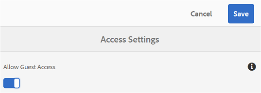

# Brand Portal에 대한 게스트 액세스 {#guest-access-to-brand-portal}

Experience Manager Assets Brand Portal을 사용하면 게스트가 포털에 액세스할 수 있습니다. 게스트 사용자는 포털에 로그인하기 위해 자격 증명이 필요하지 않으며 포털의 공개 에셋(및 컬렉션)에 액세스할 수 있습니다. 게스트 세션의 사용자는 Lightbox(개인 컬렉션)에 자산을 추가하고 세션이 지속될 때까지 다운로드할 수 있습니다(게스트 사용자가 선택하지 않는 한 세션 시작부터 2시간). [[!UICONTROL 세션 종료]](#exit-guest-session).

게스트 액세스 기능을 통해 조직은 다음과 같은 작업을 수행할 수 있습니다 [승인된 에셋 빠른 공유](../using/brand-portal-sharing-folders.md#how-to-share-folders) 온보딩할 필요 없이 의도한 대상자가 규모에 맞게 확장할 수 있습니다. Brand Portal 6.4.2 이상에서는 여러 명의 동시 게스트 사용자를 지원할 수 있습니다. 이는 조직당 총 사용자 할당량의 10%입니다. 게스트 액세스를 허용하면 Brand Portal에서 제한된 기능을 가진 사용자의 점수를 관리하고 온보딩하는 데 시간이 절약됩니다.\
조직은 다음을 사용하여 조직의 Brand Portal 계정에서 게스트 액세스를 활성화(또는 비활성화)할 수 있습니다. **[!UICONTROL 게스트 액세스 허용]** 옵션 from **[!UICONTROL 액세스]** 관리 도구 패널의 설정.

<!--
Comment Type: annotation
Last Modified By: mgulati
Last Modified Date: 2018-08-17T10:42:59.879-0400
Removed the first para: "AEM Assets Brand Portal allows public users to enter the portal anonymously and have restricted access to the allowed public resources as guests. Organization users with guest role need not seek access and authentication from administrators."
-->

## 게스트 세션 시작 {#begin-guest-session}

익명으로 Brand Portal을 입력하려면 **[!UICONTROL 여기를 클릭하십시오.]** 에 해당하는 **[!UICONTROL 게스트 액세스?]** Brand Portal 시작 화면에서 다음을 수행합니다. Brand Portal 사용 액세스 권한을 부여하려면 captcha 보안 검사를 입력합니다.

## 게스트 세션 기간 {#guest-session-duration}

게스트 사용자 세션은 15분 동안 활성 상태로 유지됩니다.
이는 의 상태가 **[!UICONTROL Lightbox]** 는 세션 시작 시간으로부터 15분 동안 유지되며, 그 후 현재 게스트 세션이 다시 시작되므로 Lightbox 상태가 손실됩니다.

예를 들어 게스트 사용자가 1500시간에 Brand Portal에 로그인하고 에셋을에 추가합니다. **[!UICONTROL Lightbox]** 다운로드 시간: 15:05 사용자가 를 다운로드하지 않는 경우 **[!UICONTROL Lightbox]** 15:15시간 전(로그인 후 15분 이내) 컬렉션(또는 에셋)에서는 사용자가 세션을 다시 시작해야 합니다. 다음 **[!UICONTROL Lightbox]** 이 비어 있으면 세션이 손실된 경우 업로드한 에셋을 더 이상 사용할 수 없습니다.

## 허용된 동시 게스트 세션 {#concurrent-guest-sessions-allowed}

동시 게스트 세션의 수는 조직당 총 사용자 할당량의 10%로 제한됩니다. 사용자 할당량이 200명인 조직에서 동시에 최대 20명의 게스트 사용자가 작업할 수 있다는 의미입니다. 21번째 사용자는 액세스가 거부되고 20명의 활성 게스트 사용자 중 하나의 세션이 종료된 경우에만 게스트로 액세스할 수 있습니다.

>[!NOTE]
>
>사용 허가된 사용자 수가 계약된 값(할당량)을 초과하는 경우 Brand Portal에서 알림을 보내지 않습니다. 또한 사용 허가된 사용자의 활동을 제한하지 않습니다.

## Brand Portal과의 게스트 사용자 상호 작용 {#guest-user-interaction-with-brand-portal}

### 게스트 UI 탐색

Brand Portal을 게스트로 시작하면 사용자가 모든 [공유된 에셋 및 폴더](../using/brand-portal-sharing-folders.md#sharefolders) 공개적으로 또는 게스트 사용자만 사용할 수 있습니다. 이 보기는 카드, 목록 또는 열 레이아웃 중 하나에 자산을 표시하는 컨텐츠 전용 보기입니다.

그러나 관리자가 활성화한 경우 게스트 사용자는 Brand Portal에 로그인할 때 폴더 트리(루트 폴더에서 시작)와 각 상위 폴더 내에 배치된 공유 폴더를 볼 수 있습니다 [폴더 계층 구조 활성화](../using/brand-portal-general-configuration.md#main-pars-header-1621071021) 구성.

이러한 상위 폴더는 가상 폴더이며 가상 폴더에서 작업을 수행할 수 없습니다. 잠금 아이콘으로 이러한 가상 폴더를 인식할 수 있습니다.

마우스로 가리키거나 선택할 때 작업 작업이 표시되지 않음 **[!UICONTROL 카드 보기]**&#x200B;공유 폴더와 다릅니다. **[!UICONTROL 개요]** 에서 가상 폴더를 선택하면 버튼이 표시됩니다. **[!UICONTROL 열 보기]** 및 **[!UICONTROL 목록 보기]**.

>[!NOTE]
>
>가상 폴더의 기본 썸네일은 첫 번째 공유 폴더의 썸네일 이미지입니다.

   

**[!UICONTROL 설정 보기]** 옵션을 사용하면 게스트 사용자가에서 카드 크기를 조정할 수 있습니다. **[!UICONTROL 카드 보기]** 또는 표시할 열 **[!UICONTROL 목록 보기]**.

다음 **[!UICONTROL 컨텐츠 트리]** assets 계층 구조를 통해 이동할 수 있습니다.

Brand Portal은 다음을 제공합니다. **[!UICONTROL 개요]** 보려는 게스트 사용자 옵션 **[!UICONTROL 자산 속성]** 개 중 개 에셋/폴더가 선택되었습니다. 다음 **[!UICONTROL 개요]** 옵션이 표시됩니다.

* 에셋/폴더 선택 시 맨 위에 있는 도구 모음에서 를 클릭합니다.
* 레일 선택기 선택 드롭다운에서 다음을 수행합니다.

선택 시 **[!UICONTROL 개요]** 에셋/폴더를 선택한 동안 옵션은 에셋 생성의 제목, 경로 및 시간을 볼 수 있습니다. 반면 에셋 세부 정보 페이지에서 **[!UICONTROL 개요]** 옵션을 사용하면 사용자가 에셋의 메타데이터를 볼 수 있습니다.

**[!UICONTROL 탐색]** 왼쪽 레일의 옵션을 사용하면 파일에서 컬렉션으로 이동하고 게스트 세션으로 돌아올 수 있으므로 사용자는 파일이나 컬렉션의 에셋을 검색할 수 있습니다.

**[!UICONTROL 필터]** 게스트 사용자는 이 옵션을 통해 관리자가 설정한 검색 조건자를 사용하여 에셋 파일 및 폴더를 필터링할 수 있습니다.

### 게스트 사용자 기능

게스트 사용자는 Brand Portal에서 공개 자산에 액세스할 수 있으며 이후에 설명된 것과 같은 몇 가지 제한 사항이 있습니다.

**게스트 사용자는**:

* 모든 Brand Portal 사용자를 위한 모든 공개 폴더 및 컬렉션에 액세스합니다.
* 모든 공용 폴더 및 컬렉션의 멤버를 찾아보고 전체 에셋을 볼 수 있습니다.
* 공용 폴더 및 컬렉션에서 자산을 검색합니다.
* Lightbox 컬렉션에 자산 추가 이러한 컬렉션 변경 사항은 세션 중에도 유지됩니다.
* 직접 또는 Lightbox 컬렉션을 통해 에셋을 다운로드합니다.

**게스트 사용자는**:

* 컬렉션 및 저장된 검색을 만들거나 더 자세히 공유할 수 있습니다.
* 폴더 및 컬렉션 설정에 액세스합니다.
* 자산을 링크로 공유합니다.

### 게스트 세션에서 에셋 다운로드

게스트 사용자는 Brand Portal에서 게스트 사용자와 공개 또는 독점적으로 공유되는 에셋을 직접 다운로드할 수 있습니다. 게스트 사용자는에 에셋을 추가할 수도 있습니다. **[!UICONTROL Lightbox]** (공개 컬렉션) 및 **[!UICONTROL Lightbox]** 세션이 만료되기 전의 컬렉션.

에셋 및 컬렉션을 다운로드하려면 다음에서 다운로드 아이콘을 사용하십시오.

* 자산 또는 컬렉션 위로 마우스를 가져가면 표시되는 빠른 작업 썸네일
* 에셋 또는 컬렉션 선택 시 표시되는 상단의 도구 모음

선택 **[!UICONTROL 다운로드 가속화 활성화]** 날짜 [!UICONTROL 다운로드] 대화 상자를 통해 다음 작업을 수행할 수 있습니다. [다운로드 성능 향상](../using/accelerated-download.md).

## 게스트 세션 종료 {#exit-guest-session}

게스트 세션을 종료하려면 **[!UICONTROL 세션 종료]** 사용 가능한 헤더에서 사용할 수 있는 옵션입니다. 그러나 게스트 세션에 사용되는 브라우저 탭이 비활성 상태인 경우 세션이 2시간 동안 비활성 상태인 경우 자동으로 만료됩니다.

## 게스트 사용자 활동 모니터링 {#monitoring-guest-user-activities}

관리자는 Brand Portal과의 게스트 사용자 상호 작용을 모니터링할 수 있습니다. Brand Portal에서 생성된 보고서는 게스트 사용자 활동에 대한 주요 통찰력을 제공할 수 있습니다. 예를 들어, **[!UICONTROL 다운로드]** 게스트 사용자가 다운로드한 에셋의 수를 추적하는 데 보고서를 사용할 수 있습니다. **[!UICONTROL 사용자 로그인]** 게스트 사용자가 포털에 마지막으로 로그인한 시간과 지정된 기간 동안의 로그인 빈도를 보고서에 알릴 수 있습니다.
