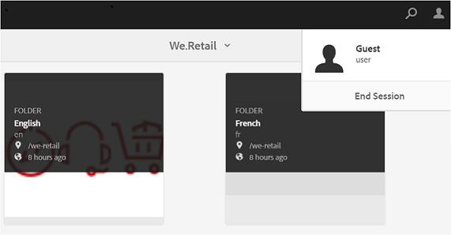

# Brand Portal에 대한 게스트 액세스 {#guest-access-to-brand-portal}

AEM 브랜드 포털에서는 게스트가 포털에 액세스할 수 있도록 합니다. 게스트 사용자는 포털에 로그인하기 위해 자격 증명이 필요하지 않으며 포털의 공개 자산(및 컬렉션)에 액세스할 수 있습니다. 게스트 세션의 사용자는 Lightbox(비공개 컬렉션)에 에셋을 추가하고 해당 세션이 지속될 때까지 다운로드할 수 있습니다. 이때 게스트 사용자가 세션 [[!UICONTROL 종료]](#exit-guest-session)옵션을 선택하지 않으면 세션 시작 시간으로부터 2시간 정도 걸립니다.

게스트 액세스 기능을 사용하면 조직에서 승인된 자산을 [도입](../using/brand-portal-sharing-folders.md#how-to-share-folders) 고객에게 개별적으로 게시하지 않고도 규모에 맞게 효율적으로 공유할 수 있습니다. Brand Portal 6.4.2부터는 조직 당 총 사용자 할당량의 10%인 여러 명의 동시 게스트 사용자를 지원할 수 있습니다. 게스트 액세스를 허용하면 브랜드 포털에서 제한된 기능을 사용해야 하는 많은 사용자를 유지 관리하는 데 걸리는 시간을 절약할 수 있습니다.\
조직은 관리 도구 패널의 액세스 설정에서 **[!UICONTROL 손님 액세스]** 허용 옵션을 사용하여 조직의 브랜드 포털 계정에서 손님 **** 액세스를 활성화(또는 비활성화)할수 있습니다.

<!--
Comment Type: annotation
Last Modified By: mgulati
Last Modified Date: 2018-08-17T10:42:59.879-0400
Removed the first para: "AEM Assets Brand Portal allows public users to enter the portal anonymously and have restricted access to the allowed public resources as guests. Organization users with guest role need not seek access and authentication from administrators."
-->

## 손님 세션 시작 {#begin-guest-session}

익명으로 브랜드 포털에 들어가려면 **[!UICONTROL 손님 액세스에 해당하는 여기를]** 클릭하십시오 **[!UICONTROL ?]** 브랜드 포털 시작 화면 브랜드 포털 사용 권한을 부여하려면 catcha 보안 검사를 입력합니다.

## 게스트 세션 기간 {#guest-session-duration}

게스트 사용자 세션은 2시간 동안 활성 상태로 유지됩니다. This means that the state of the **[!UICONTROL Lightbox]** is preserved until 1 hour from the session start time, and after 2 hours the current guest session restarts so the Lightbox state is lost.\
For example, a guest user logs in to the Brand Portal at 1500 hours and adds assets to Lightbox for download at 16:50 hours. If the user doesn&#39;t download the **[!UICONTROL Lightbox]** collection (or its assets) before 17:00 hours, the **[!UICONTROL Lightbox]** will become empty as the user will have to restart the session at the end of 1 hour (that is 1700 hours).

## 동시 손님 세션 허용됨 {#concurrent-guest-sessions-allowed}

동시 손님 세션의 수는 조직당 총 사용자 할당량의 10%로 제한됩니다. 이는 사용자 할당량이 200명인 조직의 경우 최대 20명의 게스트 사용자가 동시에 작업할 수 있음을 의미합니다. 21번째 사용자는 액세스가 거부되며 20명의 활성 게스트 사용자의 세션이 종료되는 경우에만 손님으로 액세스할 수 있습니다.

## 브랜드 포털과의 게스트 사용자 인터랙션 {#guest-user-interaction-with-brand-portal}

### 게스트 UI 탐색

손님으로 브랜드 포털에 입장할 때, 사용자는 공개적으로 공유되거나 손님 사용자만 공유하 [는](../using/brand-portal-sharing-folders.md#sharefolders) 모든 자산과 폴더를 볼 수 있습니다. 이 보기는 카드, 목록 또는 열 레이아웃 중 하나에 자산을 표시하는 컨텐츠 전용 보기입니다.

하지만, 관리자가 폴더 계층 구성 활성화를 활성화한 경우 게스트 사용자에게는 폴더 트리(루트 폴더에서 시작)와 브랜드 포털에 로그인할 때 각각의 상위 폴더 내에 배열된 공유 폴더가 [표시됩니다](../using/brand-portal-general-configuration.md#main-pars-header-1621071021) .

이러한 상위 폴더는 가상 폴더이며, 가상 폴더에 대해 작업을 수행할 수 없습니다. 이러한 가상 폴더는 잠금 아이콘으로 인식할 수 있습니다.

공유 폴더와 달리 **[!UICONTROL 카드 보기에서 마우스로 가리키거나 선택할 때 작업]**&#x200B;작업이 보이지 않습니다. **[!UICONTROL [열 보기]** ] 및 [목록 보기]에서 가상 폴더 **[!UICONTROL 를 선택하면 개요]** **[!UICONTROL 단추가]**&#x200B;표시됩니다.

>[!NOTE]
>
>가상 폴더의 기본 축소판은 첫 번째 공유 폴더의 축소판 이미지입니다.

   

**[!UICONTROL [설정]** 보기] 옵션을 사용하면 손님 사용자가 [ **[!UICONTROL 카드 보기]]** 또는 열을 조정하여 목록 보기에 표시할 수 **[!UICONTROL 있습니다]**.

컨텐츠 **[!UICONTROL 트리를]** 사용하면 자산 계층 간을 이동할 수 있습니다.

브랜드 포털에서는 게스트 사용자가 선택한 자산/폴더의 **[!UICONTROL 자산]** 속성을 볼 수 있는 **[!UICONTROL 개요]** 옵션을 제공합니다. [ **[!UICONTROL 개요]** ] 옵션이 표시됩니다.

* 자산/폴더 선택에 대한 맨 위의 도구 모음에서.
* 레일 선택기 선택 드롭다운에서
On selecting the **[!UICONTROL Overview]** option while an asset/folder is selected, users can see the title, path, and time of asset creation. 반면에, 자산 세부 사항 페이지에서 **[!UICONTROL 개요]** 옵션을 선택하면 사용자가 자산의 메타데이터를 볼 수 있습니다.

 

**[!UICONTROL 왼쪽 레일의 탐색]** 옵션을 사용하면 파일을 컬렉션으로 탐색하고 게스트 세션으로 다시 돌아와 파일 또는 컬렉션의 자산을 검색할 수 있습니다.

**[!UICONTROL 필터]** 옵션을 사용하면 게스트 사용자가 관리자가 설정한 검색 조건자를 사용하여 자산 파일과 폴더를 필터링할 수 있습니다.

### 게스트 사용자 기능

게스트 사용자는 브랜드 포털에서 공개 에셋에 액세스할 수 있으며, 자세히 살펴본 바와 같이 거의 제한 사항이 없습니다.

**게스트 사용자는 다음을 수행할 수 있습니다**.

* 모든 브랜드 포털 사용자를 위한 모든 공개 폴더 및 컬렉션에 액세스합니다.
* 검색 멤버, 세부 사항 페이지 및 모든 공개 폴더 및 컬렉션의 전체 자산 보기가 제공됩니다.
* 공용 폴더 및 컬렉션에서 에셋을 검색합니다.
* Lightbox 컬렉션에 에셋 추가 컬렉션에 대한 이러한 변경 사항은 세션 중에 지속됩니다.
* 직접 또는 lightbox 컬렉션을 통해 에셋을 다운로드할 수 있습니다.

**게스트 사용자는 다음을 수행할 수 없습니다**.

* 컬렉션 및 저장된 검색을 만들거나 추가로 공유할 수 있습니다.
* 폴더 및 컬렉션 설정에 액세스합니다.
* 에셋을 링크로 공유합니다.

### 게스트 세션에서 에셋 다운로드

게스트 사용자는 공개적으로 공유되거나 브랜드 포털에서 게스트 사용자와 단독으로 에셋을 직접 다운로드할 수 있습니다. 게스트 사용자는 세션이 만료되기 전에 **[!UICONTROL Lightbox]** (공개 컬렉션)에 자산을 추가하고 **[!UICONTROL Lightbox]** 컬렉션을 다운로드할 수도 있습니다.

자산 및 컬렉션을 다운로드하려면 다운로드 아이콘을 사용합니다.

* 에셋 또는 컬렉션 위에 마우스를 올려 놓으면 나타나는 빠른 작업 축소판
* 자산 또는 컬렉션 선택 시 표시되는 상단에 있는 도구 모음

다운로드 **[!UICONTROL 대화 상자에서 다운로드 가속]** 을 [!UICONTROL 선택하면] 다운로드 성능을 [향상시킬 수 있습니다](../using/accelerated-download.md).

## 게스트 세션 종료 {#exit-guest-session}

게스트 세션을 종료하려면 헤더에서 사용할 수 **[!UICONTROL 있는]** 옵션에서 세션 종료 를 사용합니다. 그러나 게스트 세션에 사용된 브라우저 탭이 비활성 상태인 경우 2시간 동안 아무 활동이 없으면 세션이 자동으로 만료됩니다.

## 게스트 사용자 활동 모니터링 {#monitoring-guest-user-activities}

관리자는 브랜드 포털과의 게스트 사용자 상호 작용을 모니터링할 수 있습니다. 브랜드 포털에서 생성된 보고서는 게스트 사용자 활동에 대한 주요 통찰력을 제공할 수 있습니다. 예를 들어, **[!UICONTROL 다운로드]** 보고서를 사용하여 게스트 사용자가 다운로드한 자산의 수를 추적할 수 있습니다. **[!UICONTROL 사용자 로그인]** 보고서는 게스트 사용자가 마지막으로 포털에 로그인한 날짜와 지정된 기간 동안의 로그인 빈도에 대해 알려줄 수 있습니다.
