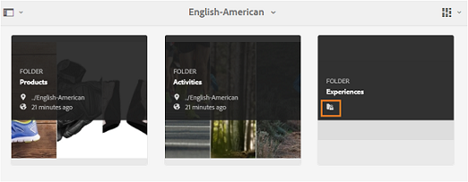

# 브랜드 포털에 대한 손님 액세스 {#guest-access-to-brand-portal}

[!DNL AEM Brand portal] 손님은 포털에 액세스할 수 있습니다. 손님 사용자는 포털에 입장하기 위해 자격 증명을 필요로 하지 않으며 포털의 공개 자산 (및 컬렉션) 에 액세스할 수 있습니다. 손님 세션의 사용자는 Lightbox (비공개 컬렉션) 에 자산을 추가하고 세션이 지속될 때까지 동일하게 다운로드할 수 있습니다. 이 세션은 게스트 사용자가 세션을 [종료하도록 선택하지 않는 한 세션이 시작될 때부터 2 시간입니다](#exit-guest-session).

기업은 게스트 액세스 기능을 사용하여 [승인된 자산을](../using/brand-portal-sharing-folders.md#how-to-share-folders) 입사 절차 없이 규모에 맞게 신속하게 공유할 수 있습니다. [!DNL Brand Portal] 6.4.2 버전에는 조직당 총 사용자 할당량의 10% 인 여러 동시 게스트 사용자를 제공할 수 있습니다. 게스트 액세스를 허용하면 제한된 기능을 사용해야 하는 사용자의 관리 작업 시간을 절약할 [!DNL Brand Portal]수 있습니다.\
조직은 관리 도구 패널의 액세스 설정에서 게스트 [!DNL Brand Portal] 액세스 **허용** 옵션을 사용하는 조직의 계정에서 손님 **액세스를** 활성화 (또는 비활성화) 할 수 있습니다.

<!--
Comment Type: annotation
Last Modified By: mgulati
Last Modified Date: 2018-08-17T10:42:59.879-0400
Removed the first para: "AEM Assets Brand Portal allows public users to enter the portal anonymously and have restricted access to the allowed public resources as guests. Organization users with guest role need not seek access and authentication from administrators."
-->

## 손님 세션 시작 {#begin-guest-session}

브랜드 포털에 익명으로 입장하려면 손님 **[!UICONTROL 액세스에]** 해당하는 **[!UICONTROL 여기를 클릭하십시오.]** 시작 [!DNL Brand Portal] 화면. 사용자는 액세스 권한을 찾을 필요가 없으며 관리자가 인증 권한을 부여하도록 기다렸다가 액세스 권한을 부여할 [!DNL Brand Portal]수 있습니다.

## 손님 세션 지속 시간 {#guest-session-duration}

손님 사용자 세션은 2 시간 동안 활성 상태로 유지됩니다. 즉 [!UICONTROL , Lightbox] 의 상태는 세션 시작 시간에서 1 시간까지 유지되고, 2 시간 후 현재 손님 세션이 다시 시작되므로 Lightbox 상태가 손실됩니다.\
예를 들어 손님 사용자는 1500 시간에 [!DNL Brand Portal] 로그인하고 Lightbox에 자산을 추가하여 16 분 50 초에 다운로드합니다. [!UICONTROL 사용자가 Lightbox 컬렉션] (또는 자산) 를 17 시간 전에 다운로드하지 않는 경우 [!UICONTROL 사용자가] 1 시간 (1700 시간) 의 끝에서 세션을 다시 시작해야 하므로 Lightbox가 비어 있게 됩니다.

## 동시 손님 세션 허용됨 {#concurrent-guest-sessions-allowed}

동시 손님 세션 수는 조직당 총 사용자 할당량 중 10%로 제한됩니다. 즉, 사용자 할당량이 200 명인 조직의 경우 최대 20 명의 게스트 사용자가 동시에 작업할 수 있습니다. 21 번째 사용자는 액세스가 거부되며 20 명의 활성 게스트 사용자 세션이 종료되면 손님으로만 액세스할 수 있습니다.

## 브랜드 포털과 게스트 사용자 인터랙션 {#guest-user-interaction-with-brand-portal}

### 게스트 UI 탐색

손님으로 입력하는 [!DNL Brand Portal] 경우 사용자는 공개적으로 공유하거나 [손님 사용자와 함께 공유한](../using/brand-portal-sharing-folders.md#sharefolders) 모든 자산 및 폴더를 볼 수 있습니다. 이 보기는 카드, 목록 또는 열 레이아웃의 자산을 표시하는 컨텐츠 전용 보기입니다.

그러나, 관리자가 [!DNL Brand Portal][ [폴더 계층](../using/brand-portal-general-configuration.md#main-pars-header-1621071021) 구조 설정 활성화] 를 활성화한 경우, 손님 사용자는 루트 폴더에서 폴더 트리 (루트 폴더에서 시작) 와 각 상위 폴더에 나열된 공유 폴더를 볼 수 있습니다.

이러한 상위 폴더는 가상 폴더이며 작업을 수행할 수 없습니다. 이러한 가상 폴더는 잠금 아이콘으로 인식할 수 있습니다.

공유 폴더와 달리 카드 보기에서 마우스를 가리키거나 선택하는 경우 작업 작업이 표시되지 않습니다. 열 보기 및 목록 보기에서 가상 폴더를 선택하면 개요 단추가 표시됩니다.

>[!NOTE]
>
>가상 폴더의 기본 썸네일은 첫 번째 공유 폴더의 썸네일 이미지입니다.

   

[설정 보기] 옵션을 사용하면 손님 사용자가 카드 보기에서 카드 크기를 조정하거나 목록 보기에 표시할 수 있습니다.

컨텐츠 트리를 사용하면 자산 계층 구조에서 이동할 수 있습니다.

[!DNL Brand Portal] 손님 사용자가 선택한 자산/폴더의 자산 속성을 볼 수 있는 **개요** 옵션을 제공합니다. 개요 옵션이 표시됩니다.

1. 자산/폴더를 선택하는 상단의 도구 모음에서
2. 를 선택합니다.

자산/폴더를 선택하는 동안 개요 옵션을 선택하면 사용자는 자산 작성의 제목, 경로 및 시간을 볼 수 있습니다. 반면에, 자산 세부 사항 페이지 선택 개요 옵션을 사용하면 자산의 메타데이터를 볼 수 있습니다.

**[!UICONTROL 왼쪽 레일의 탐색]** 옵션을 사용하면 파일 또는 컬렉션의 에셋을 탐색할 수 있도록 [왼쪽] 레일에서 [!UICONTROL [컬렉션]] 및 [손님 세션] 를 탐색할 [!UICONTROL 수 있습니다].

**필터** 옵션을 사용하면 게스트 사용자가 관리자가 설정한 검색 설명을 사용하여 자산 파일과 폴더를 필터링할 수 있습니다.

### 게스트 사용자 기능

손님 사용자는 공개 [!DNL Brand Portal]자산에 액세스할 수 있으며, 추가로 논의되는 제한도 적습니다.

손님 사용자는 다음을 수행할 수 있습니다.

* 모든 사용자에게 적합한 모든 공개 폴더 및 [!UICONTROL 컬렉션을] 이용할 [!DNL Brand Portal] 수 있습니다.
* 구성원, 세부 사항 페이지를 찾고 모든 공개 폴더 및 [!UICONTROL 컬렉션의 구성원에 대한 전체 자산 보기를 갖습니다].
* 공개 폴더 및 [!UICONTROL 컬렉션 전체에서 에셋을 검색할]수 있습니다.
* Lightbox [!UICONTROL 컬렉션에 에셋을 추가합니다]. [!UICONTROL 이러한 컬렉션의] 변경 사항은 세션 중에 유지됩니다.
* 직접 또는 Lightbox [!UICONTROL 컬렉션을 통해 에셋을 다운로드할]수 있습니다.

손님 사용자는 다음을 수행할 수 없습니다.

* [!UICONTROL 컬렉션] 및 저장된 검색을 만들거나 추가로 공유할 수 있습니다.
* 폴더 및 [!UICONTROL 컬렉션] 설정에 액세스합니다.
* 자산을 링크로 공유합니다.

### 손님 세션에서 에셋 다운로드

손님 사용자는 공개적으로 공유되거나 손님 사용자에게만 공유되는 자산을 직접 다운로드할 [!DNL Brand Portal]수 있습니다. 손님 사용자는 [!UICONTROL Lightbox] (공개 [!UICONTROL 컬렉션]) 에 자산을 추가하고 세션이 만료되기 전에 [!UICONTROL Lightbox 컬렉션을] 다운로드할 수도 있습니다.

자산과 [!UICONTROL 컬렉션을]다운로드하려면 다음에서 다운로드 아이콘을 사용합니다.

* 자산 또는 [!UICONTROL 컬렉션 위로 마우스를 가져가면 나타나는 빠른 작업 축소판]
* 자산 또는 [!UICONTROL 컬렉션 선택에 표시되는 상단의 도구 모음]

다운로드 **시 다운로드 가속화** 활성화를 선택하면 다운로드 성능을 [향상시킬](../using/accelerated-download.md)수 있습니다.

## 손님 세션 종료 {#exit-guest-session}

손님 세션을 종료하려면 헤더에서 사용 가능한 옵션에서 **종료 세션을** 사용합니다. 그러나 게스트 세션에 사용되는 브라우저가 비활성 상태인 경우 세션이 비활성화되면 세션이 자동으로 만료됩니다.

## 손님 사용자 활동 모니터링 {#monitoring-guest-user-activities}

관리자는과 게스트 사용자 상호 작용을 모니터링할 수 [!DNL Brand Portal]있습니다. 에서 [!DNL Brand Portal] 생성된 보고서는 손님 사용자 활동에 대한 주요 통찰력을 제공할 수 있습니다. 예를 들어 **, 다운로드** 보고서를 사용하여 게스트 사용자가 다운로드한 자산의 수를 추적할 수 있습니다. **사용자 로그인** 보고서는 게스트 사용자가 포털에 마지막으로 로그인한 시점과 지정된 기간 동안 로그인 빈도를 알려줄 수 있습니다.
