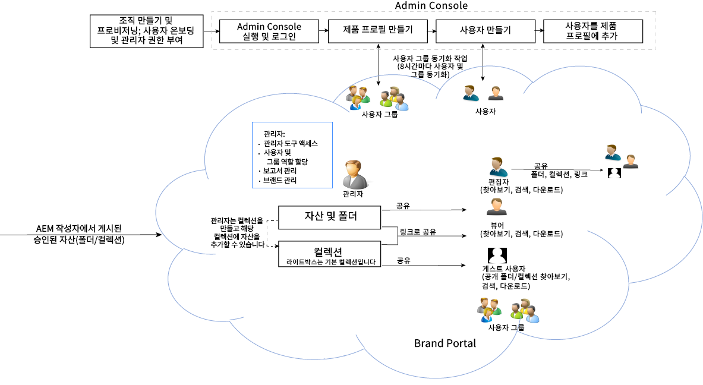

# Adobe Experience Manager Assets Brand Portal 안내서 {#aem-brand-portal}

**Adobe Experience Manager Assets Brand Portal**&#x200B;은(는) 승인된 브랜드 및 제품 자산을 외부 에이전시, 파트너, 내부 팀 및 리셀러에게 다운로드하도록 안전하게 분배하여 조직의 마케팅 요구 사항을 충족할 수 있도록 지원합니다.

안전한 자산 공유 솔루션이 없다면 다음과 같은 결과가 발생할 수 있습니다.

* 이메일 또는 클라우드를 통한 수동 자산 공유
* 브랜드 준수 문제
* 자산 사용에 대한 제어 부족
* 캠페인 및 제품 시행 지연
* 지리적 위치 및 조직에서 콘텐츠 중복
* 릴리스 전 자산의 보안되지 않은 스토리지

Brand Portal은 마케터가 파트너 및 내부 사용자와 공동 작업을 통해 디자인 지침, 로고 및 캠페인 자산을 생성하고, 관리하고, 관련자들에게 전달함으로써 브랜드 준수를 보장합니다.

Brand Portal은 클라우드 기반 SAAS 서비스입니다. Adobe Experience Manager Assets 제품(On-Premise 또는 Managed Service)의 추가 기능으로 사용할 수 있습니다. [!DNL Adobe Experience Manager Assets]을(를) [!DNL Cloud Service] (으)로 사용하여 Brand Portal을 사용할 수 있습니다. [구성](https://experienceleague.adobe.com/ko/docs/experience-manager-cloud-service/content/assets/brand-portal/configure-aem-assets-with-brand-portal)되면 [!DNL Adobe Experience Manager Assets]에서 [!DNL Cloud Service] 인스턴스로 승인된 에셋을 [!DNL Brand Portal]에 게시하고 Brand Portal 사용자에게 배포할 수 있습니다.

Brand Portal 솔루션 워크플로우는 다음 이미지에 표시되어 있습니다.

## Adobe Experience Manager Brand Portal 사용 안내서

이 사용자는 Brand Portal 서비스 및 주요 워크플로우에 대한 통찰력을 제공하는 문서를 안내합니다. 왼쪽 레일을 사용하여 다양한 기능을 탐색하고 다양한 사람들이 포털과 상호 작용하는 방법을 자세히 알아보십시오.

### 참고 항목

| 사용 안내서 | 설명 |
|--- |---|
| [새로운 기능](whats-new.md) | Brand Portal의 변경 사항. |
| [릴리스 노트](brand-portal-release-notes.md) | 개선 사항, 해결된 주요 문제 및 현재 릴리스의 알려진 문제. |
| [Brand Portal으로 Experience Manager Assets 구성](../using/configure-aem-assets-with-brand-portal.md) | Experience Manager Assets으로 Brand Portal을 복제하여 자산을 게시하는 방법. |
| [동시 게시 문제 해결](troubleshoot-parallel-publishing.md) | Brand Portal과 Experience Manager Assets 간 복제 문제를 해결합니다. |
| [지원되는 파일 형식](brand-portal-supported-formats.md) | 미리 보기 및 다운로드를 위해 Brand Portal에서 지원되는 파일 형식 |
| [자산을 Brand Portal에 게시](brand-portal-sharing-folders.md) | 폴더, 컬렉션, 링크, 사전 설정, 스키마, 패싯 및 태그를 Brand Portal에 게시하는 방법. |
| [Brand Portal의 자산 소싱](brand-portal-asset-sourcing.md) | AEM Assets에서 에셋 소싱을 구성하고 Brand Portal에서 에셋을 업로드하고 기여 폴더를 다시 AEM Assets에 게시하는 방법입니다. |
| [Brand Portal 기능 비디오](https://experienceleague.adobe.com/?lang=en&amp;tag=Brand+Portal#recommended/solutions/experience-manager) | 비디오 튜토리얼을 통해 Experience Manager Assets Brand Portal을 사용하는 방법을 알아봅니다. |

### 유용한 리소스

* [AEM Assets을 통한 Brand Portal 이해](https://experienceleague.adobe.com/en/docs/experience-manager-brand-portal/using/home)
